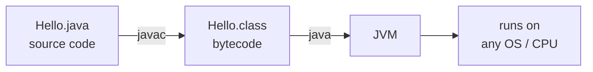

# Install & Your First Program - The JDK, javac & the JVM

Every language asks two things before anything fun happens: get the tools onto your machine, and prove
they work by running one tiny program. Java has a twist in that first program - it doesn't run the way
many languages do, and understanding that twist now saves a hundred moments of confusion later.

## The big idea: Java compiles to bytecode that runs on the JVM

When you "run" a Java program, two separate things happen, potentially on *different machines at different
times*:

1. **Compile.** A tool called `javac` reads your human-written `.java` file and translates it into
   **bytecode** - a compact, portable instruction set - saved as a `.class` file. Bytecode is *not*
   machine code for your CPU; it's instructions for an imaginary computer.
2. **Run.** A program called the **JVM** (Java Virtual Machine) loads that `.class` file and *executes*
   the bytecode, translating it into real instructions for whatever CPU it happens to be sitting on.

That imaginary computer is the key trick: code compiled once into bytecode runs on *any* machine with a
JVM - Windows, macOS, Linux, your phone, a bank mainframe. This is the famous Java promise: **write once,
run anywhere**. You compile for the JVM, and the JVM is the part that's been ported everywhere.



*What just happened:* The diagram traces the whole pipeline: `.java` source, `javac` to portable `.class`
bytecode, `java` hands that to the JVM, which runs it on the actual hardware. The `.class` file is the
portable artifact - the same one runs on every JVM.

Three acronyms get mixed up constantly. Pin them down once:

📝 **JVM** (Java Virtual Machine) - the engine that *executes* bytecode. It's the "imaginary computer"
your code targets. **JRE** (Java Runtime Environment) - the JVM *plus* the standard libraries your code
needs to run; everything required to *run* a Java program, nothing to *build* one. **JDK** (Java
Development Kit) - the JRE *plus* the developer tools: the `javac` compiler, the `java` launcher, a
debugger, and more. Everything required to *build and run*.

💡 **Key point.** You want the **JDK** - the superset, JVM and libraries included, so it gives you the
compiler *and* the runtime in one go. "Installing just a JRE" only makes sense for shipping software to end
users who run it but don't build it; as a learner, the JDK is your one download.

## Install a JDK

Java is open source; several distributions ship essentially the same thing. The two names you'll see most:

- **OpenJDK** - the open-source reference implementation. Most distributions are builds of this.
- **Oracle JDK** - Oracle's own build. Functionally near-identical for learning, but shifting licensing
  terms are why most people reach for a free OpenJDK build instead.

A friendly, free, no-licensing-drama OpenJDK build is **Eclipse Temurin** from
[adoptium.net](https://adoptium.net): grab the installer for your OS (Windows `.msi`, macOS `.pkg`, or a
Linux package) and choose a **LTS** (Long-Term Support) version like 25 (the newest LTS). Accept the installer's defaults;
on Windows, let it add Java to your `PATH` when offered.

Confirm both halves of the JDK are present - the runtime *and* the compiler:

```bash
java -version
javac -version
```
```console
$ java -version
openjdk version "25.0.1" 2025-10-21
OpenJDK Runtime Environment Temurin-25.0.1+9 (build 25.0.1+9)
OpenJDK 64-Bit Server VM Temurin-25.0.1+9 (build 25.0.1+9, mixed mode)

$ javac -version
javac 25.0.1
```
*What just happened:* `java -version` reports the **runtime**; `javac -version` reports the **compiler**.
If *both* answer with a version, you have a complete JDK. The exact numbers will differ over time -
anything Java 17 or newer works for this guide.

⚠️ **Gotcha.** If `java -version` works but `javac -version` says "command not found" / "is not
recognized," you've installed a *JRE only* - you can run Java but not compile it. Reinstall the **JDK**
from Adoptium. If a terminal already open before you installed says `java` isn't found, open a fresh one -
old terminals don't know about the new `PATH`.

## Your first program

Make a file called `Hello.java` - the capital `H` matters, as you'll see shortly - in any folder, with
exactly this:

```java
public class Hello {
    public static void main(String[] args) {
        System.out.println("Hello, Java!");
    }
}
```
*What just happened:* That's a complete Java program - a lot of words for one line of output, but Java is
wordy by design. Naming each piece:

- `public class Hello` - Java organizes all code into **classes** (named bundles of code and data). Every
  program needs at least one; `public` means "visible from everywhere." Think of the class as the
  container your code lives inside.
- `public static void main(String[] args)` - defines a **method** (a named block of code) called `main`.
  This exact signature is the **entry point**, the one method the JVM looks for and runs when your program
  starts.
- `System.out.println("Hello, Java!")` - calls `println` ("print line") to write text to the screen,
  followed by a newline. `System.out` is the standard output stream that ships with Java.

That `main` signature trips everyone up at first, so briefly, *why* it reads this way: the JVM needs one
agreed-upon "start here" method. `public` so the JVM can reach it from outside the class; `static` so it
can be called *without first creating an object* (more in [Phase 5](05-classes-and-objects.md)); `void`
because it returns nothing; `String[] args` to receive command-line arguments. You'll type this line so
often it becomes muscle memory - just know every part has a job.

Now compile it. From the folder containing `Hello.java`:

```bash
javac Hello.java
```
```console
$ javac Hello.java
$ ls
Hello.class  Hello.java
```
*What just happened:* `javac` read your source and, on success, said *nothing* - silence is good news in
the Unix tradition. It produced `Hello.class` next to your source: portable bytecode for the JVM, not for
your CPU. (Not human-readable - open it and you'll see gibberish.)

Then run it - and note you pass `Hello`, the class name, **not** `Hello.class` or `Hello.java`:

```bash
java Hello
```
```console
$ java Hello
Hello, Java!
```
*What just happened:* `java` launched a JVM, loaded the `Hello` class, found `main`, and ran it top to
bottom, printing your line. You give it the *class* name because the JVM thinks in classes, not files; it
finds `Hello.class` on its own. That two-step rhythm - `javac` to build, `java` to run - is the bedrock
workflow under every Java tool you'll ever use.

## The "everything lives in a class" rule

Notice there's no loose code floating at the top of the file - no statement outside a class. That's not a
style choice; it's a rule. In classic Java, *every* line of code lives inside a class - no free-floating
functions or top-level statements like Python or JavaScript allow.

⚠️ **Gotcha - the filename must match the public class.** A file containing `public class Hello` *must*
be named `Hello.java` - same name, same capitalization. Name it `hello.java` or `Main.java` and `javac`
refuses to compile it, with an error like `class Hello is public, should be declared in a file named
Hello.java`. This catches everyone once. The rule exists so the compiler can find any public class by
predicting its filename - but the takeaway is simpler: **public class name = filename**, capital letter
and all.

A note on the future: recent Java *loosens* this, letting you write a stripped-down program
with just a `main` method and no visible class wrapper, to ease beginners in. It was a preview feature in
Java 21-24 and became standard in Java 25 (JEP 512). Even so, essentially all existing Java code uses the
classic `public class { ... }` form, which is what this guide uses and what "Java" means in practice today.

## A smoother workflow

The `javac` → `java` two-step is the real foundation, worth doing by hand once so the pipeline isn't
magic. Day to day, you'll lean on shortcuts:

- **Single-file run (Java 11+).** For a one-file program, you can skip the separate compile step entirely:

  ```bash
  java Hello.java
  ```
  ```console
  $ java Hello.java
  Hello, Java!
  ```
  *What just happened:* Handed a `.java` file directly, `java` compiled it *in memory* and ran it
  immediately - no `.class` file left on disk. Fastest way to try a quick idea; under the hood it's still
  compile-then-run, you just skipped typing both commands.

- **Real projects use a build tool.** Once a project grows past a file or two - multiple classes, outside
  libraries, tests - a **build tool** like **Maven** or **Gradle** manages compiling, dependencies, and
  packaging instead of you calling `javac` by hand. Covered in [Phase 8](08-packages-and-tooling.md); for
  now plain `javac`/`java` keeps the focus on the language.

- **And an IDE.** Almost everyone writes Java in an IDE - **IntelliJ IDEA** (community edition is free) or
  **VS Code** with Java extensions are the popular picks. They compile as you type, underline mistakes
  before you run, and turn build-and-run into one button. Pick either.

## Recap

1. Java **compiles to bytecode that runs on the JVM** - `javac` turns `.java` into a portable `.class`,
   and the JVM runs that bytecode anywhere, which is what "write once, run anywhere" means.
2. **JDK vs JRE vs JVM:** the JVM *executes* bytecode, the JRE is the JVM plus standard libraries (enough
   to *run*), and the JDK is the JRE plus dev tools like `javac` (enough to *build*). Install the **JDK**.
3. Confirm your install with **`java -version`** (runtime) and **`javac -version`** (compiler) - you need
   *both* to answer.
4. A program needs a **class** and the special **`public static void main(String[] args)`** entry point;
   build with **`javac Hello.java`**, then run with **`java Hello`** (the class name, not the filename).
5. ⚠️ **Everything lives in a class**, and the **public class name must match the filename** exactly -
   `public class Hello` belongs in `Hello.java`.
6. Shortcuts for later: **`java Hello.java`** runs a single file directly (Java 11+), and real projects
   use a **build tool** (Maven/Gradle) plus an **IDE** (IntelliJ/VS Code).

Next: variables, the values they hold, and Java's type system - the rules that decide what fits in what.

## Quick check

Test yourself on the one idea that makes Java *Java* - compile to bytecode, run on the JVM:

```quiz
[
  {
    "q": "What does `javac` produce, and what runs it?",
    "choices": [
      "It produces a `.class` bytecode file, which the JVM (via the `java` command) executes",
      "It produces a native CPU executable that the OS runs directly",
      "It runs the program immediately and produces no file",
      "It produces another `.java` file optimized for speed"
    ],
    "answer": 0,
    "explain": "`javac` compiles your `.java` source into portable `.class` bytecode. That bytecode isn't machine code - the JVM, launched by the `java` command, loads and executes it on whatever hardware it's running on. That's the compile-then-run, write-once-run-anywhere model."
  },
  {
    "q": "You have a JDK installed. Which is true about JDK, JRE, and JVM?",
    "choices": [
      "The JDK includes a JRE (and thus a JVM) plus developer tools like `javac`",
      "The JRE includes the JDK, so installing a JRE gives you the compiler",
      "The JVM is the largest package and contains both the JDK and JRE",
      "They are three unrelated downloads you must install separately"
    ],
    "answer": 0,
    "explain": "They nest: the JVM executes bytecode; the JRE is the JVM plus standard libraries (enough to run); the JDK is the JRE plus build tools like `javac` (enough to build and run). Installing the JDK gives you everything."
  },
  {
    "q": "Your file contains `public class Hello`. What must the file be named?",
    "choices": [
      "`Hello.java` - the filename must match the public class name exactly, capitalization included",
      "`hello.java` - Java filenames are always lowercase",
      "`Main.java` - the file holding `main` must be called Main",
      "Anything ending in `.java` - the name doesn't matter"
    ],
    "answer": 0,
    "explain": "A public class must live in a file whose name matches it exactly, including the capital letter - `public class Hello` requires `Hello.java`. Mismatch it and `javac` refuses to compile, telling you the file should be named after the class."
  }
]
```

---

[Guide overview](_guide.md) · [Phase 2: Syntax, Values & Types →](02-syntax-values-and-types.md)
