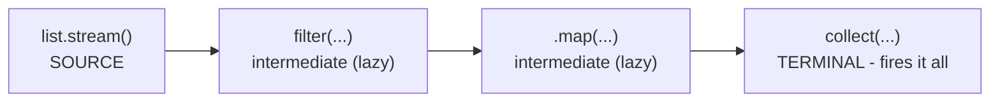

# The Streams API - Declarative Data Pipelines

In [Phase 11](11-lambdas-and-functional-interfaces.md) you learned that a lambda is a chunk of behavior you can pass around - `n -> n.length() > 3` is a value, not just a snippet of code. That was the setup. This phase is the payoff. The Streams API is the place where lambdas earn their keep, because it lets you hand those little behaviors to a pipeline and say "run this over the whole collection for me."

The mental shift here is the whole point, so let's name it up front. A traditional loop is **imperative**: you spell out every mechanical step - set up a counter, check the bound, grab the element, test it, maybe add it to a result list. A stream is **declarative**: you describe *what* you want to happen to the sequence and let Java handle the *how*. The same idea powers Python's generator expressions and Rust's iterator chains, and once it clicks in one language you see it everywhere: stop hand-driving the loop, start describing the transformation.

## The mental model - a pipeline, not a loop

**What it actually is.** A **Stream** is not a collection. It doesn't store anything. It's a *pipeline* that describes a sequence of operations to run over a source of data - transform these, keep those, add them up. You build the pipeline by chaining methods, and at the end you ask for a result.

📝 **Stream** - a one-pass pipeline over a sequence of elements. It describes operations (filter, map, aggregate) to apply, but holds no data of its own and can't be reused once consumed.

The fastest way to feel the difference is to write the same task both ways. Say we have a list of numbers and we want the squares of just the even ones.

```java
import java.util.List;
import java.util.ArrayList;

List<Integer> nums = List.of(1, 2, 3, 4, 5, 6);

// Imperative: spell out every mechanical step.
List<Integer> result = new ArrayList<>();
for (int n : nums) {
    if (n % 2 == 0) {
        result.add(n * n);
    }
}
System.out.println(result);
```
```console
[4, 16, 36]
```
*What just happened:* this works, but notice how much of it is *bookkeeping* - creating an empty list, the loop scaffolding, manually appending. The actual intent ("keep evens, square them") is buried inside three lines of plumbing. Now the same thing as a stream:

```java
import java.util.List;
import java.util.stream.Collectors;

List<Integer> nums = List.of(1, 2, 3, 4, 5, 6);

List<Integer> result = nums.stream()
        .filter(n -> n % 2 == 0)     // keep the evens
        .map(n -> n * n)             // square each one
        .collect(Collectors.toList());

System.out.println(result);
```
```console
[4, 16, 36]
```
*What just happened:* the intent is now the code. `filter` says "keep evens," `map` says "square them," `collect` says "gather into a list" - read top to bottom, it's almost an English sentence. There's no counter, no empty list to seed, no `.add()` to forget. You described the transformation and Java ran it. That readability is the headline reason streams exist.

💡 **Key point.** A stream doesn't make a simple loop faster - for tiny tasks the loop may even be marginally quicker. The win is *clarity*: chained transformations read as a pipeline instead of a pile of mechanics. Reach for streams when you're filtering, mapping, and aggregating; that's where they shine.

## Source → intermediate ops → terminal op

Every stream pipeline has the same three-part shape. Learn this shape and you can read any stream you'll ever meet.

📝 **The three parts.** **Source** - where elements come from (`list.stream()`, `Stream.of(...)`, `Arrays.stream(arr)`). **Intermediate operations** - `filter`, `map`, `sorted`, and friends; each returns *another stream*, so they chain, and each is **lazy** (it does no work yet). **Terminal operation** - `collect`, `count`, `forEach`, `reduce`; this returns a non-stream result and *triggers the whole pipeline to actually run*.



The crucial, surprising part: **nothing runs until the terminal operation.** The intermediate ops just build up a description of work. This is exactly the laziness you saw in [Python's iterators](/guides/python-from-zero) and [Rust's iterator adapters](/guides/rust-from-zero) - adapters describe, the consumer fires. Here's proof you can watch:

```java
import java.util.List;

List<String> names = List.of("ada", "bob", "cleo");

// No terminal operation - just intermediate ops.
names.stream()
     .filter(n -> {
         System.out.println("checking " + n);   // a side effect, to spy on it
         return n.length() == 3;
     });

System.out.println("--- pipeline built, but did it run? ---");
```
```console
--- pipeline built, but did it run? ---
```
*What just happened:* the `filter` body never printed a single "checking" line - because there's no terminal operation, the pipeline was built and then thrown away without running. The lambda inside `filter` was *never called*. Add a terminal op (`.count()`, `.collect(...)`, `.forEach(...)`) and suddenly the whole thing springs to life and the "checking" lines appear. 

⚠️ **Gotcha - a stream with no terminal op does nothing.** This is the number-one stream surprise. If you write a pipeline and your filtering or mapping seems to be ignored, check that you ended with a terminal operation. A bare `list.stream().filter(...).map(...);` is a recipe nobody cooked. (A second, related trap: a stream is **single-use**. Once a terminal op consumes it, calling another operation on the same stream throws `IllegalStateException`. Build a fresh stream from the source each time.)

## Common operations - building the pipeline

Here are the intermediate and terminal operations you'll reach for daily. Most are intermediate (return a stream); `reduce` and `collect` are terminal.

- **`filter(predicate)`** - keep only elements that pass the test.
- **`map(function)`** - transform each element into something else (often a different type).
- **`sorted()`** / **`sorted(comparator)`** - order the elements.
- **`distinct()`** - drop duplicates (uses `equals`).
- **`limit(n)`** - keep at most the first `n` elements, then stop.
- **`reduce(...)`** - collapse the whole stream into a single value (sum, product, concatenation).

Let's chain a realistic batch. We have raw names, and we want: only the "adult" ones (length here standing in for some real condition), uppercased, sorted, as a list.

```java
import java.util.List;
import java.util.stream.Collectors;

List<String> raw = List.of("bob", "ada", "cleo", "al", "bob");

List<String> cleaned = raw.stream()
        .filter(name -> name.length() >= 3)   // drop the too-short "al"
        .distinct()                           // collapse the duplicate "bob"
        .map(String::toUpperCase)             // shout each name
        .sorted()                             // alphabetical order
        .collect(Collectors.toList());

System.out.println(cleaned);
```
```console
[ADA, BOB, CLEO]
```
*What just happened:* read the chain as a sentence. `filter` removed `"al"` (too short); `distinct` collapsed the two `"bob"`s into one; `map` uppercased each survivor (`String::toUpperCase` is a method reference - a tidy lambda from Phase 11); `sorted` put them in alphabetical order; `collect` gathered the result into a `List`. Five clear steps, no loop scaffolding, and each line reads as exactly one transformation.

And `reduce`, the terminal op that folds a stream down to one value:

```java
import java.util.List;

List<Integer> prices = List.of(10, 25, 5, 40);

int total = prices.stream()
        .reduce(0, (running, price) -> running + price);   // start at 0, keep adding

System.out.println("total: " + total);
```
```console
total: 55
```
*What just happened:* `reduce` takes a starting value (`0`) and a function that combines the running result with the next element. It applied `0 + 10`, then `10 + 25`, then `35 + 5`, then `40 + 40`... arriving at `55`. That's the general shape of "boil a sequence down to one answer." For the common cases (sum, average, count) you'll usually use a purpose-built collector or `IntStream.sum()` instead, but `reduce` is the engine underneath them all.

## Collectors - reshaping a stream into a result

A stream produces a sequence; eventually you want it back as a real, storable thing - a `List`, a `Map`, a count, a joined string. That's the job of **collectors**, used with the `collect(...)` terminal op.

💡 **Key point.** Think of `Collectors` as the toolbox for the *last* step: "I have a stream of elements - now reshape them into a List, a Map, or a summary." It's where the pipeline's output takes its final form.

The everyday collectors:

```java
import java.util.List;
import java.util.stream.Collectors;

List<String> words = List.of("apple", "banana", "cherry");

List<String> asList = words.stream()
        .map(String::toUpperCase)
        .collect(Collectors.toList());                 // -> a List

String joined = words.stream()
        .collect(Collectors.joining(", ", "[", "]"));  // glue with separators

System.out.println(asList);
System.out.println(joined);
```
```console
[APPLE, BANANA, CHERRY]
[apple, banana, cherry]
```
*What just happened:* `Collectors.toList()` gathered the mapped elements into a `List`. `Collectors.joining(", ", "[", "]")` stitched the strings into one with a separator, prefix, and suffix - far cleaner than building a `StringBuilder` by hand. (Modern Java also offers `.toList()` directly on the stream as a shortcut for the common case.)

Now the one that changes how you think: **`groupingBy`**. It takes a stream and a function that produces a *key* for each element, and hands you back a `Map` where each key points to the list of elements that share it. It's the streaming equivalent of "GROUP BY" in SQL.

```java
import java.util.List;
import java.util.Map;
import java.util.stream.Collectors;

record Person(String name, String city) {}

List<Person> people = List.of(
        new Person("Ada", "London"),
        new Person("Bob", "Paris"),
        new Person("Cleo", "London"),
        new Person("Dan", "Paris")
);

Map<String, List<Person>> byCity = people.stream()
        .collect(Collectors.groupingBy(Person::city));

System.out.println(byCity.get("London"));
```
```console
[Person[name=Ada, city=London], Person[name=Cleo, city=London]]
```
*What just happened:* `groupingBy(Person::city)` walked the stream, called `.city()` on each person to get a key, and bucketed everyone into a `Map<String, List<Person>>` keyed by city. Ada and Cleo landed in the `"London"` bucket; Bob and Dan in `"Paris"`. Doing this by hand means creating a map, looping, calling `computeIfAbsent`, and appending - a dozen fiddly lines collapsed into one. You can even nest a *second* collector to summarize each group:

```java
import java.util.Map;
import java.util.stream.Collectors;

// ...same `people` list as above...

Map<String, Long> countByCity = people.stream()
        .collect(Collectors.groupingBy(Person::city, Collectors.counting()));

System.out.println(countByCity);
```
```console
{Paris=2, London=2}
```
*What just happened:* the second argument, `Collectors.counting()`, tells `groupingBy` not to collect the people themselves but to *count* them per group - giving `{Paris=2, London=2}`. Other downstream collectors work the same way: `Collectors.toMap` builds a key→value map directly, `Collectors.mapping(...)` transforms group members before collecting them. This composability is what makes Collectors so powerful: one collector can feed another.

## Parallel streams & when to use streams

Here's a feature that looks like free speed and is mostly a trap if you reach for it carelessly. Swap `.stream()` for `.parallelStream()` (or call `.parallel()` on an existing stream) and Java splits the work across multiple CPU cores using the common fork/join pool.

```java
import java.util.stream.IntStream;

long count = IntStream.rangeClosed(1, 1_000_000)
        .parallel()
        .filter(n -> n % 7 == 0)
        .count();

System.out.println(count);
```
```console
142857
```
*What just happened:* the work of filtering a million numbers got chopped into chunks and run on several cores at once, then combined. For a big, CPU-bound, independent computation like this, that can be a genuine speedup on a multi-core machine - the same answer, arrived at faster.

⚠️ **Parallel is not free, and it can make things slower or wrong.** Three things to internalize. **(1)** Splitting, scheduling, and merging have overhead - for small collections or cheap per-element work, the parallel version is *slower* than plain `.stream()`. It only pays off for large data with meaningful per-element cost. **(2)** Side effects in parallel are dangerous: a lambda that mutates a shared `ArrayList` or a counter from multiple threads is a data race waiting to corrupt your results or throw. Keep your stream operations *pure* - compute and return, don't reach out and mutate. **(3)** Order-dependent operations get more expensive or behave differently. Measure before you parallelize; don't sprinkle `.parallel()` as a performance prayer.

💡 **And when should you use streams at all?** Reach for a stream when you're expressing a *transformation* - filter, map, group, aggregate - because the pipeline reads cleanly and the intent is obvious. Stick with a plain `for` loop when the logic is simple, when you need to `break` out early in a way streams make awkward, when you're mutating external state, or when a stream would genuinely be *harder* to read. Streams are a tool for clarity, not a badge of sophistication. A clear loop beats a contorted stream every time - don't force it.

## Recap

1. A **Stream** is a declarative pipeline over a sequence - you describe *what* to do (filter, map, aggregate), not the loop mechanics. It stores no data and is single-use.
2. Every pipeline is **source → intermediate ops → terminal op**. Intermediate ops (`filter`, `map`, `sorted`, `distinct`, `limit`) are **lazy** and chainable; the terminal op (`collect`, `count`, `forEach`, `reduce`) fires the whole thing.
3. ⚠️ **Nothing runs without a terminal operation.** A pipeline with no terminal op does nothing at all - the most common stream mistake.
4. **Collectors** reshape a stream into a result: `toList`, `joining`, `toMap`, and especially **`groupingBy`** (with downstream collectors like `counting`) for bucketing elements into a `Map`.
5. **`parallelStream()`** splits work across cores - but only helps for large, CPU-bound, side-effect-free work. Measure first; pure operations only.
6. Use streams for readable transformations; a plain loop is fine (and sometimes clearer) for simple cases. Don't force it.

You can now read and write the pipeline style that dominates modern Java codebases. Next we look at **records and sealed types** - the features that make the immutable, intent-revealing data classes from the idioms phase a single line of code.

## Quick check

Test yourself on the three ideas that make streams tick - the pipeline shape, laziness, and grouping:

```quiz
[
  {
    "q": "You write `list.stream().filter(x -> x > 0).map(x -> x * 2);` and nothing seems to happen. Why?",
    "choices": [
      "There's no terminal operation - `filter` and `map` are lazy and do no work until a terminal op like `collect`, `count`, or `forEach` runs",
      "`filter` and `map` can't be used together in the same pipeline",
      "Streams only run if you call `.start()` on them",
      "The lambda syntax is invalid, so the pipeline is silently skipped"
    ],
    "answer": 0,
    "explain": "Intermediate operations (`filter`, `map`) are lazy: they only build up a description of the work. Nothing actually runs until a terminal operation triggers the pipeline. With no terminal op, you've built a recipe and thrown it away."
  },
  {
    "q": "What does `Collectors.groupingBy(Person::city)` produce when collected from a stream of people?",
    "choices": [
      "A `Map<String, List<Person>>` where each city key maps to the list of people in that city",
      "A flat `List<Person>` sorted by city name",
      "A single `String` of all the city names joined together",
      "A count of how many distinct cities exist"
    ],
    "answer": 0,
    "explain": "`groupingBy(Person::city)` calls `.city()` on each element to get a key and buckets the elements into a `Map` from key to the `List` of elements sharing it. Add a downstream collector like `Collectors.counting()` to summarize each group instead of listing its members."
  },
  {
    "q": "When is switching `.stream()` to `.parallelStream()` actually a good idea?",
    "choices": [
      "For large, CPU-bound work with no shared mutable state - and only after measuring, since splitting has overhead",
      "Always - parallel streams are strictly faster than sequential ones",
      "For tiny collections, where the overhead is negligible",
      "When your lambdas mutate a shared list, to speed up the writes"
    ],
    "answer": 0,
    "explain": "Parallelism pays off only for big, independent, CPU-bound work, and the split/merge overhead can make small or cheap tasks slower. Side effects on shared state in parallel are a data race - keep operations pure, and measure before reaching for `.parallel()`."
  }
]
```

---

[← Phase 11: Lambdas & Functional Interfaces](11-lambdas-and-functional-interfaces.md) · [Guide overview](_guide.md) · [Phase 13: Records, Sealed Types & Modern Java →](13-records-and-modern-java.md)
