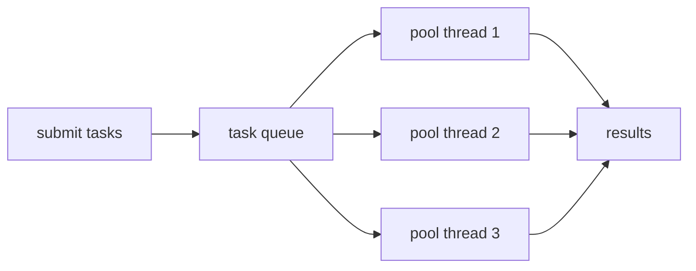

# Concurrency & Threads - Doing Many Things at Once, Safely

Every program you've written so far has done one thing at a time: line runs, finishes, next line runs. Predictable. Concurrency breaks that comfortable single-file march - you ask the machine to run several paths of execution at *the same time*, so a web server can handle a thousand requests at once, or your app can download a file without freezing the UI.

Here's the honest framing, and it's worth carrying through the whole phase: **starting threads is easy; getting them to share data without corrupting it is the entire hard part of the field.** A thread on its own is a tame thing. Two threads touching the same variable, with no coordination, is where careers' worth of subtle, intermittent, impossible-to-reproduce bugs come from. So we'll learn to make threads, then immediately learn the danger they create, and spend most of our time on the tools that tame it.

The arc: raw `Thread`s (the bricks), the race condition (the disease), `synchronized` and the memory model (the cure), `java.util.concurrent` (the tools you should actually reach for), and virtual threads (the modern leap that makes blocking code scale).

## Threads - an independent path of execution

📝 **A thread is an independent path of execution within your program.** Your program already has one - the "main" thread that runs `main()`. A new thread is a second worker running its own code at the same time, sharing the same memory as the first. The operating system juggles them across CPU cores (and, when there are more threads than cores, by rapidly switching between them).

You create one by giving it work to do. The work is a `Runnable` - an object with a single `run()` method - and the cleanest way to write one is a lambda ([Phase 11](11-lambdas-and-functional-interfaces.md)):

```java
public class Main {
    public static void main(String[] args) throws InterruptedException {
        Thread worker = new Thread(() -> {
            System.out.println("worker thread: " + Thread.currentThread().getName());
        });

        worker.start();          // spawns a NEW thread, runs the lambda there
        System.out.println("main thread: " + Thread.currentThread().getName());

        worker.join();           // wait for the worker to finish before exiting
    }
}
```
```console
$ java Main.java
main thread: main
worker thread: Thread-0
```
*What just happened:* `new Thread(() -> ...)` wrapped your lambda as the thread's job but did *not* run it yet. `worker.start()` asked the OS for a new thread and ran the lambda there, concurrently with `main`. The two `println`s race - `main` printed first here, but the order can flip on the next run, because nobody coordinated them. `worker.join()` makes the main thread block until the worker is done, so the program doesn't exit out from under it.

⚠️ **The bug that bites everyone once: calling `run()` instead of `start()`.** They look interchangeable. They are not.

```java
Thread worker = new Thread(() -> {
    System.out.println("on: " + Thread.currentThread().getName());
});

worker.run();    // WRONG - runs the lambda on the CURRENT thread, no new thread at all
worker.start();  // RIGHT - spawns a new thread
```
```console
$ java Main.java
on: main
on: Thread-0
```
*What just happened:* `run()` is just a normal method call - it executes the lambda right here, on whatever thread called it (`main`). No concurrency happens at all. Only `start()` performs the magic of asking the OS for a fresh thread. If you ever see "concurrent" code that mysteriously runs perfectly in order, single-file, check whether someone called `run()`. It's the silent no-op of Java threading.

## The danger - shared mutable state & race conditions

Now the hard part. The moment two threads read *and* write the same data, you have a potential **race condition** - and it is the central villain of all concurrency.

📝 **A race condition is a bug where the correctness of your program depends on the unpredictable timing of threads.** The result changes depending on which thread happens to get there first - so the program might work a million times and fail on the million-and-first, depending on how the OS scheduled things that instant.

The classic demonstration: two threads incrementing the same counter. You'd expect 200,000. You won't get it.

```java
public class Main {
    static int counter = 0;   // shared, mutable - the danger zone

    public static void main(String[] args) throws InterruptedException {
        Runnable job = () -> {
            for (int i = 0; i < 100_000; i++) {
                counter++;          // looks atomic. is not.
            }
        };

        Thread t1 = new Thread(job);
        Thread t2 = new Thread(job);
        t1.start();
        t2.start();
        t1.join();
        t2.join();

        System.out.println("expected 200000, got: " + counter);
    }
}
```
```console
$ java Main.java
expected 200000, got: 143281
```
*What just happened:* `counter++` looks like one indivisible step, but it's actually three: **read** the current value, **add** one, **write** it back. Two threads can both read `5` at the same instant, both compute `6`, and both write `6` - two increments, but the counter only moved by one. That lost update, repeated tens of thousands of times across the run, is why we landed at `143281` instead of `200000`. ⚠️ Run it yourself and you'll get a *different* wrong number each time - that non-determinism is the signature of a race condition, and it's exactly what makes these bugs so maddening to track down.

This is the whole game. Threads are cheap. *Sharing mutable state correctly* is the expensive, careful work, and everything below exists to make it safe.

## `synchronized` & the memory model

The fix for the counter is **mutual exclusion**: guarantee that only one thread at a time can run the read-add-write sequence. Java's built-in tool for this is the `synchronized` keyword.

📝 **`synchronized` marks a block (or method) as a critical section guarded by a lock.** Every Java object has an invisible lock (a "monitor"). A thread entering a `synchronized` block must acquire that lock; if another thread holds it, the newcomer waits. Only one thread runs the protected code at a time - so the read-add-write can't be interrupted halfway.

```java
public class Main {
    static int counter = 0;
    static final Object lock = new Object();   // the thing we lock on

    public static void main(String[] args) throws InterruptedException {
        Runnable job = () -> {
            for (int i = 0; i < 100_000; i++) {
                synchronized (lock) {           // one thread at a time, in here
                    counter++;
                }
            }
        };

        Thread t1 = new Thread(job);
        Thread t2 = new Thread(job);
        t1.start(); t2.start();
        t1.join();  t2.join();

        System.out.println("expected 200000, got: " + counter);
    }
}
```
```console
$ java Main.java
expected 200000, got: 200000
```
*What just happened:* Each thread had to grab `lock` before touching `counter`, so the read-add-write sequence ran start-to-finish without the other thread sneaking in. Every one of the 200,000 increments landed. The trade-off is real: threads now take turns through that block instead of running it in parallel, so heavily-contended locks cost speed. The art is locking the *smallest* section that keeps you correct.

💡 **The memory model, honestly, in one paragraph.** There's a second, sneakier danger beyond lost updates: **visibility**. The JVM and CPU are allowed to cache variables in registers and reorder instructions for speed, which means a write one thread makes to a shared variable might *never become visible* to another thread - it could spin forever reading a stale cached value. The **Java Memory Model (JMM)** defines the rules for when one thread's writes are guaranteed visible to another, via a relationship called **happens-before**: releasing a lock happens-before another thread acquiring that same lock, so everything you wrote inside a `synchronized` block is visible to the next thread that enters it. That's why `synchronized` fixes *both* atomicity and visibility at once.

📝 **`volatile` handles visibility alone.** Marking a field `volatile` guarantees that every read sees the most recent write from any thread - no stale caches, no reordering past it. But it does **not** give you atomicity: a `volatile` counter still loses updates under `counter++`, because the read-add-write is still three steps. ⚠️ The rule of thumb: reach for `volatile` for a simple flag one thread sets and another reads (like a `boolean running`); reach for `synchronized` (or the atomics below) the moment a thread needs to *read-then-write* shared state.

## Higher-level concurrency - prefer it

Here's the most important practical advice in this phase: **most of the time, you should not be writing `new Thread(...)` or `synchronized` by hand at all.** Hand-managing threads is error-prone and wasteful - every `new Thread` is a real OS thread that costs memory to create and time to start, and writing your own locking is exactly how the subtle bugs above creep in. The `java.util.concurrent` package gives you battle-tested tools that handle all of it.

💡 **The default move: reach for `java.util.concurrent` first.** An `ExecutorService` for running tasks, `AtomicInteger` for lock-free counters, `ConcurrentHashMap` for shared maps. These are written and tested by experts; your hand-rolled version will be slower *and* buggier.

**Thread pools via `ExecutorService`.** Instead of creating a thread per task (and exhausting the machine when there are a million tasks), a **thread pool** keeps a fixed crew of reusable threads pulling tasks from a queue. You submit work; the pool decides which thread runs it.



**`Callable` and `Future`.** A `Runnable` returns nothing. A `Callable<T>` returns a value - and since the result isn't ready immediately, `submit` hands you a `Future<T>`, an IOU you can cash in later with `.get()` (which blocks until the answer is ready).

```java
import java.util.concurrent.*;

public class Main {
    public static void main(String[] args) throws Exception {
        ExecutorService pool = Executors.newFixedThreadPool(3);

        Future<Integer> future = pool.submit(() -> {
            Thread.sleep(100);          // pretend this is slow work
            return 6 * 7;
        });

        System.out.println("doing other work while it computes...");
        Integer answer = future.get();   // blocks here until the result is ready
        System.out.println("the answer: " + answer);

        pool.shutdown();                 // stop accepting tasks; let running ones finish
    }
}
```
```console
$ java Main.java
doing other work while it computes...
the answer: 42
```
*What just happened:* `Executors.newFixedThreadPool(3)` made a pool of three reusable threads. `pool.submit(callable)` queued the work and immediately returned a `Future` - the main thread kept going and printed its message *before* the result existed. `future.get()` then blocked until the pool thread finished and handed back `42`. ⚠️ Always `shutdown()` a pool when you're done; its threads are non-daemon by default and will keep the JVM alive otherwise.

**`CompletableFuture` for composing async work.** `Future.get()` is blocking and clumsy when you want to chain steps ("fetch data, *then* transform it, *then* save it"). `CompletableFuture` lets you describe that pipeline declaratively and run it without blocking:

```java
import java.util.concurrent.CompletableFuture;

public class Main {
    public static void main(String[] args) {
        CompletableFuture<String> pipeline =
            CompletableFuture.supplyAsync(() -> "data")        // step 1, on a background thread
                .thenApply(s -> s.toUpperCase())               // step 2, when step 1 finishes
                .thenApply(s -> "[" + s + "]");                // step 3, when step 2 finishes

        System.out.println(pipeline.join());                   // wait for the whole chain
    }
}
```
```console
$ java Main.java
[DATA]
```
*What just happened:* `supplyAsync` ran the first step on a background thread and returned a `CompletableFuture` immediately. `thenApply` attached the next step to run *automatically* when the previous one completed - no manual `get()`, no blocking between stages. You described the pipeline as a chain; the runtime wired up the handoffs. This is how modern Java composes async work: stages connected by `thenApply`, `thenCompose`, `thenCombine`, each firing when its input is ready.

💡 **Lock-free counters with `AtomicInteger`.** Remember the broken counter? `AtomicInteger` solves it without any lock you write: `count.incrementAndGet()` is a single atomic operation, implemented with a CPU compare-and-swap instruction. For a shared counter, it's both simpler and faster than `synchronized`. Same spirit: `ConcurrentHashMap` for a map many threads hammer at once. Reach for these before you reach for raw locks.

## Virtual threads - the modern leap

📝 **Virtual threads (Project Loom, standard since JDK 21) are extremely lightweight threads managed by the JVM rather than the OS.** A traditional ("platform") thread maps one-to-one onto a heavy OS thread - you can realistically run a few thousand before memory runs out. A virtual thread is a cheap Java object; the JVM parks it off its underlying OS thread whenever it blocks (on I/O, a sleep, a lock) and reuses that OS thread for other work. You can run **millions** of them.

```java
import java.util.concurrent.*;

public class Main {
    public static void main(String[] args) throws InterruptedException {
        try (ExecutorService pool = Executors.newVirtualThreadPerTaskExecutor()) {
            for (int i = 0; i < 1_000_000; i++) {
                pool.submit(() -> {
                    Thread.sleep(1000);   // a blocking call - fine here
                    return null;
                });
            }
        } // try-with-resources waits for all tasks to finish
        System.out.println("ran a million blocking tasks");
    }
}
```
```console
$ java Main.java
ran a million blocking tasks
```
*What just happened:* `newVirtualThreadPerTaskExecutor()` gave every one of a million tasks its *own* virtual thread - something that would instantly exhaust memory with platform threads. Each task blocked on `Thread.sleep`, but a blocked virtual thread costs almost nothing: the JVM unmounted it from its OS thread and let that OS thread serve others.

**Why this matters for servers.** The old way to scale to many connections was reactive/async code - non-blocking callbacks that are fast but genuinely hard to read and debug. Virtual threads let you write plain, straight-line **blocking** code ("read the request, query the DB, write the response") and have it scale to enormous concurrency anyway, because blocking is now cheap. Simple code, huge throughput - that's the whole pitch.

⚠️ **Virtual threads do not repeal the laws of concurrency.** They are cheaper threads, not safer ones. Every race condition, every visibility bug, every **deadlock** - two threads each holding a lock the other needs, both stuck forever - is just as possible with a million virtual threads as with two platform threads. The new tools change the *cost* of concurrency, never the *correctness rules*. Shared mutable state still needs `synchronized`, atomics, or `java.util.concurrent`. That hard part never goes away - it just gets better tools.

## Recap

1. **A thread is an independent path of execution.** Wrap work in a `Runnable`/lambda and call **`start()`** (not `run()` - `run()` executes on the current thread and spawns nothing).
2. **A race condition** is a bug whose result depends on thread timing. `counter++` is read-add-write, not atomic, so concurrent increments lose updates - the heart of why concurrency is hard.
3. **`synchronized`** gives mutual exclusion (one thread at a time) *and*, via the **Java Memory Model's happens-before** rules, visibility. **`volatile`** gives visibility only - good for a flag, useless for read-then-write.
4. **Prefer `java.util.concurrent`.** Use an **`ExecutorService`** thread pool instead of raw threads, `Callable`/`Future` for results, **`CompletableFuture`** to compose async pipelines, and `AtomicInteger`/`ConcurrentHashMap` instead of hand-rolled locks.
5. **Virtual threads** (JDK 21+) are JVM-managed, near-free threads that let simple blocking code scale to millions - but ⚠️ they don't make races or **deadlocks** go away. Better tools, same rules.

You can now make programs do many things at once *and* keep their shared data intact - the skill that separates code that works on your laptop from code that survives production. Next we go under the hood of the machine running all this: how the JVM manages memory, garbage collection, and just-in-time compilation.

## Quick check

Test yourself on the ideas that make concurrency safe rather than just fast:

```quiz
[
  {
    "q": "What's the difference between calling `thread.start()` and `thread.run()`?",
    "choices": [
      "`start()` spawns a new thread and runs the work there; `run()` is a plain method call that runs the work on the current thread - no new thread at all",
      "They're identical; `start()` is just the newer name for `run()`",
      "`run()` spawns the thread and `start()` waits for it to finish",
      "`start()` runs the work twice for safety"
    ],
    "answer": 0,
    "explain": "Only `start()` asks the OS for a new thread. `run()` is an ordinary method call that executes the Runnable on whoever called it - a common silent bug where 'concurrent' code mysteriously runs single-file."
  },
  {
    "q": "Two threads each run `counter++` 100,000 times on a shared int, and the total comes out less than 200,000. Why?",
    "choices": [
      "`counter++` is read-add-write - three steps - so two threads can read the same value and one increment gets lost; it's a race condition",
      "Java caps integer increments at 100,000 per variable",
      "The second thread silently fails to start",
      "Integer overflow wrapped the value around to a smaller number"
    ],
    "answer": 0,
    "explain": "`counter++` isn't atomic. Two threads can both read 5, both compute 6, both write 6 - two increments collapse into one. Repeated across the run, those lost updates produce a total below 200,000, different each run. Fix it with `synchronized` or `AtomicInteger`."
  },
  {
    "q": "Do virtual threads (JDK 21+) eliminate race conditions and deadlocks?",
    "choices": [
      "No - they make threads far cheaper, so blocking code scales to millions, but every concurrency hazard (races, visibility bugs, deadlocks) still applies and shared state still needs synchronization",
      "Yes - virtual threads are immune to race conditions by design",
      "Yes - the JVM automatically synchronizes all shared state for virtual threads",
      "Only deadlocks are eliminated; race conditions remain"
    ],
    "answer": 0,
    "explain": "Virtual threads change the cost of concurrency, not its correctness rules. A million virtual threads racing on a shared counter corrupt it exactly like two platform threads would. You still need synchronized, atomics, or java.util.concurrent."
  }
]
```

---

[← Phase 13: Records, Sealed Types & Modern Java](13-records-and-modern-java.md) · [Guide overview](_guide.md) · [Phase 15: The JVM: Memory, GC & JIT →](15-the-jvm-memory-and-gc.md)
