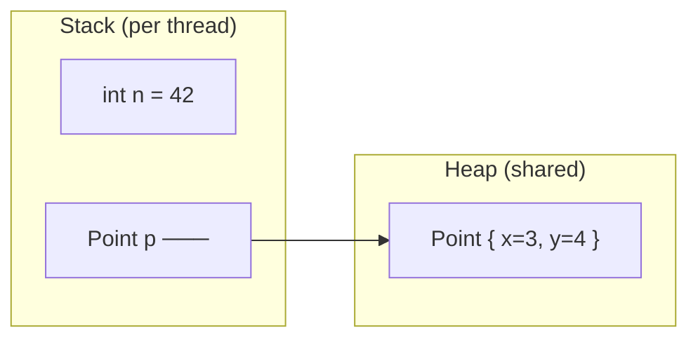
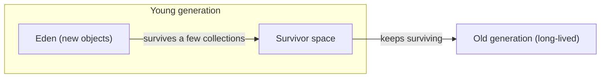

# The JVM: Memory, GC & JIT - What Runs Your Bytecode

You've written Java for fourteen phases and never once told the machine where to put an object, never freed memory by hand, never thought about whether your code was "warm." It all just worked. That's not an accident - it's the **JVM**, the Java Virtual Machine, a piece of machinery sitting between your code and the real hardware, quietly doing three enormous jobs on your behalf: it runs your compiled bytecode, it manages all your memory, and it rewrites your hot code into native machine code while the program runs.

You can ship Java for years without opening this hood. But the moment you ask "why did my memory climb and never come back down?", "why is the first request to my server slow and the thousandth one fast?", or "what *exactly* is an `OutOfMemoryError`?", you're asking JVM questions. This phase hands you the mental model so those questions have answers instead of shrugs. The big idea: **Java trades a little control you don't have for a lot of work you don't have to do** - and it pays off as long as you understand the few places where it can still bite.

## The JVM, recapped and deepened

Back in the early phases, `javac` turned your `.java` files into `.class` files full of **bytecode** - a compact, portable instruction set that no real CPU understands. That's the whole point. Your bytecode doesn't run on an Intel chip or an Apple M-series chip; it runs on the JVM, a program that pretends to be a CPU. "Write once, run anywhere" is exactly this: ship the same bytecode, and whatever JVM is installed on Windows, Linux, or macOS translates it for the local hardware.

📝 **JVM (Java Virtual Machine)** - a runtime program that executes Java bytecode. It is *not* a sandbox you opt into; it is the thing your program runs *inside*. It owns your memory, decides where objects live, reclaims them when you're done, and speeds up the parts of your code that run often.

This is what people mean when they call Java a **managed language**. In C, *you* manage memory: you `malloc` and you `free`, and if you get it wrong you get crashes and security holes. In Java, the JVM manages it. You create objects with `new` and then - this is the part that feels like magic until you understand it - you stop referring to them, and the JVM cleans up. The mental model to carry through this whole phase: **you describe what you want; the JVM decides how and where.**

```java
public class Hello {
    public static void main(String[] args) {
        String name = "world";
        System.out.println("Hello, " + name);
    }
}
```
```console
$ javac Hello.java      # source -> bytecode (Hello.class)
$ java Hello            # the JVM loads Hello.class and runs its bytecode
Hello, world
```
*What just happened:* `javac` compiled your source into portable bytecode, and `java` launched a JVM that loaded that bytecode and executed it. The JVM allocated the `String`, managed the stack frame for `main`, and reclaimed everything when the program exited - none of which you wrote a single line for. The rest of this phase is just zooming into each of those silent steps.

## Stack vs heap - where your values live

The JVM splits the memory your program uses into two regions with very different rules. Getting this distinction straight is the foundation for understanding garbage collection, recursion limits, and most memory bugs.

📝 **Stack** - a per-thread region that grows and shrinks with method calls. Each method call pushes a **frame** holding that method's local variables (primitive values like `int x = 5`, and *references* to objects). When the method returns, its frame is popped and that memory vanishes instantly, for free. **Heap** - a single region shared by all threads, where every object created with `new` actually lives. The heap is *not* freed when a method returns; reclaiming it is the garbage collector's job.

Here's the crucial relationship. When you write `Point p = new Point(3, 4)`, *two* things happen in two different places. The `Point` object itself - its `x` and `y` fields - is built on the **heap**. The variable `p` is a local on the **stack**, and it doesn't hold the object; it holds a **reference** (think: an arrow, an address) pointing at the heap object. Primitives are different: `int n = 42` stores the value `42` directly in the stack frame, no heap, no arrow.



This picture explains a lot at once. Two variables can point at the *same* heap object (that's why changing it through one is visible through the other - aliasing). A method can return a reference and the object survives, because it lives on the heap, not in the returning frame. And primitives copied between methods are genuinely independent, because the *value* travels, not an arrow.

```java
public class Where {
    static class Point { int x, y; Point(int x, int y) { this.x = x; this.y = y; } }

    public static void main(String[] args) {
        int n = 42;                         // value 42 lives in main's stack frame
        Point p = new Point(3, 4);          // the Point lives on the heap; p is a reference
        Point q = p;                        // q is a SECOND reference to the SAME object
        q.x = 99;                           // mutate through q...
        System.out.println(p.x);            // ...and p sees it, because they share one object
    }
}
```
```console
$ java Where
99
```
*What just happened:* `n` sat entirely in `main`'s stack frame as a raw value. The `Point` was allocated on the heap; both `p` and `q` are stack references holding the *same arrow* to it. Writing `q.x = 99` changed the one shared heap object, so reading `p.x` returned `99`. If `Point` had been copied by value (like `n`), `p` would still read `3` - the difference between "value lives here" and "arrow points there" is the whole game.

## Garbage collection

Objects pile up on the heap. In C you'd eventually `free()` each one; forget and you leak, double-free and you crash. Java removes that entire category of bug by reclaiming heap memory automatically. The component that does it is the **garbage collector**.

📝 **Garbage collector (GC)** - the JVM component that finds heap objects your program can no longer reach and frees them, so you never call `free()` yourself. It works by **reachability**: starting from a set of **GC roots** - local variables on every thread's stack, static fields, and a few others - it traces every reference it can follow. Anything reachable is *live* and kept. Anything it can't reach is garbage and gets reclaimed.

The key shift in thinking: **you don't manage lifetimes - reachability *is* the lifetime.** An object lives exactly as long as something can still reach it through a chain of references from a root. Drop the last reference, and it becomes eligible for collection. You never decide *when*; you only decide *whether anything still points at it*.

```java
public class Reach {
    public static void main(String[] args) {
        byte[] data = new byte[10_000_000];   // ~10 MB on the heap, reachable via `data`
        System.out.println("allocated; reachable");
        data = null;                          // drop the only reference
        // The 10 MB is now UNREACHABLE - eligible for GC. We never free it ourselves.
        System.out.println("dropped; now eligible for collection");
    }
}
```
```console
$ java Reach
allocated; reachable
dropped; now eligible for collection
```
*What just happened:* The 10 MB array was reachable through the local `data`, which is a GC root. The instant we set `data = null`, nothing in the program could reach that array anymore - it became unreachable garbage. The next time the collector runs, it traces from the roots, never finds the array, and sweeps its memory back into the pool. We freed exactly nothing by hand.

**The generational hypothesis.** Tracing the *entire* heap on every collection would be slow. Real GCs exploit a empirical observation called the **generational hypothesis**: *most objects die young.* The temporary `StringBuilder` in a loop, the request object that lives one HTTP call - the overwhelming majority of allocations become garbage almost immediately, while a few (caches, long-lived services) stick around.

So the heap is split into generations:



New objects are born in the **young generation** (Eden). A **minor GC** collects just the young gen - it's frequent and fast, because it only has to scan a small region and most of what's there is already dead. Objects that survive several minor GCs get *promoted* to the **old generation**, which is collected less often by a **major GC** (or full GC), a bigger, slower sweep. By collecting the young gen constantly and the old gen rarely, the JVM does the least work for the most garbage reclaimed.

⚠️ Both kinds of collection can trigger a **stop-the-world (STW) pause** - a moment where the JVM freezes all your application threads so the collector can work on a stable snapshot of the heap. Modern collectors shrink these pauses dramatically, but they never vanish entirely.

**The collectors you'll meet.** Java ships several GC implementations, each a different point on the pause-time-vs-throughput trade-off:

- **G1 (Garbage-First)** - the default since Java 9. Splits the heap into regions and collects incrementally to keep pauses predictable. A solid all-rounder.
- **ZGC** and **Shenandoah** - low-latency collectors that do almost all their work concurrently, targeting pauses under a millisecond even on huge (multi-hundred-GB) heaps. Reach for these when a pause would be felt (trading systems, interactive services).
- **Parallel GC** - older, throughput-focused: longer pauses but maximum raw work done. Fine for batch jobs where total time matters more than smoothness.

Step through the mark-and-sweep cycle yourself - watch roots, reachable objects, and the sweep - at your own pace:

```playground-gc
```

💡 **The insight.** GC is automatic, but it is *not free*. Every object you allocate is work the collector must eventually do. Code that churns through millions of short-lived objects creates **allocation pressure** - frequent minor GCs, and eventually pauses you can measure. The lever isn't usually a GC setting; it's allocating less garbage in the first place. You'll learn to *see* this allocation in [Phase 17: Performance & Memory](17-performance-and-ecosystem.md); for now, just hold the idea that "free" cleanup still has a price tag.

## JIT compilation

Here's a puzzle. Your bytecode isn't native machine code, so *something* has to translate it every time it runs. If the JVM translated every instruction on every execution, Java would be painfully slow. It isn't - a long-running Java service can match or beat C in throughput. The trick is the **JIT compiler**.

📝 **JIT (Just-In-Time) compiler** - the part of the JVM that compiles bytecode into native machine code *while the program runs*, focusing on the methods that run often. The JVM starts by **interpreting** bytecode (reading and executing it instruction by instruction - quick to start, slow to run), watches which methods are "hot," and hands those to the JIT to be compiled to fast native code.

This is why Java has a **warm-up** period. The first time a method runs, it's interpreted. As the JVM notices a method being called thousands of times - or a loop spinning many iterations - it promotes it to native code, and from then on that method runs at full speed. Your program literally gets faster the longer it runs, until it reaches a steady state.

Java's JIT works in **tiers** (tiered compilation):

- **C1 (client compiler)** - compiles quickly with light optimization. Gets hot code to "fast enough" sooner.
- **C2 (server compiler)** - compiles slowly with aggressive optimization (inlining, loop unrolling, dead-code elimination). For the *hottest* code, the JVM recompiles C1 output with C2 to squeeze out maximum speed.

The JVM also does **profile-guided** optimizations an ahead-of-time compiler can't: it watches the *actual* behavior of your running program - which branch is usually taken, which type really shows up at a call site - and optimizes for that. If its assumption later proves wrong, it **deoptimizes** (falls back to the interpreter and recompiles). It's optimizing for the real workload, not a guess made at compile time.

```java
public class Warmup {
    static long work(long n) {
        long sum = 0;
        for (long i = 0; i < n; i++) sum += i % 7;   // hot loop: JIT will compile this
        return sum;
    }

    public static void main(String[] args) {
        for (int run = 0; run < 5; run++) {
            long start = System.nanoTime();
            work(50_000_000L);
            long ms = (System.nanoTime() - start) / 1_000_000;
            System.out.println("run " + run + ": " + ms + " ms");
        }
    }
}
```
```console
$ java Warmup
run 0: 41 ms        # interpreted / C1 - cold
run 1: 22 ms
run 2: 9 ms
run 3: 8 ms         # C2 has kicked in - warm, steady state
run 4: 8 ms
```
*What just happened:* The identical `work(50_000_000L)` call got dramatically faster across runs without changing a line. Run 0 ran cold - interpreted, then lightly compiled. By the later runs the JIT had identified the hot loop, compiled it with C2's aggressive optimizations, and the method reached its steady-state speed. The numbers vary by machine, but the *shape* - slow first, fast once warm - is universal.

⚠️ **This is why naive microbenchmarks lie.** If you time a method once and report "Java did X in Y milliseconds," you almost certainly measured interpretation and warm-up, not real performance - or you measured a JIT that optimized away your unused result entirely. Honest benchmarking requires *warming up* (running the code enough to reach steady state) before you start timing, plus tricks to stop the JIT from deleting work whose result you ignore. Don't hand-roll this; use a tool built for it, the **JMH** harness, which you'll meet in [Phase 16: Testing, Build & Profiling](16-testing-and-profiling.md).

## Class loading and memory errors

One more JVM job runs quietly under everything: getting your `.class` files into memory in the first place.

📝 **Class loader** - the JVM subsystem that finds, loads, and links `.class` files **on demand**. A class isn't loaded when the JVM starts; it's loaded the first time your program actually needs it (the first time you reference the type). The bytecode is verified for safety, the class is initialized (static fields set, static blocks run), and it's ready to use. This lazy, on-demand loading is why a huge application starts without reading every class up front.

Most of the time class loading is invisible. Where the JVM's memory model becomes *very* visible is when something goes wrong, and there are two classic failures worth telling apart because they come from the two memory regions you now understand.

**`OutOfMemoryError` - the heap filled up.** The collector tried to make room and couldn't: live objects already occupy the whole heap. Sometimes that means you genuinely need more memory; far more often it means a **leak** - objects you *think* are garbage are still reachable, so the GC can't touch them. Remember: automatic GC frees the *unreachable*, not the *unused*. If you hold a reference, the JVM keeps the object, forever.

```java
import java.util.*;

public class Leak {
    static final List<byte[]> CACHE = new ArrayList<>();   // static = a GC root, lives forever

    public static void main(String[] args) {
        while (true) {
            CACHE.add(new byte[1_000_000]);                // never removed -> grows without bound
        }
    }
}
```
```console
$ java -Xmx64m Leak
Exception in thread "main" java.lang.OutOfMemoryError: Java heap space
```
*What just happened:* The `static` list `CACHE` is reachable from a GC root for the entire program, and so is every array we add to it. Nothing is ever removed, so the GC correctly concludes all of it is live - it can't reclaim a single byte. The heap (capped at 64 MB by `-Xmx64m`) fills and the JVM throws `OutOfMemoryError`. The GC is working *perfectly*; the bug is ours, holding references we no longer need.

⚠️ **GC'd does not mean leak-proof.** The classic real-world leaks all share this shape: a **static collection** (or singleton cache) that only ever grows, listeners or callbacks you register but never unregister, and **unclosed resources** (streams, connections) whose buffers linger. The fix is never a GC flag - it's bounding lifetimes: evict from caches, deregister listeners, and close resources (use try-with-resources from [Phase 7: Errors & I/O](07-errors-and-io.md) - pattern carries over).

**`StackOverflowError` - a stack frame too deep.** This is the *other* region failing. Each method call pushes a frame; recursion that never bottoms out pushes frames until the thread's stack space is exhausted.

```java
public class Deep {
    static int recurse(int n) {
        return recurse(n + 1);   // no base case -> frames pile up forever
    }
    public static void main(String[] args) {
        recurse(0);
    }
}
```
```console
$ java Deep
Exception in thread "main" java.lang.StackOverflowError
	at Deep.recurse(Deep.java:3)
	at Deep.recurse(Deep.java:3)
	...
```
*What just happened:* `recurse` calls itself with no base case, so every call pushes another frame onto the stack and none ever pop. The stack is a bounded region; once it's full, the JVM throws `StackOverflowError`. Note the distinction: `OutOfMemoryError` is the **heap** (too many live objects), `StackOverflowError` is the **stack** (too many nested calls). Different region, different cause, different fix.

**The size dials.** Two flags set the heap's bounds: `-Xms` is the *initial* heap size and `-Xmx` is the *maximum*. Setting `-Xmx512m` caps the heap at 512 MB; the program errors rather than consuming unbounded memory. In containers especially, set `-Xmx` deliberately so the JVM doesn't assume it owns the whole machine. Most apps never need more than these two, and you set them once at launch.

## Recap

1. The **JVM** runs your portable bytecode, manages all your memory, and recompiles hot code to native speed - this is what makes Java a **managed** language: you describe what you want, the JVM decides how and where.
2. Memory splits into the **stack** (per-thread frames; local primitives and references; freed instantly on return) and the **heap** (shared; every `new` object; reclaimed only by the GC). A variable holds a *reference* (arrow) to a heap object, not the object itself.
3. The **garbage collector** frees **unreachable** objects by tracing from **GC roots** - reachability *is* the lifetime, so you never `free()`. The **generational hypothesis** (most objects die young) drives the young/old split: frequent fast **minor GCs**, rarer slow **major GCs**, with brief **stop-the-world** pauses. **G1** is the default; **ZGC**/**Shenandoah** target sub-millisecond pauses.
4. The **JIT compiler** interprets bytecode first, then compiles hot methods to native code (**C1** fast, **C2** aggressive), which is why Java **warms up** and gets faster over time. ⚠️ Microbenchmarks must warm up or they lie - use JMH.
5. **Class loaders** load `.class` files **on demand**. ⚠️ `OutOfMemoryError` means the **heap** is full (often a leak via still-reachable objects - static collections, unclosed resources); `StackOverflowError` means the **stack** is too deep (runaway recursion). `-Xms`/`-Xmx` set the heap's bounds.

You now know what happens beneath `new`, `javac`, and every method call - the machine that runs your bytecode, places your objects, cleans up after you, and quietly makes your code faster the longer it runs. Next we make all of this measurable: testing, building, and profiling, where you watch allocations, GC pauses, and JIT warm-up with real tools instead of reasoning about them in the abstract.

## Quick check

Test yourself on the three ideas that matter most - where objects live, what GC actually frees, and why Java warms up:

```quiz
[
  {
    "q": "When you write `Point p = new Point(3, 4);`, where does the `Point` object live and what does `p` hold?",
    "choices": [
      "The Point object lives on the heap; `p` is a stack reference (an arrow) pointing at it",
      "Both the Point object and `p` live entirely on the stack",
      "The Point object lives on the stack; `p` is a heap reference pointing at it",
      "Both live on the heap, and the stack is only used for primitives like int"
    ],
    "answer": 0,
    "explain": "Objects created with `new` are built on the shared heap. The local variable `p` lives in the stack frame and holds a reference - an arrow - to that heap object, not the object itself. That's why two variables can point at the same object and a returned reference keeps its object alive."
  },
  {
    "q": "A `static List` keeps growing and you eventually get an `OutOfMemoryError`. Why can't the garbage collector reclaim those objects?",
    "choices": [
      "They are still reachable from a GC root (the static field), so the GC correctly treats them as live",
      "The GC only runs once at startup and never again during the program",
      "Static objects are immune to garbage collection by language rule",
      "The GC ran out of its own memory and gave up collecting"
    ],
    "answer": 0,
    "explain": "The GC frees what's unreachable, not what's unused. A static field is a GC root, so every object reachable through that ever-growing list stays live. The GC is working perfectly - the bug is holding references you no longer need. The fix is bounding the lifetime, not a GC setting."
  },
  {
    "q": "Why does the same method often run much faster on its thousandth call than its first?",
    "choices": [
      "The JIT compiler detected the method was hot and compiled it from bytecode to optimized native code",
      "The garbage collector deletes slow code paths after they run a few times",
      "Java caches the method's return value and skips running it again",
      "The class loader unloads and reloads the method in a faster form each call"
    ],
    "answer": 0,
    "explain": "The JVM interprets bytecode at first (slow), watches which methods run often, and hands the hot ones to the JIT, which compiles them to native code (C1 then C2). That warm-up is why steady-state Java is fast - and why naive one-shot microbenchmarks measure warm-up, not real performance."
  }
]
```

---

[← Phase 14: Concurrency & Threads](14-concurrency-and-threads.md) · [Guide overview](_guide.md) · [Phase 16: Testing, Build & Profiling →](16-testing-and-profiling.md)
