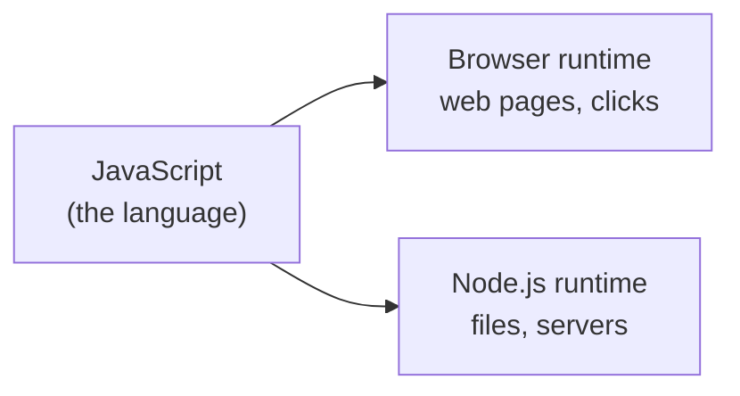

# Install & Your First Program

Before you write any JavaScript, there's one idea that saves a surprising amount of confusion: **the same
language runs in two completely different places, and they don't have the same tools.** Get this straight
now and a whole category of "why doesn't this work?" disappears.

## The mental model: a language vs. a place to run it

**What JavaScript actually is.** JavaScript is just a language - a set of grammar and rules for writing
instructions. By itself it doesn't *do* anything; it needs a program to read those instructions and carry
them out. That program is called a **runtime** (or *engine*).

There are two runtimes you'll meet first:

- **The browser** (Chrome, Firefox, Safari, Edge). Every browser has a JavaScript engine built in. This
  is JavaScript's original home - it exists to make web pages interactive. In the browser, your code can
  touch the page: change text, respond to clicks, draw things.
- **Node.js** - a runtime that takes the browser's JavaScript engine and runs it on your computer
  *outside* any web page. Node lets JavaScript do the things a normal program does: read files, run a
  web server, work with your file system.



📝 **Terminology.** A **runtime** is the program that actually executes your JavaScript. Same language,
different runtime, different powers.

⚠️ **The two are not interchangeable.** This trips up everyone eventually. The browser has objects like
`window` and `document` (the web page) that **do not exist in Node**. Node has tools like `fs` (the file
system) that **do not exist in the browser** - a web page on a stranger's site has no business reading
your hard drive, so the browser doesn't offer it. If you copy browser code into Node and it says
`document is not defined`, that's not a bug - you reached for a tool that runtime doesn't have.

## Install Node.js

You'll do most of your early learning in Node, because running a file from the terminal is the simplest
loop there is. Install it one of two ways.

**The simple way:** go to [nodejs.org](https://nodejs.org) and download the **LTS** version ("Long Term
Support" - the stable one most projects use). Run the installer, accept the defaults.

**The flexible way (recommended once you're comfortable):** install [nvm](https://github.com/nvm-sh/nvm)
("Node Version Manager"), which lets you install and switch between multiple Node versions. Real projects
often pin a specific version, and nvm makes that painless. On Windows, the equivalent is
[nvm-windows](https://github.com/coreybutler/nvm-windows).

Either way, confirm it worked by asking Node its version:
```console
$ node --version
v22.11.0
```
*What just happened:* You ran the `node` program with the `--version` flag, and it printed the version it
installed. The exact number will differ for you - what matters is that you got a `v` and some numbers back
instead of an error like `command not found`. If you *did* get `command not found`, Node isn't on your
system's PATH yet; closing and reopening your terminal (or rebooting) usually fixes a fresh install.

📝 **Terminology.** A **flag** is an extra option you pass to a command, usually starting with `--` (or a
single `-`). `--version` is asking the command "tell me your version and exit."

## Your first program: a file Node runs

Create a file called `hello.js` (the `.js` extension is the convention for JavaScript files). Put one line
in it:
```javascript runnable
console.log("Hello, JavaScript!");
```
*What just happened:* `console.log` is the instruction for "print this to the output." The text you want
shown goes in the parentheses, wrapped in quotes. (`console.log` works in *both* runtimes - in Node it
prints to your terminal, in the browser it prints to the browser's console. It's one of the few tools
both share.)

Now run the file with Node:
```console
$ node hello.js
Hello, JavaScript!
```
*What just happened:* You handed your file to the `node` runtime. Node read it top to bottom, found the
one instruction, carried it out, and printed the result. That's the whole loop you'll repeat thousands of
times: **edit a `.js` file, run it with `node`, read the output.**

💡 **Key point.** `node hello.js` means "Node, run this file." You're not compiling anything or pressing a
build button - Node reads your source directly and runs it. That immediacy is one of JavaScript's real
pleasures.

## The other runtime: the browser console

You don't need to install anything to run JavaScript in a browser - it's already there. Open any web page,
then open the **developer console**:

- **Chrome / Edge / Firefox:** press `F12`, or `Ctrl+Shift+J` (Windows/Linux) / `Cmd+Option+J` (Mac).
- Click the **Console** tab.

You'll see a prompt where you can type JavaScript and press Enter to run it immediately:
```javascript
console.log("Hello from the browser!");
2 + 2
```
*What just happened:* The console is a live, one-line-at-a-time JavaScript runtime. `console.log` printed
your text. The bare line `2 + 2` got *evaluated* and the console showed its result, `4`, automatically -
the console echoes the value of whatever you type, which makes it a fantastic scratchpad for trying things
out. (In a `.js` file run by Node, a bare `2 + 2` produces no visible output - nothing prints it. That's a
console convenience, not a language feature.)

🪖 **War story.** Nearly every JavaScript developer has, at some point, opened the browser console on a
site, typed something expecting it to behave like Node, and gotten a confusing result - or pasted Node
code into the console and watched it complain that `require` or `fs` doesn't exist. It's not you being
slow. It's the two-runtimes thing again. Whenever code surprises you, the first question is always: *which
runtime am I in, and does it have the tool I just used?*

## Recap

1. **JavaScript is a language; a runtime is what actually runs it.** The two you start with are the
   **browser** and **Node.js**.
2. **The runtimes have different tools.** The browser has `window`/`document`; Node has `fs`. Code written
   for one can fail in the other - that's expected, not broken.
3. **Install Node** from nodejs.org (LTS) or via nvm, and confirm with `node --version`.
4. **Run a file** with `node hello.js`; `console.log(...)` prints output in both runtimes.
5. **The browser console** is a live JavaScript scratchpad - open it with `F12` and the Console tab.

Next, we give those instructions something to work with: values, the types they come in, and the ways to
name and combine them.

---

[← Guide overview](_guide.md) · [Phase 2: Syntax, Values & Types →](02-syntax-values-and-types.md)
