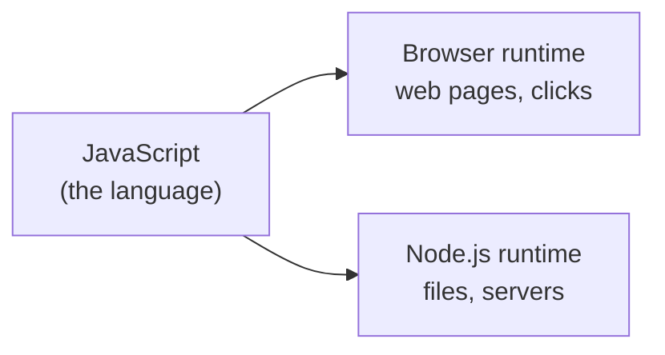

# Install & Your First Program

One idea saves a lot of confusion before you write any JavaScript: **the same language runs in two
completely different places, and they don't have the same tools.** Get this straight now and a whole
category of "why doesn't this work?" disappears.

## The mental model: a language vs. a place to run it

JavaScript is just a language - grammar and rules for writing instructions. By itself it doesn't *do*
anything; it needs a program to read and carry out those instructions. That program is called a
**runtime** (or *engine*).

There are two runtimes you'll meet first:

- **The browser** (Chrome, Firefox, Safari, Edge). Every browser has a JavaScript engine built in - this
  is JavaScript's original home, and it exists to make web pages interactive. Your code can touch the
  page: change text, respond to clicks, draw things.
- **Node.js** - a runtime that takes the browser's JavaScript engine and runs it on your computer
  *outside* any web page, so JavaScript can do what a normal program does: read files, run a web server,
  work with your file system.



📝 **Terminology.** A **runtime** is the program that executes your JavaScript. Same language, different
runtime, different powers.

⚠️ **The two are not interchangeable.** The browser has objects like `window` and `document` (the web
page) that **do not exist in Node**. Node has tools like `fs` (the file system) that **do not exist in
the browser** - a web page on a stranger's site has no business reading your hard drive. Copy browser
code into Node and see `document is not defined`? Not a bug - that tool doesn't exist there.

## Install Node.js

You'll do most of your early learning in Node, since running a file from the terminal is the simplest loop
there is.

**The simple way:** go to [nodejs.org](https://nodejs.org) and download the **LTS** version ("Long Term
Support" - the stable one most projects use). Run the installer and accept the defaults.

**The flexible way (recommended once you're comfortable):** install [nvm](https://github.com/nvm-sh/nvm)
("Node Version Manager") to install and switch between multiple Node versions - real projects often pin a
specific version, and nvm makes that painless. On Windows, use
[nvm-windows](https://github.com/coreybutler/nvm-windows).

Either way, confirm it worked by asking Node its version:
```console
$ node --version
v22.11.0
```
*What just happened:* `node --version` printed the installed version. The exact number will differ - what
matters is a `v` and some numbers, not `command not found`. Getting that error means Node isn't on your
PATH yet; reopening your terminal (or rebooting) usually fixes a fresh install.

📝 **Terminology.** A **flag** is an extra option passed to a command, usually starting with `--` (or a
single `-`). `--version` means "tell me your version and exit."

## Your first program: a file Node runs

Create a file called `hello.js` (`.js` is the convention for JavaScript files) with one line in it:
```javascript runnable
console.log("Hello, JavaScript!");
```
*What just happened:* `console.log` prints its argument to the output. (It works in *both* runtimes - in
Node it prints to your terminal, in the browser to the browser's console. One of the few tools both share.)

Now run the file with Node:
```console
$ node hello.js
Hello, JavaScript!
```
*What just happened:* Node read the file top to bottom, ran the one instruction, and printed the result.
That's the loop you'll repeat thousands of times: **edit a `.js` file, run it with `node`, read the
output.**

💡 **Key point.** `node hello.js` means "Node, run this file." Nothing to compile, no build button - Node
reads your source directly and runs it.

## The other runtime: the browser console

Running JavaScript in a browser needs no install - it's already there. Open any web page, then open the
**developer console**:

- **Chrome / Edge / Firefox:** press `F12`, or `Ctrl+Shift+J` (Windows/Linux) / `Cmd+Option+J` (Mac).
- Click the **Console** tab.

Type JavaScript at the prompt and press Enter to run it immediately:
```javascript
console.log("Hello from the browser!");
2 + 2
```
*What just happened:* The console is a live, one-line-at-a-time runtime. `console.log` printed your text;
the bare line `2 + 2` got *evaluated* and the console echoed its result, `4`, automatically - a great
scratchpad. (A `.js` file run by Node shows no output for a bare `2 + 2`; that's a console convenience,
not a language feature.)

🪖 **War story.** Nearly every JavaScript developer has opened the browser console expecting Node behavior
and gotten a confusing result - or pasted Node code into the console and watched it complain that `require`
or `fs` doesn't exist. It's the two-runtimes thing again. When code surprises you, ask: *which runtime am I
in, and does it have the tool I just used?*

## Recap

1. **JavaScript is a language; a runtime is what runs it.** The two you start with are the **browser** and
   **Node.js**.
2. **The runtimes have different tools.** The browser has `window`/`document`; Node has `fs`. Code written
   for one can fail in the other - that's expected, not broken.
3. **Install Node** from nodejs.org (LTS) or via nvm, and confirm with `node --version`.
4. **Run a file** with `node hello.js`; `console.log(...)` prints output in both runtimes.
5. **The browser console** is a live JavaScript scratchpad - open it with `F12` and the Console tab.

Next: values, the types they come in, and the ways to name and combine them.

---

[← Guide overview](_guide.md) · [Phase 2: Syntax, Values & Types →](02-syntax-values-and-types.md)
