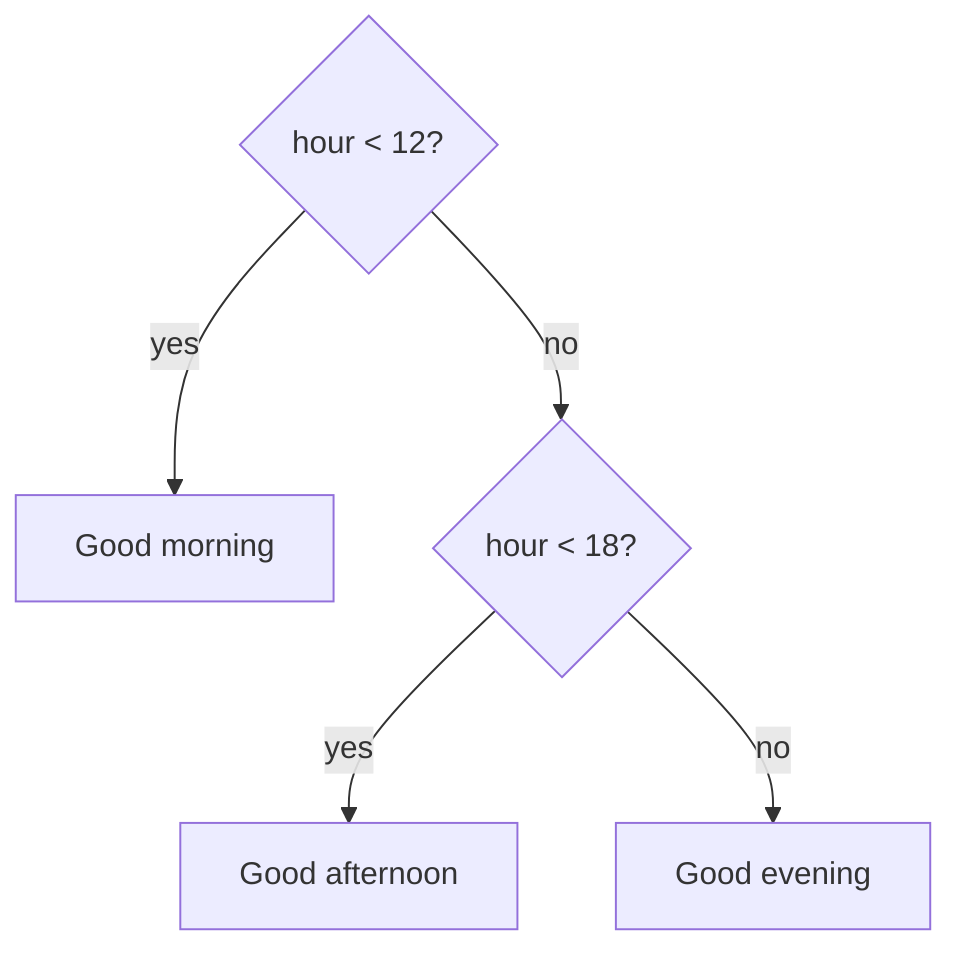

# Control Flow & Functions

So far your code runs straight down, every line, once. Real programs need to *choose* (do this only if
that's true) and *repeat* (do this for every item), and they need to *reuse* chunks of behavior without
copy-pasting. Those three needs - decisions, loops, and functions - are this phase. Functions especially:
they're the unit you'll think in for the rest of your career.

## Making decisions: `if` / `else`

**What it does.** `if` runs a block of code only when a condition is `true`. `else` covers the other case.
```javascript runnable
const hour = 14;

if (hour < 12) {
  console.log("Good morning");
} else if (hour < 18) {
  console.log("Good afternoon");
} else {
  console.log("Good evening");
}
```
```console
Good afternoon
```
*What just happened:* JavaScript checked the conditions top to bottom. `hour < 12` was `false` (14 isn't
less than 12), so it moved on. `hour < 18` was `true`, so it ran *that* block and skipped the rest. The
first matching branch wins; the others never run. The `{ }` curly braces group the lines that belong to
each branch.

Here's that decision as a picture:



📝 **Terminology - truthy and falsy.** Conditions don't have to be literal `true`/`false`. JavaScript
treats some values as "truthy" and others as "falsy" in a yes/no context. The falsy ones are worth
memorizing because they're a common source of bugs: `false`, `0`, `""` (empty string), `null`,
`undefined`, and `NaN`. *Everything else* is truthy - including `"0"` (a non-empty string) and `[]` (an
empty array). So `if (value)` means "if value is truthy."

## Repeating: `for...of` and `while`

The cleanest way to do something with every item in an array is `for...of`:
```javascript runnable
const names = ["Ada", "Linus", "Grace"];
for (const name of names) {
  console.log(`Hello, ${name}`);
}
```
```console
Hello, Ada
Hello, Linus
Hello, Grace
```
*What just happened:* `for (const name of names)` walked through `names` one item at a time, putting each
into `name` and running the block. You didn't manage any index counter - `for...of` handles that for you,
which is why it's the loop to reach for when you just want "each item." (You'll also see the older
C-style `for (let i = 0; i < names.length; i++)` loop; `for...of` is cleaner when you don't need the index
number itself.)

When you don't know in advance how many times to loop, use `while` - it repeats *as long as* its condition
stays true:
```javascript runnable
let countdown = 3;
while (countdown > 0) {
  console.log(countdown);
  countdown = countdown - 1;
}
console.log("Liftoff!");
```
```console
3
2
1
Liftoff!
```
*What just happened:* `while` checked `countdown > 0`, ran the block, and checked again - repeating until
`countdown` hit `0`. Crucially, the block *changes* `countdown` each time. ⚠️ If a `while` loop's
condition never becomes false (you forget to change the thing it checks), it runs forever and freezes your
program - the classic "infinite loop." Always make sure each pass moves toward the exit.

## Functions: naming a block of behavior

**What a function actually is.** A function is a named, reusable block of instructions that can take
*inputs* (parameters) and hand back an *output* (a return value). It lets you write a piece of behavior
once and run it whenever you need it, with different inputs.
```javascript runnable
function greet(name) {
  return `Hello, ${name}!`;
}

console.log(greet("Ada"));
console.log(greet("Grace"));
```
```console
Hello, Ada!
Hello, Grace!
```
*What just happened:* `function greet(name) { ... }` defined a function with one **parameter**, `name`.
`return` hands a value back to whoever called the function. Calling `greet("Ada")` ran the function with
`name` set to `"Ada"` and produced `"Hello, Ada!"`, which `console.log` then printed. The same function,
called twice with different inputs, gave two different outputs - that's the whole point of parameters.

📝 **Terminology.** A **parameter** is the name in the function definition (`name`); an **argument** is the
actual value you pass in when calling (`"Ada"`). `return` ends the function and sends a value back; a
function with no `return` hands back `undefined`.

**Default parameters** let a parameter fall back to a value when the caller leaves it out:
```javascript runnable
function greet(name = "friend") {
  return `Hello, ${name}!`;
}
console.log(greet());          // no argument passed
console.log(greet("Ada"));
```
```console
Hello, friend!
Hello, Ada!
```
*What just happened:* Calling `greet()` with no argument let `name` fall back to its default, `"friend"`.
Passing `"Ada"` overrode the default. Defaults save you from scattering "if it wasn't provided, use X"
checks through your code.

## Arrow functions: the compact form

You've already seen these in [Phase 3](03-collections.md). An **arrow function** is a shorter way to write
a function, used constantly for small, inline functions:
```javascript runnable
const double = (n) => n * 2;
const greet = (name) => `Hello, ${name}!`;

console.log(double(5));
console.log(greet("Ada"));
```
```console
10
Hello, Ada!
```
*What just happened:* `(n) => n * 2` is a function taking `n` and returning `n * 2`. When the body is a
single expression, you can skip the `{ }` and the word `return` - the value is returned automatically. It's
the same idea as a `function`, written tighter. For a multi-line body you bring back the braces and an
explicit `return`: `(n) => { const r = n * 2; return r; }`.

For now, treat arrow functions and `function` declarations as two ways to write the same thing. There *is*
one real behavioral difference around `this`, which we flag at the end of this phase and cover fully later.

## Functions are values you can pass around

This is the idea that makes JavaScript click. **A function is itself a value** - you can store it in a
variable, put it in an array, and (the powerful part) *pass it to another function*. A function passed to
another function is called a **callback**.
```javascript runnable
function runTwice(action) {
  action();
  action();
}

runTwice(() => console.log("tick"));
```
```console
tick
tick
```
*What just happened:* `runTwice` takes a function as its argument and calls it twice. We handed it
`() => console.log("tick")` - a function with no parameters - and `runTwice` ran it two times. This is
exactly what `map`/`filter`/`reduce` do: you hand them a function, and *they* decide when and how to call
it on your data. Once "functions are just values you pass around" feels natural, huge swaths of JavaScript
(event handlers, array methods, async code) stop looking like magic.

💡 **Key point.** "First-class functions" is the formal name for this: functions are values, equal
citizens with numbers and strings. Passing behavior into other code - instead of just passing data - is the
backbone of how JavaScript handles clicks, timers, and network responses, all of which are coming in
[Phase 6](06-async-and-the-dom.md).

## ⚠️ A tease: `this` depends on *how* you call a function

You'll eventually meet the keyword `this` inside functions, and it's one of JavaScript's genuinely
confusing corners - so here's the one sentence that defuses most of the pain: **`this` is not set by where
a function is *defined*, but by *how it is called*.** The same function can see a different `this` depending
on whether you call it as a method on an object, on its own, or as a callback. Arrow functions are special
here - they *don't* get their own `this`, which is one reason people prefer them for callbacks.

That's all you need for now. We're flagging it so the word `this` isn't a total stranger when it appears;
the full mental model gets its own treatment in [Phase 9: Idioms & Gotchas](09-idioms-and-gotchas.md).

## Recap

1. **`if` / `else if` / `else`** picks the first branch whose condition is truthy; remember the falsy
   values (`false`, `0`, `""`, `null`, `undefined`, `NaN`).
2. **`for...of`** loops over each item in a list cleanly; **`while`** repeats until its condition goes
   false - make sure it eventually does.
3. **Functions** package reusable behavior: **parameters** are inputs, `return` is the output, and
   **defaults** cover missing arguments.
4. **Arrow functions** (`(n) => n * 2`) are the compact form for small inline functions.
5. **Functions are values** - you can pass them around; one passed into another function is a
   **callback**. And `this` is decided by *how* a function is called, not where it's written.

Next, we stop cramming everything into one file: modules let you split a program across files and pull the
pieces together cleanly.

---

[← Phase 3: Collections](03-collections.md) · [Guide overview](_guide.md) · [Phase 5: Modules & Project Layout →](05-modules-and-project-layout.md)
