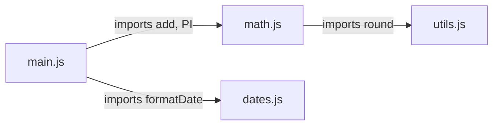

# Modules & Project Layout

Everything so far lived in one file - fine for ten lines, but it falls apart fast for anything real.
Programs grow, and you want related code grouped into files you can find, reuse, and reason about
separately. The tool for that is **modules**. This phase sets the stage for the async and browser work in
[Phase 6](06-async-and-the-dom.md).

## The mental model: each file is a module

A module is a `.js` file that keeps its contents *private* by default and explicitly *shares* (exports)
the pieces other files may use; other files then *import* exactly what they need. Nothing leaks between
files unless you say so.

This system is called **ES modules** (or "ESM" - the official, modern standard built into the language).
Two keywords run it: `export` to share, `import` to borrow.

📝 **Terminology.** You may also hear about **CommonJS** (`require(...)` / `module.exports`), the *older*
system Node used for years and that you'll still meet in existing code. We teach **ES modules** since
they're the standard going forward and work in both browser and Node. Recognize `require`; write
`import`.

## `export` and `import`

Let's split a tiny program into two files. First, a file that *provides* some helpers:
```javascript
// math.js
export function add(a, b) {
  return a + b;
}

export const PI = 3.14159;
```
*What just happened:* The `export` keyword marks `add` and `PI` as the parts of this file other files may
use. Anything *without* `export` (a helper variable, say) stays private to `math.js`, invisible from
outside. The file is now a reusable module with a clear public surface.

Now a file that *uses* them:
```javascript
// main.js
import { add, PI } from "./math.js";

console.log(add(2, 3));
console.log(PI);
```
```console
5
3.14159
```
*What just happened:* `import { add, PI } from "./math.js"` reached into `math.js` and pulled out the two
exported names. The `./` at the front means "a file right next to me" (a *relative* path), resolving the
same way regardless of which folder you run the program from. ES modules in Node need the `.js`
extension. Run with `node main.js` and Node loads `math.js` automatically because `main.js` asked for it. (For this to run, your project needs the `"type": "module"` setting covered in the next section - or, to skip setup entirely and run right now, name the files `math.mjs`/`main.mjs`: the `.mjs` extension tells Node a file is a module all on its own, with no `package.json`.)

Here's the relationship as a picture - a small **module graph**:



*Reading it:* arrows point from a file to the files it depends on. `main.js` is the entry point; it pulls
in `math.js` and `dates.js`, and `math.js` pulls in `utils.js`. Node starts at your entry file and follows
these arrows, loading each module once. This graph *is* your program's structure - a clean tree, not a
tangle where everything imports everything, is most of what "good architecture" means here.

### Default exports

A second flavor of export, **default**, is for when a file's main purpose is to provide one thing:
```javascript
// greet.js
export default function greet(name) {
  return `Hello, ${name}!`;
}
```
```javascript
// main.js
import greet from "./greet.js";   // no curly braces for a default
console.log(greet("Ada"));
```
```console
Hello, Ada!
```
*What just happened:* A file can have one `export default`. Import it *without* curly braces and pick any
name for it on the importing side. Use a default when a module is really "about" one thing (a single
function or class); use named `{ ... }` exports when a file offers several helpers. Plenty of code mixes
both.

## What `package.json` is

The moment a project is more than a couple of loose files, it gets a **`package.json`** - a small file at
the project root describing the project. Create one by running:
```console
$ npm init -y
Wrote to /home/ada/my-project/package.json
```
*What just happened:* `npm init -y` created a starter `package.json` with sensible defaults (`-y` says
"yes to all the prompts"). `npm` is Node's package manager, shipped with Node - more in
[Phase 8](08-ecosystem-and-tooling.md). For an ES module project you want it to look roughly like this:
```json
{
  "name": "my-project",
  "version": "1.0.0",
  "type": "module",
  "scripts": {
    "start": "node main.js"
  },
  "dependencies": {}
}
```
*What just happened:* This file is your project's ID card and control panel. The fields that matter
early:

- **`"type": "module"`** - tells Node to treat your `.js` files as ES modules so `import`/`export` work.
  ⚠️ Without this line, Node assumes the *old* CommonJS system and your `import` statements throw
  `SyntaxError: Cannot use import statement outside a module`. If you hit that error, this missing line
  is almost always why (`npm init -y` doesn't always add it - set it yourself).
- **`"scripts"`** - named shortcuts run with `npm run <name>` (e.g. `npm run start`), saving you retyping
  long commands and documenting how the project is meant to run.
- **`"dependencies"`** - the outside packages your project uses, filled in as you install them.

## What `node_modules` is

Installing an outside package (`npm install some-package`) makes npm download it - and everything *it*
depends on - into a folder called **`node_modules`** at your project root, recording the package in
`package.json`.

⚠️ **`node_modules` is huge and disposable - never commit it.** It can hold thousands of files, and it's
fully rebuildable: anyone with your `package.json` can recreate it via `npm install`. List it in
`.gitignore` and leave it out of version control. The *recipe* (`package.json` and its lockfile) is what
you track; the *downloaded result* (`node_modules`) is not. New developers clone the repo, run
`npm install`, and `node_modules` reappears.

💡 **Key point.** The split is the whole idea: **`package.json` is the recipe you keep; `node_modules` is
the meal you can always re-cook.** Track the recipe, ignore the meal.

## A sane small project layout

You don't need an elaborate structure to start. Here's a layout that scales from tiny to medium without
ceremony:
```text
my-project/
  package.json        the recipe: name, scripts, dependencies
  package-lock.json   exact versions npm installed (commit this)
  .gitignore          lists node_modules/ so Git ignores it
  node_modules/       downloaded packages (ignored, rebuildable)
  src/                your actual code lives here
    main.js           the entry point you run
    math.js           a module of related helpers
    dates.js          another module
  README.md           what this project is and how to run it
```

*Reading it:* the principle is "code in `src/`, config at the root, downloaded stuff ignored." `main.js`
is your entry point - the file you run, the root of the module graph. As the project grows, add more
files under `src/` (and eventually subfolders that group related modules), but the shape stays the same.
Resist inventing structure you don't need yet - let folders appear when the code calls for them.

## Recap

1. **A module is a file** that keeps its contents private and shares only what it `export`s; other files
   pull pieces in with `import`.
2. **Named exports** (`export const x` → `import { x }`) for several helpers; **default export** (one per
   file, no braces on import) when a file is about one thing. Use relative paths with the `.js`
   extension, e.g. `from "./math.js"`.
3. **`package.json`** is your project's recipe - set **`"type": "module"`** so `import`/`export` work,
   define **`scripts`**, and let **`dependencies`** track outside packages.
4. **`node_modules`** holds downloaded packages; huge, rebuildable with `npm install`, **never
   committed** - gitignore it.
5. **A sane layout** keeps code in `src/`, config at the root, `node_modules` ignored - grow it only as
   the code demands.

Next: what makes JavaScript truly distinctive - doing things that take time (network calls, timers,
clicks) without freezing, and reaching into a live web page from your code.

---

[← Phase 4: Control Flow & Functions](04-control-flow-and-functions.md) · [Guide overview](_guide.md) · [Phase 6: Async & the DOM →](06-async-and-the-dom.md)
