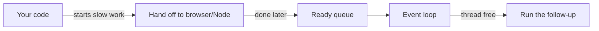
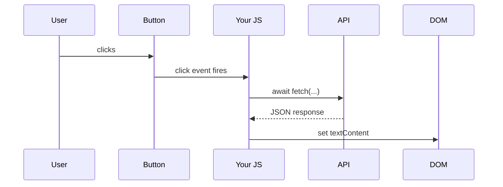

# Async & the DOM - JavaScript's Big Idea

By now you can write functions, loop over arrays, and split code into modules. This phase is where JavaScript stops feeling like "a language" and starts feeling like *the thing browsers run* - two ideas define almost everything you'll do with it: **async** (JavaScript does one thing at a time, but refuses to sit and wait for slow things) and the **DOM** (the live, in-memory model of the page that your JavaScript reads and rewrites while the user watches). Get these two, and "make the button fetch some data and update the page" goes from intimidating to obvious.

## The one-thread rule

JavaScript runs your code on a **single thread** - one worker, doing one thing at a time, in order. No second worker quietly runs your other functions in the background; if your code is busy, it's busy, and nothing else of yours runs until it finishes.

That sounds like a recipe for a frozen, useless program. The thing that saves it is the **event loop**.

📝 **Terminology.** A *thread* is a single sequence of execution - one worker, one task at a time. *Asynchronous* ("async") means "started now, finished later" - kick off slow work and get on with other things instead of standing still until it's done.

When your code starts something slow - a network request, a timer, waiting for a click - JavaScript doesn't block the thread waiting for it. It hands the job off (to the browser or Node) and returns immediately. Later, when the slow thing is done, the *follow-up* code drops into a queue, and the event loop runs it once the thread is free.



*What this shows:* The slow work happens *off* your one thread. The event loop picks the next ready follow-up and runs it when the thread isn't busy - one worker, many things in flight, since waiting doesn't occupy the worker.

⚠️ **Gotcha: don't block the event loop.** A long *synchronous* task - a giant `for` loop, a heavy calculation - freezes everything, since there's only one thread. In the browser the page stops responding (no scrolling, no clicks); on a server, every request stalls. Keep heavy synchronous work off the main thread - let slow things be async, and break up big computations.

> 💡 This phase is the working mental model. For the full picture - the queue, microtasks vs. macrotasks, why one thread can feel concurrent - see [Async/Await and the Event Loop](/guides/async-await-and-the-event-loop).

## Three generations of async syntax

The *idea* (start now, finish later) has stayed the same; the *syntax* for expressing it got dramatically nicer over the years. You'll see all three in real code, so let's meet them in order.

### Callbacks - the original

A **callback** is a function you hand to something slow, with the instruction "call this when you're done." The slow thing holds onto your function and runs it later.

```javascript
setTimeout(() => {
  console.log("2 seconds have passed");
}, 2000);
console.log("This runs first");
```
```console
This runs first
2 seconds have passed
```
*What just happened:* `setTimeout` registered your callback and returned immediately, so the line *after* it ran first. Two seconds later the browser dropped your callback into the queue and the event loop ran it.

**The gotcha.** Callbacks nest. One async step depending on another, depending on another, marches your code rightward into a pyramid everyone calls *callback hell*:

```javascript
getUser(id, (user) => {
  getOrders(user, (orders) => {
    getDetails(orders[0], (details) => {
      // ...three levels deep and still going
    });
  });
});
```
*What just happened:* Each step can only start once the previous one's callback fires, so they nest. It works, but it's hard to read and harder to add error handling to - exactly what Promises were invented to fix.

### Promises - a value that arrives later

A **Promise** is an object that stands in for a result that isn't ready yet - a placeholder with three states: *pending* (still waiting), *fulfilled* (succeeded, here's the value), or *rejected* (failed, here's the error). You attach `.then()` for success and `.catch()` for failure.

```javascript
fetch("https://api.example.com/user/1")
  .then((response) => response.json())
  .then((user) => console.log(user.name))
  .catch((error) => console.log("Request failed:", error));
```
*What just happened:* `fetch` returns a Promise immediately, without waiting for the network. Each `.then` says "when the previous step resolves, run this next." The chain is *flat*, not nested: each step returns a new Promise, so success flows down the `.then`s and any error skips straight to `.catch`. Pyramid gone.

📝 **Terminology.** A Promise *resolves* when it settles successfully (giving you a value) and *rejects* when it fails (giving you an error). "Settled" means done one way or the other.

### async/await - Promises that read like normal code

`async`/`await` is *syntax over Promises*. Mark a function `async`, and inside it you can `await` a Promise, which pauses the function until the Promise settles, then hands you the value as if it were a normal return. The code reads top-to-bottom like ordinary code, but it's still async underneath.

```javascript
async function showUser(id) {
  const response = await fetch(`https://api.example.com/user/${id}`);
  const user = await response.json();
  console.log(user.name);
}
```
*What just happened:* `await fetch(...)` pauses `showUser` until the response arrives, then resumes with it in hand - no `.then` nesting, no callback. The function *looks* synchronous, but `await` is quietly doing the "start now, continue later" dance with the event loop. This is the style you'll write almost all the time.

⚠️ **Gotcha: forgetting `await`.** Drop the `await` and you get the *Promise itself*, not the value inside it - your code marches on before the work is done. This bites everyone:

```javascript
async function showUser(id) {
  const response = fetch(`https://api.example.com/user/${id}`); // no await!
  const user = await response.json(); // boom
}
```
```console
TypeError: response.json is not a function
```
*What just happened:* Without `await`, `response` is a pending Promise, not the resolved `Response` object, and a Promise has no `.json()` method - hence the `TypeError`. When something is `undefined` or "not a function" right after an async call, check for a missing `await` first.

> 💡 Rule of thumb: `await` lives inside an `async` function, on something that returns a Promise (`fetch`, `response.json()`, anything you wrote with `async`).

## The DOM - the page as a live object

Async gets data. The **DOM** is how you put it on screen.

When the browser loads your HTML, it parses it into a tree of objects in memory - one per tag - called the **DOM** (Document Object Model). Your JavaScript doesn't edit the HTML text; it edits *this tree*. Change an object in the tree and the browser instantly re-renders that part of the page.

📝 **Terminology.** *DOM* = Document Object Model. An *element* is one node in that tree (a `<button>`, a `<div>`). `document` is the global object that's the root of the tree and your entry point to it.

Three verbs cover most DOM work: **select** an element, **change** it, and **respond** to events on it.

```javascript
// Select
const button = document.querySelector("#load");
const output = document.querySelector("#output");

// Respond to an event
button.addEventListener("click", () => {
  // Change
  output.textContent = "Loading...";
});
```
*What just happened:* `querySelector` finds elements using CSS-selector syntax (`#load` = the element with `id="load"`). `addEventListener("click", fn)` tells the browser to run that function on every click. Setting `output.textContent` rewrites that element's text, and the user sees it change immediately.

⚠️ **Gotcha: use `textContent`, not `innerHTML`, for plain text.** `innerHTML` parses its input as HTML, so dropping user-supplied text into it can inject markup or scripts (an XSS hole). For plain text, `textContent` is both safer and faster.

## Putting it together: click → fetch → update

The canonical browser flow, and why both halves of this phase matter: the user clicks, you fetch data without freezing the page, the response updates the DOM. Watch the thread stay free the whole time:



```javascript
const button = document.querySelector("#load");
const output = document.querySelector("#output");

button.addEventListener("click", async () => {
  output.textContent = "Loading...";
  try {
    const res = await fetch("https://api.example.com/quote");
    const data = await res.json();
    output.textContent = data.text;
  } catch (err) {
    output.textContent = "Could not load. Try again.";
  }
});
```
*What just happened:* The click handler is an `async` function, so it can `await`. It shows "Loading..." then awaits the fetch, and since that wait is async, the page stays fully responsive (the user can still scroll). When the JSON arrives, it's written into the DOM; if anything fails, `catch` shows a friendly message instead of a silent break. This four-line pattern - set pending state, await, update, catch - is most of what front-end JavaScript *is*.

Async code fails in its own particular ways, which is exactly where the next phase begins.

## Recap

1. JavaScript runs on **one thread**; the **event loop** runs slow work's follow-up later, so the thread never sits and waits.
2. Async syntax evolved: **callbacks** (nest badly) → **Promises** (`.then`/`.catch`, flat) → **async/await** (reads like normal code, still Promises underneath).
3. **`await`** pauses an `async` function until a Promise settles and hands you the value - forgetting it gives you the Promise itself, the #1 async bug.
4. The **DOM** is the page as a live tree of objects: **select** (`querySelector`), **change** (`textContent`), **respond** (`addEventListener`).
5. Everyday browser pattern: **click → `await fetch` → update the DOM**, wrapped in `try/catch`, page never freezing.

---

[← Phase 5: Modules & Project Layout](05-modules-and-project-layout.md) · [Guide overview](_guide.md) · [Phase 7: Errors & I/O →](07-errors-and-io.md)
