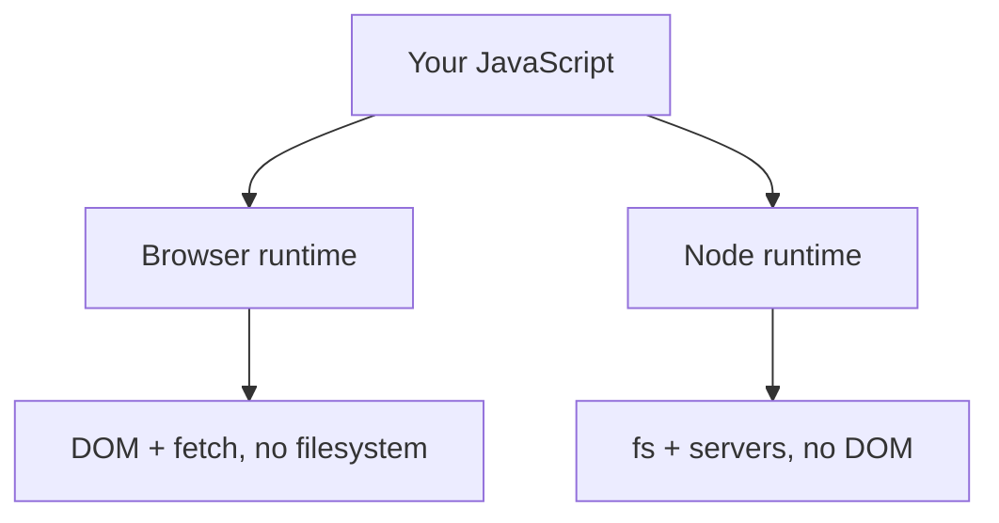

# The Ecosystem & Tooling - npm, Runtimes, and the Tools Everyone Uses

You can write perfectly good JavaScript with nothing but a text file and a browser. But the moment you join a real project, you're surrounded by tooling - `package.json`, `node_modules`, a `npm run dev` someone told you to type, configs for things called Prettier and ESLint. None of it is mandatory knowledge to *write* JavaScript, but all of it is mandatory knowledge to *work with other people's* JavaScript.

So here's the map. We'll go through the pieces in the order you actually meet them, explaining what each one is *for* - because once you know the job each tool does, the config files stop being scary and start being obvious.

## npm - the package manager

**What it actually is.** **npm** ("Node Package Manager") does two jobs: it downloads code other people wrote (**packages**) into your project, and it runs the **scripts** you've defined. It ships with Node, so if you have Node, you have npm.

📝 **Terminology.** A *package* (or *dependency*) is reusable code published to the npm registry - a date library, a web framework, a testing tool. A *package manager* installs them and tracks exactly which versions you used.

**What it does in real life.** You install something, and npm records it:

```console
$ npm install dayjs
added 1 package in 1s
```
*What just happened:* npm downloaded the `dayjs` package into a folder called `node_modules/`, and added it to your `package.json` under `dependencies` - so anyone who clones your project can run `npm install` and get the exact same set of packages.

### package.json - the project's identity card

`package.json` is the file that describes your project: its name, its dependencies, and its **scripts** - named shortcuts for commands.

```json
{
  "name": "my-app",
  "type": "module",
  "scripts": {
    "dev": "vite",
    "build": "vite build",
    "test": "vitest",
    "format": "prettier --write ."
  },
  "dependencies": {
    "dayjs": "^1.11.0"
  }
}
```
*What just happened:* The `scripts` block defines names you can run with `npm run <name>`. Instead of remembering `vite build`, you type `npm run build`. (`npm test` and `npm start` are special - you can drop the `run`.) `"type": "module"` tells Node to treat your `.js` files as ES modules, so `import`/`export` work (the modern default - see [Phase 5](05-modules-and-project-layout.md)).

```console
$ npm run dev

  VITE v5.4.0  ready in 412 ms

  ➜  Local:   http://localhost:5173/
```
*What just happened:* `npm run dev` looked up `"dev"` in your scripts, found `vite`, and ran it - starting a local dev server you can open in a browser. This is the command you'll type a hundred times a day.

⚠️ **Gotcha: `node_modules` is huge and regenerable - never commit it.** That folder routinely holds tens of thousands of files and hundreds of megabytes, and it can be rebuilt anytime from `package.json` with `npm install`. Committing it bloats your repo and causes endless merge conflicts. Put it in `.gitignore`:

```console
$ cat .gitignore
node_modules/
```
*What just happened:* Git now ignores `node_modules/` entirely. What you *do* commit is `package.json` and `package-lock.json` (which pins exact versions) - those two are enough for anyone to reproduce your dependencies.

## Where JavaScript runs - the runtime split

JavaScript code needs a **runtime**: a program that actually executes it. There are two you'll meet first, and two newer ones worth a sentence.

📝 **Terminology.** A *runtime* is the environment that runs your JavaScript and gives it abilities beyond the language itself (reading files, making network requests, talking to a screen).

- **The browser** (Chrome, Firefox, Safari…) runs JavaScript to make web pages interactive. It gives you the DOM and `fetch`, but deliberately *can't* read your filesystem.
- **Node.js** runs JavaScript outside the browser - on servers, on your laptop, in build tools. It gives you `fs`, networking, and access to npm packages, but has *no* DOM (there's no page).

That's the split that explains a thousand "why doesn't this work" moments: `document` is undefined in Node because Node has no page; `fs` is undefined in the browser because pages can't touch your disk.



*What this shows:* Same language, two homes, different superpowers. Knowing *which* runtime your code runs in tells you which APIs are available.

> 💡 **Deno and Bun** are newer alternatives to Node that run JavaScript (and TypeScript directly), aiming for better defaults and speed. You can ignore them while learning - Node is still the default you'll meet first - but you'll hear the names, so now you know what they are.

## The supporting cast - four tools you'll see everywhere

These aren't part of the language. They're npm packages a project pulls in to make life better. You don't need them to start, but you'll meet them fast.

**Bundler - Vite.** In a real app your code is split across dozens of module files, and the browser would be slow fetching each one. A **bundler** combines and optimizes them into a few tight files for the browser, and (in dev) gives you instant reloading as you edit. **Vite** is the popular modern choice; you saw it as the `dev` and `build` scripts above. One line to remember: *a bundler turns many source files into something the browser loads fast.*

**Formatter - Prettier.** Argues with nobody about spaces vs. tabs because it just reformats your code to one consistent style automatically. You run it (or your editor runs it on save) and the whole codebase looks the same.

**Linter - ESLint.** A formatter cares how code *looks*; a **linter** cares whether code is *suspect* - unused variables, `==` where you meant `===`, an `await` you forgot. It flags likely bugs before you run anything.

**Test runner - Vitest / Jest.** Runs your automated tests and reports pass/fail. **Jest** is the long-time standard; **Vitest** is the newer one that pairs naturally with Vite. Either way, `npm test` runs them.

Here's the supporting cast at work in one session:

```console
$ npm run format            # Prettier rewrites files to one style
$ npx eslint .              # ESLint flags suspicious code
/src/app.js
  12:7  warning  'count' is assigned a value but never used  no-unused-vars
  ✖ 1 problem (0 errors, 1 warning)
$ npm test                  # Vitest runs the test suite
 ✓ src/math.test.js (3 tests) 4ms
 Test Files  1 passed (1)
      Tests  3 passed (3)
```
*What just happened:* Three different tools, three different jobs. Prettier silently tidied formatting. ESLint read the same files and warned that `count` is declared but never used - a likely mistake, caught before runtime. Vitest ran the tests and reported all green. `npx` (which ships with npm) runs a package's command without a script entry - handy for one-offs.

📝 **Terminology.** *Linting* is static analysis: inspecting code *without running it* to spot likely bugs and bad patterns. *Formatting* is purely cosmetic - rearranging the same code for consistent looks.

## How the pieces fit

Put together, a typical project flows like this: npm installs the dependencies, your editor + Prettier + ESLint keep the source clean as you write, Vite bundles it for the browser, and Vitest proves it works - all triggered through `package.json` scripts.

You do not need to set any of this up by hand on day one. `npm create vite@latest` scaffolds a project with most of it wired up. The value of this phase isn't configuring the tools - it's *recognizing* them, so when you open someone's repo and see these files, you already know what each one is doing and why it's there.

## Recap

1. **npm** installs packages into `node_modules/` and runs **scripts** defined in `package.json` (`npm run dev`, `npm test`).
2. **`node_modules` is huge and regenerable** - gitignore it; commit `package.json` + `package-lock.json` instead.
3. JavaScript runs in two main **runtimes**: the **browser** (DOM, `fetch`, no filesystem) and **Node** (`fs`, servers, no DOM); **Deno/Bun** are newer alternatives.
4. **Vite** bundles many source files into fast browser files; **Prettier** formats, **ESLint** lints (flags likely bugs), **Vitest/Jest** run tests.
5. You don't configure all this by hand - you *recognize* it; scaffolders like `npm create vite@latest` wire it up for you.

---

[← Phase 7: Errors & I/O](07-errors-and-io.md) · [Guide overview](_guide.md) · [Phase 9: Idioms & Common Gotchas →](09-idioms-and-gotchas.md)
