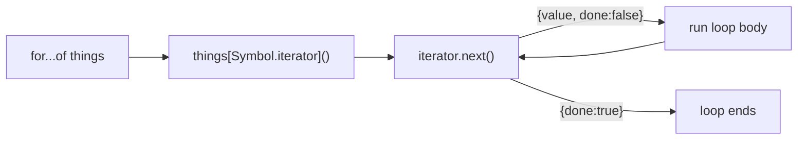

# Iterators, Generators & Symbols - Producing Values on Demand

You've written `for (const x of arr)` since early in this guide. But what does that loop actually *do*, and why does it work on arrays, strings, `Map`s, and `Set`s - yet throw a fit on a plain object? This phase pulls back the curtain.

One idea runs underneath it: **producing values one at a time, on demand**, instead of building the whole collection up front. See how `for...of` asks for the next value, and two tools fall into your lap: making *your own* objects loopable, and writing functions that pause mid-execution, hand back a value, and resume later. That last trick - generators - lets you describe an *infinite* sequence without your machine catching fire.

## The iterable protocol - what `for...of` really does

**What it actually is.** An **iterable** is anything you can loop over with `for...of`. An **iterator** is the thing that walks through it. The iterable is the book; the iterator is the bookmark.

📝 **Iterable** - an object with a `[Symbol.iterator]()` method that returns an iterator. **Iterator** - an object with a `.next()` method that returns `{ value, done }` each time you call it. `for...of` asks the iterable for a fresh iterator, then pulls items until `done` is `true`.

When you write `for (const x of things)`, the engine does three things under the hood:

1. Calls `things[Symbol.iterator]()` to get an iterator.
2. Calls `.next()` on that iterator over and over; each call returns `{ value, done }`.
3. Stops the moment a `.next()` comes back with `done: true`.



Drive that machinery by hand to watch it move:

```javascript runnable
const things = ["a", "b"];
const it = things[Symbol.iterator]();   // get an iterator (the bookmark)

console.log(it.next());                 // pull the first item
console.log(it.next());                 // pull the second
console.log(it.next());                 // nothing left
```
```console
{ value: 'a', done: false }
{ value: 'b', done: false }
{ value: undefined, done: true }
```
*What just happened:* `things[Symbol.iterator]()` made an iterator that remembers its position. Each `.next()` advanced it by one and returned a `{ value, done }` record. After the last real item, `.next()` returned `done: true` - the signal `for...of` watches for to stop. A `for...of` loop is this, with the `.next()` calls and `done` check handled for you.

💡 **Why this saves you later.** Once `for...of` means "call `.next()` until `done`," a pile of JavaScript stops being mysterious: why `{a: 1}` can't be looped with `for...of` (no `[Symbol.iterator]`), why arrays, strings, `Map`, and `Set` all *can*, and - coming up - how generators plug straight into every `for...of` you'll write.

## Symbols, briefly - collision-proof keys

You just saw `Symbol.iterator` show up as an object key.

**What it actually is.** A `Symbol` is a primitive value whose entire purpose is to be **unique**. Every call to `Symbol()` produces a brand-new value equal to nothing but itself - even two made from the same description are different.

📝 **Symbol** - a unique, unforgeable primitive, often used as an object key when you need a name that can't clash with any string key. `Symbol("x") !== Symbol("x")`.

```javascript runnable
const a = Symbol("id");
const b = Symbol("id");
console.log(a === b);                    // false - every Symbol is unique

const user = { name: "Ada" };
user[a] = 42;                            // use a Symbol as a key
console.log(user[a]);                    // 42
console.log(Object.keys(user));          // ['name'] - Symbol key is hidden
```
```console
false
Ada
42
[ 'name' ]
```
*What just happened:* `a` and `b` describe the same thing (`"id"`) but are distinct values, so `a === b` is `false`. As a key, `a` stored `42` on `user` without touching any string property - `Object.keys` didn't even list it. A Symbol key lives in its own namespace and can never overwrite a normal `name`/`role`/`length` property.

This is why the iterable protocol uses `Symbol.iterator` instead of a string like `"iterator"`: a plain-string hook would risk colliding with any object that happened to have a property named `iterator`. `Symbol.iterator` is a single well-known Symbol shared across the runtime, immune to that collision.

## Make your own object iterable

Because `for...of` only needs `[Symbol.iterator]`, you can teach *any* object to be loopable with that one method. Here's a `range` object yielding numbers from `start` up to (not including) `end`:

```javascript runnable
function range(start, end) {
  return {
    [Symbol.iterator]() {            // the hook for...of looks for
      let current = start;
      return {
        next() {                     // the iterator: one .next() at a time
          if (current < end) {
            return { value: current++, done: false };
          }
          return { value: undefined, done: true };
        },
      };
    },
  };
}

for (const n of range(1, 4)) {
  console.log(n);
}
console.log([...range(1, 4)]);       // spread works too - it uses the protocol
```
```console
1
2
3
[ 1, 2, 3 ]
```
*What just happened:* `range(1, 4)` returned a plain object with a `[Symbol.iterator]` method. Calling that method got back an iterator holding its own `current` counter. Each `.next()` returned the next number and bumped `current`; once `current` hit `end`, it returned `done: true` and the loop stopped. The spread `[...range(1, 4)]` worked for free - spread, destructuring, and `for...of` all speak the *same* protocol, so implementing it once unlocks all of them.

⚠️ **Gotcha - keep the counter inside the method, not on the object.** `current` lives inside `[Symbol.iterator]()`, so each loop gets a fresh `current` starting at `start`. Store it as a property on the returned object instead, and the *second* loop over the same `range` would start where the first left off - empty. State belongs in the iterator, not the iterable, so the same iterable can be looped twice.

## Generators - a function that pauses and resumes

Writing `[Symbol.iterator]` with a hand-rolled `next()` and a manual `{ value, done }` is a lot of ceremony. JavaScript has a far easier way: the **generator**.

**What it actually is.** A **generator function** is written `function*` and uses `yield` instead of `return`. Calling it doesn't run the body - it hands back an iterator. Each pull runs the function until the next `yield`, hands that value out, then **freezes right there**, remembering all its local variables until thawed by the next pull.

📝 **`yield`** - like `return`, but instead of ending the function it pauses it and produces one value. The function picks up where it left off on the next pull. A `function*` containing `yield` is a generator.

**Why this exists.** `return` ends a function and discards everything it knew; `yield` produces a value *without* ending, so a single function can emit a whole stream over time. That's the "one item at a time, remember where you were" behavior the iterator protocol wants - and a generator's returned object already has `.next()` *and* `[Symbol.iterator]`, so it drops straight into `for...of`.

```javascript runnable
function* countToThree() {
  console.log("  -> starting");
  yield 1;
  console.log("  -> resumed after 1");
  yield 2;
  console.log("  -> resumed after 2");
  yield 3;
}

for (const n of countToThree()) {
  console.log("got", n);
}
```
```console
  -> starting
got 1
  -> resumed after 1
got 2
  -> resumed after 2
got 3
```
*What just happened:* Calling `countToThree()` ran *none* of the body - it returned a generator object. `for...of` pulled the first value, which ran the function up to `yield 1` and froze. Pulling again thawed it right after that `yield`, ran to `yield 2`, and froze again. The interleaved logs prove the function is genuinely pausing and resuming, not running all at once - and it's far shorter than the hand-rolled `range`, because `yield` *is* the protocol, written for you.

`range` as a generator, in a fraction of the code:

```javascript runnable
function* range(start, end) {
  for (let n = start; n < end; n++) {
    yield n;
  }
}

console.log([...range(1, 5)]);
for (const n of range(10, 13)) console.log(n);
```
```console
[ 1, 2, 3, 4 ]
10
11
12
```
*What just happened:* The `function*` does everything the verbose version did - `for...of` and spread both work - with no `{ value, done }` bookkeeping and no nested object. `yield` inside the loop hands out each number and pauses; the engine builds the `{ value, done }` records and `[Symbol.iterator]` automatically.

⚠️ **Gotcha - a generator is single-use.** A generator object is an iterator, and an iterator gets *consumed*: once walked to the end, it's empty forever. Loop the *same* generator object a second time and you get nothing.

```javascript runnable
function* squares() {
  for (let n = 0; n < 3; n++) yield n * n;
}

const gen = squares();
console.log("first pass: ", [...gen]);   // drains it
console.log("second pass:", [...gen]);   // already empty
```
```console
first pass:  [ 0, 1, 4 ]
second pass: []
```
*What just happened:* The first spread pulled every value until `done: true`, exhausting the generator. The second spread started where the first left off - at the end - so it got an empty array. To iterate twice, call the generator *function* again for a fresh one (`squares()`), or, if the data is small, materialize it once into an array and reuse that. (`range(1, 5)` works fresh each time precisely because each call is a brand-new generator.)

## Lazy sequences - produce the infinite without storing it

Generators can do something an array fundamentally *can't*: describe a sequence that never ends. An array can't store endless items, but a generator can *describe* one and produce it on demand - you only pay for the values you actually pull.

```javascript runnable
function* naturals() {
  let n = 0;
  while (true) {            // never ends on its own
    yield n++;
  }
}

const gen = naturals();
const firstFive = [];
for (let i = 0; i < 5; i++) {
  firstFive.push(gen.next().value);   // pull exactly five, then stop asking
}
console.log(firstFive);
```
```console
[ 0, 1, 2, 3, 4 ]
```
*What just happened:* `naturals()` would yield numbers forever - the `while (true)` never finishes. Nothing is computed until you ask, so we pulled exactly five values and walked away; the generator is now paused mid-`while`, holding `n`, ready to continue if we come back. ⚠️ Never write a bare `for (const x of naturals())` with no break - it runs until you kill the tab. Always cap how many values you pull.

A practical version: a unique-ID generator. No global counter variable, no risk of two parts of your code resetting it - the state lives safely inside the generator:

```javascript runnable
function* idGenerator(prefix = "id") {
  let n = 1;
  while (true) {
    yield `${prefix}-${n++}`;
  }
}

const nextId = idGenerator("user");
console.log(nextId.next().value);   // user-1
console.log(nextId.next().value);   // user-2
console.log(nextId.next().value);   // user-3
```
```console
user-1
user-2
user-3
```
*What just happened:* `idGenerator` holds `n` privately and bumps it on every `.next()` - an endless, self-incrementing supply with zero shared mutable state floating around your module. A common real-world reason to reach for a generator even when "infinite" sounds exotic.

💡 **Generator vs array - when to reach for which.** Use an **array** when you need the whole collection in hand: to index it, loop it more than once, get its `.length`, or pass it around. Reach for a **generator** when values are produced one pass at a time - especially if the sequence is huge, expensive to compute, infinite, or you'll bail out early. Rule of thumb: if it feeds a single `for...of` or you only want the first few items, a generator keeps memory flat no matter how big the source is.

## Recap

1. `for...of` calls `obj[Symbol.iterator]()` to get an **iterator**, then calls `.next()` - which returns `{ value, done }` - until `done` is `true`. That's the whole **iterable protocol**.
2. A **Symbol** is a unique, collision-proof primitive; the protocol hangs off the well-known `Symbol.iterator` so it can never clash with your own string keys.
3. You can make **any object iterable** by giving it a `[Symbol.iterator]()` method that returns an object with a `.next()` - and that one method also unlocks spread and destructuring.
4. A **generator** (`function*` + `yield`) is the easy way: it pauses and resumes, producing a stream while remembering its place, and plugs straight into `for...of`.
5. ⚠️ A generator object is **single-use** - once exhausted it's empty. Call the generator function again for a fresh one.
6. Generators enable **lazy and infinite sequences**: describe an endless stream, pay only for the values you pull, and keep memory flat.

## Quick check

Test yourself on the ideas that make `for...of` and generators tick:

```quiz
[
  {
    "q": "What does `for...of someThing` call first to start looping?",
    "choices": [
      "someThing[Symbol.iterator]() to obtain an iterator",
      "someThing.next() directly on the object itself",
      "someThing.forEach() with an internal callback",
      "Object.keys(someThing) to list its properties"
    ],
    "answer": 0,
    "explain": "for...of looks up the well-known Symbol.iterator method, calls it to get an iterator, then repeatedly calls that iterator's .next() until it returns { done: true }. A plain object lacks Symbol.iterator, which is why it can't be used with for...of."
  },
  {
    "q": "Why does the iterable protocol use `Symbol.iterator` instead of a plain string key like `\"iterator\"`?",
    "choices": [
      "A Symbol is a unique key, so the language's hook can never collide with your own string properties",
      "Symbols are faster to look up than strings in every engine",
      "String keys are not allowed as method names in JavaScript",
      "It only works that way for historical reasons with no real benefit"
    ],
    "answer": 0,
    "explain": "Symbol.iterator is a single well-known, unique Symbol. Because it isn't a string, no object property you create can accidentally clash with the protocol's hook."
  },
  {
    "q": "You write `const g = squares();` then spread `[...g]` twice in a row. What does the second spread produce?",
    "choices": [
      "An empty array [] - the generator was exhausted by the first spread",
      "The same array as the first spread - generators restart automatically",
      "An error, because you can't spread a generator twice",
      "Half the values, because the generator remembers its midpoint"
    ],
    "answer": 0,
    "explain": "A generator object is single-use. The first spread drains it to done:true, leaving it empty forever. To iterate again, call squares() for a fresh generator, or materialize the values into an array once."
  }
]
```

---

[← Phase 11: this, Prototypes & the Object Model](11-this-prototypes-and-objects.md) · [Guide overview](_guide.md) · [Phase 13: The Event Loop, Deep →](13-the-event-loop-deep.md)
