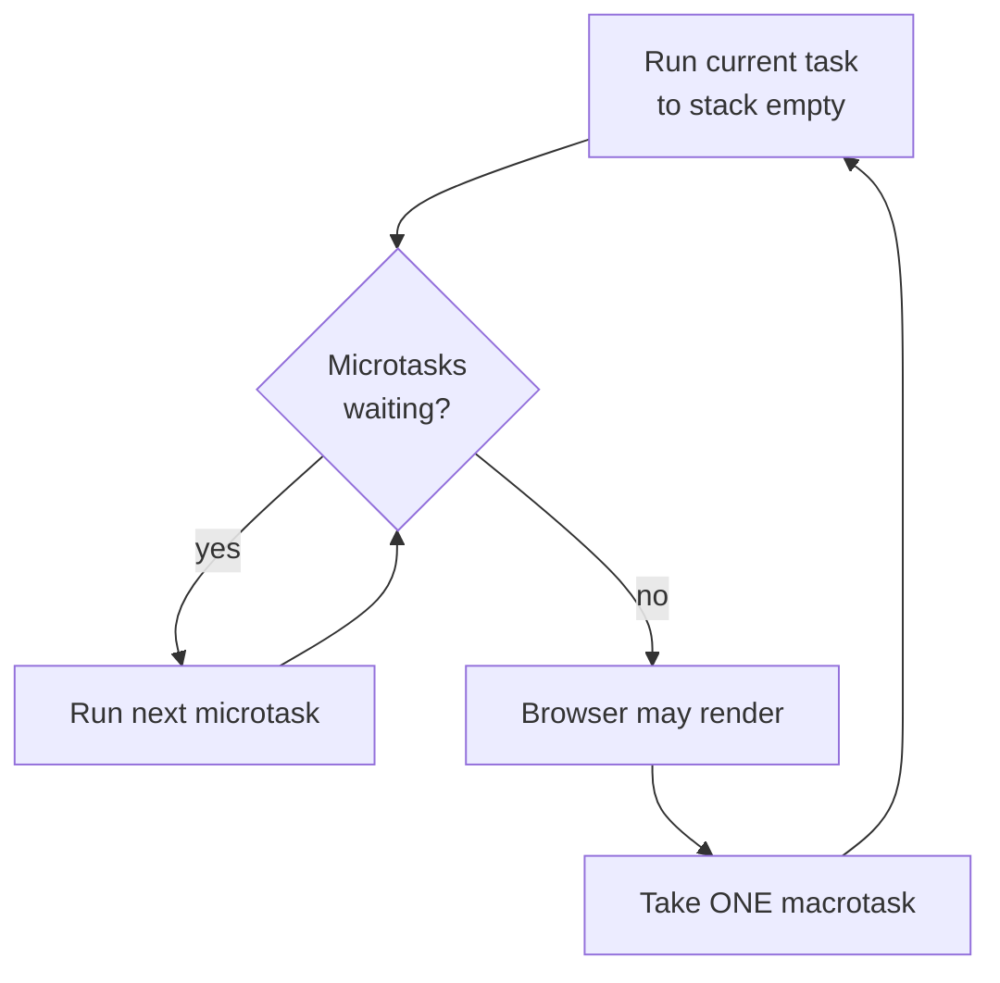

# The Event Loop, Deep - Tasks, Microtasks & Why Order Surprises You

Back in [Phase 6](06-async-and-the-dom.md) you learned to *use* promises and `async`/`await` - fetch some data, wait for it, do something with it. That's enough to ship. But sooner or later you'll write code that prints things in an order that makes no sense, stare at it, and wonder if the engine is broken. (It isn't. It's doing exactly what it's told - you just haven't seen the rulebook yet.)

This phase is that rulebook. We're going under the hood of the runtime: the single thread, the call stack, the two queues that feed it, and the one rule that explains every surprising print order you'll ever hit. Once this model is in your head, async JavaScript stops being magic and becomes *predictable*.

## JavaScript is single-threaded - "async" means deferred, not parallel

Here's the mental model to carry through the whole phase: **JavaScript runs your code on exactly one thread, with exactly one call stack.** There is no second thread quietly running your `setTimeout` callback "in the background." When something is "async," it doesn't run *alongside* your code - it runs *later*, after the current work is completely finished.

📝 **Single-threaded** - only one piece of JavaScript can execute at any instant. The engine runs the current code *to completion* - never pausing it halfway to slip in something else - and only then picks up the next chunk of work.

So what does "async" actually buy you? It lets you *register work to be done later* without blocking. When you call `setTimeout` or `.then()`, you're not running that callback - you're handing it to the runtime and saying "run this when you get a chance." The thread keeps going. Later, when the stack is empty, the **event loop** hands those waiting callbacks back to the thread one at a time.

💡 **The whole model in one sentence:** the engine runs the current code to completion, and then a loop hands it more work - over and over, forever. "Concurrency" in JavaScript is this hand-off dance, not two things truly running at once.

## The call stack - synchronous code runs to empty first

The **call stack** is the engine's to-do list for *right now*. Every function call pushes a frame on; every `return` pops one off. While there's anything on the stack, the engine is busy and nothing async can interrupt it. Async callbacks only get their turn when the stack is **empty**.

```javascript runnable
function inner() {
  console.log("inner");
}
function outer() {
  console.log("outer start");
  inner();
  console.log("outer end");
}

console.log("script start");
outer();
console.log("script end");
```
```console
script start
outer start
inner
outer end
script end
```
*What just happened:* Every line here is synchronous, so it ran top to bottom with no surprises. `outer()` pushed a frame, called `inner()` (another frame), `inner` returned and popped, then `outer` finished its last line and popped. The stack drained naturally in order. Nothing deferred, nothing queued - this is the baseline. The interesting part starts when we add work that *can't* run now.

⚠️ **Gotcha - synchronous code blocks everything, including the UI.** Because there's one thread, a long-running synchronous loop freezes the whole page: no clicks, no rendering, no timers fire. The event loop can't hand out *any* deferred work until your current code returns and the stack goes empty. "Don't block the thread" is the cardinal rule of browser JavaScript.

## Two queues: macrotasks vs microtasks

When the stack is empty, where does the event loop get more work? From two separate queues - and the difference between them is the secret behind every confusing ordering puzzle.

📝 **Macrotask queue** (also called the *task* queue) - holds callbacks from `setTimeout`, `setInterval`, I/O, and DOM events (a click handler, etc.). The loop takes **one** macrotask, runs it to completion, and then checks the microtasks.

📝 **Microtask queue** - holds promise reactions (`.then`, `.catch`, `.finally`), the continuation after an `await`, and anything you pass to `queueMicrotask`. These are meant to run *as soon as possible* after the current work, before the page does anything else.

Now the single rule that governs all of it:

> **After each macrotask (and after the initial script finishes), the engine drains the *entire* microtask queue before taking the next macrotask.** Not one microtask - *all* of them, including any new microtasks those add along the way.

So the cycle is: run a task → empty the whole microtask queue → (let the browser render if needed) → take the next task → repeat. Microtasks always jump the queue ahead of the next timer or event.



*One idea:* a macrotask is one "turn," but every turn ends by flushing *all* pending microtasks. That's why a promise callback queued during the current turn runs before a `setTimeout` queued *earlier* - the microtask gets drained at the end of this turn, while the timer waits for the next one.

## The classic ordering puzzle

Here's the example that confuses everyone the first time. Read it, predict the output *before* you run it, then check yourself.

```javascript runnable
console.log("1: sync start");

setTimeout(() => {
  console.log("4: setTimeout (macrotask)");
}, 0);

Promise.resolve().then(() => {
  console.log("3: promise (microtask)");
});

console.log("2: sync end");
```
```console
1: sync start
2: sync end
3: promise (microtask)
4: setTimeout (macrotask)
```
*What just happened:* This is the rule in action, in three beats. **First**, all the synchronous code runs to completion: `"1: sync start"`, then `"2: sync end"`. Along the way, `setTimeout` parked its callback in the *macrotask* queue and `Promise.resolve().then` parked its callback in the *microtask* queue - neither ran yet. **Second**, the script (itself the first macrotask) finishes, so the engine drains the entire microtask queue: `"3: promise"` fires. **Third**, only now does the loop take a macrotask: `"4: setTimeout"`. Even though you wrote `setTimeout` *above* the promise and gave it a `0` delay, the promise wins - because microtasks are always drained before the next macrotask.

⚠️ **Gotcha - `setTimeout(fn, 0)` does not mean "run now."** It means "run after the current synchronous code *and* after every queued microtask." The `0` is a *minimum* delay, not a promise of immediacy. If you need something to happen truly next-thing, a microtask (`queueMicrotask(fn)` or `Promise.resolve().then(fn)`) jumps ahead of any timer.

Microtasks also chain ahead of macrotasks. Watch what happens when a microtask queues *another* microtask:

```javascript runnable
setTimeout(() => console.log("D: timeout"), 0);

Promise.resolve()
  .then(() => console.log("B: promise 1"))
  .then(() => console.log("C: promise 2"));

console.log("A: sync");
```
```console
A: sync
B: promise 1
C: promise 2
D: timeout
```
*What just happened:* `"A: sync"` runs first as plain synchronous code. The script ends, so the engine drains microtasks: `"B: promise 1"` runs - and its `.then` returning schedules `"C: promise 2"` as a *new* microtask. The drain rule says empty the queue *completely*, so `"C"` runs in the same drain pass too. Only after the microtask queue is truly empty does the loop reach for the macrotask: `"D: timeout"`. The whole promise chain finished before a single `setTimeout` got a look-in.

This is exactly the kind of thing worth poking at by hand. Add log lines, swap a `setTimeout` for a `queueMicrotask`, and watch the order shift:

```playground-eventloop
```

## Why it matters

This isn't trivia - the model changes how you reason about real code.

**`await` resumes as a microtask.** When an `async` function hits `await`, it pauses and the rest of the function is scheduled to continue *as a microtask* once the awaited value settles. That's why code after an `await` runs before a pending `setTimeout`, and why two `async` functions can interleave in surprising ways.

```javascript runnable
async function go() {
  console.log("2: before await");
  await null;                       // pauses; the rest becomes a microtask
  console.log("4: after await");
}

console.log("1: sync start");
go();
setTimeout(() => console.log("5: timeout"), 0);
console.log("3: sync end");
```
```console
1: sync start
2: before await
3: sync end
4: after await
5: timeout
```
*What just happened:* Calling `go()` runs synchronously up to the `await` - so `"2: before await"` prints immediately. The `await` then suspends the function and queues its continuation as a microtask. Control returns to the top level, which keeps going: `setTimeout` parks a macrotask, and `"3: sync end"` prints. The script ends, microtasks drain, and the suspended continuation resumes: `"4: after await"`. Finally the macrotask runs: `"5: timeout"`. The line *after* `await` behaves precisely like a `.then` callback - because under the hood, it is one.

⚠️ **Gotcha - a flood of microtasks can starve rendering and timers.** Because the engine drains the *entire* microtask queue before the next macrotask (and before the browser repaints), a microtask that keeps queuing more microtasks can lock the loop in an endless drain - your page freezes, your `setTimeout` never fires, the frame never paints. The classic footgun is a recursive `queueMicrotask` or a promise chain that never terminates. When you need to yield back to the browser (let it paint, let timers run), reach for a macrotask like `setTimeout(fn, 0)` instead - it explicitly waits for the *next* turn.

💡 **Key point.** Microtasks are for "finish this logical unit of work before anything else happens" (settling promises, running `.then` chains). Macrotasks are for "let the world catch up first" (rendering, user input, the next tick). Choosing the right one is choosing *when relative to the browser* your code runs.

## Recap

1. **JavaScript is single-threaded.** One call stack runs the current code to completion; "async" means a callback is *deferred* to run later, not run in parallel.
2. **The event loop** feeds the empty stack from two queues: **macrotasks** (`setTimeout`, I/O, DOM events) and **microtasks** (promise reactions, `await` continuations, `queueMicrotask`).
3. **The rule:** after each macrotask (and after the initial script), the engine drains the **entire** microtask queue - including microtasks added during the drain - before taking the next macrotask.
4. That rule is why a `Promise.resolve().then(...)` always runs **before** a `setTimeout(..., 0)` queued in the same turn. `setTimeout(fn, 0)` means "after the current work and all microtasks," not "now."
5. **`await` resumes as a microtask** - the code after `await` is effectively a `.then` callback, so it runs ahead of pending timers.
6. ⚠️ A runaway flood of microtasks can **starve rendering and timers**; use a macrotask (`setTimeout(fn, 0)`) when you need to yield back to the browser.

You can now predict the order of any mix of sync code, promises, and timers - the single most reliably confusing thing in JavaScript. Next, we step back from the runtime and into a different way of *structuring* code: functional JavaScript.

## Quick check

Test yourself on the rule that governs all of it - microtasks vs macrotasks:

```quiz
[
  {
    "q": "A script logs `A`, schedules `setTimeout(() => log('B'), 0)`, then `Promise.resolve().then(() => log('C'))`, then logs `D`. What order prints?",
    "choices": [
      "A, D, C, B",
      "A, B, C, D",
      "A, D, B, C",
      "A, C, D, B"
    ],
    "answer": 0,
    "explain": "Synchronous code runs first: A then D. The script (a macrotask) ends, so the engine drains all microtasks before the next macrotask - the promise callback C runs. Only then does the setTimeout macrotask B run. So: A, D, C, B."
  },
  {
    "q": "What does `setTimeout(fn, 0)` actually guarantee about when `fn` runs?",
    "choices": [
      "It runs after the current synchronous code AND after every queued microtask - as the next macrotask, not immediately",
      "It runs immediately, before any other code",
      "It runs before any pending promise callbacks",
      "It runs exactly 0 milliseconds later, interrupting whatever is on the stack"
    ],
    "answer": 0,
    "explain": "The 0 is a minimum delay, not 'now.' fn is a macrotask, so it waits for the current code to finish and the entire microtask queue to drain. A microtask (queueMicrotask / Promise.then) always jumps ahead of it."
  },
  {
    "q": "Inside an `async` function, the code that runs after an `await` is scheduled as…",
    "choices": [
      "A microtask - it behaves like a `.then` callback and runs before pending timers",
      "A macrotask - it waits behind every queued setTimeout",
      "Synchronous code - it runs immediately with no deferral",
      "A new thread that runs in parallel"
    ],
    "answer": 0,
    "explain": "await suspends the function and queues its continuation as a microtask once the awaited value settles. That's why the line after await runs ahead of a pending setTimeout - under the hood it's a promise reaction."
  }
]
```

---

[← Phase 12: Iterators, Generators & Symbols](12-iterators-generators-symbols.md) · [Guide overview](_guide.md) · [Phase 14: Functional JavaScript →](14-functional-javascript.md)
