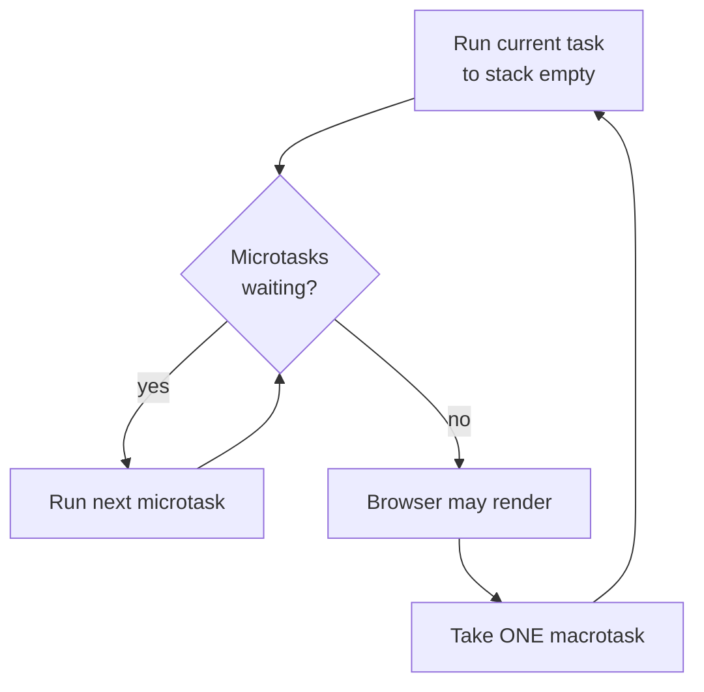

# The Event Loop, Deep - Tasks, Microtasks & Why Order Surprises You

Back in [Phase 6](06-async-and-the-dom.md) you learned to *use* promises and `async`/`await`. That's enough to ship, but sooner or later you'll write code that prints things in an order that makes no sense. (The engine isn't broken - it's doing exactly what it's told, you just haven't seen the rulebook yet.)

This phase is that rulebook: the single thread, the call stack, the two queues that feed it, and the one rule that explains every surprising print order you'll hit. Once this model is in your head, async JavaScript stops being magic and becomes *predictable*.

## JavaScript is single-threaded - "async" means deferred, not parallel

The mental model to carry through this phase: **JavaScript runs your code on exactly one thread, with exactly one call stack.** There is no second thread quietly running your `setTimeout` callback "in the background." When something is "async," it doesn't run *alongside* your code - it runs *later*, after the current work is completely finished.

📝 **Single-threaded** - only one piece of JavaScript can execute at any instant. The engine runs the current code *to completion*, never pausing it halfway to slip in something else, then picks up the next chunk of work.

"Async" lets you *register work to be done later* without blocking. Calling `setTimeout` or `.then()` doesn't run that callback - it hands it to the runtime with "run this when you get a chance," and the thread keeps going. When the stack is empty, the **event loop** hands those waiting callbacks back one at a time.

💡 **In one sentence:** the engine runs the current code to completion, then a loop hands it more work, forever. "Concurrency" in JavaScript is this hand-off dance, not two things truly running at once.

## The call stack - synchronous code runs to empty first

The **call stack** is the engine's to-do list for *right now*. Every function call pushes a frame on; every `return` pops one off. While anything is on the stack, the engine is busy and nothing async can interrupt it - async callbacks only get their turn when the stack is **empty**.

```javascript runnable
function inner() {
  console.log("inner");
}
function outer() {
  console.log("outer start");
  inner();
  console.log("outer end");
}

console.log("script start");
outer();
console.log("script end");
```
```console
script start
outer start
inner
outer end
script end
```
*What just happened:* Every line is synchronous, so it ran top to bottom: `outer()` pushed a frame, called `inner()` (another frame), `inner` popped, then `outer` popped. Nothing deferred, nothing queued. The interesting part starts when we add work that *can't* run now.

⚠️ **Gotcha - synchronous code blocks everything, including the UI.** With one thread, a long-running synchronous loop freezes the whole page: no clicks, no rendering, no timers fire, until your code returns and the stack goes empty. "Don't block the thread" is the cardinal rule of browser JavaScript.

## Two queues: macrotasks vs microtasks

When the stack is empty, the event loop pulls more work from two separate queues - their difference is the secret behind every confusing ordering puzzle.

📝 **Macrotask queue** (also called the *task* queue) - callbacks from `setTimeout`, `setInterval`, I/O, and DOM events (a click handler, etc.). The loop takes **one** macrotask, runs it to completion, then checks the microtasks.

📝 **Microtask queue** - promise reactions (`.then`, `.catch`, `.finally`), the continuation after an `await`, and anything passed to `queueMicrotask`. These run as soon as possible after the current work, before the page does anything else.

The single rule that governs all of it:

> **After each macrotask (and after the initial script finishes), the engine drains the *entire* microtask queue before taking the next macrotask.** Not one microtask - *all* of them, including any new microtasks those add along the way.

The cycle: run a task → empty the whole microtask queue → (let the browser render if needed) → take the next task → repeat.



*One idea:* a macrotask is one "turn," and every turn ends by flushing *all* pending microtasks. That's why a promise callback queued this turn beats a `setTimeout` queued *earlier* - the microtask drains before the timer's turn arrives.

## The classic ordering puzzle

The example that confuses everyone first. Predict the output before you run it.

```javascript runnable
console.log("1: sync start");

setTimeout(() => {
  console.log("4: setTimeout (macrotask)");
}, 0);

Promise.resolve().then(() => {
  console.log("3: promise (microtask)");
});

console.log("2: sync end");
```
```console
1: sync start
2: sync end
3: promise (microtask)
4: setTimeout (macrotask)
```
*What just happened:* The rule in three beats. **First**, all synchronous code runs to completion, parking `setTimeout`'s callback in the *macrotask* queue and the `.then` callback in the *microtask* queue - neither runs yet. **Second**, the script (itself the first macrotask) finishes, so the engine drains the entire microtask queue: the promise callback fires. **Third**, only now does the loop take a macrotask: the timeout fires. Even though `setTimeout` was written *above* the promise with a `0` delay, the promise wins - microtasks always drain before the next macrotask.

⚠️ **Gotcha - `setTimeout(fn, 0)` does not mean "run now."** It means "run after the current synchronous code *and* after every queued microtask." The `0` is a *minimum* delay, not a promise of immediacy. For something to happen truly next, use a microtask (`queueMicrotask(fn)` or `Promise.resolve().then(fn)`) - it jumps ahead of any timer.

Microtasks also chain ahead of macrotasks - watch what happens when a microtask queues *another* microtask:

```javascript runnable
setTimeout(() => console.log("D: timeout"), 0);

Promise.resolve()
  .then(() => console.log("B: promise 1"))
  .then(() => console.log("C: promise 2"));

console.log("A: sync");
```
```console
A: sync
B: promise 1
C: promise 2
D: timeout
```
*What just happened:* The sync log runs first. The script ends, so the engine drains microtasks: the first `.then` runs, and its return value schedules the second `.then` as a *new* microtask - which runs in the same drain pass, since the rule says empty the queue *completely*. Only once it's truly empty does the loop reach for the timeout. The whole promise chain finishes before a single `setTimeout` gets a look-in.

Worth poking at by hand - swap a `setTimeout` for a `queueMicrotask` and watch the order shift:

```playground-eventloop
```

## Why it matters

**`await` resumes as a microtask.** When an `async` function hits `await`, it pauses and the rest of the function is scheduled to continue *as a microtask* once the awaited value settles - why code after an `await` runs before a pending `setTimeout`, and why two `async` functions can interleave in surprising ways.

```javascript runnable
async function go() {
  console.log("2: before await");
  await null;                       // pauses; the rest becomes a microtask
  console.log("4: after await");
}

console.log("1: sync start");
go();
setTimeout(() => console.log("5: timeout"), 0);
console.log("3: sync end");
```
```console
1: sync start
2: before await
3: sync end
4: after await
5: timeout
```
*What just happened:* Calling `go()` runs synchronously up to the `await`, printing immediately. The `await` suspends the function and queues its continuation as a microtask. Control returns to the top level, which parks the `setTimeout` macrotask and prints its own line. The script ends, microtasks drain and the continuation resumes, and only then does the macrotask run - the line *after* `await` behaves precisely like a `.then` callback, because under the hood, it is one.

⚠️ **Gotcha - a flood of microtasks can starve rendering and timers.** Since the engine drains the *entire* microtask queue before the next macrotask (and before the browser repaints), a microtask that keeps queuing more microtasks locks the loop in an endless drain - page frozen, `setTimeout` never firing, frame never painting. The classic footgun is a recursive `queueMicrotask` or a promise chain that never terminates. To yield back to the browser, use a macrotask like `setTimeout(fn, 0)` instead - it explicitly waits for the *next* turn.

💡 **Key point.** Microtasks mean "finish this before anything else happens" (settling promises, `.then` chains). Macrotasks mean "let the world catch up first" (rendering, user input, the next tick) - choosing the right one is choosing *when relative to the browser* your code runs.

## Recap

1. **JavaScript is single-threaded.** One call stack runs the current code to completion; "async" means a callback is *deferred* to run later, not run in parallel.
2. **The event loop** feeds the empty stack from two queues: **macrotasks** (`setTimeout`, I/O, DOM events) and **microtasks** (promise reactions, `await` continuations, `queueMicrotask`).
3. **The rule:** after each macrotask (and after the initial script), the engine drains the **entire** microtask queue - including microtasks added during the drain - before taking the next macrotask.
4. That's why `Promise.resolve().then(...)` always runs **before** a `setTimeout(..., 0)` queued in the same turn - `setTimeout(fn, 0)` means "after the current work and all microtasks," not "now."
5. **`await` resumes as a microtask** - the code after `await` is effectively a `.then` callback, so it runs ahead of pending timers.
6. ⚠️ A runaway flood of microtasks can **starve rendering and timers**; use a macrotask (`setTimeout(fn, 0)`) to yield back to the browser.

You can now predict the order of any mix of sync code, promises, and timers - the single most reliably confusing thing in JavaScript. Next: functional JavaScript.

## Quick check

```quiz
[
  {
    "q": "A script logs `A`, schedules `setTimeout(() => log('B'), 0)`, then `Promise.resolve().then(() => log('C'))`, then logs `D`. What order prints?",
    "choices": [
      "A, D, C, B",
      "A, B, C, D",
      "A, D, B, C",
      "A, C, D, B"
    ],
    "answer": 0,
    "explain": "Synchronous code runs first: A then D. The script (a macrotask) ends, so the engine drains all microtasks before the next macrotask - the promise callback C runs. Only then does the setTimeout macrotask B run. So: A, D, C, B."
  },
  {
    "q": "What does `setTimeout(fn, 0)` actually guarantee about when `fn` runs?",
    "choices": [
      "It runs after the current synchronous code AND after every queued microtask - as the next macrotask, not immediately",
      "It runs immediately, before any other code",
      "It runs before any pending promise callbacks",
      "It runs exactly 0 milliseconds later, interrupting whatever is on the stack"
    ],
    "answer": 0,
    "explain": "The 0 is a minimum delay, not 'now.' fn is a macrotask, so it waits for the current code to finish and the entire microtask queue to drain. A microtask (queueMicrotask / Promise.then) always jumps ahead of it."
  },
  {
    "q": "Inside an `async` function, the code that runs after an `await` is scheduled as…",
    "choices": [
      "A microtask - it behaves like a `.then` callback and runs before pending timers",
      "A macrotask - it waits behind every queued setTimeout",
      "Synchronous code - it runs immediately with no deferral",
      "A new thread that runs in parallel"
    ],
    "answer": 0,
    "explain": "await suspends the function and queues its continuation as a microtask once the awaited value settles. That's why the line after await runs ahead of a pending setTimeout - under the hood it's a promise reaction."
  }
]
```

---

[← Phase 12: Iterators, Generators & Symbols](12-iterators-generators-symbols.md) · [Guide overview](_guide.md) · [Phase 14: Functional JavaScript →](14-functional-javascript.md)
