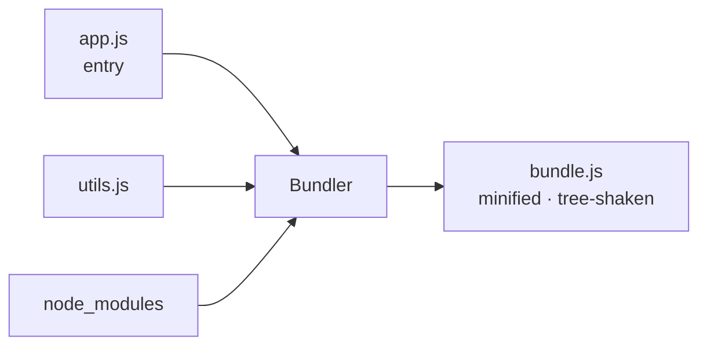

# Modules & Bundlers, Deep - From Files to a Shippable App

Back in [Phase 5](05-modules-and-project-layout.md) you learned to split code across files with `import` and
`export`, and [Phase 8](08-ecosystem-and-tooling.md) name-dropped "bundlers" as one of the tools in the
ecosystem. That was enough to be productive. This phase is the *why* underneath it: what the two competing
module systems actually are, why one of them lets your tools do near-magical things, and what a bundler is
really doing when you run `npm run build`.

The thread tying it all together is one property: **static structure**. Because modern JavaScript modules
declare their dependencies in a way tools can read *without running the code*, a whole class of optimizations
becomes possible - shrinking your app, splitting it into pieces, loading the heavy bits only when needed.
Once you see that, the bundler stops being a black box and starts being a tool you can reason about.

## Two module systems - ESM vs CommonJS

JavaScript spent years without a built-in way to share code across files, so the community invented one
(**CommonJS**), and years later the language got an official one (**ES Modules**). You'll meet both, so it's
worth knowing what separates them.

📝 **ES Modules (ESM)** - the *standard* module system, built into the language and browsers. Uses
`import` and `export`. Imports are **static**: declared at the top level, resolved before the code runs.

📝 **CommonJS (CJS)** - the *older* module system from early Node.js. Uses `require()` and
`module.exports`. Imports are **dynamic**: `require()` is a regular function call that runs at runtime,
wherever you put it.

Here they are side by side. First ESM:

```javascript
// math.js - ESM
export function add(a, b) {
  return a + b;
}
export const PI = 3.14159;

// app.js - ESM
import { add, PI } from "./math.js";
console.log(add(2, 3), PI);
```

Now the same thing in CommonJS:

```javascript
// math.js - CommonJS
function add(a, b) {
  return a + b;
}
module.exports = { add, PI: 3.14159 };

// app.js - CommonJS
const { add, PI } = require("./math.js");
console.log(add(2, 3), PI);
```

*What just happened:* both files export an `add` function and a `PI` constant and import them elsewhere - the
*intent* is identical. The difference is mechanical: ESM uses dedicated `import`/`export` keywords that live
at the top of the file, while CommonJS uses a plain function call (`require`) and assigns to a special
`module.exports` object. That "keyword vs function call" distinction looks cosmetic, but it's the whole
ballgame, as the next section shows.

⚠️ **Gotcha - don't mix them carelessly.** You can't `require()` an ESM file or sprinkle `import` statements
into a CommonJS file freely; Node decides which mode a file is in based on the `"type"` field in
`package.json` (`"module"` = ESM) or the file extension (`.mjs` = ESM, `.cjs` = CommonJS). When you see
"Cannot use import statement outside a module" or "require is not defined," you've crossed the streams. For
new code, prefer ESM - it's the standard, and it's what the rest of this phase relies on.

## Why static structure changes everything

Here's the key difference, stated plainly: **ESM imports are knowable without running the program.**

Because `import { add } from "./math.js"` must sit at the top level and can't be hidden inside an `if` or
built from a variable, a tool can read your files as plain text and draw the complete map of what depends on
what - the **dependency graph** - before a single line executes.

CommonJS can't promise that. `require()` is an ordinary function, so it can appear anywhere and take a
computed argument:

```javascript
// Perfectly legal CommonJS - and impossible to analyze statically
const name = Math.random() > 0.5 ? "./mathA.js" : "./mathB.js";
const lib = require(name); // which file? nobody knows until it runs
```

*What just happened:* the module being loaded is decided *at runtime* by a coin flip. A tool reading this
file can't know whether `mathA` or `mathB` is needed - it would have to run the program to find out. That
single bit of dynamism poisons the well: if imports *can* be unpredictable, tools must assume the worst and
keep everything.

💡 **Insight.** Static structure is a promise to your tools: "every dependency is declared up front, in the
open." That promise is what unlocks the optimizations in the rest of this phase. ESM made the promise;
CommonJS, by design, can't.

## Tree-shaking - dropping code you never use

📝 **Tree-shaking** - dead-code elimination for modules: the bundler drops any `export` that nothing in your
app actually `import`s, so the unused code never makes it into the final file.

The name is the picture: think of your dependency graph as a tree, give it a shake, and the dead leaves -
exports no one reached for - fall off. Pull in one helper from a library that exports fifty, and a
tree-shaking bundler ships only the one (plus whatever it depends on).

```javascript
// utils.js - exports three things
export function used() {
  return "I'm in the bundle";
}
export function neverCalled() {
  return "I should be dropped";
}
export function alsoUnused() {
  return "me too";
}

// app.js - imports exactly one
import { used } from "./utils.js";
console.log(used());
```

*What just happened:* `app.js` imports only `used`. Because ESM lets the bundler see the entire import graph
ahead of time, it can prove with certainty that `neverCalled` and `alsoUnused` are never reached from your
entry point - nothing imports them - and leave them out of the shipped bundle. Smaller file, less code for
the browser to download and parse.

This is exactly why CommonJS resists tree-shaking: `module.exports = { ... }` builds a plain object at
runtime, and any code could later read an arbitrary key off it. The bundler can't safely prove a given
export is unused, so to stay correct it keeps everything. **Tree-shaking needs ESM's static structure to
work.**

💡 **Insight - import only what you use.** Reach for named imports of the specific things you need
(`import { debounce } from "lodash-es"`) rather than grabbing a whole namespace, and prefer libraries that
ship ESM. You give the bundler the clearest possible picture of what's actually used, and it rewards you with
a leaner app.

## What a bundler actually does

You've heard the word; here's the job. A **bundler** starts at your **entry file** (say `app.js`), reads its
imports, follows each one to the file it points at, reads *those* imports, and keeps walking until it has
discovered every module your app touches. Then it stitches them together into one (or a few) optimized files
the browser can load efficiently.

📝 **Bundler** - a build tool that follows your import graph from an entry point, then combines and
transforms all those modules into a small number of optimized output files.

Along the way it does more than concatenate:

- **Resolves** every import path to a real file (including reaching into `node_modules`).
- **Transforms** code - runs your TypeScript or JSX through a compiler, converts modern syntax for older
  browsers.
- **Tree-shakes** away unused exports (the previous section).
- **Minifies** - strips whitespace, shortens variable names, removes comments to shrink the output.
- **Bundles** the survivors into output files, often with content hashes in the name for caching.



Why bother? Two reasons. First, the browser can't follow a giant web of tiny `import` requests efficiently -
historically each was a separate network round-trip, and even today fewer, well-organized files load faster.
Second, the browser doesn't understand TypeScript, JSX, or always the newest syntax; the bundler turns your
authoring code into something it *does* understand.

The popular tools today - **Vite**, **esbuild**, **webpack**, and others - all do this same core job. They
differ in speed, configuration, and defaults, not in purpose. (Vite leans on esbuild and is the common
default for new projects; webpack is the veteran you'll meet in older codebases.) Pick whatever your project
already uses; the mental model above carries across all of them.

## Dynamic import & code splitting

Everything so far loads at startup. But some code - a giant charting library, an admin-only screen, a rarely
opened dialog - isn't needed the moment the page loads. Forcing the user to download it up front makes the
whole app slower to start.

The fix is **`import()`** as a *function* (note the parentheses). Unlike the static `import` statement, this
runs at runtime, returns a **promise**, and tells the bundler: "split whatever this points at into its own
separate file, and don't load it until this line runs."

```javascript
// Load a heavy module only when the user clicks the button
button.addEventListener("click", async () => {
  const { renderChart } = await import("./heavy-chart.js");
  renderChart(data);
});
```

*What just happened:* `heavy-chart.js` is **not** in the initial bundle. The static analysis still works -
the bundler sees the `import()` call and carves `heavy-chart.js` (and its dependencies) into a separate
**chunk**. That chunk only downloads when the click handler runs and awaits the promise. Your app's startup
payload stays small; the heavy code arrives exactly when it's first needed.

📝 **Code splitting** - breaking your app into multiple bundles ("chunks") so the browser downloads each
piece on demand, instead of one giant file up front. `import()` is how you mark a split point.

This is the standard pattern behind "lazy-loaded routes" in frameworks: each page becomes its own chunk, so
visiting the home page doesn't download the settings page, the checkout flow, and the admin panel too.

⚠️ **Gotcha - don't over-split.** Each chunk is a separate network request with its own overhead, so
shattering your app into hundreds of tiny chunks can be *slower* than one reasonable bundle. Split on real
boundaries - distinct routes, genuinely heavy libraries, features most users never touch - not on every
module. The goal is "load less at startup," not "load everything in maximum pieces."

## Recap

1. **ESM** (`import`/`export`) is the standard, *static* module system; **CommonJS** (`require`/
   `module.exports`) is the older, *dynamic* one from Node. Prefer ESM for new code.
2. ESM's imports are **knowable without running the code**, so tools can build the full dependency graph
   ahead of time - the foundation everything else stands on.
3. **Tree-shaking** drops exports nothing imports, shrinking your bundle; it needs ESM's static structure,
   which is why CommonJS can't be reliably tree-shaken.
4. A **bundler** (Vite, esbuild, webpack) follows your import graph from an entry file, then resolves,
   transforms, tree-shakes, minifies, and combines everything into a few optimized output files.
5. **`import()`** loads a module at runtime and returns a promise, letting the bundler split heavy or rare
   code into separate **chunks** loaded on demand - but split on real boundaries, not every file.

## Quick check

Test yourself on the idea that powers this whole phase - static structure and what it buys you:

```quiz
[
  {
    "q": "Why can ESM be tree-shaken reliably but CommonJS generally can't?",
    "choices": [
      "ESM imports are static and declared up front, so tools can prove which exports are unused before running the code",
      "ESM files are always smaller than CommonJS files",
      "CommonJS code is written in an older version of JavaScript that bundlers refuse to read",
      "Tree-shaking only works in the browser, and CommonJS only runs in Node"
    ],
    "answer": 0,
    "explain": "Tree-shaking depends on the bundler knowing the full import graph without executing the program. ESM's static, top-level imports make that possible; CommonJS's runtime `require()` can take computed paths, so the bundler must keep everything to stay correct."
  },
  {
    "q": "What does the bundler do when it sees `await import(\"./heavy-chart.js\")`?",
    "choices": [
      "Splits heavy-chart.js into a separate chunk that downloads only when that line runs",
      "Inlines heavy-chart.js into the main bundle so it loads at startup",
      "Throws an error because import() isn't valid JavaScript",
      "Deletes heavy-chart.js from the project as dead code"
    ],
    "answer": 0,
    "explain": "The dynamic `import()` form is a code-split point. The bundler carves that module (and its dependencies) into its own chunk, and the browser fetches it on demand when the line executes - keeping the startup payload small."
  },
  {
    "q": "Which best describes the core job of a bundler like Vite or webpack?",
    "choices": [
      "Follow the import graph from an entry file and combine/transform the modules into a few optimized output files",
      "Run your tests and report which ones fail",
      "Format your code and fix indentation on save",
      "Download npm packages and add them to package.json"
    ],
    "answer": 0,
    "explain": "A bundler starts at an entry point, follows every import to build the dependency graph, then resolves, transforms, tree-shakes, minifies, and combines those modules into optimized files the browser can load efficiently."
  }
]
```

---

[← Phase 14: Functional JavaScript](14-functional-javascript.md) · [Guide overview](_guide.md) · [Phase 16: Performance & Memory →](16-performance-and-memory.md)
