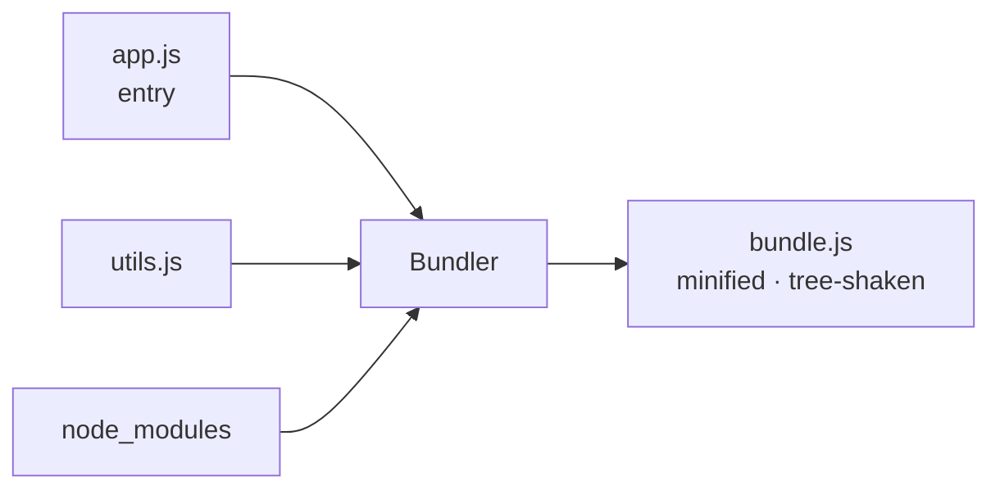

# Modules & Bundlers, Deep - From Files to a Shippable App

Back in [Phase 5](05-modules-and-project-layout.md) you split code across files with `import` and `export`,
and [Phase 8](08-ecosystem-and-tooling.md) name-dropped "bundlers." This phase is the *why*: what the two
competing module systems actually are, why one lets your tools do near-magical things, and what a bundler
really does when you run `npm run build`.

One property ties it together: **static structure**. Modern JavaScript modules declare their dependencies in
a way tools can read *without running the code*, unlocking optimizations - shrinking your app, splitting it
into pieces, loading heavy bits only when needed. See that, and the bundler stops being a black box.

## Two module systems - ESM vs CommonJS

JavaScript had no built-in way to share code across files, so the community invented one (**CommonJS**), and
years later the language got an official one (**ES Modules**). You'll meet both.

📝 **ES Modules (ESM)** - the *standard* module system, built into the language and browsers. Uses `import`
and `export`. Imports are **static**: declared at the top level, resolved before the code runs.

📝 **CommonJS (CJS)** - the *older* module system from early Node.js. Uses `require()` and `module.exports`.
Imports are **dynamic**: `require()` is a regular function call that runs at runtime, wherever you put it.

Side by side, first ESM:

```javascript
// math.js - ESM
export function add(a, b) {
  return a + b;
}
export const PI = 3.14159;

// app.js - ESM
import { add, PI } from "./math.js";
console.log(add(2, 3), PI);
```

Now the same thing in CommonJS:

```javascript
// math.js - CommonJS
function add(a, b) {
  return a + b;
}
module.exports = { add, PI: 3.14159 };

// app.js - CommonJS
const { add, PI } = require("./math.js");
console.log(add(2, 3), PI);
```

Both export an `add` function and a `PI` constant and import them elsewhere - the *intent* is identical. The
difference is mechanical: ESM uses dedicated `import`/`export` keywords at the top of the file, while
CommonJS uses a plain function call (`require`) assigned to a special `module.exports` object. That
distinction looks cosmetic, but it's the whole ballgame, as the next section shows.

⚠️ **Gotcha - don't mix them carelessly.** You can't `require()` an ESM file or sprinkle `import` into a
CommonJS file freely; Node decides a file's mode from `package.json`'s `"type"` field (`"module"` = ESM) or
the extension (`.mjs` = ESM, `.cjs` = CommonJS). "Cannot use import statement outside a module" or "require
is not defined" means you've crossed the streams. Prefer ESM for new code.

## Why static structure changes everything

The key difference: **ESM imports are knowable without running the program.**

`import { add } from "./math.js"` must sit at the top level and can't be hidden inside an `if` or built from a
variable, so a tool can read your files as plain text and draw the complete **dependency graph** before a
single line executes.

CommonJS can't promise that: `require()` is an ordinary function, so it can appear anywhere and take a
computed argument.

```javascript
// Perfectly legal CommonJS - and impossible to analyze statically
const name = Math.random() > 0.5 ? "./mathA.js" : "./mathB.js";
const lib = require(name); // which file? nobody knows until it runs
```

The module loaded here is decided *at runtime* by a coin flip - no tool can know whether `mathA` or `mathB`
is needed without running the program. That single bit of dynamism poisons the well: tools must assume the
worst and keep everything.

💡 **Insight.** Static structure is a promise to your tools: every dependency is declared up front. That
promise unlocks the optimizations in the rest of this phase. ESM made it; CommonJS, by design, can't.

## Tree-shaking - dropping code you never use

📝 **Tree-shaking** - dead-code elimination for modules: the bundler drops any `export` nothing in your app
actually `import`s, so the unused code never makes it into the final file.

Think of your dependency graph as a tree: shake it and the dead leaves - exports no one reached for - fall
off. Pull in one helper from a library exporting fifty, and a tree-shaking bundler ships only that one (plus
its dependencies).

```javascript
// utils.js - exports three things
export function used() {
  return "I'm in the bundle";
}
export function neverCalled() {
  return "I should be dropped";
}
export function alsoUnused() {
  return "me too";
}

// app.js - imports exactly one
import { used } from "./utils.js";
console.log(used());
```

`app.js` imports only `used`. Since ESM lets the bundler see the entire import graph ahead of time, it can
prove `neverCalled` and `alsoUnused` are unreachable and drop them from the shipped bundle - smaller file,
less to download and parse.

This is why CommonJS resists tree-shaking: `module.exports = { ... }` builds a plain object at runtime, and
any code could later read an arbitrary key off it. The bundler can't prove a given export is unused, so it
keeps everything. **Tree-shaking needs ESM's static structure to work.**

💡 **Insight - import only what you use.** Reach for named imports of specific things you need
(`import { debounce } from "lodash-es"`) rather than a whole namespace, and prefer libraries shipping ESM -
the bundler gets a clearer picture and rewards you with a leaner app.

## What a bundler actually does

A **bundler** starts at your **entry file** (say `app.js`), reads its imports, follows each to the file it
points at, and keeps walking until it has discovered every module your app touches, then stitches them into
one (or a few) optimized files the browser can load efficiently.

📝 **Bundler** - a build tool that follows your import graph from an entry point, then combines and
transforms those modules into a small number of optimized output files.

Along the way it does more than concatenate:

- **Resolves** every import path to a real file (including into `node_modules`).
- **Transforms** code - compiles TypeScript or JSX, converts modern syntax for older browsers.
- **Tree-shakes** away unused exports (the previous section).
- **Minifies** - strips whitespace, shortens variable names, removes comments.
- **Bundles** the survivors into output files, often with content hashes in the name for caching.



Why bother? The browser can't follow a giant web of tiny `import` requests efficiently - historically each
was a separate round-trip, and fewer, well-organized files still load faster. It also doesn't understand
TypeScript, JSX, or the newest syntax, so the bundler converts your code into something it *does* understand.

The popular tools today - **Vite**, **esbuild**, **webpack**, and others - do this same core job, differing in
speed, configuration, and defaults, not purpose. Vite leans on esbuild and is the default for new projects;
webpack is the veteran in older codebases. The mental model carries across all of them.

## Dynamic import & code splitting

Everything so far loads at startup. But some code - a giant charting library, an admin-only screen, a rarely
opened dialog - isn't needed the moment the page loads, and forcing it on the user slows the app's start.

The fix is **`import()`** as a *function* (note the parentheses). Unlike the static `import` statement, this
runs at runtime, returns a **promise**, and tells the bundler to split whatever it points at into its own
file, not loaded until this line runs.

```javascript
// Load a heavy module only when the user clicks the button
button.addEventListener("click", async () => {
  const { renderChart } = await import("./heavy-chart.js");
  renderChart(data);
});
```

`heavy-chart.js` is **not** in the initial bundle. Static analysis still works: the bundler sees the
`import()` call and carves `heavy-chart.js` (and its dependencies) into a separate **chunk**, downloaded only
when the click handler runs and awaits the promise. Startup payload stays small; the heavy code arrives when
first needed.

📝 **Code splitting** - breaking your app into multiple bundles ("chunks") so the browser downloads each
piece on demand instead of one giant file. `import()` marks a split point.

This is the standard pattern behind "lazy-loaded routes" in frameworks: each page becomes its own chunk, so
visiting the home page doesn't also download the settings page, checkout flow, and admin panel.

⚠️ **Gotcha - don't over-split.** Each chunk is a separate network request with its own overhead, so
shattering your app into hundreds of tiny chunks can be *slower* than one reasonable bundle. Split on real
boundaries - distinct routes, genuinely heavy libraries, rarely-touched features - not on every module. The
goal is "load less at startup," not "load everything in maximum pieces."

## Recap

1. **ESM** (`import`/`export`) is the standard, *static* module system; **CommonJS** (`require`/
   `module.exports`) is the older, *dynamic* one from Node. Prefer ESM for new code.
2. ESM's imports are **knowable without running the code**, so tools can build the full dependency graph
   ahead of time - the foundation everything else stands on.
3. **Tree-shaking** drops exports nothing imports, shrinking your bundle; it needs ESM's static structure,
   which is why CommonJS can't be reliably tree-shaken.
4. A **bundler** (Vite, esbuild, webpack) follows your import graph from an entry file, then resolves,
   transforms, tree-shakes, minifies, and combines everything into a few optimized output files.
5. **`import()`** loads a module at runtime and returns a promise, letting the bundler split heavy or rare
   code into separate **chunks** loaded on demand - but split on real boundaries, not every file.

## Quick check

Test yourself on the idea that powers this phase - static structure and what it buys you:

```quiz
[
  {
    "q": "Why can ESM be tree-shaken reliably but CommonJS generally can't?",
    "choices": [
      "ESM imports are static and declared up front, so tools can prove which exports are unused before running the code",
      "ESM files are always smaller than CommonJS files",
      "CommonJS code is written in an older version of JavaScript that bundlers refuse to read",
      "Tree-shaking only works in the browser, and CommonJS only runs in Node"
    ],
    "answer": 0,
    "explain": "Tree-shaking depends on the bundler knowing the full import graph without executing the program. ESM's static, top-level imports make that possible; CommonJS's runtime `require()` can take computed paths, so the bundler must keep everything to stay correct."
  },
  {
    "q": "What does the bundler do when it sees `await import(\"./heavy-chart.js\")`?",
    "choices": [
      "Splits heavy-chart.js into a separate chunk that downloads only when that line runs",
      "Inlines heavy-chart.js into the main bundle so it loads at startup",
      "Throws an error because import() isn't valid JavaScript",
      "Deletes heavy-chart.js from the project as dead code"
    ],
    "answer": 0,
    "explain": "The dynamic `import()` form is a code-split point. The bundler carves that module (and its dependencies) into its own chunk, and the browser fetches it on demand when the line executes - keeping the startup payload small."
  },
  {
    "q": "Which best describes the core job of a bundler like Vite or webpack?",
    "choices": [
      "Follow the import graph from an entry file and combine/transform the modules into a few optimized output files",
      "Run your tests and report which ones fail",
      "Format your code and fix indentation on save",
      "Download npm packages and add them to package.json"
    ],
    "answer": 0,
    "explain": "A bundler starts at an entry point, follows every import to build the dependency graph, then resolves, transforms, tree-shakes, minifies, and combines those modules into optimized files the browser can load efficiently."
  }
]
```

---

[← Phase 14: Functional JavaScript](14-functional-javascript.md) · [Guide overview](_guide.md) · [Phase 16: Performance & Memory →](16-performance-and-memory.md)
