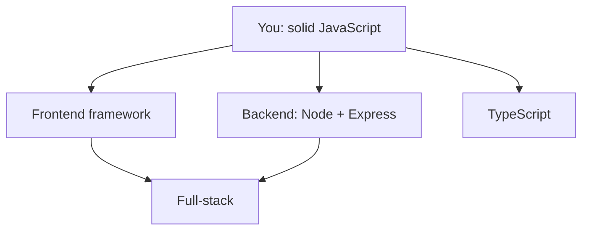

# Where to Go Next - Honest Signposts From Here

You made it. You can write JavaScript, reason about async, manipulate the DOM, handle errors, and read a real project's tooling without flinching - the foundation every JavaScript career is built on. Everything below is *application* of what you already know.

This phase isn't more syntax - it's a map: the honest paths from here, what each is *for*, and what to build to make it stick.

## The branches from here

*What this shows:* three directions lead out from where you stand, and they converge. You're not locked in forever, but pick *one to go deep on next* - depth beats breadth while learning.

## Frontend frameworks - building real UIs

You used `querySelector` and `addEventListener` to change the page by hand - fine for small things, but a tangle once an app has dozens of interacting pieces. **Frameworks** fix this: describe what the UI *should look like* for a given state, and the framework keeps it in sync.

- **React** - most widely used, safest bet for jobs, biggest ecosystem. Component-based; you'll meet "JSX" and "hooks."
- **Vue** - gentle learning curve, lovely docs, approachable after plain JS.
- **Svelte** - compiles components away, so less framework at runtime; many find it the most pleasant to write.

> 📝 They're more alike than internet arguments suggest - all three are component-based, state-drives-the-UI. Learn *one* well; the concepts transfer.

For employability, **React** is the pragmatic choice. For joy, try **Svelte** or **Vue**.

## Backend - JavaScript on the server

The same language you've been writing runs servers, thanks to **Node** (Phase 8). The classic starting point is **Express** - a small framework for web servers and APIs: code that listens for requests, talks to a database, and sends back JSON, the other end of the `fetch` calls you already know.

The natural next step if you liked `fs` and `fetch` more than the DOM - building an API your frontend talks to is one of programming's most satisfying moments.

> 💡 If "request," "response," "status code," and "JSON" still feel fuzzy, spend an hour with [HTTP and JSON API Basics](/guides/http-and-json-api-basics) before diving into Express.

## TypeScript - typed JavaScript, and yes, learn it

**TypeScript** is JavaScript with a type system bolted on: annotate what variables and functions expect (`name: string`, `age: number`), and a checker catches whole categories of bugs *before you run the code* - the "undefined is not a function," "forgot an await" mistakes from this course, flagged in your editor as you type.

It compiles to plain JavaScript, runs everywhere JavaScript runs, and nearly every serious codebase uses it now.

**Learning TypeScript next is strongly worth it.** It's not a different language - it's the JavaScript you know plus a safety net. Fewer bugs, better autocomplete, and a short leap *because* you already understand the JavaScript underneath.

> 💡 Don't learn TypeScript *first* and JavaScript *never* - you'd be fighting types without understanding the language beneath them. You did this in the right order.

## Full-stack - the whole picture

Combine a frontend framework with a Node backend and a database, and you're **full-stack** - building complete applications end to end. Tools like Next.js (React) or SvelteKit (Svelte) blur the frontend/backend line and let one project do both. Where the branches converge - realistic within months, not years.

## What to actually build

Reading guides got you here; *building* turns knowledge into skill. Aim small enough to finish but real enough to teach the messy parts:

1. **A quiz or to-do app, plain JS + DOM.** No framework. Cements Phases 6–9 - events, state, async.
2. **A page that fetches a public API and displays it.** Weather, GitHub repos, anything with a free JSON API. Practices `fetch`, error handling, and the DOM together.
3. **The same app, rebuilt in a framework.** Now you'll *feel* what React/Vue/Svelte do, since you remember doing it by hand.
4. **A tiny Express API plus a frontend that talks to it.** Your first full-stack thing - the moment both halves connect is when it clicks.

Finish each one - a finished rough project teaches more than three polished ones abandoned at 80%.

## A last word

If how programming languages relate still feels hazy - why JavaScript made its choices, how it compares to Python or Rust - [Languages, Explained Like a Human](/guides/languages-explained-like-a-human) puts it in context.

You started this course unsure what `npm run dev` even did. Now you read real code, reason about async, and choose your next step on purpose, not by panic. Go build the small thing; the rest is more of what you already know.

## Recap

1. **Pick one direction to go deep:** **frontend framework** (React for jobs, Svelte/Vue for joy), **backend** (Node + Express), or **TypeScript**.
2. **TypeScript is the standout next step** - typed JavaScript that catches bugs early; short leap since you know the JS underneath.
3. **Full-stack** (frontend + Node backend + database) is where the paths converge - realistic in months.
4. **Build to learn:** plain-JS app → API-fetching page → rebuild in a framework → tiny full-stack app. *Finish each one.*

---

[← Phase 17: Types & the Road to TypeScript](17-types-and-typescript.md) · [Guide overview](_guide.md)
