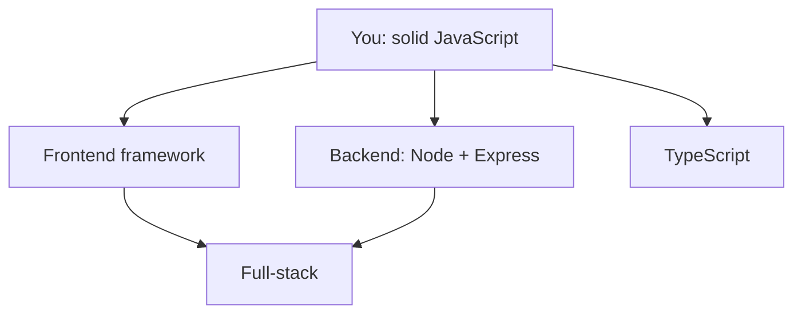

# Where to Go Next - Honest Signposts From Here

You made it. You can write JavaScript, reason about async, manipulate the DOM, handle errors, and read a real project's tooling without flinching. That's not a small thing - that's the foundation every JavaScript career is built on. Everything below is *application* of what you already know.

So this last phase isn't more syntax. It's a map. The JavaScript world is enormous and loud, and it's easy to feel like you must learn everything at once. You don't. Here are the honest paths, what each is *for*, and - most importantly - what to build so it actually sticks.

## The branches from here

*What this shows:* Three directions lead out from where you stand, and they converge. You don't have to pick one forever - most developers end up touching all of them. But pick *one to go deep on next*, because depth beats breadth when you're learning.

## Frontend frameworks - building real UIs

You used `querySelector` and `addEventListener` to change the page by hand. That works for small things, but for a real app with dozens of interacting pieces, doing it manually becomes a tangle. **Frameworks** solve this: you describe what the UI *should look like* for a given state, and the framework keeps the page in sync as the state changes.

- **React** - the most widely used, the safest bet for jobs, the biggest ecosystem. Component-based; you'll meet "JSX" and "hooks."
- **Vue** - gentle learning curve, lovely docs, very approachable after plain JS.
- **Svelte** - compiles your components away, so there's less framework at runtime; many people find it the most pleasant to write.

> 📝 They're more alike than the internet's arguments suggest - all three are component-based and use the state-drives-the-UI idea. Learn *one* well; the concepts transfer.

If your goal is employability, **React** is the pragmatic first choice. If your goal is joy and you're learning for yourself, try **Svelte** or **Vue**.

## Backend - JavaScript on the server

The same language you've been writing runs servers, thanks to **Node** (Phase 8). The classic starting point is **Express** - a small, well-documented framework for building web servers and APIs. You'll write code that listens for requests, talks to a database, and sends back JSON - the other end of the `fetch` calls you already understand.

This is the natural next step if you liked the `fs` and `fetch` side of things more than the DOM side. Building an API that your frontend talks to is one of the most satisfying "oh, it all connects" moments in programming.

> 💡 If terms like "request," "response," "status code," and "JSON" still feel fuzzy, spend an hour with [HTTP and JSON API Basics](/guides/http-and-json-api-basics) before diving into Express. It'll make backend work click.

## TypeScript - typed JavaScript, and yes, learn it

**What it actually is.** **TypeScript** is JavaScript with a type system bolted on. You annotate what your variables and functions expect (`name: string`, `age: number`), and a checker catches whole categories of bugs *before you run the code* - the "undefined is not a function" and "forgot an await" mistakes you met in this course, flagged in your editor as you type.

It compiles down to plain JavaScript, so it runs everywhere JavaScript runs. Nearly every serious codebase uses it now.

This is the one I'd single out: **learning TypeScript next is strongly worth it.** It's not a different language - it's the JavaScript you already know plus a safety net. The payoff in fewer bugs and better editor autocomplete is large, and the leap from here is short *because* you understand the JavaScript underneath. (That's an opinion, but it's a widely shared one.)

> 💡 Don't learn TypeScript *first* and JavaScript *never* - you'd be fighting types without understanding the language they describe. You did this in the right order.

## Full-stack - the whole picture

Combine a frontend framework with a Node backend and a database, and you're **full-stack** - able to build a complete application end to end. Tools like Next.js (React) or SvelteKit (Svelte) blur the frontend/backend line and let one project do both. This is where the branches converge, and it's a realistic goal within months, not years, from where you are.

## What to actually build

Reading guides got you here. *Building* is what turns knowledge into skill. The trick is to build something small enough to finish but real enough to teach you the messy parts. A few honest suggestions, in rough order:

1. **A quiz or to-do app, plain JS + DOM.** No framework. Cements Phases 6–9 - events, state, async.
2. **A page that fetches a public API and displays it.** Weather, GitHub repos, anything with a free JSON API. Practices `fetch`, error handling, and the DOM together.
3. **The same app, rebuilt in a framework.** Now you'll *feel* what React/Vue/Svelte do for you, because you remember doing it by hand.
4. **A tiny Express API plus a frontend that talks to it.** Your first full-stack thing. The moment both halves connect is the moment it all clicks.

Finish each one - a finished rough project teaches more than three polished half-projects abandoned at 80%.

## A last word

If the *idea* of how programming languages differ and relate still feels hazy - why JavaScript made the choices it did, how it compares to the Pythons and Rusts of the world - [Languages, Explained Like a Human](/guides/languages-explained-like-a-human) is a calm, big-picture read that'll put JavaScript in context.

You started this course unsure what `npm run dev` even did. You're leaving it able to read real code, reason about async, and choose your next step on purpose instead of by panic. That's the hard part, and it's behind you. Go build the small thing. The rest is just more of what you already know.

## Recap

1. **Pick one direction to go deep:** a **frontend framework** (React for jobs, Svelte/Vue for joy), **backend** (Node + Express), or **TypeScript**.
2. **TypeScript is the standout next step** - typed JavaScript that catches your bugs early; short leap because you know the JS underneath.
3. **Full-stack** (frontend + Node backend + database) is where the paths converge and is a realistic goal in months.
4. **Build to learn:** plain-JS app → API-fetching page → rebuild it in a framework → tiny full-stack app. *Finish each one.*

---

[← Phase 17: Types & the Road to TypeScript](17-types-and-typescript.md) · [Guide overview](_guide.md)
