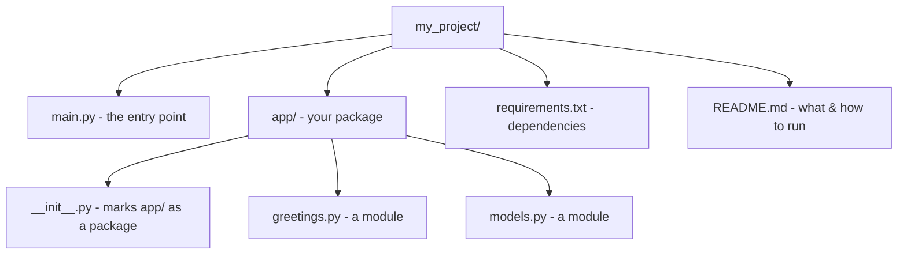

# Modules & Project Layout

One file is fine for a script, but once a program grows past a screen or two, cramming everything into
`main.py` turns it into a haystack. Python's answer is the **module**: every `.py` file is one, and
`import` pulls code from one file into another. That same mechanism gives you the **standard library** -
a huge toolbox that ships with Python.

## A module is just a `.py` file

**What it actually is.** A **module** is a single Python file. Its functions, variables, and (later)
classes can be *imported* - borrowed - into another file. Nothing special to do to create one; writing
`greetings.py` already makes a module named `greetings`.

A tiny two-file program. First, the module:
```python
# greetings.py
def shout(text):
    return text.upper() + "!"

PI = 3.14159
```
*What just happened:* One function, one variable, nothing visible on its own - a toolbox waiting to be
opened by another file. (The `#` starts a **comment**, a note for humans that Python ignores.)

## `import` - borrow code from another module

A second file that uses it. Two common styles, differing in *how you then refer to the borrowed names*:
```python
# main.py
import greetings
from greetings import shout

print(greetings.PI)
print(shout("hello"))
```
*What just happened:* `import greetings` brought in the whole module - reach into it with a dot, like
`greetings.PI`. `from greetings import shout` pulled out *just* that name, callable directly without a
prefix:
```console
3.14159
HELLO!
```

📝 **Terminology.** `import module` brings in the module as a namespace (use `module.thing`); `from
module import thing` brings a specific name straight in (use `thing`). Both run the imported file once -
the difference is only how you spell the names afterward.

⚠️ **`ModuleNotFoundError`.** If Python can't find what you're importing, you get:
```console
ModuleNotFoundError: No module named 'greetings'
```
Two usual causes: the file isn't in the folder you're running from (Python looks alongside the file you
ran), or the name is misspelled. You import `greetings`, **not** `greetings.py` - drop the extension.

## The standard library - batteries included

**What it actually is.** Python ships with a large collection of ready-made modules, the **standard
library** - math, dates, randomness, file paths, JSON, and more. Import them like your own; nothing to
install, they're already there.
```python runnable
import math
from random import randint

print(math.sqrt(16))
print(randint(1, 6))
```
*What just happened:* `math.sqrt(16)` returned the square root as a float; `randint(1, 6)` returned a
random whole number from 1 to 6 (a die roll) - yours will vary:
```console
4.0
3
```

💡 **Key point.** "Is there already a module for this?" is the right first question in Python. The
standard library covers an enormous amount, and the wider ecosystem covers most of the rest - that's
[Phase 8](08-ecosystem-and-tooling.md). Reach for existing, tested code before writing your own.

## `if __name__ == "__main__"` - run-directly vs imported

This line shows up in nearly every Python file and looks cryptic until you see the problem it solves.

**The problem.** When you `import` a file, Python *runs the whole file* to define its functions and
variables. Fine for `def`s - but any *top-level* code (a `print`, a call) runs too, the moment someone
imports it. You usually don't want a module's demo code firing just because another file borrowed one
function from it.

**The mechanism.** Python sets a built-in variable, `__name__`, differently depending on how the file is
used: `"__main__"` when you **run it directly**, the *module's own name* when it's **imported**. So you
guard "run this only when executed directly" behind a check on it.
```python runnable
# greetings.py
def shout(text):
    return text.upper() + "!"

if __name__ == "__main__":
    print(shout("running directly"))
```
*What just happened:* The `def` always defines the function, whether imported or run directly. The
guarded block runs *only* when this file is the one you launched:
```console
$ python3 greetings.py
RUNNING DIRECTLY!
```
But `import greetings` from another file defines `shout` and *skips* the guarded block, because
`__name__` is `"greetings"`, not `"__main__"` - importing it stays silent, exactly what you want.

📝 **Terminology.** `__name__` is a variable Python sets for you: `"__main__"` ⇒ "this file was run
directly"; the module name ⇒ "this file was imported." The `if __name__ == "__main__":` block is
conventionally where a script's *starting point* lives.

## A sane small project layout

As a program grows, group related code into files in sensible places. A clean, common starting shape:



What each piece is for:

- **`main.py`** - the entry point you run (`python3 main.py`); imports from your package and kicks
  things off inside an `if __name__ == "__main__":` block.
- **`app/`** - a folder of your real code, split into focused modules (`greetings.py`, `models.py`, …).
  A folder of modules like this is a **package**.
- **`app/__init__.py`** - an (often empty) file whose presence tells Python "this folder is a package."
  Import from it as `from app.greetings import shout`.
- **`requirements.txt`** - a list of outside libraries your project needs (covered in
  [Phase 8](08-ecosystem-and-tooling.md)).
- **`README.md`** - a plain-text note on what the project is and how to run it.

📝 **Terminology.** A **module** is one `.py` file; a **package** is a folder of modules (marked by
`__init__.py`). "Import from the `app` package" means reach into that folder's files.

⚠️ **Don't over-organize on day one.** A 30-line script doesn't need a package - a single file is
correct. Add structure when the file gets unwieldy, not before. Start flat; split when it hurts.

## Recap

1. Every `.py` file is a **module**; `import` borrows its code into another file.
2. `import module` ⇒ use `module.thing`; `from module import thing` ⇒ use `thing` directly. Import by
   name, without `.py`.
3. The **standard library** ships with Python - `math`, `random`, and many more - no install needed.
   Check it before writing your own.
4. `if __name__ == "__main__":` runs a block *only when the file is executed directly*, not when it's
   imported. It's where a script's starting point goes.
5. A small project: a `main.py` entry point, an `app/` **package** (folder of modules with
   `__init__.py`), plus `requirements.txt` and a `README.md`. Add structure only when you need it.

Next: modeling *things* - objects and the classes that define them - so data and its operations live
together.

---

[← Phase 4: Control Flow & Functions](04-control-flow-and-functions.md) · [Guide overview](_guide.md) · [Phase 6: Objects & Classes →](06-objects-and-classes.md)
