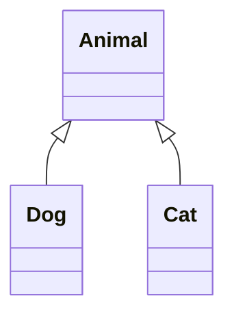

# Objects & Classes - Python's OOP

You've been using objects since Phase 2 without anyone calling them that. A string has a `.upper()`
method; a list has `.append()`. Each is an object: *data* (the characters, the items) glued to the
*behavior* that works on it. Classes are how you make your own.

"OOP" scares people because it arrives wrapped in vocabulary - encapsulation, polymorphism, abstraction.
Ignore that for now: exactly one idea sits underneath it, and once it clicks, the keywords stop being
spells and start being obvious.

## The one idea: bundle data with the behavior that acts on it

**What it actually is.** A **class** is a blueprint saying "things of this kind hold *this* data and can
do *these* things." An **object** (or **instance**) is one actual thing built from that blueprint - the
class is the cookie cutter, the objects are the cookies.

📝 **Class** - the template. **Instance / object** - one concrete thing made from it. Write the class
once and stamp out as many instances as you like, each with its own copy of the data.

**Why this exists.** Imagine modeling a dog without classes: a loose `name` string, an `age` number,
separate functions `bark(name)` and `birthday(age)` floating elsewhere. Nothing keeps them together -
keeping them in sync is on you. OOP's answer: one box for the data and its functions.

> 💡 **Key point.** Everything in this phase is one sentence repeated: *the data and the behavior that
> belongs with it live together in an object.* Lost? Return to that line.

## Your first class

**A real example.** A `Dog` - read the comments, they carry the whole lesson.

```python runnable
class Dog:
    def __init__(self, name, age):   # the constructor: runs when you make a Dog
        self.name = name             # store data ON this particular dog
        self.age = age

    def bark(self):                  # a method: behavior that belongs to a Dog
        return f"{self.name} says woof!"

rex = Dog("Rex", 3)                  # build one instance
print(rex.bark())
print(rex.age)
```
```console
$ python dogs.py
Rex says woof!
3
```
*What just happened:* `Dog("Rex", 3)` ran `__init__` with `name="Rex"` and `age=3`, storing those on the
new dog as `self.name` and `self.age`. `rex.bark()` then read its own `self.name` back out.

### `__init__` - the setup ritual

**What it actually is.** `__init__` (two underscores each side, said "dunder init") is the
**constructor**: a special method Python runs automatically when you create an instance, to set up its
starting data.

📝 **Dunder** - short for "double underscore." Names like `__init__` are Python's hooks: you define them
and Python calls them at the right moment. You almost never call `__init__` yourself - `Dog(...)` calls
it for you.

### `self` - the "this particular object" handle

**What it actually is.** `self` is the first parameter of every method, referring to *the specific
instance called*. Write `rex.bark()`, and Python quietly passes `rex` in as `self` - so inside `bark`,
`self.name` means "Rex's name," not some other dog's.

⚠️ **Gotcha - forgetting `self`.** Every method's first parameter must be `self`, and every reference to
the object's own data must go through it. Write `def bark():` (no `self`) or `return f"{name} says woof!"`
(no `self.`) and Python throws a `TypeError` or `NameError`. This trips up everyone coming from languages
where `this` is implicit - in Python it's explicit and always spelled out.

```console
$ python dogs.py
TypeError: Dog.bark() takes 0 positional arguments but 1 was given
```
*What just happened:* `def bark():` had no parameter, but `rex.bark()` still passes `rex` in as the first
argument - an argument the method wasn't expecting. Fix: `def bark(self):`.

### Attributes vs. methods

📝 **Attribute** - data stored on an object (`rex.name`, `rex.age`). **Method** - a function defined in
the class that acts on the object (`rex.bark()`). Read an attribute with no parentheses; call a method
with them.

## Inheritance - describe only what's different

**The problem it solves.** Suppose you now want a `Cat` and a `Cow` too. All have a name and age; all eat
and sleep. Only their sound differs. Copy-pasting the shared parts into three classes means three places
to fix when the logic changes - and they *will* drift apart.

**What it actually is.** **Inheritance** lets one class build on another: the child gets everything the
parent has, and you add or override only what's different. Pull the common parts into an `Animal` parent
and let `Dog` inherit from it.

```python runnable
class Animal:
    def __init__(self, name):
        self.name = name

    def speak(self):
        return f"{self.name} makes a sound."

class Dog(Animal):               # Dog IS an Animal, plus a little more
    def speak(self):             # override: dogs are more specific
        return f"{self.name} says woof!"

generic = Animal("Thing")
rex = Dog("Rex")
print(generic.speak())
print(rex.speak())
```
```console
$ python animals.py
Thing makes a sound.
Rex says woof!
```
*What just happened:* `Dog(Animal)` means "a Dog is an Animal." `Dog` never defined `__init__`, so it
inherited `Animal`'s - why `Dog("Rex")` still sets `self.name`. But `Dog` did define its own `speak`, so
that version wins. This is **overriding**: same method name, more specific behavior.

📝 **Parent / child** (also **superclass / subclass**) - `Animal` is the parent, `Dog` the child.
**Override** - a child redefining an inherited method to specialize it.

That relationship as a picture:



*One idea:* `Dog` and `Cat` both *are* `Animal`s (arrows point up to the parent). They share `name` and
the idea of `speak()`, but each gives it its own voice.

### `super()` - reuse the parent's work

When a child needs *extra* setup but still wants the parent's, `super()` calls the parent's version so
you don't repeat it.

```python
class Dog(Animal):
    def __init__(self, name, breed):
        super().__init__(name)   # let Animal set up self.name
        self.breed = breed       # then add what's new to Dog

rex = Dog("Rex", "Beagle")
print(rex.name, "-", rex.breed)
```
```console
$ python super_demo.py
Rex - Beagle
```
*What just happened:* `super().__init__(name)` ran `Animal.__init__`, setting `self.name`; then `Dog`
added its own `self.breed`. The child reused the parent's setup instead of copy-pasting `self.name = name`.

⚠️ **Gotcha - inheritance overuse.** People reach for inheritance too eagerly. Deep chains (class extends
class extends class, four levels down) get impossible to follow, since understanding one object means
mentally merging four files. Use it only for genuine, permanent "is-a" relationships, kept shallow. When
two things merely *share some parts*, prefer giving one object the other as a field
(`self.engine = Engine()`). The full trade-off - inheritance vs. composition, and the other paradigm
entirely - is laid out in [OOP vs. Functional](/guides/oop-vs-functional).

**Why this saves you later.** Shared logic changes once in the parent and every child updates for free.
Add a `Cat` tomorrow and you describe only its sound, not a whole animal from scratch.

## Recap

1. A **class** is a blueprint; an **object / instance** is one thing built from it, with data and
   behavior living together inside.
2. **`__init__`** runs automatically when you create an instance, setting up its starting data.
3. **`self`** is "this particular object" - the first parameter of every method, and how a method reads
   its own data. Forget it and you'll get a `TypeError`.
4. **Attributes** are data (`rex.name`); **methods** are behavior (`rex.bark()`).
5. **Inheritance** (`class Dog(Animal)`) lets a child reuse a parent and override only what differs;
   **`super()`** calls the parent's version. Use it sparingly, for true "is-a" relationships.

OOP is one of two big ways to organize code; the other, functional, keeps functions and data apart on
purpose. Next: what to do when things go wrong, and how to read and write files.

---

[← Phase 5: Modules & Project Layout](05-modules-and-project-layout.md) · [Guide overview](_guide.md) · [Phase 7: Errors & I/O →](07-errors-and-io.md)
