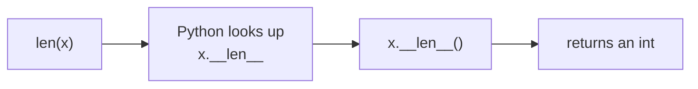

# The Data Model & Dunder Methods

Back in Phase 6 you met `__init__` and `self`, and learned the word **dunder** - double underscore.
You were told these names are "hooks": you define them, and Python calls them at the right moment.
That one sentence is the most important idea in the entire language, and this phase is about taking it
seriously.

Here's the secret nobody tells you up front: **Python's built-in syntax is mostly an illusion.** When
you write `len(x)`, Python doesn't have some privileged knowledge of how long things are - it turns
around and calls `x.__len__()`. When you write `a + b`, it calls `a.__add__(b)`. When you `print(x)`,
it calls `x.__repr__()` or `x.__str__()`. The square brackets, the `+`, the `==`, the `for` loop -
all of it is sugar over method calls on *your* objects. Learn which method each piece of syntax calls,
and you can make your own classes behave exactly like the built-ins.

This collection of hooks has a name: **the data model**. Let's make it knowable.

## The one rule: syntax dispatches to a dunder method

**What it actually is.** Almost every piece of Python syntax has a corresponding dunder method it
delegates to. The syntax is the friendly face; the dunder is where the work happens. You don't call the
dunder yourself - you write the syntax, and Python calls the dunder for you, on the object involved.

📝 **The data model** - Python's published contract of which dunder method each operator, built-in, and
piece of syntax calls. Implement the right dunders and your object plugs into the language as if it were
built in.

Here's the dispatch for one example, `len(x)`:



*One idea:* `len()` is not magic. It is a thin wrapper that finds your object's `__len__` method and
calls it. The same shape holds for the rest of the model - find the syntax, find the dunder behind it.

A handful of the most common pairings, so the pattern is concrete:

| You write | Python calls |
|---|---|
| `len(x)` | `x.__len__()` |
| `x[key]` | `x.__getitem__(key)` |
| `a + b` | `a.__add__(b)` |
| `a == b` | `a.__eq__(b)` |
| `print(x)` / `str(x)` | `x.__str__()` |
| `repr(x)` / the REPL echo | `x.__repr__()` |
| `for item in x:` | `x.__iter__()` |
| `x()` | `x.__call__()` |

> 💡 **Key point.** You will not memorize this table. You don't need to. Hold the *rule* - "syntax calls
> a dunder on the object" - and you can look up the specific name when you need it. The rule is the skill;
> the names are just lookups.

## `__repr__` vs `__str__` - how your object describes itself

**The problem it solves.** Make a class, print an instance, and you get this:

```python
class Money:
    def __init__(self, cents):
        self.cents = cents

print(Money(500))
```
```console
$ python money.py
<__main__.Money object at 0x10f4c2a90>
```
*What just happened:* Python had no idea how to turn your `Money` into text, so it fell back to its
default: the class name and the object's memory address. That hex number is useless to you and useless
to anyone reading a log at 2am. Python is telling you "you haven't taught me how to describe this."

You teach it with two dunders, and the difference between them matters:

📝 **`__repr__`** - the *unambiguous* representation, aimed at a developer. Ideally it looks like the code
that would recreate the object: `Money(500)`. This is what the REPL echoes and what shows up in a list,
a dict, or a debugger.
📝 **`__str__`** - the *readable* representation, aimed at an end user. This is what `print()` and
`str()` use. If you don't define it, Python falls back to `__repr__`.

```python runnable
class Money:
    def __init__(self, cents):
        self.cents = cents

    def __repr__(self):
        return f"Money({self.cents})"          # looks like the constructor call

    def __str__(self):
        return f"${self.cents / 100:.2f}"      # looks like money

m = Money(500)
print(m)            # uses __str__
print(repr(m))      # uses __repr__
print([m])          # a list shows __repr__ of its contents
```
```console
$ python money.py
$5.00
Money(500)
[Money(500)]
```
*What just happened:* `print(m)` reached for `__str__` and got the human-friendly `$5.00`. `repr(m)`
reached for `__repr__` and got `Money(500)` - the form a developer can read and even paste back into
code. And notice the list: collections always show their elements' `__repr__`, which is exactly why a
good `__repr__` makes debugging so much calmer - you see `[Money(500), Money(150)]`, not three memory
addresses.

⚠️ **Gotcha - skipping `__repr__` is a debugging tax you pay forever.** If you define nothing, every log
line, every error message, every `print` of a list of your objects shows `<Money object at 0x...>`. You
won't know which object is which. **Always give a class a `__repr__`** - it's the single highest-value
dunder. `__str__` is optional (it falls back to `__repr__`); `__repr__` is the one you owe yourself.

## `__eq__` - what "equal" means for your object (and why it drags `__hash__` along)

**The problem it solves.** By default, two objects are equal only if they're the *same object in memory*
- the `is`-style identity you met in [Phase 9](09-idioms-and-gotchas.md). But you almost never mean that.
Two `Money(500)` values are *the same amount of money*, even though they're separate objects.

`__eq__` lets you define equality by *value*. Python calls it for `==`.

```python runnable
class Money:
    def __init__(self, cents):
        self.cents = cents

    def __repr__(self):
        return f"Money({self.cents})"

    def __eq__(self, other):
        return self.cents == other.cents       # equal when the amounts match

print(Money(500) == Money(500))    # same amount
print(Money(500) == Money(150))    # different amount
```
```console
$ python eq.py
True
False
```
*What just happened:* `Money(500) == Money(500)` is now `True` even though they're two distinct objects,
because your `__eq__` compares `cents` instead of identity. You've redefined what "equal" means for this
type - exactly what you wanted.

But you just broke something quietly. The moment you define `__eq__`, Python *removes* the default
`__hash__`, and your objects become unhashable - they can't go in a `set` or be used as `dict` keys:

```python
amounts = {Money(500), Money(150)}
```
```console
$ python eq.py
TypeError: unhashable type: 'Money'
```
*What just happened:* Python made a deliberate rule: anything used as a set member or dict key must have
a `__hash__`, and **objects that are equal must have the same hash**. If you change what "equal" means
(via `__eq__`) but leave the old hash in place, that promise could break - so Python refuses to guess,
and disables hashing until you say what the hash should be.

📝 **`__hash__`** - returns an integer Python uses to bucket the object in sets and dicts. The contract:
if `a == b`, then `hash(a) == hash(b)`. The easy, correct way to honor it is to hash the same data your
`__eq__` compares - usually as a tuple.

```python runnable
class Money:
    def __init__(self, cents):
        self.cents = cents

    def __repr__(self):
        return f"Money({self.cents})"

    def __eq__(self, other):
        return self.cents == other.cents

    def __hash__(self):
        return hash(self.cents)        # hash the SAME data __eq__ compares

amounts = {Money(500), Money(500), Money(150)}
print(amounts)                          # the two equal 500s collapse into one
```
```console
$ python eq.py
{Money(500), Money(150)}
```
*What just happened:* With `__hash__` defined to mirror `__eq__`, `Money` works in a `set` again - and
because the two `Money(500)` objects are equal *and* hash the same, the set correctly treats them as one.
The rule to carry away: **define `__eq__` and `__hash__` together, over the same fields, or not at all.**

⚠️ **Gotcha - `__eq__` without `__hash__` silently costs you sets and dicts.** The `TypeError` only
fires when you actually try to put the object in a set or use it as a key, which might be far from where
you wrote `__eq__`. If your "value" object should be usable as a key (most should), add `__hash__` in the
same edit. (One exception: *mutable* objects you intend to change in place are often deliberately left
unhashable, because their hash would shift underneath the set.)

## `__getitem__` and `__iter__` - making an object indexable and loopable

The data model is what makes `x[key]` and `for item in x:` work on the built-in types - and you can opt
your own classes in.

**`__getitem__` - square brackets.** Define it, and `x[key]` calls `x.__getitem__(key)`. The `key` can
be anything: an integer index, a string, a slice - it's your method, you decide what it means.

```python runnable
class Playlist:
    def __init__(self, songs):
        self.songs = songs

    def __getitem__(self, index):
        return self.songs[index]        # delegate to the underlying list

p = Playlist(["Intro", "Verse", "Chorus"])
print(p[0])         # calls p.__getitem__(0)
print(p[-1])        # negative indexing, for free
```
```console
$ python playlist.py
Intro
Chorus
```
*What just happened:* `p[0]` dispatched to your `__getitem__`, which handed the work to the inner list.
You didn't subclass `list` or do anything heavy - you implemented one hook and `Playlist` started
behaving like a sequence.

**`__iter__` - the `for` loop.** When you write `for song in p:`, Python calls `p.__iter__()` to get an
**iterator**, then pulls items from it one at a time. Returning `iter(self.songs)` borrows the list's
own iterator, which is the simplest correct thing to do:

```python runnable
class Playlist:
    def __init__(self, songs):
        self.songs = songs

    def __iter__(self):
        return iter(self.songs)         # hand back the list's iterator

p = Playlist(["Intro", "Verse", "Chorus"])
for song in p:
    print(song)
```
```console
$ python playlist.py
Intro
Verse
Chorus
```
*What just happened:* `for song in p:` called `p.__iter__()`, got the list's iterator back, and walked
it. Your object is now loopable. This is the *shallow* end of iteration - enough to make a class work in
a `for` loop today. The real machinery (what an iterator actually is, `__next__`, and how to write your
own from scratch - including ones that generate values lazily) is the whole of the next phase:
[Iterators & Generators](11-iterators-and-generators.md).

## Operator overloading - teaching `+` to your type

**What it actually is.** **Operator overloading** is just the data-model rule applied to math symbols:
`a + b` calls `a.__add__(b)`, `a - b` calls `a.__sub__(b)`, `a * b` calls `a.__mul__(b)`, and so on. The
operators carry no built-in knowledge of *your* type; you supply the meaning by defining the dunder.

Let's give `Money` real arithmetic. Combine it with the `__repr__` and `__eq__` from before and you have
a small, complete value type:

```python runnable
class Money:
    def __init__(self, cents):
        self.cents = cents

    def __repr__(self):
        return f"Money({self.cents})"

    def __str__(self):
        return f"${self.cents / 100:.2f}"

    def __eq__(self, other):
        return self.cents == other.cents

    def __hash__(self):
        return hash(self.cents)

    def __add__(self, other):           # called for  self + other
        return Money(self.cents + other.cents)

    def __mul__(self, factor):          # called for  self * factor
        return Money(self.cents * factor)

price = Money(500)
tax = Money(45)
total = price + tax                     # __add__
doubled = price * 2                     # __mul__
print(total)
print(doubled)
print(total == Money(545))
```
```console
$ python money.py
$5.45
$10.00
True
```
*What just happened:* `price + tax` dispatched to `__add__`, which built and returned a *new* `Money` of
545 cents. `price * 2` dispatched to `__mul__`. Then `total == Money(545)` used `__eq__`. From the
outside, `Money` now reads exactly like a built-in number type - `+`, `*`, `==`, and a clean `print`
- but every one of those behaviors is a method you wrote. That is the whole payoff of the data model:
**your types become first-class citizens of the language.**

📝 **Return a new object, don't mutate.** Notice `__add__` returns a fresh `Money` rather than changing
`self`. That mirrors how `+` works everywhere in Python (`3 + 4` doesn't change `3`), and it keeps your
type predictable. Operators that quietly mutate their operands surprise everyone who uses them.

> 🪖 **War story.** A teammate built a `Vector` class for a physics sim and made `+` mutate the
> left-hand vector in place to "save an allocation." A week later a bug surfaced where positions were
> drifting; the culprit was `total = a + b` silently corrupting `a` every frame it ran. The fix was one
> line - return a new `Vector` - and the lesson stuck: operators are expected to be pure. Honor the
> reader's intuition, not the micro-optimization.

## Recap

1. **The data model is one rule:** Python syntax dispatches to a dunder method on the object. `len(x)` →
   `x.__len__()`, `a + b` → `a.__add__(b)`, `x[k]` → `x.__getitem__(k)`. Learn the rule, look up the name.
2. **`__repr__` vs `__str__`:** `__repr__` is the unambiguous, developer-facing form (also what lists and
   the REPL show); `__str__` is the readable, user-facing form `print` uses. **Always define `__repr__`**
   - skipping it gives you the useless `<object at 0x...>` in every log.
3. **`__eq__` defines value equality** (`==`), but defining it makes your object **unhashable** until you
   add **`__hash__`** - define the two together over the same fields, or sets and dicts break.
4. **`__getitem__`** makes `x[key]` work; **`__iter__`** makes `for item in x:` work. (The deep version of
   iteration is the next phase.)
5. **Operator overloading** is the same rule for symbols: define `__add__`, `__mul__`, etc., and your type
   does arithmetic. Return *new* objects; don't mutate operands.

You can now make your own classes behave like Python's built-ins. The one hook we touched only lightly is
`__iter__` - and iteration turns out to be deep enough, and useful enough, to deserve its own phase. Next
we pull it apart: what an iterator really is, and how generators let you produce values lazily, one at a
time, without ever building the whole sequence in memory.

Quick check - make sure these stuck:

```quiz
[
  {"q":"When you write len(x), what does Python actually do?","choices":["It reads a hidden length field that every object stores","It calls x.__len__() - len() is a thin wrapper over that dunder","It counts the object's attributes in memory"],"answer":1,"explain":"The data model is one rule: syntax dispatches to a dunder. len(x) finds and calls x.__len__(); it has no privileged knowledge of length."},
  {"q":"Why is defining __repr__ on your class considered the single highest-value dunder?","choices":["Without it, print(x), logs, and lists of your objects all show a useless <object at 0x...>","It is required before you can use == on instances","It makes the object hashable"],"answer":0,"explain":"__repr__ is the developer-facing form shown by the REPL, debuggers, and inside collections. Skip it and every log line shows a memory address instead of something readable."},
  {"q":"You add __eq__ to a class so two equal-valued instances compare equal. What breaks?","choices":["Nothing - __eq__ is fully self-contained","The instances become unhashable: defining __eq__ removes the default __hash__, so they can't go in a set or be dict keys until you add __hash__","print() stops working on them"],"answer":1,"explain":"Equal objects must hash equally, so once you redefine equality Python disables the inherited hash. Define __eq__ and __hash__ together over the same fields, or sets and dicts break."}
]
```

---

[← Phase 9: Idioms & Common Gotchas](09-idioms-and-gotchas.md) · [Guide overview](_guide.md) · [Phase 11: Iterators & Generators →](11-iterators-and-generators.md)
