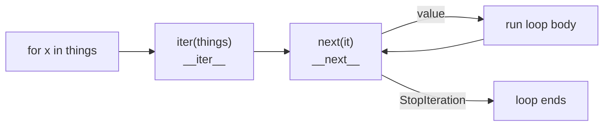

# Iterators & Generators

You've written `for line in file:` and `for x in my_list:` since Phase 2, and it just worked. But have
you ever wondered what the `for` loop is actually *doing*? Or hit a moment where a list got so big it ate
all your RAM and the program died? This phase is the answer to both — and the idea connecting them is one
of the most useful in all of Python.

That idea is **laziness**: producing values *one at a time, on demand*, instead of building the whole
collection up front. A list of a billion numbers needs a billion numbers' worth of memory. A *lazy*
sequence of a billion numbers needs room for one. Once that clicks, you can process a 10 GB file on a
laptop, or loop over an *infinite* sequence without your machine catching fire.

## The iterator protocol — what a `for` loop really does

**What it actually is.** An **iterable** is anything you can loop over (a list, a string, a file, a dict).
An **iterator** is the thing that actually walks through it, handing you one item at a time and remembering
where it left off. They're two roles: the iterable is the book; the iterator is the bookmark.

📝 **Iterable** — something you *can* loop over (has `__iter__`). **Iterator** — the stateful walker that
produces items one by one (has `__next__`). `for` asks the iterable for a fresh iterator, then pulls items
from it until they run out.

When you write `for x in things:`, Python does three things under the hood:

1. Calls `iter(things)` to get an iterator (this runs `things.__iter__()`).
2. Calls `next(...)` on that iterator over and over to get each value (this runs `__next__()`).
3. Stops when `__next__` raises a special exception, `StopIteration`, which means "nothing left."



*One idea:* the `for` loop is a polite, automatic `next()`-calling machine. It keeps asking for the next
value and quietly stops the moment the iterator signals it's empty.

**A real example.** You can drive that machinery by hand to see it move:

```python runnable
things = ["a", "b"]
it = iter(things)          # get an iterator (the bookmark)

print(next(it))            # pull the first item
print(next(it))            # pull the second
try:
    print(next(it))        # nothing left...
except StopIteration:
    print("done — StopIteration raised")
```
```console
$ python protocol.py
a
b
done — StopIteration raised
```
*What just happened:* `iter(things)` made an iterator that remembers its position. Each `next(it)` advanced
it by one and returned that item. The third `next(it)` found nothing left, so it raised `StopIteration` —
the exact signal a `for` loop catches to know it's time to stop. A `for` loop is just this, with the
`try/except` handled for you.

**Why this saves you later.** Once you know `for` is "call `next` until `StopIteration`," a pile of Python
behavior stops being mysterious: why a file object can be looped but not indexed, why you can't rewind a
loop mid-stream, and — coming up next — how generators plug straight into every `for` loop you'll ever
write.

## Generators — a function that pauses and resumes

Writing a class with `__iter__` and `__next__` to produce a sequence is a lot of ceremony. Python has a
far easier way to make an iterator: the **generator**.

**What it actually is.** A **generator** is a function that uses `yield` instead of `return`. The moment a
function contains `yield`, calling it doesn't run the body — it hands you back an iterator. Each time
something pulls a value, the function runs until the next `yield`, hands that value out, then **freezes
right there**, remembering all its local variables. The next pull thaws it and continues from that exact
spot.

📝 **`yield`** — like `return`, but instead of ending the function, it pauses it and produces one value.
The function picks up where it left off on the next request. A function with `yield` in it is a generator.

**Why this exists.** `return` ends a function and throws away everything it knew. `yield` is the opposite:
it produces a value *without* ending, so a single function can produce a whole stream over time, keeping
its place between values. That's exactly the "one item at a time, remember where you were" behavior the
iterator protocol wants — for free.

**A real example.** Watch the pausing happen:

```python runnable
def count_to_three():
    print("  -> starting")
    yield 1
    print("  -> resumed after 1")
    yield 2
    print("  -> resumed after 2")
    yield 3

for n in count_to_three():
    print("got", n)
```
```console
$ python gen.py
  -> starting
got 1
  -> resumed after 1
got 2
  -> resumed after 2
got 3
```
*What just happened:* Calling `count_to_three()` ran *none* of the body — it returned a generator. The
`for` loop pulled the first value, which ran the function up to `yield 1` and then froze. Pulling again
thawed it right after that `yield`, ran to `yield 2`, and froze again. The interleaved prints prove the
function is genuinely pausing and resuming, not running all at once.

**The gotcha — a generator is single-use.** This one bites everyone exactly once. A generator is an
iterator, and an iterator gets *consumed*: once you've walked to the end, it's empty forever. Loop over the
same generator a second time and you get nothing.

```python runnable
def squares():
    for n in range(3):
        yield n * n

gen = squares()
print("first pass: ", list(gen))   # drains it
print("second pass:", list(gen))   # already empty
```
```console
$ python single_use.py
first pass:  [0, 1, 4]
second pass: []
```
*What just happened:* The first `list(gen)` pulled every value until `StopIteration`, leaving the generator
exhausted. The second `list(gen)` started where the first left off — at the end — so it got an empty list.
If you need to iterate twice, either call the generator function again to get a *fresh* one (`squares()`),
or, if the data is small enough, materialize it once into a list and loop over that.

⚠️ **Gotcha — generators are single-use.** This trips people in sneaky ways: passing a generator to a
function that loops over it twice, or printing it for debugging (which drains it) before the real loop. If
something downstream needs the values more than once, store them in a list first — but only if they fit in
memory, which is the very thing generators exist to avoid.

## Generator expressions — comprehensions that don't build the list

You met list comprehensions in [Phase 9](09-idioms-and-gotchas.md): `[x*x for x in nums]` builds a whole
list. Swap the square brackets for parentheses and you get a **generator expression** — same syntax, but
*lazy*. It produces values one at a time and never holds the full result in memory.

**What it actually is.** `(x*x for x in nums)` is a generator written inline. It computes each value only
when asked. The difference from `[x*x for x in nums]` isn't the output values — it's *when* and *whether*
they all exist at once.

```python runnable
import sys

list_comp = [x * x for x in range(10000)]    # builds all 10,000 now
gen_expr  = (x * x for x in range(10000))    # builds nothing yet

print("list comp bytes:", sys.getsizeof(list_comp))
print("gen expr bytes: ", sys.getsizeof(gen_expr))
print("first three:", next(gen_expr), next(gen_expr), next(gen_expr))
```
```console
$ python genexpr.py
list comp bytes: 85176
gen expr bytes:  208
first three: 0 1 4
```
*What just happened:* The list comprehension allocated all 10,000 squares immediately — tens of kilobytes,
growing with the input. The generator expression allocated a tiny fixed-size object that holds *the recipe*,
not the results: `208` bytes whether the range is 10,000 or 10 billion. The squares only come into being as
`next()` asks for them. (Sizes shown are from CPython on a 64-bit build; the exact bytes vary by platform,
but the lesson — fixed-and-tiny vs. grows-with-input — holds everywhere.)

💡 **Key point.** Use a **list** comprehension when you need the whole collection in hand (to index it,
loop twice, or pass it around). Use a **generator** expression when you'll consume the values once, in a
single pass — especially if the input is huge. The rule of thumb: if it feeds straight into a `for`,
`sum()`, `any()`, or `min()`, a generator expression is usually the leaner choice.

## Why it matters — huge files and infinite sequences

Here's where laziness stops being a curiosity and starts saving your program.

**Process a file bigger than your RAM.** A file object is *already* a lazy iterator over its lines —
looping it reads one line at a time, never loading the whole file. You can wrap that in your own generator
to build a processing pipeline that stays small no matter the file size:

```python runnable
import io

# Pretend this is a 10 GB log file; io.StringIO behaves like an open file.
fake_file = io.StringIO("error: disk full\ninfo: started\nerror: timeout\n")

def error_lines(f):
    for line in f:                 # one line at a time — never the whole file
        if line.startswith("error"):
            yield line.rstrip()

for line in error_lines(fake_file):
    print(line)
```
```console
$ python bigfile.py
error: disk full
error: timeout
```
*What just happened:* `error_lines` is a generator. It pulls one line from the file, and if it's an error,
yields it — then pauses until the next line is needed. At no point does the whole file (or even the whole
list of error lines) sit in memory. Point this at a real 10 GB log opened with `open(path)` and it uses the
same tiny footprint: one line at a time, start to finish. That's the headline use case for generators.

**Loop over something infinite.** A list can't be infinite — you can't store endless items. But a generator
can *describe* an endless sequence and produce it on demand. You just need a way to stop pulling.

```python runnable
def naturals():
    n = 0
    while True:        # never ends on its own
        yield n
        n += 1

gen = naturals()
first_five = [next(gen) for _ in range(5)]   # pull exactly 5, then stop asking
print(first_five)
```
```console
$ python infinite.py
[0, 1, 2, 3, 4]
```
*What just happened:* `naturals()` would yield numbers forever if you let it — the `while True` never
finishes. But nothing is computed until you ask, so you pulled exactly five values with `next()` and then
walked away. The generator is paused mid-`while`, holding `n`, ready to continue if you ever come back.
⚠️ Never write a bare `for x in naturals():` with no stopping condition — it runs until you kill the
process. You need something that caps how many values you pull, which is exactly what `itertools` gives you.

## A peek at `itertools` — the lazy toolkit

The standard library's `itertools` module is a box of ready-made lazy building blocks. They take iterators
and produce iterators, all without materializing anything. Three you'll reach for constantly:

- **`count(start)`** — counts upward forever (a lazy, infinite version of `range`).
- **`islice(it, n)`** — takes the first `n` items from any iterator, then stops. This is your "stop pulling"
  tool for infinite generators.
- **`chain(a, b)`** — glues iterables end to end into one stream, without copying them into a combined list.

```python runnable
from itertools import count, islice, chain

# islice tames an infinite counter: take 5, no manual next() loop
first_five = list(islice(count(0), 5))
print(first_five)

# chain walks two sequences as one, lazily
for x in chain([1, 2], ["a", "b"]):
    print(x)
```
```console
$ python itertools_demo.py
[0, 1, 2, 3, 4]
1
2
a
b
```
*What just happened:* `count(0)` is an endless lazy counter; `islice(count(0), 5)` pulled exactly the first
five values and then raised `StopIteration`, so `list(...)` got `[0, 1, 2, 3, 4]` and the counter never ran
away. `chain([1, 2], ["a", "b"])` produced all four items as a single stream without ever building a
combined `[1, 2, "a", "b"]` list in memory. Same pattern throughout: take iterators, return iterators, stay
lazy.

## Recap

1. A `for` loop calls `iter()` to get an **iterator**, then `next()` until it raises **`StopIteration`**.
   That's the whole **iterator protocol**.
2. A **generator** is a function with **`yield`**: it pauses and resumes, producing a stream of values one
   at a time while remembering its place.
3. A **generator expression** `(x*x for x in ...)` is a lazy comprehension — same syntax as `[...]`, but it
   never builds the full list, so its memory stays tiny no matter the input size.
4. Laziness is the payoff: **process a 10 GB file or an infinite sequence** without loading it into RAM,
   one item at a time.
5. ⚠️ A generator is **single-use** — once exhausted, it's empty. Make a fresh one (or a list) if you need
   to iterate again.
6. **`itertools`** (`count`, `islice`, `chain`) gives you lazy building blocks; `islice` is how you safely
   take a finite slice of an infinite generator.

You can now produce values without paying for all of them up front. Next, we look at **decorators** — a way
to wrap a function in extra behavior without touching its body, built on the same "functions are just
objects" idea that makes generators tick.

## Quick check

Test yourself on the one idea that makes this whole phase tick — laziness:

```quiz
[
  {
    "q": "What does `yield` do that `return` doesn't?",
    "choices": [
      "Pauses the function and produces a value, then resumes from that exact spot on the next request",
      "Ends the function and discards its local variables, just like return",
      "Builds and returns a complete list of all values at once",
      "Makes the function run faster by skipping the iterator protocol"
    ],
    "answer": 0,
    "explain": "`yield` produces a value without ending the function. It freezes the function in place, remembering all local variables, and thaws it on the next pull — that's what lets one function emit a whole stream over time."
  },
  {
    "q": "Why does `(x*x for x in range(10_000_000))` use far less memory than `[x*x for x in range(10_000_000)]`?",
    "choices": [
      "The generator expression computes values one at a time on demand instead of building the full list up front",
      "The generator expression secretly uses a faster C loop",
      "Parentheses are always cheaper than square brackets in Python",
      "The generator expression rounds the numbers to save space"
    ],
    "answer": 0,
    "explain": "A generator expression holds the recipe, not the results. It produces each value only when asked, so its footprint stays tiny and fixed no matter how big the input is — while the list comprehension allocates every value immediately."
  },
  {
    "q": "You write `gen = squares()`, then `list(gen)` twice in a row. What does the second `list(gen)` return?",
    "choices": [
      "An empty list `[]` — the generator was exhausted by the first pass",
      "The same list as the first call — generators restart automatically",
      "An error, because you can't call `list()` on a generator twice",
      "Half the values, because the generator remembers only its midpoint"
    ],
    "answer": 0,
    "explain": "A generator is single-use. The first `list(gen)` drains it to `StopIteration`, leaving it empty forever. To iterate again, call the generator function for a fresh one (`squares()`), or materialize the values into a list first."
  }
]
```

---

[← Phase 10: The Data Model & Dunder Methods](10-the-data-model.md) · [Guide overview](_guide.md) · [Phase 12: Decorators →](12-decorators.md)
