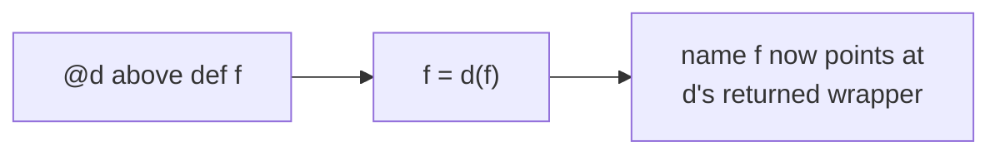

# Decorators

The first time you see `@app.get("/")` or `@property` sitting on top of a function, it looks like a
spell - the function gets *powers* it didn't ask for, hidden behind a symbol you've never been formally
introduced to. People copy these incantations from tutorials for years without knowing what `@` does.

Here's the relief up front: there is no magic. A decorator is an ordinary function. The `@` is a
two-character shortcut for one line of plain Python you could write yourself. By the end of this phase
you'll be able to read any `@something` and know exactly what it's doing - and write your own.

To get there we need one idea first - the one most languages never make you think about.

## Functions are first-class objects

**What it actually is.** In Python, a function is *a value*, just like `3` or `"hello"` or a list. The
`def` statement doesn't summon something special - it creates an object and binds a name to it. Because a
function is a value, you can do everything to it you'd do to any value: store it in a variable, put it in
a list, pass it to another function, return it from one.

**Why this matters here.** Decorators are *built* out of this single fact: if a function can be passed
around and returned like data, a function can take *another function* as input and hand back a new one.
That's the whole game. Prove each piece in code.

```python runnable
def shout(text):
    return text.upper() + "!"

# 1. A function is a value - bind it to another name
yell = shout
print(yell("hello"))

# 2. Pass a function as an argument
def apply_twice(func, value):
    return func(func(value))

print(apply_twice(shout, "hi"))
```
```console
$ python firstclass.py
HELLO!
HIHI!
```
*What just happened:* `yell = shout` didn't *call* `shout` - no parentheses. It bound a second name to the
same function object, so `yell` and `shout` are now two names for one thing. `apply_twice` received
`shout` as plain data in its `func` parameter and called it - a function went *into* another function as
an argument and got used there. (`apply_twice(shout, "hi")` runs `shout(shout("hi"))` → `shout("HI!")` →
`"HI!!"`.)

📝 **First-class** - a value the language lets you pass, return, and store with no special ceremony. In
Python, functions are first-class (so are classes and modules) - this is *why* decorators are possible.

### Functions can be defined inside, and returned out

The last piece: a function can be *defined inside another function*, and the outer function can *return*
it as its result.

```python runnable
def make_greeter(greeting):
    def greet(name):                     # defined inside make_greeter
        return f"{greeting}, {name}!"
    return greet                         # hand the inner function back

say_hello = make_greeter("Hello")        # this returns a function
say_hi = make_greeter("Hi")
print(say_hello("Ana"))
print(say_hi("Bo"))
```
```console
$ python factory.py
Hello, Ana!
Hi, Bo!
```
*What just happened:* `make_greeter("Hello")` ran, defined a fresh `greet` inside, and *returned* it
without calling it - so `say_hello` is now a function. The clever part: the returned `greet` still
remembers the `greeting` it was born with (`"Hello"`), even though `make_greeter` already finished. That
remembered value is a **closure** - the inner function closes over the variables it used from the outer
one.

📝 **Closure** - an inner function plus the outer-scope variables it captured. `say_hello` carries
`greeting="Hello"` around with it forever; `say_hi` carries `"Hi"`. Same code, different captured data.

Combine those two abilities - *pass a function in*, *return a function out* - and you have a decorator.

## A decorator is a function that takes a function and returns a function

**What it actually is.** A **decorator** is a function whose input is a function and whose output is a
(usually wrapped) function. You give it `f`; it gives back a new function that does something *extra*
around `f` - runs code before, after, or instead of it - then hands control to `f` and returns its result.

> 💡 **Key point.** That one sentence is the entire concept: *takes a function, returns a function.*
> Everything else - the `@`, the arguments, `functools.wraps` - is detail layered on top of it.

**A real example.** Here's a decorator that logs every call. Read it bottom-up: `log_calls` takes a
function `func`, defines a `wrapper` that prints around calling `func`, and returns `wrapper`.

```python runnable
def log_calls(func):
    def wrapper(*args, **kwargs):
        print(f"-> calling {func.__name__}")
        result = func(*args, **kwargs)
        print(f"<- {func.__name__} returned {result}")
        return result
    return wrapper

def add(a, b):
    return a + b

add = log_calls(add)          # wrap it by hand - no @ yet
print(add(2, 3))
```
```console
$ python logcalls.py
-> calling add
<- add returned 5
5
```
*What just happened:* `log_calls(add)` returned `wrapper` - a brand-new function that closes over the
original `add` (as `func`). We rebound the name `add` to point at that wrapper, so calling `add(2, 3)`
really calls `wrapper(2, 3)`: it prints, calls the *real* `add` through `func`, prints again, and returns
the result. The original function never changed - it got *wrapped*.

📝 **`*args, **kwargs`** - "accept any positional arguments and any keyword arguments." The wrapper uses
this so it works for *any* function regardless of its signature, then forwards everything to `func`
unchanged. You met functions in [Phase 4](04-control-flow-and-functions.md); this is where treating them
as values pays off.

## `@decorator` is sugar for `f = decorator(f)`

Now the reveal: that line `add = log_calls(add)` is exactly what `@` does, just written above the
function instead of below it.

These two snippets are *identical* in behavior:

```python
# The longhand you already understand:
def add(a, b):
    return a + b
add = log_calls(add)

# The @ shorthand - same thing, said once:
@log_calls
def add(a, b):
    return a + b
```

The `@log_calls` line means: "after defining `add`, immediately run `add = log_calls(add)`." That's the
whole definition of `@` syntax - not a keyword with hidden rules, just a rewrite.



*One idea:* `@d` is a textual shortcut. The interpreter defines your function, passes it through `d`, and
rebinds the name to whatever `d` returns. Knowing this, you can read any decorator stack.

Here it is doing real work - `@timer` reports how long a function took:

```python runnable
import time

def timer(func):
    def wrapper(*args, **kwargs):
        start = time.perf_counter()
        result = func(*args, **kwargs)
        elapsed = time.perf_counter() - start
        print(f"{func.__name__} took {elapsed:.4f}s")
        return result
    return wrapper

@timer
def slow_sum(n):
    return sum(range(n))

print(slow_sum(1_000_000))
```
```console
$ python timer.py
slow_sum took 0.0143s
9999990000
```
*What just happened:* `@timer` rewrote `slow_sum` into `timer(slow_sum)` - the wrapper that times the
call. We never touched `slow_sum`'s body; the timing logic lives entirely in the decorator and can be
slapped onto any function the same way. (Your exact seconds will differ - it's a live measurement.)

## `functools.wraps` - don't lose the function's identity

There's a quiet bug in every decorator written so far. When you wrap a function, the *name* now points at
`wrapper` - so the original function's `__name__` and docstring vanish, replaced by the wrapper's. Tools
that introspect functions (debuggers, docs generators, test frameworks) suddenly see `wrapper` everywhere.

```python runnable
def log_calls(func):
    def wrapper(*args, **kwargs):
        return func(*args, **kwargs)
    return wrapper

@log_calls
def add(a, b):
    "Add two numbers."
    return a + b

print(add.__name__)        # we'd hope for "add"
print(add.__doc__)         # we'd hope for "Add two numbers."
```
```console
$ python noidentity.py
wrapper
None
```
*What just happened:* `add` is now the `wrapper` function, so `add.__name__` honestly reports `"wrapper"`
and the docstring is gone - `wrapper` never had one. Every function decorated with `log_calls` would
*claim to be named* `wrapper`, which is confusing in tracebacks and breaks tools that rely on `__name__`.

⚠️ **Gotcha - always wrap your wrapper with `functools.wraps`.** `functools.wraps(func)` is a decorator
you put on the *inner* wrapper. It copies the original function's `__name__`, `__doc__`, and other
metadata onto the wrapper. Leaving it out is the single most common decorator mistake.

```python runnable
import functools

def log_calls(func):
    @functools.wraps(func)             # copy func's identity onto wrapper
    def wrapper(*args, **kwargs):
        return func(*args, **kwargs)
    return wrapper

@log_calls
def add(a, b):
    "Add two numbers."
    return a + b

print(add.__name__)
print(add.__doc__)
```
```console
$ python wraps.py
add
Add two numbers.
```
*What just happened:* `@functools.wraps(func)` ran on `wrapper` and copied `add`'s name and docstring onto
it. The decorated `add` *still* introspects as `add` - same name, same docs - even though it's secretly
the wrapper. Make this a reflex: every decorator gets a `@functools.wraps(func)` on its inner function.

## Decorators that take arguments

So far `@timer` and `@log_calls` take no configuration. But you've surely seen `@app.get("/users")` or
`@retry(times=3)` - decorators *with parentheses and arguments*. How does that work, when a decorator is
supposed to take a function?

**The trick: one more layer.** `@repeat(3)` is two steps. First Python evaluates `repeat(3)` - a normal
function call that must *return a decorator*. Then that returned decorator gets applied to your function.
So a decorator-with-arguments is a function that returns a decorator that returns a wrapper - three
layers deep.

📝 **Decorator factory** - a function you call (`repeat(3)`) that builds and returns a decorator. The
arguments you pass configure the decorator it produces.

```python runnable
import functools

def repeat(times):                        # the factory: takes the config
    def decorator(func):                  # the actual decorator: takes the function
        @functools.wraps(func)
        def wrapper(*args, **kwargs):     # the wrapper: takes the call's args
            for _ in range(times):
                result = func(*args, **kwargs)
            return result
        return wrapper
    return decorator

@repeat(3)
def greet(name):
    print(f"Hi, {name}!")

greet("Ana")
```
```console
$ python repeat.py
Hi, Ana!
Hi, Ana!
Hi, Ana!
```
*What just happened:* `@repeat(3)` ran in two beats. `repeat(3)` was called first and returned `decorator`
(carrying `times=3` in a closure). Then `decorator` was applied to `greet`, exactly like a normal
decorator, producing `wrapper`. Calling `greet("Ana")` loops the wrapper three times. The extra layer
exists purely to capture the `3` before the function ever shows up.

Read `@repeat(3)` as `greet = repeat(3)(greet)`: the first call eats the argument, the second eats the
function. Once you see those two calls, decorators with arguments stop being mysterious.

## Where you've already met decorators

You don't usually *write* decorators day to day - you *use* ones other people wrote. Now that you know
the mechanism, these all read as plain code:

- **Web framework routes** - `@app.get("/users")` in FastAPI, `@app.route("/")` in Flask. The decorator
  takes your view function and registers it in the framework's routing table, then returns it (often
  unchanged). The "magic" is just `your_view = app.get("/users")(your_view)`.
- **`@property`** - a built-in decorator that turns a method into a *computed attribute*, so you can write
  `obj.area` (no parentheses) and have it run a method behind the scenes.
- **`@functools.lru_cache`** - wraps a function so its results are *cached*: call it again with the same
  arguments and get the stored answer instead of recomputing. It's a decorator factory
  (`@lru_cache(maxsize=128)`) doing exactly the layered trick you just learned.
- **`@staticmethod` / `@classmethod`** - built-in decorators that change how a method receives its first
  argument, from [Phase 6](06-objects-and-classes.md)'s class machinery.

Here's `lru_cache` turning a painfully slow recursive Fibonacci into an instant one, with a single line:

```python runnable
import functools

@functools.lru_cache(maxsize=None)
def fib(n):
    if n < 2:
        return n
    return fib(n - 1) + fib(n - 2)

print(fib(40))
print(fib.cache_info())
```
```console
$ python cache.py
102334155
CacheInfo(hits=38, misses=41, maxsize=None, currsize=41)
```
*What just happened:* `@lru_cache` wrapped `fib` so each `(n,)` it's ever called with is computed once
and remembered. Without it, `fib(40)` would recompute the same sub-results billions of times; with it,
each of the 41 distinct calls runs once (`misses=41`) and the rest are served from cache (`hits=38`). One
decorator line bought all of that, and `cache_info()` is a bonus method the decorator attached to your
function.

**Why this saves you later.** Decorators are how Python lets a library add behavior to *your* code without
you editing it - logging, timing, caching, routing, access control, retries. Read `@` as "pass this
function through that function and rebind the name" and every framework you pick up gets less mysterious.

## Recap

1. **Functions are first-class** - you can store, pass, and return them. Decorators are built entirely on
   this.
2. A **closure** is an inner function plus the outer variables it captured; returning an inner function
   keeps those values alive.
3. A **decorator** is a function that takes a function and returns a (usually wrapped) function.
4. **`@decorator`** above a `def` is pure sugar for `f = decorator(f)` - a rewrite, not magic.
5. **`functools.wraps(func)`** on the inner wrapper copies the original's name and docstring across - omit
   it and your function forgets who it is. Make it a reflex.
6. **Decorators with arguments** add one layer: `@repeat(3)` means `repeat(3)(func)` - a factory returns
   the decorator, which returns the wrapper.
7. You've already used decorators everywhere - `@app.get(...)`, `@property`, `@lru_cache`. Now you know
   exactly what each one does.

You can now read and write the `@` with confidence. Next, another piece of "magic" that turns out to be a
plain protocol: the `with` statement and the context managers behind it, the reliable way to guarantee
setup and cleanup.

See an LRU cache fill and evict, live:

```playground-lru
```

Quick check - make sure these stuck:

```quiz
[
  {
    "q": "What is a decorator, fundamentally?",
    "choices": [
      "A keyword that adds hidden behavior to a function",
      "A function that takes a function and returns a (usually wrapped) function",
      "A special class that wraps methods",
      "A comment the interpreter reads above a def"
    ],
    "answer": 1,
    "explain": "A decorator is just an ordinary function whose input is a function and whose output is a function. No magic - the @ is sugar on top of that one idea."
  },
  {
    "q": "The line `@log_calls` written above `def add(...):` is equivalent to which plain statement?",
    "choices": [
      "log_calls(add())",
      "add = log_calls",
      "add = log_calls(add)",
      "log_calls = add(log_calls)"
    ],
    "answer": 2,
    "explain": "`@d` above a def means: define the function, then run `f = d(f)`. So `@log_calls` over `add` is exactly `add = log_calls(add)` - a textual rewrite, not a keyword."
  },
  {
    "q": "Why put `@functools.wraps(func)` on your inner wrapper?",
    "choices": [
      "It makes the wrapped function run faster",
      "It copies the original's __name__, __doc__, and other metadata onto the wrapper so it still looks like itself",
      "It is required syntax or the decorator won't apply",
      "It caches the function's results between calls"
    ],
    "answer": 1,
    "explain": "Without it, the decorated name points at `wrapper`, so `__name__` reports \"wrapper\" and the docstring is lost. `functools.wraps` copies the original's identity (name, docstring, etc.) onto the wrapper."
  }
]
```

---

[← Phase 11: Iterators & Generators](11-iterators-and-generators.md) · [Guide overview](_guide.md) · [Phase 13: Context Managers →](13-context-managers.md)
