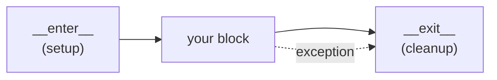

# Context Managers

Some things you open, you must close. A file. A network connection. A lock another
thread is waiting on. A database transaction someone needs committed or rolled
back. The pattern is always the same: setup, do your work, then - *no matter what
happens in the middle* - clean up.

That last part is where people get burned. The work in the middle can raise an
exception, and if it does, the cleanup line after it never runs. The file stays
open, the lock stays held, the connection leaks. You won't notice on a good day;
you'll notice at 2am when the server has run out of file handles and nobody can
log in.

Python has one tool that makes "always clean up" automatic: the `with` statement.
This phase covers what `with` actually guarantees, and how to build your own.

## The problem `with` solves

**The naive version.** You open something, use it, close it:

```python
f = open("data.txt")
data = f.read()
f.close()
```

This is fine - until `f.read()` raises (the disk hiccups, the file is malformed,
your parsing blows up). Then `f.close()` never runs, because the exception jumps
straight out of the function. The file handle leaks.

**The careful version.** The honest fix is `try`/`finally` - the `finally` block
runs whether or not an exception happened:

```python
f = open("data.txt")
try:
    data = f.read()
finally:
    f.close()
```

This is *correct*. It's also four lines of ceremony around one line of real work,
and you have to write it every time you touch a resource. Forget the `try`/`finally`
once and you're back to leaking handles - and noisy code is code people skip.

**What it actually is.** A **context manager** is an object that knows how to set
itself up and, crucially, how to tear itself down - and the `with` statement wires
that teardown to run automatically, exception or not. It's the `try`/`finally`
above, packaged so you write it once and reuse it forever.

> 💡 **Key point.** `with` is a guarantee: *the cleanup runs no matter how the
> block ends* - normal finish, `return`, or exception. That guarantee is the whole
> reason context managers exist.

## `with open(...)` - the one you already know

You met this back in [Phase 7](07-errors-and-io.md). Now you can see what it's
really doing:

```python
with open("data.txt") as f:
    data = f.read()
# f is closed here - automatically
```

*What just happened:* `with open(...) as f` opened the file and handed it to `f`.
When the block ends - for *any* reason, including an exception thrown by
`f.read()` - Python calls the file's cleanup, which closes the handle. That's the
`finally` you no longer have to write. `as f` is just the name you give whatever
the context manager hands back.

Every `with open(...)` you've written was a `try`/`finally` in disguise. The same
machinery works for anything else that needs guaranteed cleanup - you just have to
teach an object how to enter and exit.

## The protocol: `__enter__` and `__exit__`

**What it actually is.** Any object with two dunder methods can be used in a
`with` statement:

- `__enter__(self)` runs at the top of the block. Its return value is what `as`
  binds to.
- `__exit__(self, ...)` runs at the bottom of the block - *always* - and that's
  where cleanup lives.

📝 **The context manager protocol** - an object is a context manager if it has
`__enter__` and `__exit__`. (Recall from [Phase 6](06-objects-and-classes.md):
dunder methods are hooks Python calls for you. You don't call `__enter__`
yourself - `with` calls it.)

Here's a tiny one that prints on enter and exit, so you can watch the protocol fire:

```python runnable
class Tag:
    def __init__(self, name):
        self.name = name

    def __enter__(self):
        print(f"<{self.name}>")        # setup
        return self                    # what `as` receives

    def __exit__(self, exc_type, exc_value, traceback):
        print(f"</{self.name}>")       # teardown - always runs

with Tag("body"):
    print("  hello")
```
```console
$ python tags.py
<body>
  hello
</body>
```
*What just happened:* Entering the `with` block called `__enter__`, which printed
the opening tag. Your code printed `hello`. Then, at the end of the block, Python
called `__exit__`, which printed the closing tag. You wrote the opening and
closing exactly once, and Python guaranteed they bracket whatever happens between.

Those three parameters on `__exit__` - `exc_type`, `exc_value`, `traceback` - are
how Python tells your cleanup *whether the block ended normally or blew up*. More
on them in the gotcha section below.

Here's the shape of it as a picture:



*One idea:* the body runs after setup, and the exit always runs after the body -
whether the body finished cleanly or threw (the dotted path).

## The easier way: `@contextmanager`

A whole class with two dunder methods is a lot of structure for something that's
really just "do this, then yield control, then do that." Python's `contextlib`
module gives you a shortcut: write a generator, mark it with `@contextmanager`,
and let a single `yield` split setup from teardown.

📝 **Generator** - a function that uses `yield` to pause and hand a value back to
its caller, then resume where it left off. For a context manager, everything
*before* the `yield` is setup, the yielded value is what `as` gets, and everything
*after* the `yield` is teardown.

```python runnable
from contextlib import contextmanager

@contextmanager
def tag(name):
    print(f"<{name}>")        # everything before yield = setup
    yield name                # hand control to the block; `name` goes to `as`
    print(f"</{name}>")       # everything after yield = teardown

with tag("body") as t:
    print(f"  hello from {t}")
```
```console
$ python tag_cm.py
<body>
  hello from body
</body>
```
*What just happened:* The generator ran up to `yield`, printing the open tag and
pausing. The yielded value `name` became `t` via `as`. Your block ran. When it
ended, the generator *resumed* from the `yield` and printed the close tag. One
function, one `yield`, the same guarantee - much less ceremony than the class.

For the cleanup to truly always run, the teardown belongs in a `finally`, so an
exception can't skip it. Here's the robust form - a small `Timer` that reports how
long a block took, even if it crashes partway:

```python runnable
import time
from contextlib import contextmanager

@contextmanager
def timer(label):
    start = time.perf_counter()
    print(f"{label}: start")
    try:
        yield                              # the block runs here
    finally:
        elapsed = time.perf_counter() - start
        print(f"{label}: done")            # always prints the result line

with timer("work"):
    total = sum(range(1_000_000))
print(total)
```
```console
$ python timer.py
work: start
work: done
499999500000
```
*What just happened:* Setup recorded the start time, `yield` ran your block, and
`finally` ran the teardown - so even if `sum(...)` had raised, you'd still see the
`done` line. Wrapping the post-`yield` work in `try`/`finally` is the habit that
makes a `@contextmanager` bulletproof.

> 💡 **Key point.** Two ways to build a context manager, same protocol underneath:
> a **class** with `__enter__`/`__exit__` when you need to hold state or reuse the
> object, or a **`@contextmanager` generator** when it's a simple setup-yield-
> teardown. Reach for the generator first; it's less to get wrong.

## Where this shows up in real code

The `with` statement is everywhere once you start looking, because *so many* things
need guaranteed cleanup:

- **Files** - `with open(...) as f:` closes the handle. The original example, and
  the most common.
- **Locks** - a `threading.Lock` is a context manager. `with lock:` acquires it on
  entry and releases it on exit, so it can't stay stuck even if the protected code
  raises:

  ```python
  import threading
  lock = threading.Lock()

  with lock:           # acquire
      shared_counter += 1
  # released here, even if the line above had thrown
  ```

  Without `with`, you'd `lock.acquire()` and `lock.release()` by hand - a
  forgotten or skipped `release()` is a classic deadlock, where another thread
  waits forever for a lock that's never coming back.

- **Database transactions** - most DB connection libraries make the connection (or
  a cursor) a context manager that **commits** the transaction if the block
  succeeds and **rolls it back** if an exception escapes. So `with conn:` means
  "all of this, or none of it" - exactly the all-or-nothing behavior a transaction
  should give you. (The exact object you wrap varies by library, but the pattern
  is the point.)

The thread tying them together: setup that must be matched by teardown you can't
afford to skip. That's the precise shape `with` was built for.

## ⚠️ The gotcha: `__exit__` runs on exception - and can swallow it

The whole point of `with` is that cleanup runs **even when the block raises** -
that's a feature, it's *why* the file still closes when `f.read()` blows up. But
it has a sharp edge worth understanding.

When an exception propagates out of a `with` block, Python passes its details into
`__exit__` through those three parameters, and **`__exit__`'s return value decides
what happens to the exception**:

- Return a **falsy** value (or nothing - the default `None`) → the exception
  continues propagating after cleanup. *This is what you almost always want.*
- Return **`True`** → Python treats the exception as *handled* and **swallows it**.
  Execution continues after the `with` block as if nothing went wrong.

Watch the difference. Here `__exit__` returns `True`, which makes the error vanish:

```python runnable
class Swallow:
    def __enter__(self):
        return self

    def __exit__(self, exc_type, exc_value, traceback):
        if exc_type is not None:
            print(f"caught {exc_type.__name__}: {exc_value}")
        return True            # True = "I handled it" = suppress the exception

with Swallow():
    print("about to fail")
    raise ValueError("boom")

print("we got here - the exception was swallowed")
```
```console
$ python swallow.py
about to fail
caught ValueError: boom
we got here - the exception was swallowed
```
*What just happened:* The `raise` sent a `ValueError` out of the block. Python
called `__exit__` with `exc_type=ValueError` and the exception details, ran the
cleanup (the print), and saw `return True` - so it *suppressed* the error. The
line after the `with` ran normally. Returning `None` (or nothing) would have let
that `ValueError` keep propagating and crash the program - the right behavior the
vast majority of the time.

The rule of thumb: **let exceptions through.** Your `__exit__` should clean up and
return nothing, so problems still surface. Returning `True` to swallow an exception
is a rare, deliberate choice - `contextlib.suppress` exists for cases where you
*mean* it (e.g. "delete this file if it exists, shrug if it doesn't"). Silently
eating errors you didn't mean to is how bugs hide for weeks.

> 🪖 **War story.** A teammate wrote a context manager for a flaky API client and,
> copying a snippet, left a `return True` in `__exit__`. For months, every failed
> API call inside that `with` block vanished without a trace - no error, no log,
> just silently wrong data downstream. The fix was deleting two characters. When in
> doubt, return nothing from `__exit__`.

## Recap

1. Anything you **open you must close** - files, locks, connections, transactions.
   `with` guarantees the close happens, even on exception, so you don't write
   `try`/`finally` by hand every time.
2. **`with open(...) as f:`** is a `try`/`finally` in disguise: the file closes
   when the block ends, no matter how it ends.
3. The **protocol** is two dunder methods: `__enter__` (setup; its return value is
   what `as` binds) and `__exit__` (cleanup; always runs).
4. **`@contextmanager`** turns a generator into a context manager - everything
   before `yield` is setup, everything after is teardown. Put the teardown in a
   `finally` so it can't be skipped.
5. ⚠️ `__exit__` runs **even on exception** (that's the point), and its **return
   value controls suppression**: return falsy/`None` to let the exception through
   (almost always what you want); return `True` only when you deliberately mean to
   swallow it.

You can now reach for `with` anytime something needs reliable cleanup, and build
your own when the standard ones don't fit. Next, making your code say what it means
about *types* - annotations and letting `mypy` catch whole classes of bugs before
you ever run the program.

## Quick check

See if the protocol stuck. Pick the best answer for each, then check yourself.

```quiz
[
  {
    "q": "In a `with` block, what guarantees that cleanup runs even if the code inside the block raises an exception?",
    "choices": [
      "The exception is silently caught and discarded by `with`",
      "`__exit__` is always called when the block ends - normal finish, return, or exception",
      "Python re-runs the block until it finishes without error",
      "Cleanup only runs if you wrap the block in `try`/`finally` yourself"
    ],
    "answer": 1,
    "explain": "The `with` statement calls `__exit__` no matter how the block ends. That's the whole guarantee - it's the `try`/`finally` packaged into the protocol, so the file closes or the lock releases even when an exception fires."
  },
  {
    "q": "Using `@contextmanager`, where does the setup code go and where does the teardown go relative to `yield`?",
    "choices": [
      "Everything goes before `yield`; teardown is a separate function",
      "Setup goes after `yield`, teardown before it",
      "Setup goes before `yield`, teardown after it (ideally in a `finally`)",
      "`yield` must appear twice - once for setup, once for teardown"
    ],
    "answer": 2,
    "explain": "A single `yield` splits the generator: everything before it is setup, the yielded value is what `as` receives, and everything after is teardown. Put the teardown in a `finally` so an exception in the block can't skip it."
  },
  {
    "q": "Your `__exit__` returns `True` after an exception propagates into it. What happens?",
    "choices": [
      "The exception is suppressed and execution continues after the `with` block",
      "The exception keeps propagating, but cleanup is skipped",
      "Python raises a new error because `True` is invalid",
      "Nothing changes - the return value of `__exit__` is ignored"
    ],
    "answer": 0,
    "explain": "Returning `True` tells Python the exception was handled, so it swallows it and runs on. Returning falsy/`None` (the usual choice) lets the exception keep propagating after cleanup - silently eating errors is how bugs hide for weeks."
  }
]
```

---

[← Phase 12: Decorators](12-decorators.md) · [Guide overview](_guide.md) · [Phase 14: Type Hints & mypy →](14-type-hints.md)
