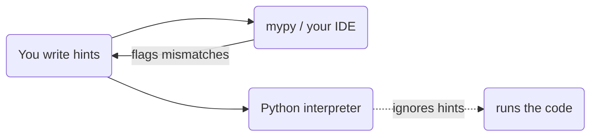

# Type Hints & mypy

Python lets you assign a string to a variable, then an integer, then a list, all on the same name, and
it won't blink. That flexibility is wonderful when you're sketching, and quietly terrifying when your
codebase is forty files deep and a function three layers down was *supposed* to receive a `User` but got
a `str` instead. The bug doesn't announce itself where you made the mistake - it surfaces later, in some
unrelated place, as a confusing crash.

**Type hints** are how you buy back some of that safety without giving up Python's looseness. You annotate
what a function expects and returns, and a separate tool reads those annotations and tells you - *before
you run anything* - where the types don't line up. This is called **gradual typing**: you add hints where
they pay off and leave them off where they don't. No all-or-nothing rewrite.

## The one idea: hints are for humans and tools, not the interpreter

**What they actually are.** A type hint is a note attached to a variable, parameter, or return value
saying "this is meant to be a `str`" (or `int`, or `list[str]`, …). That note is *documentation that tools
can read*. The Python interpreter itself **does not check it and does not act on it**. Your annotated code
runs exactly the same as the unannotated version would.

📝 **Gradual typing** - the approach where some of your code is annotated and some isn't, and that's fine.
You opt in incrementally, file by file, function by function.

> 💡 **Key point.** Hold onto this one line for the whole phase: *hints change nothing at runtime.* They
> exist for three audiences - the next human who reads your code, your editor (autocomplete and inline
> warnings), and a **type checker** like mypy that reads them and flags mismatches. The interpreter
> ignores them.

Here's the flow, because it's the part people get backwards:



*One idea:* the checker and the interpreter are two separate readers of the same file. mypy is where the
hints have teeth; Python at runtime just runs.

## Basic annotations

**What they look like.** You annotate a parameter with `name: type`, and a function's return value with
`-> type` after the parentheses. You can annotate plain variables too, with `name: type = value`.

```python runnable
def greet(name: str) -> str:        # takes a str, returns a str
    return f"Hello, {name}!"

count: int = 3                       # a variable annotation
message: str = greet("Ada")

print(message)
print(count)
```
*What just happened:* `greet` is annotated to take a `str` and return a `str`, and `count` is annotated as
an `int`. The code printed exactly what it would have without any annotations - `Hello, Ada!` and `3`. The
hints added meaning for tools and readers, and **zero** change to behavior. That `-> str` is the single
most common piece of typing syntax you'll write: it's the return type.

📝 **Annotation** - the `: type` or `-> type` note itself. Python stores annotations on the function (in
`__annotations__`) but never consults them while running.

## Container generics - saying *what's inside*

A bare `list` tells a reader it's a list, but not a list *of what*. **Generics** let you say the element
type: `list[int]` is "a list of integers," `dict[str, int]` is "a dict whose keys are strings and values
are ints."

```python runnable
def total(scores: list[int]) -> int:    # a list of ints in, one int out
    return sum(scores)

ages: dict[str, int] = {"Ana": 30, "Bo": 25}    # str keys, int values

print(total([90, 85, 95]))
print(ages["Ana"])
```
*What just happened:* `list[int]` and `dict[str, int]` spelled out what the containers hold. `total` now
documents that it wants a list of integers specifically - and mypy will complain if you hand it
`["90", "85"]` (strings). The square-bracket syntax - `list[...]`, `dict[..., ...]`, `tuple[...]`,
`set[...]` - is how you parameterize any container.

⚠️ **Gotcha - lowercase built-ins need Python 3.9+.** Writing `list[int]` and `dict[str, int]` directly
works on Python 3.9 and newer. On older versions you had to write `List[int]` / `Dict[str, int]` imported
from the `typing` module. If you're on a modern Python (3.9+), prefer the lowercase built-in forms shown
here.

## When a value might be missing - `Optional` / `X | None`

Real code is full of "this is a `str`, *or* it might be `None`." A lookup that can fail, a default that
isn't set yet. You spell that as `X | None` (Python 3.10+) - read it as "an `X`, or `None`."

```python runnable
def find_user(user_id: int) -> str | None:    # returns a name, or None if not found
    users = {1: "Ana", 2: "Bo"}
    return users.get(user_id)                  # .get returns None when the key is absent

result = find_user(1)
if result is not None:                         # narrow it: now it's definitely a str
    print(result.upper())
else:
    print("not found")
```
*What just happened:* `str | None` says the return is *either* a string *or* `None`. Because of that, mypy
won't let you blindly call `result.upper()` - `None` has no `.upper()`. The `if result is not None:` check
**narrows** the type: inside that branch, mypy knows `result` is a real `str`, so `.upper()` is safe. This
is the everyday payoff of typing - it forces you to handle the "what if it's missing?" case you'd
otherwise forget.

📝 **`Optional[X]`** - the older spelling of the same thing: `Optional[str]` means exactly `str | None`.
You'll see it in existing code and from `from typing import Optional`. On 3.10+, the `str | None` form
reads more plainly. **`Union[X, Y]`** is the general "one of several types" - `Union[int, str]` is now
written `int | str`.

So the modern shorthand, all on the `|` operator:

- `str | None` - a string, or nothing (the old `Optional[str]`).
- `int | str` - an int *or* a string (the old `Union[int, str]`).

## A glimpse of `Protocol` - duck typing, but checked

You met **duck typing** earlier: Python doesn't care what *class* an object is, only whether it has the
method you call. ("If it quacks, it's a duck.") That's powerful, but a plain type hint can't express "I
accept anything with a `.read()` method" - it only knows concrete class names.

`typing.Protocol` closes that gap. You define a Protocol listing the methods/attributes you need, and any
object that *structurally* has them counts as a match - no inheritance required.

```python runnable
from typing import Protocol

class Readable(Protocol):
    def read(self) -> str: ...      # "anything with a .read() returning str"

def show(source: Readable) -> None:
    print(source.read())

class File:                          # never mentions Readable, but has read()
    def read(self) -> str:
        return "file contents"

show(File())                         # accepted: File structurally matches Readable
```
*What just happened:* `Readable` is a Protocol describing a *shape* - "has a `read()` that returns `str`."
`File` never inherits from `Readable` and never even imports it, yet it satisfies the protocol because it
has the right method. mypy checks that match for you. This is "duck typing, checked": the flexibility of
*if it quacks* with a tool verifying the quack before you ship.

(`...` here is a real Python value - the ellipsis literal - used as a stand-in body meaning "no
implementation, just the signature." It runs fine.)

## Running mypy - where the hints earn their keep

All of the above is just annotation until you point a checker at it. **mypy** is the most common one. You
install it, run it on your file, and it reports type mismatches - without executing your code.

Say you have this file, `account.py`:

```python
def withdraw(balance: int, amount: int) -> int:
    return balance - amount

withdraw(100, "20")     # oops - passing a str where an int is expected
```

This file *runs* - and then crashes at runtime with a `TypeError` on the subtraction, because you can't
subtract a string from an int. But mypy catches it *before* you run anything:

```console
$ mypy account.py
account.py:4: error: Argument 2 to "withdraw" has incompatible type "str"; expected "int"  [arg-type]
Found 1 error in 1 file (checked 1 source file)
```
*What just happened:* mypy read your annotations, saw that `withdraw` wants an `int` for `amount`, noticed
you passed `"20"` (a `str`), and pointed at the exact line and argument - `account.py:4`, argument 2. You
fixed a bug by *reading*, not by running and waiting for a crash in production. That's the whole pitch of
gradual typing in one transcript.

⚠️ **Gotcha - hints are NOT enforced at runtime.** This is the misunderstanding that surprises everyone.
The annotation `amount: int` does **not** make Python reject a string at runtime. If you never run mypy,
`withdraw(100, "20")` happily executes until the subtraction blows up later - possibly far from where the
wrong value entered. Hints are *checked* only by a tool you choose to run (mypy, or your IDE doing the same
in the background). Python itself trusts you completely. So a type hint without a checker is a polite
comment, nothing more.

```python runnable
def withdraw(balance: int, amount: int) -> int:
    return balance - amount

# Python does NOT stop this - the hint is ignored at runtime:
print(withdraw(100, 20))            # 80 - fine
print(type(withdraw))               # the function still exists, hints and all
```
*What just happened:* the correctly-typed call returned `80`. Python read the annotations, stored them, and
otherwise ignored them. Nothing about `int` was enforced as the program ran - proving the point: the
interpreter doesn't police types, the checker does.

## When typing earns its keep (and when it doesn't)

Type hints aren't free - they're more to write and to read. They pay off most when:

- **The codebase is large or long-lived.** The more files and the more people, the more a function's
  contract needs to be machine-checkable instead of remembered.
- **You're writing a library** others import. Hints become documentation *and* give your users'
  editors autocomplete and warnings for free.
- **You want editor superpowers.** With hints, your IDE knows that `user.` should offer `.name` and
  `.email`, and warns you the instant you misspell or misuse something - no running required.

They earn their keep less in a 20-line throwaway script or an exploratory notebook, where the ceremony
costs more than it saves. That's the point of *gradual* typing: add them where the safety is worth it,
skip them where it isn't. A common pattern is to start untyped, then add hints to the parts that have
gotten big or scary.

## Recap

1. **Hints change nothing at runtime.** They're for humans, editors, and a type checker - the
   interpreter ignores them.
2. **Basic syntax:** `def greet(name: str) -> str:` for parameters and returns; `count: int = 3` for
   variables.
3. **Generics** say what's inside a container: `list[int]`, `dict[str, int]` (3.9+ lowercase forms).
4. **Maybe-missing values:** `str | None` (old: `Optional[str]`); **either/or:** `int | str` (old:
   `Union[int, str]`), both on the `|` operator in 3.10+.
5. **`Protocol`** is duck typing, checked - match by *shape* (the methods present), not by inheritance.
6. **mypy** reads your hints and flags mismatches *before* you run, pointing at the exact line. But hints
   are **not** enforced at runtime - without a checker, a wrong type still runs and may blow up later.
7. Typing earns its keep in **bigger codebases, libraries, and for editor autocomplete**; skip it for
   throwaway scripts.

You can now annotate code and let a tool catch a whole class of bugs early. Next we put hints to work for
*modeling*: dataclasses turn "a bag of typed fields" into a clean, declarative class with almost no
boilerplate.

## Quick check

Test the one sticky idea - hints don't run, they're *checked*. Pick the best answer for each.

```quiz
[
  {
    "q": "You write `def f(x: int) -> int: return x` and then call `f(\"hello\")`. You never run mypy. What does Python do at runtime?",
    "choices": [
      "Raises a TypeError immediately because \"hello\" isn't an int",
      "Runs the call normally - the hint is ignored at runtime",
      "Refuses to define the function until the type is fixed",
      "Silently converts \"hello\" to an int"
    ],
    "answer": 1,
    "explain": "Type hints change nothing at runtime. Python stores annotations but never enforces them. The call runs; only a checker like mypy would have flagged the mismatch beforehand."
  },
  {
    "q": "Which tool actually catches the mismatch between a hint and the value you passed?",
    "choices": [
      "The Python interpreter, when it runs the line",
      "A type checker like mypy (or your IDE doing the same check)",
      "The `__annotations__` dictionary, automatically",
      "Nothing - hints are purely decorative comments"
    ],
    "answer": 1,
    "explain": "mypy reads your annotations and reports mismatches before you run anything. The interpreter just runs; it doesn't police types. Hints aren't merely decorative - they have teeth, but only when a checker reads them."
  },
  {
    "q": "What does the annotation `str | None` mean?",
    "choices": [
      "A string that will be converted to None",
      "Either a string or None - i.e. the value is optional",
      "A string that must never be None",
      "Two separate variables, a str and a None"
    ],
    "answer": 1,
    "explain": "`str | None` (the modern spelling of `Optional[str]`) means the value is either a `str` or `None`. It's how you say \"this might be missing,\" forcing you to handle the None case."
  }
]
```

---

[← Phase 13: Context Managers](13-context-managers.md) · [Guide overview](_guide.md) · [Phase 15: Dataclasses & Modern Modeling →](15-dataclasses.md)
