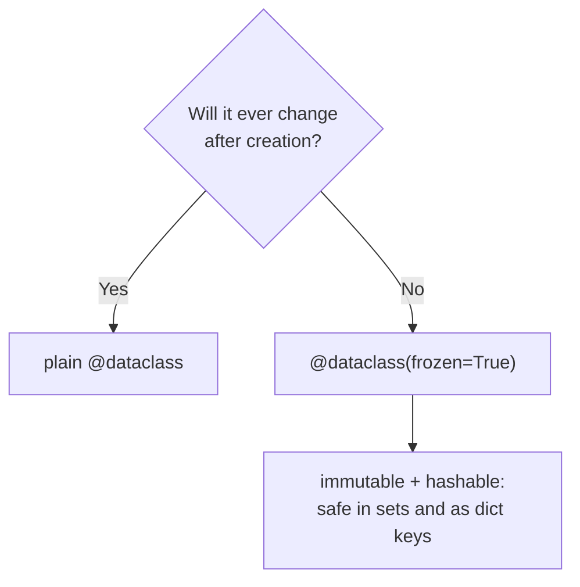

# Dataclasses & Modern Modeling

A huge fraction of the classes you'll ever write are just *bags of fields*. A `Point` with an `x` and
a `y`. A `User` with a name, an email, and an age. There's no clever behavior - the class exists only to
hold a few values together and let you compare and print them.

Back in [Phase 6](06-objects-and-classes.md) you wrote these by hand, and in
[Phase 10](10-the-data-model.md) you learned that the comparing and printing live in dunder methods like
`__repr__` and `__eq__`. Put those two facts together and a problem appears: for every bag-of-fields
class, you end up writing the *same* `__init__`, the *same* `__repr__`, the *same* `__eq__` - by hand,
every time. It's tedious, it's easy to get subtly wrong, and it's pure ceremony.

Modern Python kills that ceremony. This phase is about the tools that write the boilerplate for you so
you can describe *what your data is* and stop typing the parts a machine could.

## The boilerplate problem - see it first

Here's an honest, hand-written bag-of-fields class. Nothing here is clever; every line is obligatory.

```python
class Point:
    def __init__(self, x, y):
        self.x = x
        self.y = y

    def __repr__(self):
        return f"Point(x={self.x!r}, y={self.y!r})"

    def __eq__(self, other):
        if not isinstance(other, Point):
            return NotImplemented
        return (self.x, self.y) == (other.x, other.y)
```

Three methods, and not one of them says anything about what a `Point` *means*. The only real
information in the whole class is "a point has an `x` and a `y`." Everything else is the machinery you're
forced to hand-crank: store the args, make it print nicely, make two points with equal coordinates
compare equal.

⚠️ And it's not just tedious - it's a place bugs hide. Add a `z` coordinate later and you must remember
to touch `__init__`, `__repr__`, *and* `__eq__`. Miss one and you get a class that constructs fine but
prints the old shape or compares wrong, quietly.

## `@dataclass` - describe the fields, get the methods for free

**What it actually is.** `@dataclass` is a **decorator** from the standard library that reads the typed
fields you declare at the top of a class and *generates* `__init__`, `__repr__`, and `__eq__` for you
from them. You write the data; it writes the ceremony.

📝 **Decorator** - a thing you put above a class or function with `@name` that transforms it. You met the
idea in passing; here, `@dataclass` takes your field declarations and adds the dunder methods to the
class before you ever use it.

It leans directly on the [type hints](14-type-hints.md) from the last phase: the `x: int` annotations
aren't decoration here, they're how the dataclass knows what the fields *are*. Watch the same `Point`
collapse:

```python runnable
from dataclasses import dataclass

@dataclass
class Point:
    x: int
    y: int

p = Point(3, 4)
print(p)            # the generated __repr__
print(p == Point(3, 4))   # the generated __eq__
```
```console
$ python points.py
Point(x=3, y=4)
True
```
*What just happened:* The two lines `x: int` and `y: int` are the entire class now. `@dataclass` saw
them and wrote an `__init__(self, x, y)` that stores both, a `__repr__` that prints
`Point(x=3, y=4)`, and an `__eq__` that compares by field values - which is why two separately-built
points with the same coordinates came back `True`. That last point matters: by default a plain class
compares by *identity* (are these the literal same object?), so `Point(3, 4) == Point(3, 4)` would be
`False` without the generated `__eq__`. The dataclass gives you the equality you actually wanted.

> 💡 **Key point.** A dataclass isn't a new kind of object - it's a *normal class* with the boring dunders
> filled in for you. You can still add methods, properties, and anything else a regular class has. You've
> just been handed back the time you'd have spent typing `self.x = x`.

## Defaults - and the mutable-default trap, again

Fields can have defaults, so callers can omit them. You write them like default arguments:

```python runnable
from dataclasses import dataclass

@dataclass
class User:
    name: str
    active: bool = True      # default: callers can leave it off

print(User("Ana"))
print(User("Bo", active=False))
```
```console
$ python users.py
User(name='Ana', active=True)
User(name='Bo', active=False)
```
*What just happened:* `active: bool = True` gave the field a fallback, so `User("Ana")` filled it in
automatically while `User("Bo", active=False)` overrode it. This reads exactly like default arguments in
a normal `__init__`, because that's what the dataclass generates.

But the moment a default is a **mutable** value - a list, a dict, a set - you're standing on the same
landmine from [Phase 4](04-control-flow-and-functions.md): mutable defaults are created *once* and shared.
Python knows this is a trap and refuses to let you do it the naive way:

```console
$ python tags.py
ValueError: mutable default <class 'list'> for field tags is not allowed: use default_factory
```
*What just happened:* You wrote `tags: list = []` and the dataclass machinery stopped you cold. A single
`[]` written at class-definition time would be shared by *every* `User` instance - append a tag to one
user and it'd appear on all of them. Rather than hand you that footgun, dataclasses raise a `ValueError`
and point you at the fix.

**The fix - `field(default_factory=...)`.** Instead of giving a default *value*, you give a default
*recipe*: a zero-argument callable that the dataclass calls fresh for each new instance.

```python runnable
from dataclasses import dataclass, field

@dataclass
class User:
    name: str
    tags: list = field(default_factory=list)   # a fresh [] per instance

a = User("Ana")
b = User("Bo")
a.tags.append("admin")     # only touches a's list
print(a)
print(b)
```
```console
$ python tags.py
User(name='Ana', tags=['admin'])
User(name='Bo', tags=[])
```
*What just happened:* `default_factory=list` told the dataclass "when a `User` is built without `tags`,
call `list()` to make a brand-new empty list for it." So `a` and `b` got *separate* lists - appending to
`a.tags` left `b.tags` empty. This is the same trap and the same cure you learned for function arguments,
just spelled with `field()`. Any zero-arg callable works: `default_factory=dict`, `default_factory=set`,
or your own `lambda: [0, 0, 0]`.

⚠️ **The rule to remember:** immutable default (number, string, `True`, `None`) → write it plainly
(`active: bool = True`). Mutable default (list, dict, set) → always `field(default_factory=...)`. The
dataclass enforces this for you, which is one of the nicer things it does.

## `frozen=True` - make instances immutable and hashable

By default a dataclass is mutable: you can reassign `p.x = 99` after the fact. Sometimes that's exactly
wrong. A `Point`, a `Color`, a `Coordinate` - these are *values*, and a value that can be quietly mutated
under you is a source of bugs. You want it to behave like a number: fixed once created.

**What it does.** Passing `frozen=True` to the decorator makes assignment to fields raise an error after
construction, and - because the object can no longer change - Python can also generate a `__hash__`,
which means frozen instances can go into sets and be used as dict keys.

```python runnable
from dataclasses import dataclass

@dataclass(frozen=True)
class Point:
    x: int
    y: int

p = Point(1, 2)
print(p)
seen = {p, Point(1, 2), Point(3, 4)}   # usable in a set now
print(len(seen))
p.x = 99                                # this is no longer allowed
```
```console
$ python frozen.py
Point(x=1, y=2)
2
dataclasses.FrozenInstanceError: cannot assign to field 'x'
```
*What just happened:* `frozen=True` locked the instance. Two of the three points in the set were equal
(`Point(1, 2)` twice), so the set collapsed them and `len` is `2` - that only works because frozen
dataclasses are **hashable**. Then `p.x = 99` raised `FrozenInstanceError`: the object refuses to be
mutated after birth. You've turned a bag of fields into a proper immutable value.

📝 **Hashable** - an object Python can reduce to a fixed number so it can live in a `set` or be a `dict`
key. Mutable objects (like lists, or default dataclasses) generally aren't, because if they changed, the
number would lie. Freezing makes the object unchanging, so hashing becomes safe.

Here's the small decision in one picture:



## `typing.NamedTuple` - the lightweight immutable alternative

There's an even lighter option for the immutable case, and it predates the modern dataclass: a typed
named tuple. It's a tuple under the hood - so it's immutable and hashable for free - but with *named*
fields instead of `[0]`/`[1]` positions.

**What it actually is.** `typing.NamedTuple` lets you declare a tuple subclass with typed, named fields.
You get the `__repr__` and `__eq__` for free like a dataclass, plus everything tuples already do:
indexing, unpacking, immutability.

```python runnable
from typing import NamedTuple

class Point(NamedTuple):
    x: int
    y: int

p = Point(3, 4)
print(p)
print(p.x, p[0])        # access by name OR by position
a, b = p                # it unpacks like the tuple it is
print(a, b)
```
```console
$ python named.py
Point(x=3, y=4)
3 3
3 4
```
*What just happened:* `Point(3, 4)` built a tuple whose two slots also answer to `.x` and `.y`. So
`p.x` and `p[0]` are the same value, and `a, b = p` unpacks it exactly like `(3, 4)` - because it *is*
a tuple. It's immutable and hashable automatically, with none of the `frozen=True` ceremony.

**When to reach for which.** Both model immutable bags of fields. The honest trade-off:

| | `typing.NamedTuple` | `@dataclass(frozen=True)` |
|---|---|---|
| Immutable & hashable | yes, automatically | yes, with `frozen=True` |
| Acts like a tuple (index, unpack) | yes - sometimes handy, sometimes a footgun | no, it's its own type |
| Mutable option | no | yes, drop `frozen=True` |
| Defaults, `field()`, rich config | limited | full |

Reach for `NamedTuple` when you want a small, immutable record that's pleasant to unpack and pass around.
Reach for `@dataclass` when you want more control - mutability when you need it, `default_factory`, and
room to grow methods onto the class. (Judgment, not law: most teams default to `@dataclass` and use
`NamedTuple` for the genuinely tuple-shaped cases.)

## A one-paragraph nod to pydantic

Everything above *trusts its inputs*. A dataclass `User(age="not a number")` happily stores the string -
the `: int` hint is a note for humans and type-checkers ([Phase 14](14-type-hints.md)), not a runtime
guard. That's fine inside your own code, but at a *boundary* - JSON arriving from an API, a config file,
a form submission - you want the data **validated and coerced** before it gets in. That's
[**pydantic**](https://docs.pydantic.dev/), a third-party library (so `pip install pydantic`; it's not in
the standard library, which is why the snippet below isn't runnable here). It looks almost identical to a
dataclass, but it *enforces* the types at construction time and raises a clear error when the data is
wrong:

```python
from pydantic import BaseModel

class User(BaseModel):
    name: str
    age: int

User(name="Ana", age="30")    # the string "30" is coerced to int 30
User(name="Bo", age="oops")   # raises ValidationError - not a valid integer
```

Rule of thumb: **dataclasses for data you already trust** (objects you build inside your own program);
**pydantic at the edges** where untrusted data crosses into your system. You'll meet it for real when you
build APIs.

## Recap

1. Bag-of-fields classes force you to hand-write `__init__`, `__repr__`, and `__eq__` - pure boilerplate,
   and a place bugs hide when the class grows.
2. **`@dataclass`** generates those three from your typed fields. It's a normal class with the dunders
   filled in; you can still add methods.
3. **Defaults** are written like default arguments (`active: bool = True`) - but a **mutable** default is
   forbidden; use **`field(default_factory=list)`** so each instance gets its own fresh list/dict/set.
   Same trap, same cure as [Phase 4](04-control-flow-and-functions.md).
4. **`frozen=True`** makes instances immutable *and* hashable - safe as values, in sets, and as dict keys.
5. **`typing.NamedTuple`** is the lightweight immutable alternative: tuple-backed, named fields, free
   immutability and hashing.
6. **pydantic** (third-party) validates and coerces at the boundary - reach for it where untrusted data
   enters, and keep dataclasses for data you already trust.

You can now describe your data cleanly and let the language write the ceremony. Next we leave the world
of single-threaded code and ask the question that confuses everyone: why don't Python threads make CPU
work faster?

## Quick check

Before you move on, three questions to make sure the dataclass essentials stuck - what the decorator generates, the mutable-default fix, and what `frozen=True` buys you.

```quiz
[
  {
    "q": "You write a class with two typed fields and put @dataclass above it. Which methods does the decorator generate for you by default?",
    "choices": [
      "__init__, __repr__, and __eq__",
      "Only __init__",
      "__hash__ and __slots__",
      "None - @dataclass just documents the fields for type-checkers"
    ],
    "answer": 0,
    "explain": "@dataclass reads your typed fields and generates __init__ (stores the args), __repr__ (prints Point(x=3, y=4)), and __eq__ (compares by field values) from them. __hash__ is only added when you also pass frozen=True."
  },
  {
    "q": "You write `tags: list = []` in a dataclass and Python raises a ValueError. What's the correct fix?",
    "choices": [
      "tags: list = field(default_factory=list)",
      "tags: list = field(default=[])",
      "tags: list = None, then build the list in __post_init__",
      "Add frozen=True so the shared list can't be mutated"
    ],
    "answer": 0,
    "explain": "A single [] written at class-definition time would be shared by every instance. field(default_factory=list) gives a recipe Python calls fresh for each new instance, so each one gets its own empty list - the same trap and cure as mutable default arguments."
  },
  {
    "q": "What does passing frozen=True to @dataclass give you?",
    "choices": [
      "Instances become immutable and hashable - assignment after construction raises, and they can go in sets and be dict keys",
      "It makes every field optional with a default of None",
      "It speeds up attribute access by freezing the class layout",
      "It validates and coerces field types at construction time"
    ],
    "answer": 0,
    "explain": "frozen=True makes assignment to fields raise FrozenInstanceError after construction. Because the object can no longer change, Python can also generate __hash__, so frozen instances are hashable - usable in sets and as dict keys. (Type validation/coercion is pydantic's job, not frozen's.)"
  }
]
```

---

[← Phase 14: Type Hints & mypy](14-type-hints.md) · [Guide overview](_guide.md) · [Phase 16: Concurrency & the GIL →](16-concurrency-and-the-gil.md)
