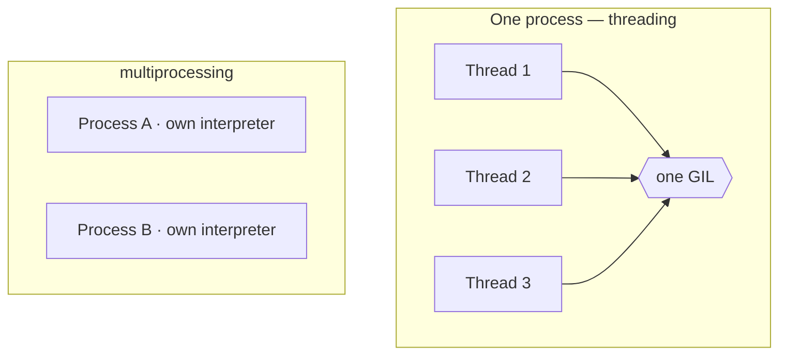

# Concurrency & the GIL

This is the corner of Python that gets the most confident-sounding wrong answers. You'll hear "Python
can't do threads," "the GIL makes Python slow," "use async for everything." Each of those is a true thing
mangled into a false one. The reality is cleaner than the folklore, and once you have the right mental
model you'll know exactly which tool to reach for — and, just as usefully, why the one you tried first
didn't help.

There are three tools, and the whole phase is about telling them apart and pointing each at the job it's
actually good at.

## The one distinction everything rests on: I/O-bound vs CPU-bound

Before any tool, install this idea, because the right choice falls straight out of it.

**What it actually is.** Every slow piece of work is slow for one of two reasons:

- **I/O-bound** — your program is *waiting*. Waiting on a web response, a database query, a file to come
  off disk, a network socket. The CPU is mostly idle; the clock is just ticking while something else
  takes its time.
- **CPU-bound** — your program is *computing*. Crunching numbers, resizing images, parsing a huge blob,
  hashing. The CPU is pinned at 100% doing actual work; there's no waiting to overlap.

📝 **I/O-bound / CPU-bound** — "bound" means "the thing limiting your speed." If faster I/O would help,
you're I/O-bound. If a faster CPU would help, you're CPU-bound.

> 💡 **Key point.** Almost every concurrency decision in Python is just answering one question: *is this
> work waiting, or computing?* Hold that question. The GIL, the three tools, the gotcha — all of it
> reduces to which side of this line your work sits on.

## The three tools, and the problem each one solves

Python hands you three different mechanisms, and they are *not* interchangeable. They solve different
problems.

📝 **Concurrency** — making progress on several things in overlapping time spans (juggling). **Parallelism**
— literally running several things at the same instant on different CPU cores (many hands). They're not
the same word, and the difference is the heart of this phase.

- **`threading`** — multiple threads inside *one* process, taking turns. Great for overlapping lots of
  *waiting*. This is concurrency, not (in CPython) true parallelism — and the GIL below is why.
- **`asyncio`** — a single thread that juggles thousands of waiting tasks using `async`/`await`, switching
  whenever one would block. Also for I/O, also concurrency, but cooperative and very lightweight. Covered
  in depth in [Async/Await & the Event Loop](/guides/async-await-and-the-event-loop).
- **`multiprocessing`** — multiple *separate* Python processes, each with its own interpreter and its own
  memory. This is real parallelism: four processes can pin four cores at once. The tool for CPU-bound work.

That's the menu. The reason you can't just pick the first one for everything is the GIL.

## The GIL, explained honestly

This is the part that's usually either hand-waved or turned into a boogeyman. Here's the straight version.

📝 **GIL — Global Interpreter Lock.** A single lock inside CPython (the standard Python you almost
certainly run). The rule it enforces: **only one thread can execute Python bytecode at a time.** A thread
must hold the GIL to run your Python code, and there's exactly one GIL per process.

**Why it exists.** It's not malice or laziness — it's a trade-off. The GIL makes CPython's memory
management simple and fast for the common single-threaded case, and it lets C extensions be written
without worrying about thread-safety at every turn. The cost of that simplicity is the thing everyone
trips over next.

**What it does in real life — the honest two-part truth:**

1. **For CPU-bound work, threads do NOT speed you up.** Spin up four threads to crunch numbers and they'll
   take turns holding the one GIL — only one runs Python at any instant. Four threads finish in *about the
   same wall-clock time* as one, sometimes slightly worse because now there's switching overhead. No free
   cores were used. This is the single most surprising fact about Python threading, and it's true.

2. **For I/O-bound work, threads DO help — a lot.** Here's the saving grace: **a thread releases the GIL
   while it waits on I/O.** When a thread blocks on a network read or a disk fetch, it hands the GIL to
   another thread, which runs while the first one waits. The waiting overlaps. So ten threads downloading
   ten URLs really do progress together — not because they compute in parallel, but because mostly they're
   all *waiting* in parallel, which the GIL happily allows.

The same release happens inside well-written C extensions: NumPy, for instance, drops the GIL during heavy
array math, so threaded NumPy code *can* use multiple cores. But for *your* plain-Python loop, assume the
GIL is held the whole time.

Here's the shape of it: threads share one interpreter and one GIL; processes each get their own.



*One idea:* on the left, three threads fight over a single GIL — only one runs Python at a time. On the
right, each process carries its *own* interpreter and *own* GIL, so they genuinely run at the same instant
on different cores. That picture is the whole decision.

## The decision rule

You almost never have to agonize over this. It collapses to one line:

> **I/O-bound → `threading` or `asyncio`. CPU-bound → `multiprocessing`.**

- **Waiting on the world** (HTTP calls, DB queries, files, sockets)? Use **threads** (simplest) or
  **asyncio** (when you have *thousands* of concurrent waits and want them lightweight). The GIL is
  released during the waits, so concurrency is real.
- **Burning CPU** (math, parsing, image work, compression)? Use **`multiprocessing`**. Separate processes
  sidestep the GIL entirely — each has its own — so you get true parallelism across cores. The cost is
  that processes don't share memory, so data crossing between them gets *pickled* (serialized) and copied,
  which is why you don't reach for it when there's no CPU work to justify the overhead.

📝 **Pickling** — Python's built-in serialization. To send an object to another process, it's converted to
bytes and rebuilt on the other side. Cheap for small data, not free for large data.

## What each one looks like

You won't run these here — threads, processes, and event loops don't behave deterministically in a
browser sandbox, so treat these as illustrative. They're faithful to what you'll see at a real terminal.

### asyncio — one thread juggling waits

```python
import asyncio

async def fetch(name, seconds):
    print(f"{name} starting")
    await asyncio.sleep(seconds)        # stand-in for a network wait; yields control here
    print(f"{name} done")
    return name

async def main():
    # run three "fetches" concurrently, not one-after-another
    results = await asyncio.gather(
        fetch("A", 2),
        fetch("B", 1),
        fetch("C", 3),
    )
    print("all done:", results)

asyncio.run(main())
```
```console
$ python fetch.py
A starting
B starting
C starting
B done
A done
C done
all done: ['A', 'B', 'C']
```
*What just happened:* all three started immediately. At each `await asyncio.sleep(...)`, the task said "I'm
about to wait — someone else go ahead," and the single event loop switched to another task. So `B` (1s)
finished before `A` (2s) before `C` (3s), and the whole thing took about 3 seconds, not 2+1+3 = 6. One
thread, no GIL fight, thousands of these possible. This is the I/O-bound tool when you have *many* waits.
The full machinery — the event loop, what `await` really does — is in
[Async/Await & the Event Loop](/guides/async-await-and-the-event-loop).

### multiprocessing — real parallelism for CPU work

```python
from multiprocessing import Pool

def heavy(n):                           # pure CPU: no waiting, just computing
    return sum(i * i for i in range(n))

if __name__ == "__main__":              # required on Windows/macOS — see gotcha below
    with Pool(4) as pool:               # four worker processes, four cores
        results = pool.map(heavy, [10_000_000] * 4)
    print(results)
```
```console
$ python crunch.py
[333333283333335000000, 333333283333335000000, 333333283333335000000, 333333283333335000000]
```
*What just happened:* `Pool(4)` started four separate Python processes, each with its own interpreter and
its own GIL. `pool.map` handed one `heavy` call to each, and they ran *genuinely simultaneously* on four
cores. The four results came back and got copied (unpickled) into your main process. This is the speedup
threads couldn't give you — because the GIL is per-process, and now there are four of them.

⚠️ **Gotcha — `if __name__ == "__main__":` is mandatory here.** On Windows and macOS, child processes
*re-import your script* to start up. Without that guard, each child re-runs the `Pool(...)` line, which
spawns more children, which re-import and spawn again — an explosion. The guard makes the spawning code run
only in the original process. It's not optional decoration; leave it off and `multiprocessing` misbehaves.

## ⚠️ The gotcha that sends everyone here in the first place

This is the one that drags people to this phase, usually confused and a little annoyed:

> You have a slow number-crunching loop. You think "I'll just throw it on a few threads." You do. You
> measure. It's **exactly as slow as before** — maybe slower. Nothing went parallel.

That's not a bug in your code. **That's the GIL.** Your work was CPU-bound, so the four threads spent the
whole time taking turns holding the one lock — only ever one of them running Python at a time. Threads were
never going to help, because nothing was *waiting*; it was all *computing*.

The fix is the decision rule: CPU-bound work wants **`multiprocessing`**, not threads. Swap the thread pool
for a process pool and the same loop spreads across your cores and actually gets faster.

🪖 **War story.** Nearly every Python developer writes this exact bug once: a slow image-processing or
data-crunching script, "speed it up with threads," no change, a half-hour of staring at the profiler before
the GIL clicks into place. Knowing it ahead of time is the whole reason this phase exists — now it'll cost
you a *thought*, not an afternoon.

## One honest note on the future

The GIL has been CPython's defining constraint for decades, and that's finally starting to shift:
**free-threaded ("no-GIL") CPython is emerging** as an official, still-experimental build where the GIL can
be disabled, aiming to let threads run Python in genuine parallel. It's early, not the default, and many C
extensions aren't ready for it — so for everything you write today, plan around the GIL exactly as
described above. Just know the ground may move under this in the next few years.

## Recap

1. Every slow task is either **I/O-bound** (waiting) or **CPU-bound** (computing). That single question
   drives every decision here.
2. Three tools, three jobs: **`threading`** (overlap waiting), **`asyncio`** (overlap *lots* of waiting,
   lightweight), **`multiprocessing`** (real parallelism for computing).
3. The **GIL** lets only one thread execute Python bytecode at a time per process. So threads **don't**
   speed up CPU-bound work — but the GIL is **released during I/O** (and by C extensions like NumPy), so
   threads **do** speed up I/O-bound work.
4. The rule: **I/O-bound → threads or asyncio; CPU-bound → multiprocessing** (separate processes = separate
   GILs = true parallelism, at the cost of copying data between them).
5. The classic trap — threading a number-crunching loop and seeing no speedup — *is* the GIL telling you
   that you wanted `multiprocessing`.
6. **Free-threaded / no-GIL CPython is emerging**, but it's experimental; design around the GIL for now.

Concurrency is one half of "making Python fast." The other half is the work each core actually does — how
Python uses memory, where the time really goes, and how to measure it instead of guessing. That's next.

## Quick check

The GIL is the one idea that has to stick. Test yourself before moving on.

```quiz
[
  {
    "q": "You have a CPU-bound loop (pure number crunching, no waiting). You split it across four threads and measure: it's no faster than one thread. Why?",
    "choices": [
      "Your CPU only has one core",
      "The GIL lets only one thread execute Python bytecode at a time, so the four threads just take turns — no parallelism",
      "Threads in Python are always slower than a single thread",
      "You forgot to call thread.start() on the extra threads"
    ],
    "answer": 1,
    "explain": "That's the GIL doing exactly what it does: one thread runs Python bytecode at a time per process. With nothing waiting, the threads serialize on the lock and you get zero speedup (sometimes a little worse from switching overhead)."
  },
  {
    "q": "You need to download 200 URLs, each mostly spent waiting on the network. Which tool fits best?",
    "choices": [
      "multiprocessing — you need true parallelism",
      "threading or asyncio — the work is I/O-bound, and the GIL is released while a thread waits",
      "Nothing helps; the GIL blocks all concurrency",
      "A single plain loop — concurrency can't help with network calls"
    ],
    "answer": 1,
    "explain": "This is I/O-bound: the program is waiting, not computing. A thread releases the GIL while it waits, so the waits overlap. threading (simplest) or asyncio (when you have thousands of lightweight waits) is the right call — not multiprocessing."
  },
  {
    "q": "You have a genuinely CPU-bound job (resizing thousands of images in pure Python) and want it to actually use all your cores. What's the right tool?",
    "choices": [
      "threading — spin up one thread per core",
      "asyncio — async/await makes everything parallel",
      "multiprocessing — separate processes each get their own interpreter and GIL, giving true parallelism across cores",
      "It's impossible to use multiple cores from Python"
    ],
    "answer": 2,
    "explain": "CPU-bound work wants multiprocessing. Each process has its own GIL, so they run genuinely simultaneously on different cores — at the cost of pickling/copying data between them. Threads and asyncio only help when work is waiting, not computing."
  }
]
```

---

[← Phase 15: Dataclasses & Modern Modeling](15-dataclasses.md) · [Guide overview](_guide.md) · [Phase 17: Performance & Memory →](17-performance-and-memory.md)
