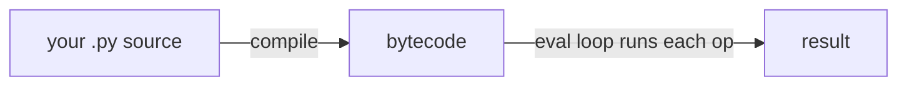
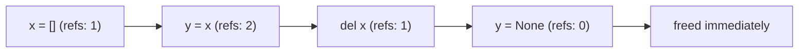

# Performance & Memory

At some point someone tells you "Python is slow," and it lands as a vague accusation you can't quite
defend against. Slow compared to what? Slow at *what*? And when your own code really is too slow, the
panic is worse - you start rewriting random pieces by feel, hoping something helps, and usually it
doesn't. You burn an afternoon and the program runs the same speed it did before lunch.

Both problems come from the same gap: you don't have a mental model of *what Python is doing under your
code*, so you can't reason about where the time goes. This phase fixes that: why Python earns the "slow"
label (and why it usually doesn't matter), how CPython actually executes your program and manages memory,
then the rule that saves you from wasted afternoons - **measure, don't guess** - and the speedups that
genuinely work, in the order worth trying them.

## Why Python is "slow"

**What's actually going on.** Python is **interpreted** and **dynamically typed**, and those two facts
are the whole story. Compare a quick `a + b`:

- In a compiled, statically-typed language (C, Rust), the compiler knew the types ahead of time. `a + b`
  becomes one machine instruction - add these two integers in these two registers. Done.
- In Python, nothing is known ahead of time. At the moment `a + b` runs, the interpreter asks: what *is*
  `a`? What *is* `b`? Does this kind of object know how to be added? It looks up the types, finds the
  right `__add__` method, calls it, and wraps the result back into a Python object on the heap.

That lookup-and-dispatch dance happens for *every single operation*, every time it runs. The flexibility
you love - duck typing, swapping a list for a generator, monkey-patching in a test - is bought with
runtime work a compiled language did once, up front.

📝 **Interpreted** - your source is executed by another program (the interpreter) at runtime, rather than
being translated to machine code ahead of time. **Dynamically typed** - a variable's type is discovered
while the program runs, not declared in the source.

> 💡 **Key point.** Python isn't slow because it was written badly. It's slow at raw per-operation work
> *by design*, as the price of being dynamic and flexible. That trade only matters in the small fraction
> of code that does heavy per-operation work in a tight loop - and that's exactly the part you can hand
> off to fast C.

**Why this usually doesn't matter.** Most programs spend their time *waiting* - on the network, the disk,
the database - not on CPU work. When you're waiting on a web response, it makes no difference that the
language is interpreted; you'd be waiting in C too. Python is "slow" precisely where it's rarely the
bottleneck, and fast enough everywhere else. Keep this phrase in your head: slow *language*, fast
*ecosystem* - the heavy lifting lives in C libraries (more below).

## How CPython runs your code

📝 **CPython** - the standard, reference implementation of Python, the one you get from python.org and
almost certainly the one you're running. "Python the language" and "CPython the program that runs it" are
worth keeping separate; other implementations (PyPy, etc.) make different speed trade-offs.

**What actually happens when you run a `.py` file.** It's two steps, not one. CPython first *compiles*
your source into **bytecode** - a compact list of simple instructions for a virtual machine. Then the
**eval loop** walks that bytecode one instruction at a time and does what each one says.



📝 **Bytecode** - not machine code your CPU runs directly, but instructions for CPython's own virtual
machine: `LOAD_FAST`, `BINARY_OP`, `CALL`, `RETURN_VALUE`, and friends. The `.pyc` files in your
`__pycache__` folder are cached bytecode, so a module that hasn't changed skips re-compiling next time.

**Seeing it for real.** The `dis` module ("disassemble") shows the bytecode for any function. You'll
rarely need this, but looking once demystifies the whole thing.

```python
import dis

def add(a, b):
    return a + b

dis.dis(add)
```
```console
$ python show_bytecode.py
  2           RESUME                   0

  3           LOAD_FAST                a
              LOAD_FAST                b
              BINARY_OP                0 (+)
              RETURN_VALUE
```
*What just happened:* `dis` printed the instructions CPython runs for `add`: load `a`, load `b`, perform
`+`, return the top of the stack. Each step is the eval loop doing a bit of work, and `BINARY_OP` is where
that runtime type lookup from the last section actually lives. (Opcode names shift between Python
versions, so don't memorize them; the shape is what matters.)

**Why this is worth knowing.** Once you can picture "source → bytecode → an eval loop grinding through
ops," two things stop being mysterious: why pushing work into a single C-implemented built-in beats a
hand-written loop (one C call versus thousands of trips through the eval loop), and why micro-rewrites of
pure-Python loops rarely help much (you're still grinding the same loop, just with slightly different ops).

## Memory - how objects get freed

You never call `free()` in Python. Memory is managed for you, and it's worth knowing how - it explains
both why Python is convenient and where it can surprise you.

**The main mechanism: reference counting.** Every Python object carries a count of how many things
currently refer to it. Bind it to a new name, the count goes up. A name goes out of scope or gets
reassigned, the count goes down. The instant that count hits **zero** - nothing refers to this object
anymore - CPython frees it immediately.



*One idea:* the object lives exactly as long as something points at it. When the last reference drops, it
goes away right then - no waiting, no scheduled sweep.

**The backup mechanism: a cyclic garbage collector.** Reference counting has one blind spot: a **cycle**.
If object A refers to B and B refers back to A, their counts never reach zero even after *you* let go of
both - each props up the other. So CPython also runs a periodic **garbage collector** whose only job is
finding these unreachable cycles and cleaning them up.

📝 **Reference cycle** - two or more objects that refer to each other, so reference counting alone can't
free them. The cyclic GC exists specifically to catch these.

> 📝 This is a deliberately short version. The full picture - how the cyclic collector decides what's
> truly unreachable, generational collection, when to care - lives in
> [Memory & Garbage Collection](/guides/memory-and-garbage-collection). Read that when memory behavior
> (not speed) is what's biting you.

**Why this touches performance.** Two practical consequences. First, creating and destroying *millions* of
small objects isn't free - each is a heap allocation plus refcount bookkeeping, part of why a pure-Python
numeric loop over a huge dataset is slow (you're minting a Python object per number). That's the exact
pain NumPy removes, below. Second, the GC's occasional cycle-hunting pauses are usually invisible, but in
latency-sensitive code they're a knob you can tune. Both are reasons to *measure* before assuming you know
where the cost is.

## The cardinal rule: measure, don't guess

Here is the single most important thing in this phase, and the one developers ignore most:

> 💡 **Key point.** You are *bad* at guessing where your program spends its time. Everyone is. The hot
> spot is almost never where intuition points. **Profile first, then optimize the part that's actually
> slow** - and nothing else.

Before you touch a line of code for speed, get the lay of the land from these two companion guides:
[What "Performance" Even Means](/guides/what-performance-means) (latency vs. throughput, what you're even
trying to make faster) and [Profiling 101](/guides/profiling-101) (how to find the hot spot instead of
guessing at it).

**Timing a small piece: `timeit`.** For comparing two ways of doing one small thing, `timeit` runs it many
times and reports how long, handling the fiddly bits (warm-up, repeated runs) for you.

```console
$ python -m timeit -s "data = list(range(1000))" "sum(data)"
50000 loops, best of 5: ... usec per loop
```
*What just happened:* `timeit` ran `sum(data)` tens of thousands of times and reported the best per-loop
time. The `-s` setup string (building the list) runs once and isn't counted. The actual microsecond number
depends entirely on your machine and load - treat any timing you see written down, including in this
guide, as *illustrative*, never a fact about your code. Run it yourself.

**Finding the hot spot in a whole program: `cProfile`.** `timeit` answers "which of these two snippets is
faster." `cProfile` answers the bigger question - "in my actual program, where does the time *go*?" - by
running your code and reporting how long was spent in each function.

```console
$ python -m cProfile -s cumulative my_program.py
         ... function calls in ... seconds

   ncalls  tottime  percall  cumtime  percall filename:lineno(function)
        1    0.001    0.001    2.104    2.104 my_program.py:1(<module>)
        1    0.003    0.003    2.090    2.090 my_program.py:12(process_all)
     5000    1.870    0.000    1.980    0.000 my_program.py:30(parse_line)
        ...
```
*What just happened:* `cProfile` ranked functions by cumulative time. Reading it, `parse_line` is eating
the program - called 5000 times and dominating the total. *That's* where optimization effort belongs;
everything else is noise. Without this you'd be guessing, and probably "optimize" `process_all` because
it's at the top of the file - and gain nothing. (Numbers above are illustrative, showing the *shape* of
the output, not a benchmark.)

⚠️ **Gotcha - premature optimization.** This is the big one, the mistake that wastes more developer time
than almost anything else: rewriting code for speed *before* measuring. Someone reads that "list
comprehensions are fast" or "f-strings beat `.format()`," sprints to apply it everywhere, and rewrites the
wrong 5% from a hunch - code that wasn't slow, often less readable in the bargain - while the actual
bottleneck (a redundant database query, an accidental O(n²) loop) sits untouched. The fix is a discipline,
not a trick: **profile, find the real hot spot, fix only that, measure again to confirm it helped.** Skip
the profile and you're guessing - and you'll usually guess wrong.

## The real speedups, in order

When profiling *has* shown you a genuine hot spot, here's where to reach, top to bottom. Try them in this
order - the early ones win big and cost little; the later ones cost more and matter less often.

**1. A better algorithm or data structure.** This dwarfs everything else. No amount of micro-tuning
rescues an O(n²) approach when an O(n) one exists. The classic: you're checking "is this item in the
collection?" inside a loop, and the collection is a `list`, so each check scans the whole thing. Switch it
to a `set` - membership becomes near-instant - and a slow loop becomes fast, untouched otherwise. This is
the first thing to look at, always, and the cheapest. (Worth a refresher?
[Big-O Without the Math Panic](/guides/big-o-without-the-math-panic) is the backbone here.)

**2. Built-ins and the standard library.** Functions like `sum`, `min`, `max`, `sorted`, `any`, and the
tools in `itertools` and `collections` are implemented in **C**. When one does what your loop does, it
does it in a single fast C call instead of thousands of trips through the eval loop. Prefer `sum(data)`
over a hand-rolled accumulator loop - same result, far less interpreter overhead. Rule of thumb: *if a
built-in already does it, let it.*

**3. Cache repeated work with `functools.lru_cache`.** If a function is **pure** (same inputs → same
output, no side effects) and gets called with the same arguments over and over, have Python remember past
results instead of recomputing them. One decorator does it.

```python runnable
import functools

@functools.lru_cache(maxsize=None)
def fib(n):
    if n < 2:
        return n
    return fib(n - 1) + fib(n - 2)

print(fib(35))
print(fib.cache_info())
```
```console
$ python cache_demo.py
9227465
CacheInfo(hits=33, misses=36, maxsize=None, currsize=36)
```
*What just happened:* `fib` is the naive recursive Fibonacci, which normally recomputes the same values
an exploding number of times. With `@lru_cache`, each `fib(n)` is computed *once* and stored; every later
call with that same `n` is a **hit**, returned straight from the cache. `cache_info()` proves it: 36 real
computations (misses) and 33 instant lookups (hits), so the recursion never blows up.

📝 **`lru_cache`** - "Least Recently Used cache." It remembers a function's results keyed by its
arguments; `maxsize` caps how many it keeps (evicting the least-recently-used), and `maxsize=None` means
unbounded. Arguments must be **hashable** (dicts and lists can't be cache keys), and the function must be
pure - caching one with side effects or time-dependent output hands you stale answers.

**4. Push hot numeric loops into NumPy / C.** When the hot spot is genuinely heavy number-crunching over a
big array - and you've confirmed it with a profile - move it out of pure Python entirely. **NumPy** stores
numbers in a tight, typed C array (no per-number Python object, none of that allocation-and-refcount cost
from the memory section) and runs operations over the whole array in compiled C. A loop that adds a
million numbers one Python object at a time becomes a single vectorized operation. This is the real answer
to "Python is slow for math": you don't speed up Python, you let it *orchestrate* fast C. The same idea
powers pandas, scikit-learn, and the rest of the scientific stack.

**5. Only now, micro-optimize.** Last, and only inside a hot spot a profiler flagged: avoiding repeated
attribute lookups, hoisting work out of a loop, choosing a comprehension. These give small wins in tight,
proven-hot code, and waste your attention and your code's readability everywhere else. Micro-optimization
is the *bottom* of this list for a reason.

> 🪖 **War story.** A teammate was sure a report was slow because of "all those list comprehensions" and
> spent a day rewriting them into loops "for speed." No change. A five-minute `cProfile` run afterward
> showed the whole time was one function calling the database once *per row* - an N+1 query. One fix
> there, batching the query, and the report went from minutes to seconds. The day of comprehension
> rewrites bought nothing; the profiler would have pointed at the real culprit in five minutes.

## Recap

1. Python is "slow" because it's **interpreted and dynamically typed** - types are looked up at runtime
   on every operation. That cost only bites in tight per-operation loops, and most programs are waiting
   on I/O anyway.
2. CPython runs your code in two steps: **source → bytecode → an eval loop** that executes each
   instruction. `dis` lets you see the bytecode; `__pycache__` caches it.
3. Memory is freed by **reference counting** (freed the instant the count hits zero), with a **cyclic
   garbage collector** as backup for reference cycles. The deep version lives in
   [Memory & Garbage Collection](/guides/memory-and-garbage-collection).
4. The cardinal rule: **measure, don't guess.** Use `timeit` for small comparisons and `cProfile` to find
   the real hot spot. Treat any timing number - including ones in guides - as illustrative; run it
   yourself.
5. **Premature optimization** is the trap: rewriting the wrong 5% from a hunch. Profile first, fix only
   the proven hot spot, measure again.
6. The real speedups, in order: **better algorithm/data structure → built-ins & stdlib (C) → cache with
   `lru_cache` → push numeric work into NumPy/C → only then micro-optimize.**

You now know *why* Python runs the way it does and how to make it faster without flailing. Next, the other
side of shipping real Python: getting it, and the exact libraries it depends on, to run reliably on a
machine that isn't yours.

Feel how each complexity class grows:

```playground-bigo
```

Watch reference counting and the cycle collector at work:

```playground-gc
```

Quick check - make sure these stuck:

```quiz
[
  {
    "q": "Why is Python often called \"slow\" compared to a language like C?",
    "choices": [
      "Its syntax is too verbose, so programs take longer to write",
      "It's interpreted and dynamically typed, so types are looked up and dispatched at runtime on every operation",
      "It can only use a single CPU core no matter what",
      "It stores all numbers as text and re-parses them constantly"
    ],
    "answer": 1,
    "explain": "The cost is structural: because Python is interpreted and types aren't known ahead of time, every operation pays for a runtime type lookup and dispatch that a compiled, statically-typed language did once, up front."
  },
  {
    "q": "You think you know which function in your program is the bottleneck. What should you do before rewriting it for speed?",
    "choices": [
      "Trust the hunch and rewrite it - you wrote the code, so you know it best",
      "Rewrite every loop as a comprehension first, since comprehensions are fast",
      "Profile it (e.g. with cProfile) to find where the time actually goes, then optimize only the proven hot spot",
      "Switch the whole program to NumPy to be safe"
    ],
    "answer": 2,
    "explain": "Measure, don't guess. The hot spot is almost never where intuition points, so profile first, fix only the part that's actually slow, and measure again to confirm it helped. Rewriting from a hunch is premature optimization."
  },
  {
    "q": "A profiler has confirmed a genuine hot spot. Which speedup should you reach for first?",
    "choices": [
      "Micro-optimizations like avoiding repeated attribute lookups",
      "A better algorithm or data structure (e.g. a set instead of a list for membership checks)",
      "Rewriting the whole thing in NumPy",
      "Adding @lru_cache to every function"
    ],
    "answer": 1,
    "explain": "The order that pays off: better algorithm/data structure → built-ins & stdlib in C → cache repeated work with lru_cache → push numeric loops into NumPy/C → and only then micro-optimize. A better algorithm dwarfs everything else; no micro-tuning rescues an O(n²) approach when an O(n) one exists."
  }
]
```

---

[← Phase 16: Concurrency & the GIL](16-concurrency-and-the-gil.md) · [Guide overview](_guide.md) · [Phase 18: Packaging & Environments →](18-packaging-and-environments.md)
