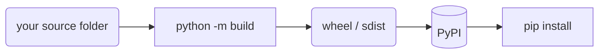

# Packaging & Environments

You have a folder full of `.py` files that does something useful. A friend asks for it, and your real
answer is "clone this, make a venv, install these three things, and run `python main.py` from the right
directory." That works, barely, and only because you're standing next to them. What you actually want is
for them to type one line - `pip install your-thing` - and have it work on a machine you'll never see.

This phase is about that gap: turning a folder of scripts into a **package** the rest of the world can
install. The mental model first - packaging has a reputation for being a confusing thicket of tools, and
most of that confusion comes from not seeing what each tool is *for*.

## The mental model: source folder → built artifact → index → install

**What it actually is.** Packaging is a small assembly line. Your **source folder** (code plus a
description of the project) gets turned into a **built artifact** - a single file in a standard format -
which gets uploaded to an **index** (a public server). Anyone's `pip` can then download it from the index
and install it. Four stops, one direction.



*One idea:* every tool in this phase lives at exactly one of those arrows. `build` makes the artifact;
`twine` (or `uv`) uploads it to PyPI; `pip` downloads and installs it. Know which arrow a command stands
on, and the landscape stops being a thicket.

> 💡 **Key point.** "Packaging" is two separate jobs people lump together: *isolating* the dependencies a
> project needs (virtual environments), and *distributing* your project so others can install it (build +
> publish). The first you do for every project; the second only when you have something to share.

## Recap from Phase 8: why the virtual environment comes first

You met **virtual environments** in [Phase 8](08-ecosystem-and-tooling.md), and they matter here too - the
one-line refresher: a venv is a private box holding its own Python and packages, isolated from every other
project. You make one per project so project A's `requests` 2.20 can't collide with project B's `requests`
2.32.

📝 **Virtual environment (venv)** - a per-project folder (usually `.venv`) with its own copy of Python and
its own installed packages. Activate it and `pip install` drops things *into that box only*.

The reason it leads this phase: you build and test a package *inside* a clean venv. Build against your
messy global Python and you can't tell which dependencies you actually declared versus which just happened
to be lying around - and your users have a different pile lying around. A fresh venv is the real test of
"did I declare everything this project needs?"

```console
$ python -m venv .venv
$ source .venv/bin/activate          # macOS/Linux  (Windows: .venv\Scripts\activate)
(.venv) $
```
*What just happened:* you created an empty, isolated Python in `.venv` and switched your shell into it -
the `(.venv)` prefix proves you're inside the box. Everything you install from here on lands in this
folder and nowhere else.

## The dependency-tool landscape, plainly

There are two ways people manage a project's dependencies today, and the right answer depends on how much
the project will grow. Here's the plain comparison, both sides, not a sales pitch for either.

| | **`pip` + `venv`** (built-in) | **`poetry`** / **`uv`** (all-in-one) |
|---|---|---|
| **What it is** | The baseline that ships with Python. `venv` makes the box, `pip` installs into it. | A single tool that resolves, installs, *and* manages the venv for you. `uv` is the fast newer one; `poetry` is the established one. |
| **Lockfile** | None built in - you pin by hand with `pip freeze`. | Yes - a lockfile records the *exact* resolved versions of every dependency and sub-dependency. |
| **Resolver** | Installs what you ask, one at a time. | Solves all your dependencies together so they're mutually compatible before installing anything. |
| **You install** | Nothing - it's already there. | An extra tool, once. |
| **Good when** | Small project, scripts, learning, or you want zero extra tooling. | Real project with many deps, a team, or reproducible builds that matter. |

📝 **Lockfile** - a file recording the *exact* version of every package installed, including
dependencies-of-dependencies. `requirements.txt` from `pip freeze` is a hand-rolled version of this; tools
like `poetry` and `uv` generate and update one automatically.

📝 **Resolver** - the part that figures out a set of versions that all work together. If package A needs
`urllib3<2` and package B needs `urllib3>=2`, a real resolver tells you *before* installing; naive
installation discovers it only when something breaks at runtime.

**The straight take.** For your first shareable package, plain `pip` + `venv` + a `pyproject.toml` is
completely enough, and it's the foundation everything else is built on - so that's what we'll use below.
If you later fight dependency conflicts or want one-command reproducible installs, reach for `uv` or
`poetry`; they automate the same `pyproject.toml` you're about to write, plus the lockfile. Nothing here
is wasted by moving to them.

## `pyproject.toml` - the modern project descriptor

**What it actually is.** `pyproject.toml` is the one file that describes your project: its name, version,
what it depends on, and how to build it. It's a Python standard (every modern tool reads the same file),
and replaces the older scattered setup (`setup.py`, `setup.cfg`, and friends) with a single declarative
document.

📝 **TOML** - a plain, readable config format: `key = value`, grouped under `[section]` headers. No code,
no surprises - it's data, not a script.

Here is a complete, real one for a small command-line tool:

```toml
[project]
name = "greet-cli"
version = "0.1.0"
description = "A tiny CLI that greets people."
readme = "README.md"
requires-python = ">=3.10"
dependencies = [
    "requests>=2.32",
]

[project.scripts]
greet = "greet_cli.main:run"

[build-system]
requires = ["hatchling"]
build-backend = "hatchling.build"
```

*What just happened:* this file says four things. The `[project]` table is the identity card - name,
version, one-line description, minimum Python, runtime dependencies. `[project.scripts]` wires up a
terminal command: after install, typing `greet` runs the `run` function inside `greet_cli/main.py`.
`[build-system]` names the **build backend** - the tool that turns your source into an artifact (here,
`hatchling`, a common low-fuss choice; `setuptools` is the classic alternative).

📝 **Build backend** - the engine that reads your `pyproject.toml` and produces the wheel/sdist. You rarely
interact with it directly; the front-end tool (`python -m build`) calls it for you. You only name which one
in `[build-system]`.

⚠️ **Gotcha - `name` vs. import name.** The `name` on PyPI (`greet-cli`, with a hyphen) and the name you
`import` in code (`greet_cli`, with an underscore - Python identifiers can't contain hyphens) are *not*
required to match, and beginners conflate them constantly. Pick the distribution `name` for the index and
make sure your package folder uses a valid import name. Keeping them parallel (`greet-cli` ↔ `greet_cli`)
saves everyone the headache.

## Building a distributable - `python -m build`

**What it actually is.** Building takes your source folder and produces the artifact that gets shipped.
There are two artifact types, and you almost always make both:

📝 **Wheel** (`.whl`) - the *built*, ready-to-install format. `pip` prefers it because it's pre-assembled:
no build step on the user's machine, it just unpacks. This is what most people install.

📝 **sdist** (source distribution, `.tar.gz`) - your source code in a tarball. The fallback when no
compatible wheel exists, and good provenance to publish alongside the wheel.

The standard front-end tool is `build`. Install it into your venv, then run it from your project root:

```console
(.venv) $ python -m pip install build
(.venv) $ python -m build
* Creating isolated environment...
* Building sdist...
* Building wheel...
Successfully built greet_cli-0.1.0.tar.gz and greet_cli-0.1.0-py3-none-any.whl
```
*What just happened:* `build` read your `pyproject.toml`, called the build backend in a clean isolated
environment, and dropped two files into a new `dist/` folder - the sdist (`.tar.gz`) and the wheel
(`.whl`). `py3-none-any` in the wheel name means "pure Python, any platform, any CPU" - installs anywhere
Python 3 runs. Those two files in `dist/` are the entire thing you ship.

## Publishing to PyPI - so others can `pip install`

**What it actually is.** **PyPI** (the Python Package Index) is the public server `pip` downloads from.
Publishing means uploading your `dist/` files there - once they land, your package is a name anyone in
the world can `pip install`.

📝 **PyPI / TestPyPI** - PyPI is the real, public index. **TestPyPI** is a separate sandbox copy for
rehearsing a publish without burning a version number on the real thing. Practice on TestPyPI first.

The classic uploader is **twine**:

```console
(.venv) $ python -m pip install twine
(.venv) $ python -m twine upload dist/*
Uploading distributions to https://upload.pypi.org/legacy/
Uploading greet_cli-0.1.0-py3-none-any.whl
100% ━━━━━━━━━━━━━━━━━━━━━━━━━━━━━━━━ 8.2/8.2 kB
Uploading greet_cli-0.1.0.tar.gz
100% ━━━━━━━━━━━━━━━━━━━━━━━━━━━━━━━━ 6.1/6.1 kB

View at:
https://pypi.org/project/greet-cli/0.1.0/
```
*What just happened:* `twine` uploaded both files from `dist/` to PyPI and printed the live URL for your
new release. It'll prompt for an API token the first time (generate one in your PyPI account settings -
username/password uploads are no longer accepted). From this moment, `pip install greet-cli` works for
everyone.

If you're using `uv`, it's the same two steps under one tool - `uv build` writes the wheel and sdist to
`dist/`, then `uv publish` uploads them. Same destinations, same result; `uv build` replaces `python -m
build` and `uv publish` replaces `twine upload`.

> 🪖 **War story - the version you can't take back.** PyPI won't let you re-upload a version number once
> it's published; `0.1.0` is `0.1.0` forever, even if you spot a typo thirty seconds later. The fix is
> always *forward* - bump to `0.1.1` and publish again. That's exactly what TestPyPI is for: make your
> embarrassing mistakes in the sandbox, where burning a version number costs nothing.

## The editable install - `pip install -e .`

**The problem it solves.** While you're *developing* the package, you don't want to rebuild and reinstall
after every code change - you want your installed package to *be* your source folder, so edits show up
instantly.

**What it actually is.** An **editable install** installs a link to your source directory instead of a
copy of it. `import greet_cli` then loads your live files - edit a function, rerun, and the change is
already there.

```console
(.venv) $ python -m pip install -e .
Obtaining file:///home/you/greet-cli
Installing build dependencies ... done
Successfully installed greet-cli-0.1.0
```
*What just happened:* the `-e` (editable) flag plus `.` (this directory) installed your project as a link
back to the source folder, not a frozen copy. Now `import greet_cli` and the `greet` command both run your
current code - the install you use *while building*; the wheel is what users get when you're done.

⚠️ **Gotcha - keep build junk and secrets out of git.** Building creates `dist/`, often `build/`, and a
`*.egg-info/` folder; your venv lives in `.venv/`. None of that belongs in version control - it's
generated, machine-specific, and bloats the repo. Add a `.gitignore`:

```console
$ cat .gitignore
.venv/
dist/
build/
*.egg-info/
__pycache__/
```
*What just happened:* git now ignores the generated artifacts and your local environment, so a clean clone
contains only source. The security half of the same rule: your PyPI API token, and any credentials a tool
stores in its config, are **secrets** - never commit them. Keep tokens in an environment variable or your
tool's credential store, never pasted into a tracked file.

## Recap

1. Packaging is an assembly line with one direction: **source folder → built artifact → PyPI → `pip
   install`**. Every command lives on exactly one of those arrows.
2. A **virtual environment** (from [Phase 8](08-ecosystem-and-tooling.md)) isolates each project's deps -
   build and test inside a clean one so you know you've declared everything.
3. The tool landscape, plainly: **`pip` + `venv`** is the built-in baseline and enough for a first
   package; **`poetry`/`uv`** add lockfiles and one-command resolve-install-venv when a project grows.
4. **`pyproject.toml`** is the modern, standard descriptor - name, version, dependencies, and build-system
   in one declarative file.
5. **`python -m build`** produces a **wheel** (built, ready-to-install) and an **sdist** (source tarball)
   into `dist/`.
6. Publish with **`twine upload`** (or **`uv publish`**) to **PyPI** - and versions are permanent, so
   rehearse on **TestPyPI** first.
7. **`pip install -e .`** gives you an editable install for development; keep `dist/`, `build/`,
   `*.egg-info/`, and `.venv/` out of git, and never commit secrets.

You can now hand someone a package name instead of a list of instructions. Next, the guide steps back from
your own code to the wider world - the libraries, communities, and directions worth knowing as you keep
going with Python.

Quick check - see if the assembly line and the isolation rule stuck:

```quiz
[
  {
    "q": "Why make a fresh virtual environment per project before building a package?",
    "choices": [
      "It makes pip install run faster",
      "It isolates each project's dependencies so you can tell exactly what you declared versus what was just lying around globally",
      "PyPI refuses uploads built outside a venv",
      "Virtual environments are required to write a pyproject.toml"
    ],
    "answer": 1,
    "explain": "A venv is a private box with its own Python and packages. Building inside a clean one is the real test of whether you declared every dependency, instead of relying on whatever happens to be installed globally."
  },
  {
    "q": "Which file is the modern, standard descriptor for a Python project - its name, version, dependencies, and build backend?",
    "choices": [
      "requirements.txt",
      "setup.py",
      "pyproject.toml",
      ".gitignore"
    ],
    "answer": 2,
    "explain": "pyproject.toml is the single declarative file every modern tool reads. It replaces the older scattered setup.py / setup.cfg and names the build backend in [build-system]."
  },
  {
    "q": "What's the right way to get a package into other people's hands, and what stays out of git?",
    "choices": [
      "Email them your .py files; commit .venv/ and dist/ so they have everything",
      "python -m build makes a wheel, twine (or uv) publishes it to PyPI, and others pip install it - while .venv/, dist/, build/, and secrets stay out of git",
      "Push your repo to GitHub; pip install reads straight from the default branch",
      "Run pip install -e . on their machine over SSH"
    ],
    "answer": 1,
    "explain": "The assembly line is source → build (wheel/sdist) → publish to PyPI → others pip install. Generated artifacts (.venv/, dist/, build/, *.egg-info/) and API tokens are machine-specific or secret, so they belong in .gitignore, never the repo."
  }
]
```

---

[← Phase 17: Performance & Memory](17-performance-and-memory.md) · [Guide overview](_guide.md) · [Phase 19: Where to Go Next →](19-where-to-go-next.md)
