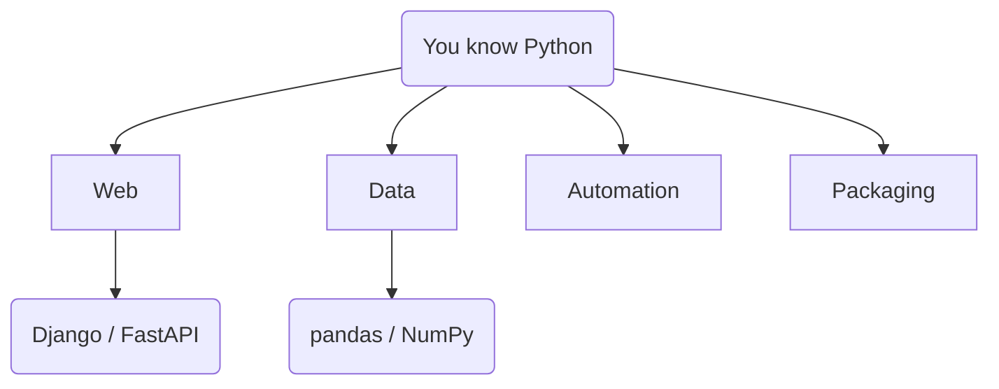

# Where to Go Next

You've gone the whole distance — from "what is Python" through classes and errors, and on into the deep
half: the data model, generators, decorators, typing, concurrency, performance, and packaging. That's the
*language* genuinely in your hands. What's left isn't *more Python* so much as *Python pointed at a
problem* — and which direction you go depends entirely on what you want to make.

So this last phase is a map, not a curriculum. No "you must learn all of these." Pick the one branch that
matches what you're trying to build, ignore the rest until you need them, and — most importantly — go
build the thing.

## The four big branches

Each of these is a whole world. Here's the honest one-paragraph version of each, so you can tell which
one is yours.



*One idea:* the same Python you learned branches toward different goals — a website, a data analysis, a
script that does your chores, or a tool you share. Same language, different destination.

### Web — make something people open in a browser

If you want to build a website or an API that other programs call, this is your branch. The two names
you'll hear most:

- **Django** — a "batteries-included" framework. It hands you an admin panel, user accounts, database
  models, and forms out of the box. Great when you're building a full application and want the common
  parts already solved. The trade-off: it's opinionated and large, so there's more to learn up front.
- **FastAPI** — a modern, lightweight framework focused on building APIs (the JSON-over-HTTP kind). It's
  smaller, fast to start with, and leans on the type hints you met in [Phase 14](14-type-hints.md). Great
  when you want an API and not a whole website.

Neither is "better" — Django is more *included*, FastAPI is more *minimal*. To understand what an API
even is before you pick, [What an API Is](/guides/what-an-api-is) is the grounding. (Deep dives on both
are their own guides.)

### Data — turn numbers into answers

If your goal is analysis — spreadsheets too big for Excel, charts, models — this is where Python genuinely
dominates.

- **NumPy** — fast numerical arrays. The foundation almost everything data-related is built on (and the
  practical escape hatch from the performance limits of [Phase 17](17-performance-and-memory.md)).
- **pandas** — tables (it calls them DataFrames) with filtering, grouping, and joining, built on NumPy.
  If you've ever wished a spreadsheet were programmable, this is that.

This branch is deep (it leads toward machine learning), but pandas alone will already change how you
handle any pile of data.

### Automation — make the computer do your chores

The least glamorous branch and often the most immediately useful: small scripts that rename files, scrape
a page, send a report, or poke an API on a schedule. You can start *today* with only what this guide
taught you plus the `requests` library from [Phase 8](08-ecosystem-and-tooling.md). This is where most
people feel Python "click" — because the payoff is a real chore that never bothers you again.

### Packaging — share what you built

You've already seen the mechanics in [Phase 18](18-packaging-and-environments.md) — `pyproject.toml`,
building, publishing. The "next step" here isn't learning *how*; it's having something worth sharing.
Don't rush it — package a tool once it's genuinely useful to someone other than you.

## The honest advice: build, then look things up

> 💡 **Key point.** You don't learn the next layer by reading about it. You learn it by trying to build
> something that needs it, getting stuck, and looking up exactly the piece you're stuck on. A tutorial you
> follow start-to-finish teaches you to follow tutorials; a project you fight through teaches you to build.

A few starter projects sized to where you are right now:

- **Automation:** a script that reads a folder of files and renames them by a rule you choose.
- **Web:** a FastAPI app with one endpoint that returns some JSON. Just one. Then add a second.
- **Data:** load a CSV with pandas, filter it, and print the answer to one question you actually care
  about.

Pick the smallest version of the thing you want to exist. Build *that*. Everything in this guide — types,
collections, functions, classes, the data model, generators, decorators, typing, concurrency — was the
vocabulary. A project is where it becomes fluency.

## One last reframe

Python was a deliberate choice as a first language: readable, forgiving, and useful in nearly every
corner of software. But the *ideas* you picked up here — variables and types, collections, control flow,
objects, the data model, iteration, error handling, concurrency — aren't Python's. They're how nearly
every modern language works, dressed in different syntax. If you ever pick up a second language, you'll
find you already know most of it; you're just learning new spellings.
[Languages, Explained Like a Human](/guides/languages-explained-like-a-human) is the map of that bigger
landscape, for whenever you're curious what else is out there.

You came in not knowing what `print("hello")` did. You're leaving able to reason about an entire program
*and* the runtime underneath it. That's not a small thing. Go make something.

## Recap

1. Python branches toward **web** (Django for full apps, FastAPI for APIs), **data** (NumPy + pandas),
   **automation** (small useful scripts), and **packaging** (sharing what you built).
2. Pick the *one* branch that matches what you want to make; ignore the rest until you need them.
3. You learn the next layer by **building something and looking up what you get stuck on** — not by
   reading ahead.
4. The concepts you learned here are nearly universal across languages; a second language is mostly new
   spelling.

One last check — the through-lines of the whole guide:

```quiz
[
  {
    "q": "Python branches toward different goals. If you wanted to build an API that other programs call over HTTP, which branch is that?",
    "choices": ["Data (NumPy / pandas)", "Web (Django / FastAPI)", "Packaging (pyproject.toml)", "Automation (small scripts)"],
    "answer": 1,
    "explain": "Web is the branch for websites and APIs — Django for full applications, FastAPI for lightweight APIs. Data, automation, and packaging point at different destinations."
  },
  {
    "q": "What's the guide's honest advice for learning the next layer beyond this guide?",
    "choices": ["Read every framework's docs cover to cover first", "Follow a long tutorial start to finish before building anything", "Build something that needs it, get stuck, and look up exactly the piece you're stuck on", "Memorize the standard library before starting a project"],
    "answer": 2,
    "explain": "You learn by building and looking things up when you get stuck. A tutorial teaches you to follow tutorials; a project you fight through teaches you to build."
  },
  {
    "q": "You finish this guide and later pick up a second language. What carries over?",
    "choices": ["Almost nothing — every language is entirely its own world", "The core ideas — variables, collections, control flow, objects, iteration, errors — which are nearly universal", "Only Python's exact syntax, which you'll have to unlearn", "Just the print statement"],
    "answer": 1,
    "explain": "The concepts you learned aren't Python's — they're how nearly every modern language works, dressed in different syntax. A second language is mostly learning new spellings."
  }
]
```

---

[← Phase 18: Packaging & Environments](18-packaging-and-environments.md) · [Guide overview](_guide.md)
