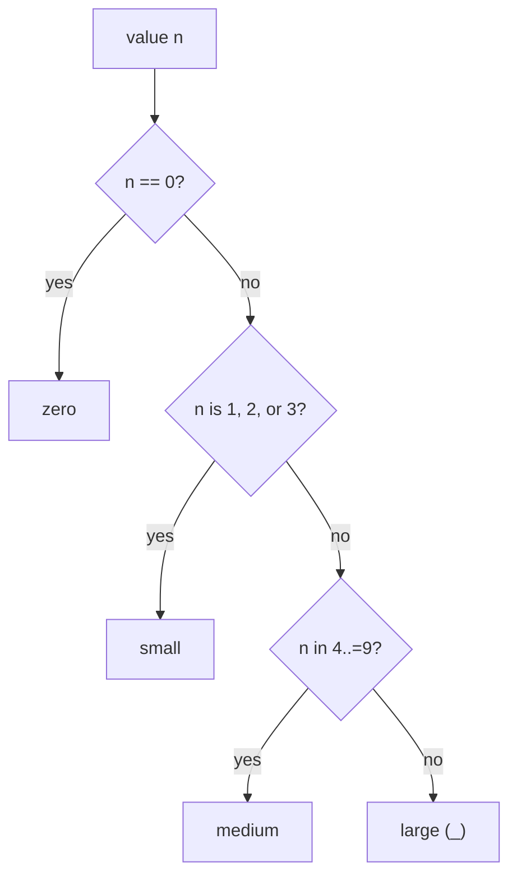

# Control Flow & Functions

So far your programs run straight down, top to bottom. Real programs branch ("if it's hot, say so") and
repeat ("for each score, print it") and split work into named, reusable pieces (functions). This phase
covers all of that - and along the way you'll meet two ideas that make Rust feel different from most
languages: **almost everything is an expression that produces a value**, and **`match` forces you to handle
every possible case.** That second one is the star of the phase, and it's the feature Rust programmers miss
most when they go back to other languages.

## `if` / `else` - and it's an expression

You know `if`/`else`. The twist in Rust: an `if` doesn't just *do* something, it *produces a value*, so you
can assign its result straight to a variable.

```rust
fn main() {
    let temp = 30;
    let label = if temp > 25 { "hot" } else { "mild" };
    println!("{label}");
}
```
```console
$ cargo run
hot
```
*What just happened:* The whole `if temp > 25 { "hot" } else { "mild" }` *evaluated* to one of the two
strings and `let label =` caught it. There's no ternary `? :` in Rust because plain `if` already does that
job. (Note both branches must produce the *same* type - you can't have one arm give a string and the other
a number.)

📝 **Terminology.** An **expression** produces a value (`2 + 2`, `if ... { } else { }`). A **statement**
does something but produces no usable value (`let x = 5;`). Rust leans hard on expressions - keep this
distinction in mind; it explains how functions return, below.

## The loops: `for`, `while`, `loop`

Rust has three ways to repeat, each for a different shape of problem.

**`for ... in`** - for walking over a collection or a range. This is the one you'll use most:

```rust
fn main() {
    for n in [10, 20, 30] {
        println!("{n}");
    }
    for i in 0..3 {
        println!("i = {i}");
    }
}
```
```console
$ cargo run
10
20
30
i = 0
i = 1
i = 2
```
*What just happened:* The first loop walked the array. The second walked a **range**, `0..3`, which means
"0 up to *but not including* 3" - so `0, 1, 2`. (Want to include the end? Use `0..=3` for `0, 1, 2, 3`.)

**`while`** - repeat as long as a condition holds:

```rust
fn main() {
    let mut count = 0;
    while count < 3 {
        println!("count {count}");
        count += 1;
    }
}
```
```console
$ cargo run
count 0
count 1
count 2
```
*What just happened:* The loop ran while `count < 3`, printing and incrementing each pass, and stopped once
`count` reached `3`. (This is where forgetting `mut` on `count` bites people, as we warned in
[Phase 2](02-syntax-values-and-types.md) - you're changing it each pass.)

**`loop`** - repeat forever, until you `break` out. Useful when the exit condition is in the middle, not
the top:

```rust
fn main() {
    let mut n = 1;
    loop {
        if n > 3 {
            break;
        }
        println!("n = {n}");
        n += 1;
    }
}
```
```console
$ cargo run
n = 1
n = 2
n = 3
```
*What just happened:* `loop` runs unconditionally; `break` is the only way out (here, once `n > 3`). Use
`loop` when "keep going until something happens" reads more naturally than a `while` condition at the top.

## `match` - the star: handle every case, exhaustively

**What it actually is.** `match` compares a value against a list of patterns and runs the first one that
fits. It's like a `switch` from other languages, but with a superpower: **it must cover every possible
case.** If you forget one, the program *won't compile.* That sounds strict; it's one of Rust's best
bug-prevention features.

```rust
fn classify(n: i32) -> &'static str {
    match n {
        0 => "zero",
        1 | 2 | 3 => "small",
        4..=9 => "medium",
        _ => "large",
    }
}

fn main() {
    for n in [0, 2, 7, 100] {
        println!("{n} is {}", classify(n));
    }
}
```
```console
$ cargo run
0 is zero
2 is small
7 is medium
100 is large
```
*What just happened:* Each **arm** (`pattern => result`) is checked top to bottom; the first match wins.
`1 | 2 | 3` matches any of those values; `4..=9` matches the inclusive range 4 through 9; and `_` is the
catch-all "anything else." Like `if`, `match` is an *expression* - it produces a value, which is why
`classify` can hand the whole `match` back as its answer.

Here's the flow of evaluating a single value through that `match`:



### Why "exhaustive" is a gift, not a chore

Here's what makes it matter. Say you have a type with a fixed set of options (an `enum` - a value that's
exactly one of several named variants), and you forget to handle one:

```rust
enum Light { Red, Yellow, Green }

fn action(l: Light) -> &'static str {
    match l {
        Light::Red => "stop",
        Light::Green => "go",
        // forgot Yellow!
    }
}
```
```console
$ cargo run
error[E0004]: non-exhaustive patterns: `Light::Yellow` not covered
 --> src/main.rs:4:11
  |
4 |     match l {
  |           ^ pattern `Light::Yellow` not covered
  |
note: `Light` defined here
 --> src/main.rs:1:6
  |
1 | enum Light { Red, Yellow, Green }
  |      ^^^^^        ------ not covered
help: ensure that all possible cases are being handled by adding a match arm with a wildcard pattern or an explicit pattern as shown
```
*What just happened:* The compiler **refused to build** because `Light::Yellow` isn't handled. In most
languages this would compile fine and quietly do nothing for yellow lights - a bug you'd find in
production. Rust catches it at compile time and even names exactly which case you missed.

💡 **Key point.** Exhaustive `match` means: when you add a new variant to an enum later, the compiler walks
you to *every* `match` that now needs updating. "Handle all the cases" stops being something you have to
remember - the compiler remembers for you. This is a big part of why people say refactoring Rust feels
safe.

⚠️ **Gotcha - `_` can hide bugs.** The catch-all `_` *also* satisfies exhaustiveness. That's perfect for
genuinely-infinite types like `i32` (as in `classify`), but on an enum it switches off the helpful "you
forgot a case" check. So on enums, prefer listing the variants explicitly when you reasonably can - you
*want* the compiler to nag you when a new variant appears.

## Functions - and returning without `return`

**What it actually is.** A function is a named, reusable block of logic that takes inputs (parameters) and
optionally produces an output. You define one with `fn`, name the parameter types (always required), and
name the return type after `->`.

The Rust-flavored part: a function returns the value of its **last expression** - and that expression has
**no semicolon.**

```rust
fn square(x: i32) -> i32 {
    x * x
}

fn main() {
    println!("square of 5 is {}", square(5));
}
```
```console
$ cargo run
square of 5 is 25
```
*What just happened:* `square` takes an `i32` named `x` and returns an `i32` (the `-> i32`). Its body is the
single expression `x * x` - **no semicolon** - so that value *becomes the return value*. You don't write
`return x * x;` (though you can; `return` exists, mainly for returning early from the middle of a function).

⚠️ **The semicolon gotcha that bites everyone once.** A semicolon turns an expression into a statement,
which produces *no value*. So writing `x * x;` (with a semicolon) as the last line means the function
returns "nothing" - and if you promised to return an `i32`, the compiler stops you with a "mismatched
types" error, expecting `i32` but finding `()` (Rust's "no value," called the *unit type*). The fix is
almost always: **delete the trailing semicolon** on the last line. Once you internalize "last line, no
semicolon = the return value," this stops happening.

📝 **Terminology.** `()` is the **unit type** - Rust's way of saying "no meaningful value." A function with
no `-> Type` returns `()` (it's run for its side effects, like printing).

## Recap

1. **`if`/`else` is an expression** - it produces a value you can assign; there's no ternary because `if`
   covers it.
2. **`for ... in`** walks collections and ranges (`0..3` excludes the end; `0..=3` includes it); **`while`**
   loops on a condition; **`loop`** runs until `break`.
3. **`match` compares a value to patterns and is *exhaustive*** - forget a case and it won't compile. Like
   `if`, it's an expression that produces a value.
4. Exhaustiveness is a **gift**: add an enum variant and the compiler points you to every `match` to fix.
5. **Functions** use `fn`, require parameter types, and return after `->`. The **last expression with no
   semicolon** is the return value - a stray semicolon there is the classic beginner bug.

You can now branch, loop, and factor logic into functions. As your programs grow past one file, you'll need
a way to organize them - that's next: modules, crates, and how a real Rust project is laid out. And right
after that comes the phase everything has been building toward: ownership.

---

[← Phase 3: Collections](03-collections.md) · [Guide overview](_guide.md) · [Phase 5: Modules & Project Layout →](05-modules-and-project-layout.md)
