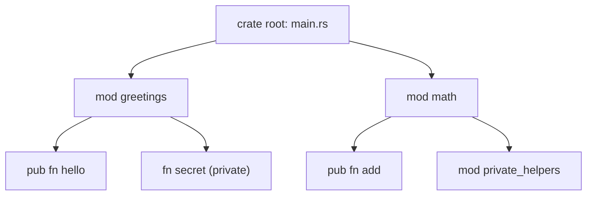

# Modules & Project Layout

Everything so far lived in one `main.rs`. Real projects don't - they grow into many files, pull in code
other people wrote, and split logic into tidy named groups. This phase is the map: what each file in a
Cargo project is *for*, how to carve code into **modules**, what `pub` and `use` actually do, and what
people mean by a **crate**. None of this is hard - it's mostly naming things you've half-noticed already.

This is also the last phase before the big one: [Phase 6: Ownership](06-ownership-and-borrowing.md), the
phase the whole guide has been walking toward.

## Anatomy of a Cargo project

Remember what `cargo new hello` made back in [Phase 1](01-install-and-first-program.md)? Let's read it now
that the pieces will mean something:

```console
$ ls hello
Cargo.toml  src
$ ls hello/src
main.rs
```

Two things matter:

**`Cargo.toml` - the manifest.** A small config file describing your project: name, version, and the
libraries it depends on. You'll edit this whenever you add a dependency.

```toml
[package]
name = "hello"
version = "0.1.0"
edition = "2024"

[dependencies]
```
*What just happened:* `[package]` names your project and pins the **edition** (a several-year batch of
language conventions - `2021` and `2024` are both fine; `cargo new` picks a recent one for you).
`[dependencies]` is empty for now - where added libraries get listed.

📝 **Terminology.** `Cargo.toml` is the file *you* edit. You'll also see a `Cargo.lock` appear next to it -
written by `cargo` to record the *exact* versions it resolved, so builds are reproducible. Leave
`Cargo.lock` to `cargo`; don't hand-edit it.

**`src/main.rs` vs `src/lib.rs` - the two kinds of crate root.** Worth memorizing:

- **`src/main.rs`** is the entry point of a **binary** - a program you *run*. It has a `fn main()`. This is
  what `cargo new` gives you by default.
- **`src/lib.rs`** is the entry point of a **library** - code meant to be *used by other code*, not run on
  its own. It has no `main`. You get one with `cargo new --lib mylib`.

💡 **Key point.** A binary is a thing you run; a library is a thing you reuse. Many real projects have
both: a `lib.rs` holding the actual logic (easy to test and share) and a thin `main.rs` that calls into it.
For now, `main.rs` is all you need.

## `mod` - group code into modules

**What it actually is.** A **module** is a named container for related code - functions, types, other
modules. It's how you keep a growing file from becoming a wall of unrelated functions. Declare one with
`mod`.

```rust
mod greetings {
    pub fn hello(name: &str) -> String {
        format!("Hello, {name}!")
    }
}

fn main() {
    println!("{}", greetings::hello("Ada"));
}
```
```console
$ cargo run
Hello, Ada!
```
*What just happened:* `mod greetings { ... }` created a module holding one function. From outside, reach
into it with `greetings::hello(...)` - `::` is the path separator, "the `hello` inside `greetings`."
(`format!` is like `println!` but builds a `String` instead of printing it.)

📝 **Terminology.** A **path** like `greetings::hello` names *where* something lives - module by module,
separated by `::`. You've already used paths: `std::collections::HashMap` in [Phase 3](03-collections.md)
is "`HashMap`, inside `collections`, inside the standard library `std`."

## `pub` - make things public

Did you notice the `pub` on `hello`? That's not decoration. **By default, everything in a module is
private - usable only inside that module.** `pub` ("public") opens it up to the outside.

```rust
mod greetings {
    pub fn hello(name: &str) -> String {
        format!("Hello, {name}!")
    }

    fn secret() -> &'static str {  // no pub → private
        "private"
    }
}

fn main() {
    println!("{}", greetings::hello("Ada"));
    println!("{}", greetings::secret());  // try to use the private one
}
```
```console
$ cargo run
error[E0603]: function `secret` is private
  --> src/main.rs:13:31
   |
13 |     println!("{}", greetings::secret());
   |                               ^^^^^^ private function
   |
note: the function `secret` is defined here
  --> src/main.rs:6:5
   |
 6 |     fn secret() -> &'static str {
   |     ^^^^^^^^^^^^^^^^^^^^^^^^^^^
```
*What just happened:* `hello` is `pub`, so calling it works. `secret` has no `pub`, so it's private to the
`greetings` module, and the compiler **refuses** to let `main` reach in and call it. Code *inside*
`greetings` could still call `secret` freely; only the outside is blocked.

💡 **Key point.** Private-by-default is the same philosophy as immutable-by-default from
[Phase 2](02-syntax-values-and-types.md): Rust makes the safe, restrictive choice the default and asks you
to opt *out*. The benefit is a clear contract - anyone reading your module sees exactly which functions are
meant to be used and which are internal plumbing they shouldn't depend on.

## `use` - bring a name into scope

Typing `greetings::hello` every time gets old, and long paths like `std::collections::HashMap` get *very*
old. `use` pulls a name into the current scope so you can refer to it by its short name:

```rust
mod greetings {
    pub fn hello(name: &str) -> String {
        format!("Hello, {name}!")
    }
}

use greetings::hello;  // bring `hello` into scope

fn main() {
    println!("{}", hello("Ada"));  // now just `hello`, no path
}
```
```console
$ cargo run
Hello, Ada!
```
*What just happened:* `use greetings::hello;` made `hello` available by its bare name in `main`. Same
reason you wrote `use std::collections::HashMap;` before using `HashMap` in [Phase 3](03-collections.md) -
`use` shortens the path; it doesn't change what the thing is.

Modules can nest, giving your project a tree you can picture:



*Reading the tree:* the crate root (`main.rs`) holds two modules; `greetings` exposes `hello` but keeps
`secret` private; `math` exposes `add` and has its own nested module. A path like `math::add` walks this
tree from the root down.

## Crates and dependencies

📝 **Terminology.** A **crate** is the unit Rust compiles: one binary or one library. Your project is a
crate, and the libraries you pull in are crates too - published on
**[crates.io](https://crates.io)**, Rust's package registry (like npm for JavaScript or PyPI for Python).

To use someone else's crate, add it to `Cargo.toml` - easiest via `cargo add`, which edits the file for
you:

```console
$ cargo add rand
    Updating crates.io index
      Adding rand v0.9.2 to dependencies
```
*What just happened:* `cargo add rand` looked up the `rand` crate (random numbers), wrote it into
`[dependencies]`, and noted the version. The next `cargo build` or `cargo run` downloads and compiles it
automatically - that's the build whose *first* run is a bit slow, as flagged in
[Phase 1](01-install-and-first-program.md). After that, bring its items in with `use` (e.g.
`use rand::Rng;`) just like your own modules. That's the whole point of `cargo`: this short.

⚠️ **Gotcha - `mod` vs `use` confusion.** These do *different* jobs. `mod foo;` *declares that a module
exists* (and, in a multi-file project, tells Rust to load `foo.rs`). `use foo::bar;` *brings an existing
name into scope* for convenience. Declare a module **once** with `mod`; `use` names from it as often as
you like. "Unresolved import" usually means a `use` for something never `mod`-declared (or never `pub`).

## You're ready for the hard part

You can now write Rust that holds data, makes decisions, lives in functions, and is organized into modules
across a real project - a genuine working foundation, most of a programming language.

But there's one idea we've been circling: every time you saw a `&` (borrowing a `Vec` in a `for` loop,
passing `&owned` where a `&str` was wanted, `&str` itself), a deeper system was at work. That system is
**ownership**, the reason Rust can promise memory safety without a garbage collector.

🪖 **A word before you turn the page.** Phase 6 is *the* phase. It's where Rust stops resembling languages
you know and the borrow checker - the part of the compiler that enforces ownership - starts rejecting code
that looks fine to you. Everyone struggles here; it's the normal shape of learning Rust, not a sign you're
doing badly. Take it slowly, type the examples, and let the mental model build - once ownership clicks,
the rest of Rust falls into place around it. For the "why does any language need this?" background first,
see [Memory & Garbage Collection](/guides/memory-and-garbage-collection).

## Recap

1. **`Cargo.toml`** is the manifest you edit (name, edition, dependencies); **`Cargo.lock`** is managed by
   `cargo`.
2. **`src/main.rs`** is a binary you run (`fn main`); **`src/lib.rs`** is a library other code reuses.
3. **`mod`** groups code into modules; reach into them with `::` paths.
4. **Everything is private by default**; **`pub`** exposes it. Privacy is a deliberate, opt-out contract.
5. **`use`** shortens a path by bringing a name into scope - it doesn't change what the thing is.
6. A **crate** is a compiled unit (your project, or a library); **`cargo add <name>`** pulls one from
   crates.io.

Next: the heart of Rust - ownership and borrowing. Who owns a value, what "moving" and "borrowing" really
mean, and why the borrow checker is on your side even when it's saying no.

---

[← Phase 4: Control Flow & Functions](04-control-flow-and-functions.md) · [Guide overview](_guide.md) · [Phase 6: Ownership & Borrowing →](06-ownership-and-borrowing.md)
