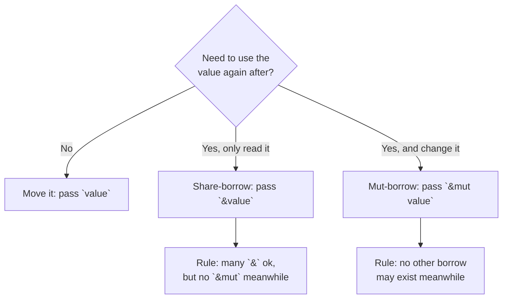

# Ownership & Borrowing - Rust's Big Idea

This is the phase people warn you about. Maybe someone already told you that Rust has a "borrow checker" that will yell at you, and you're bracing for a fight. Here's the reframe that changes everything: **the borrow checker is not your enemy. It's a teacher who refuses to let you ship a whole class of bug.** Every error it gives you is it saying, "Wait - this would have crashed or corrupted memory at runtime. Let's fix it now, on your screen, instead of at 2am in production."

Once the rules click, they stop feeling like rules and start feeling like common sense. So we'll install the mental model first, slowly, and only then look at the famous errors - and you'll find they suddenly read as helpful.

If you've ever wrestled with `null`, dangling pointers, or use-after-free bugs in another language - or read [How Memory & Garbage Collection Work](/guides/memory-and-garbage-collection) - this phase is the punchline to that story: Rust solves those problems *at compile time*, with no garbage collector running in the background.

## The three rules of ownership

Everything in this phase grows from three short rules. Read them once; you'll recognize them when they show up.

1. **Each value has exactly one owner** - a single variable that's responsible for it.
2. **There can only be one owner at a time.** When you give the value to someone else, the old owner gives it up.
3. **When the owner goes out of scope, the value is dropped** - its memory is freed automatically, right then.

📝 **Terminology.** *Scope* is the region of code where a variable is valid - usually between its `let` and the closing `}` of the block it lives in. *Dropped* means Rust runs the value's cleanup and frees its memory. You never call `free` yourself; rule 3 does it for you.

That third rule is the quiet miracle: no garbage collector pausing your program to hunt for unused memory, no `free()` to forget. The compiler knows exactly where each value's owner ends, so it knows exactly where to insert the cleanup. **Memory safety, decided at compile time.**

## Move semantics: giving a value away

**What it actually is.** In most languages, `let t = s` copies a reference and both names point at the same thing. In Rust, for a value that owns heap memory (like a `String`), `let t = s` *moves* ownership: `t` becomes the owner, and `s` is no longer valid. The value wasn't copied - it changed hands.

**Why this exists.** If both `s` and `t` owned the same `String`, then when both went out of scope, Rust would try to free the same memory twice - a "double free," a classic crash. Making the assignment a move guarantees there's always exactly one owner to do the cleanup. Rule 2, enforced.

**Why people get this wrong.** They expect `s` to still work after `let t = s`, because that's how nearly every other language behaves. Let's watch Rust stop us, and read what it says.

```rust
fn main() {
    let s = String::from("hello");
    let t = s;            // ownership moves from s to t
    println!("{}", s);    // ...but we try to use s anyway
}
```
```console
$ cargo build
error[E0382]: borrow of moved value: `s`
 --> src/main.rs:4:20
  |
2 |     let s = String::from("hello");
  |         - move occurs because `s` has type `String`, which does not implement the `Copy` trait
3 |     let t = s;
  |             - value moved here
4 |     println!("{}", s);
  |                    ^ value borrowed here after move
  |
help: consider cloning the value if the performance cost is acceptable
  |
3 |     let t = s.clone();
  |              ++++++++
```
*What just happened:* Read that error like a sentence, because it *is* one. "move occurs because `s` has type `String`" - assigning a `String` is a move. "value moved here" points at `let t = s`. "value borrowed here after move" points at exactly the line where you tried to use `s` again. The compiler even drew arrows to the two conflicting lines. This isn't a cryptic stack trace - it's a code review that found a bug before the program ever ran.

💡 **Key point.** Passing a value into a function moves it too, by the same rule. `do_thing(s)` hands ownership of `s` to `do_thing`; afterward, `s` is gone from your scope unless the function hands it back. Assigning, passing, or returning are all the same move.

⚠️ **The "just clone it" trap.** The error helpfully suggests `s.clone()`, which makes a full independent copy so both names own their own data. Sometimes that's exactly right. But reaching for `.clone()` *every* time the borrow checker complains is the most common beginner habit, and it quietly copies data all over your program. Treat clone as a deliberate choice ("I genuinely need two copies"), not a reflex to silence the compiler. Most of the time, the better answer is the next idea: **borrowing.**

## Borrowing: using a value without taking it

**What it actually is.** A *borrow* is a reference to a value you can use without owning it. Write `&value` to borrow it. The owner keeps ownership; you get temporary access - like reading a book off a friend's shelf instead of making them give you the book.

This is how you call a function on a value and *still have it afterward*:

```rust
fn length(s: &String) -> usize {
    s.len()              // we can read s through the borrow
}

fn main() {
    let s = String::from("hello");
    let n = length(&s);  // lend s to length, don't give it away
    println!("{} is {} chars", s, n);   // s is still ours!
}
```
```console
$ cargo run
hello is 5 chars
```
*What just happened:* `&s` handed `length` a *reference* to `s` instead of moving the `String` itself. `length` read it and returned, the borrow ended, and `s` was still fully ours on the next line - no move, no clone, no copy of the string's bytes, just a temporary loan.

📝 **Terminology.** `&T` is a *shared reference* (also called an *immutable borrow*) - you can read through it but not change the value. `&mut T` is a *mutable reference* (an *exclusive borrow*) - you can change the value through it.

## The one rule that governs all borrowing

Here is the single most important rule in the language, and it's short:

> **At any given time, you can have *either* one mutable reference *or* any number of shared references - but not both.**

Read it as: *many readers, or one writer, never both at once.* If something can be changed (a `&mut`), nothing else may be looking at it. If many things are looking at it (`&`), nobody may change it underneath them.

**Why this exists.** This rule kills data races and a whole family of aliasing bugs. If a value can't be mutated while anything else holds a view of it, no reader can ever be surprised by the value changing out from under them. The compiler proves this for you. Let's see it catch a violation:

```rust
fn main() {
    let mut v = vec![1, 2, 3];
    let a = &mut v;          // first exclusive borrow
    let b = &mut v;          // second exclusive borrow - not allowed
    println!("{:?} {:?}", a, b);
}
```
```console
$ cargo build
error[E0499]: cannot borrow `v` as mutable more than once at a time
 --> src/main.rs:4:13
  |
3 |     let a = &mut v;
  |             ------ first mutable borrow occurs here
4 |     let b = &mut v;
  |             ^^^^^^ second mutable borrow occurs here
5 |     println!("{:?} {:?}", a, b);
  |                           - first borrow later used here
```
*What just happened:* The compiler caught two `&mut` borrows of `v` alive at the same time and refused. Again it's precise: it underlines the *first* mutable borrow, the *second* one, and the line where the first is *later used* (why the first one was still alive when the second appeared). The fix is usually to not need both at once - finish using `a` before you make `b`, or restructure so only one writer exists.

🪖 **War story.** A teammate coming from Python spent an afternoon furious at E0499 in a loop that mutated a list while iterating over it. Then it dawned on him: the same code in Python had been silently producing wrong results for months, because mutating a collection mid-iteration is a real bug - Python just never complained. Rust wasn't being difficult. It had found a bug hiding in plain sight.

## Move vs. borrow, at a glance

When you hand a value to a function (or another variable), you're choosing one of three things - a decision you'll make hundreds of times a day, until it becomes automatic:



Most of the time the answer is "borrow" (`&`), because you usually want to keep using your values. Reach for a move when you're genuinely done with the value, and `&mut` when you need to change something in place.

## A taste of lifetimes

You'll eventually meet syntax like `&'a str` with that little `'a`, and it can look intimidating. Here's the whole idea in one sentence so it's not scary when it shows up:

**A lifetime is the compiler's name for "how long a reference is valid."** It exists to guarantee a reference never outlives the thing it points to - that's how Rust makes dangling pointers *impossible* instead of merely unlikely.

Most of the time the compiler figures lifetimes out silently and you never type one. You only write them down in the few cases it can't infer the relationship on its own - for example, a function returning a reference that needs to say *which* input it borrows from. When you get there, remember: you're not learning a new feature, just spelling out a "this reference can't outlive that value" relationship the compiler was already enforcing. Don't let `'a` intimidate you out of the gate.

## How this gives you safety with no GC and no `free`

Step back and look at what these rules bought you:

- **No double-free**, because every value has exactly one owner to clean it up (move semantics).
- **No use-after-free / dangling pointers**, because a reference can never outlive its owner (borrowing + lifetimes).
- **No data races from aliasing**, because you can't mutate something while it's shared (the one-writer-or-many-readers rule).
- **No manual `free()` to forget**, because cleanup happens automatically when the owner's scope ends (rule 3).
- **No garbage collector**, because the compiler already knows the exact moment each value dies - no runtime needed to go find out.

Languages with a garbage collector (covered in [How Memory & Garbage Collection Work](/guides/memory-and-garbage-collection)) buy safety by running a collector that periodically pauses your program to figure out what's still in use. Rust buys the *same* safety by proving it at compile time instead. The trade is real and honest: more thinking up front (and sometimes arguing with the borrow checker), in exchange for no GC pauses and predictable, instant cleanup. That trade-off - and how different languages make it - is exactly the kind of design decision [Programming Languages, Explained Like a Human](/guides/languages-explained-like-a-human) walks through.

## When you're "fighting the borrow checker"

You will hit a wall where the compiler rejects something you're *sure* is fine, and it'll feel personal. Two things to hold onto:

1. **It's almost always pointing at a real issue** - some way the value's lifetime or aliasing doesn't line up. The fix is usually to restructure (borrow instead of move, narrow a scope, finish using one borrow before starting another), not to fight harder.
2. **Resist the clone-to-escape reflex.** Sprinkling `.clone()` to make errors go away works, but it's how you end up with slow, copy-everything code. Clone when you *mean* to copy; otherwise, listen to what the error is telling you about your data's shape.

Here's the genuinely encouraging part: **the fights get rare fast.** The first week you argue with the borrow checker constantly. By the second or third, you start writing code it accepts on the first try, because you've absorbed the model - you're now thinking about ownership the way it does. It stops feeling like a checker in your way and starts feeling like a habit you already have.

## Recap

1. **Three rules:** each value has one owner; only one owner at a time; the value is dropped (freed) when the owner's scope ends.
2. **Move:** assigning, passing, or returning a heap-owning value *moves* ownership; the old name is no longer valid (`error[E0382]: borrow of moved value`).
3. **Borrow:** use a value without owning it - `&` for shared/read, `&mut` for exclusive/write.
4. **The borrowing rule:** many `&` *or* one `&mut`, never both at once (`error[E0499]` when you break it). Many readers, or one writer.
5. **Lifetimes** are just the compiler's name for "how long a reference is valid" - they make dangling pointers impossible.
6. Together these give **memory safety with no garbage collector and no manual `free`** - checked at compile time. The borrow checker is a teacher; the fights get rare fast.

---

[← Phase 5: Modules & Project Layout](05-modules-and-project-layout.md) · [Phase 7: Errors & I/O →](07-errors-and-io.md)
