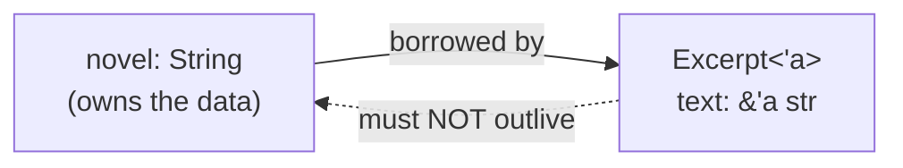

# Lifetimes & the Borrow Checker, Deep — Making References Provable

Back in [Phase 6](06-ownership-and-borrowing.md) you learned to borrow: `&T` to read, `&mut T` to write, many readers or one writer. And in [Phase 9](09-idioms-and-gotchas.md) we admitted that the `'a` syntax gives people "lifetime anxiety" — it looks like deep wizardry. This phase is where we drain that anxiety completely. By the end, `'a` won't read as magic. It'll read as the compiler spelling out a relationship you already understand.

Here's the reframe to carry through the whole phase: **a lifetime is not something you create. It's a region of code where a reference is valid.** The compiler tracks those regions for every reference, all the time — you just don't usually see it. Annotations like `'a` aren't *making* lifetimes; they're *naming* ones that already exist so the compiler can check a relationship it couldn't otherwise figure out.

## The problem lifetimes solve

Every borrowing rule in Phase 6 was protecting one promise: **a reference must never outlive the data it points to.** If it did, you'd have a *dangling reference* — a pointer to memory that's already been freed. Reading through it is undefined behavior: a crash, garbage data, or a security hole. Languages without this guarantee (C, C++) leak this bug constantly. Rust makes it *impossible*, at compile time.

Lifetimes are the bookkeeping that makes that possible. Watch the compiler catch the bug:

```rust
fn main() {
    let r;                      // r will hold a reference
    {
        let x = 5;              // x lives only inside this block
        r = &x;                 // borrow x
    }                           // x is dropped here — its memory is gone
    println!("{}", r);          // ...but r still points at it
}
```
```console
$ cargo build
error[E0597]: `x` does not live long enough
 --> src/main.rs:5:13
  |
4 |         let x = 5;
  |             - binding `x` declared here
5 |         r = &x;
  |             ^^ borrowed value does not live long enough
6 |     }
  |     - `x` dropped here while still borrowed
7 |     println!("{}", r);
  |                    - borrow later used here
```
*What just happened:* `x` was born and died inside the inner block. `r` borrowed it, then tried to outlive it. The compiler compared two regions — the region `x` is alive for, and the region `r` needs its borrow to be valid for — and saw that `r`'s need extends *past* `x`'s death. That mismatch is the whole error. It even narrates the timeline: "declared here," "dropped here while still borrowed," "borrow later used here." No dangling reference ships.

📝 **Lifetime** — the region of code over which a reference is guaranteed valid (roughly, from where it's created to its last use, but never past the moment its referent is dropped). It's a property the compiler *infers and checks*, not a value you store or pass around.

💡 **Key point.** The borrow checker isn't doing anything new here — it's the same "references can't outlive their data" rule from Phase 6, now visible. Lifetimes are the name for *how long* each reference is allowed to be valid. Most of the time the compiler works this out silently. You only get involved when it genuinely can't.

## Why a function sometimes needs annotations

Inside one function, the compiler can see every variable's scope, so it figures out lifetimes on its own. The trouble starts at **function boundaries**. When a function returns a reference, the compiler — looking only at the signature — has to know *which input that reference borrows from*. Without that, it can't tell the caller how long the returned reference stays valid.

The classic case is a function that returns the longer of two string slices:

```rust
fn longest(a: &str, b: &str) -> &str {
    if a.len() > b.len() { a } else { b }
}

fn main() {
    println!("{}", longest("hello", "hi"));
}
```
```console
$ cargo build
error[E0106]: missing lifetime specifier
 --> src/main.rs:1:33
  |
1 | fn longest(a: &str, b: &str) -> &str {
  |               ----     ----     ^ expected named lifetime parameter
  |
  = help: this function's return type contains a borrowed value, but the
          signature does not say whether it is borrowed from `a` or `b`
help: consider introducing a named lifetime parameter
  |
1 | fn longest<'a>(a: &'a str, b: &'a str) -> &'a str {
  |           ++++     ++          ++          ++
```
*What just happened:* The compiler hit a fork. The returned `&str` might come from `a` *or* from `b` — the `if` decides at runtime. So how long is the result valid? It depends on which input it came from, and the signature doesn't say. The error is precise: "whether it is borrowed from `a` or `b`." This is the *one* situation where the compiler needs you to spell out the relationship.

The fix is exactly what the help text shows — add a lifetime parameter:

```rust
fn longest<'a>(a: &'a str, b: &'a str) -> &'a str {
    if a.len() > b.len() { a } else { b }
}

fn main() {
    let s1 = String::from("hello");
    let s2 = String::from("hi");
    println!("longest is {}", longest(&s1, &s2));
}
```
```console
$ cargo run
longest is hello
```
*What just happened:* `<'a>` declares a lifetime *name* — read it as "for some region `'a`." Then `a: &'a str` and `b: &'a str` say "both inputs are borrowed for at least `'a`," and `-> &'a str` says "the returned reference is valid for `'a` too." You haven't changed *what the code does* — `longest` still returns the longer slice. You've added a *promise to the compiler*: the result lives no longer than the shorter-lived of the two inputs. Now the caller knows exactly how long it can hold the result.

📝 **`<'a>`** — a *lifetime parameter*. The leading apostrophe marks it as a lifetime (not a type), and `a` is just a name — `'a` is conventional, like `i` for a loop counter. `&'a str` means "a `&str` valid for the region named `'a`." You're not setting the lifetime; you're giving the compiler a label so it can connect inputs to outputs and verify the whole thing holds.

⚠️ **Annotations describe; they don't extend.** A common misread is thinking `'a` *makes* a reference live longer. It can't. Lifetimes only *document* relationships the compiler then checks. If you tell it the output lives as long as `a`, but a caller drops `a` too early, you get an error at the *call site* — the annotation is what makes that check possible, not a way to dodge it.

## Lifetime elision — why you almost never write `'a`

If returning a reference needs lifetimes, why have you written dozens of functions taking `&self` or `&str` without ever typing `'a`? Because the compiler applies **lifetime elision rules** — a short list of obvious patterns where it fills in the lifetimes for you. When your function fits a pattern, you write nothing; the compiler infers it. `longest` failed only because it fit *none* of them (two input references, ambiguous source).

The three rules the compiler applies, in order:

1. **Each input reference gets its own lifetime.** `fn f(x: &str, y: &str)` is treated as `fn f<'a, 'b>(x: &'a str, y: &'b str)`.
2. **If there's exactly one input lifetime, it's assigned to all outputs.** One reference in, references out — they all borrow from that one input. This covers the vast majority of functions.
3. **If one of the inputs is `&self` or `&mut self`, `self`'s lifetime goes to all outputs.** This is why methods on a struct almost never need annotations.

Here's a function that *looks* like it needs a lifetime but doesn't, thanks to rule 2:

```rust
fn first_word(s: &str) -> &str {
    s.split(' ').next().unwrap_or("")
}

fn main() {
    let sentence = String::from("hello world");
    println!("{}", first_word(&sentence));
}
```
```console
$ cargo run
hello
```
*What just happened:* `first_word` returns a reference, yet compiles with no `'a` in sight. Rule 2 did the work: there's exactly one input reference (`s`), so the compiler assigns its lifetime to the return type automatically. Behind the scenes the signature is `fn first_word<'a>(s: &'a str) -> &'a str` — you did not have to type it. `longest` couldn't use this rule because it had *two* input references and no `self`, leaving the source genuinely ambiguous.

💡 **You've been using lifetimes all along.** Every `&str` parameter, every method returning `&self.field`, every borrow you've written since Phase 6 had lifetimes — the compiler just inferred them via elision. Annotations aren't a separate, scary feature you're now learning. They're the same thing made explicit for the handful of cases where inference can't guess.

## References in structs

So far our references have lived in local variables and function signatures. You can also store a reference *inside a struct* — but the moment you do, the struct picks up a lifetime parameter. The reason follows directly from the core rule: if a struct holds a reference, **the struct must not outlive the data that reference points to.** A lifetime parameter is how the struct carries that constraint.

```rust
struct Excerpt<'a> {
    text: &'a str,          // a borrowed slice, not an owned String
}

fn main() {
    let novel = String::from("Call me Ishmael. Some years ago...");
    let first_sentence = novel.split('.').next().unwrap();
    let e = Excerpt { text: first_sentence };
    println!("Excerpt: {}", e.text);
}
```
```console
$ cargo run
Excerpt: Call me Ishmael
```
*What just happened:* `Excerpt<'a>` declares that the struct holds a reference valid for region `'a`, and `text: &'a str` ties the field to it. Reading it aloud: "an `Excerpt` cannot outlive the `&str` it borrows." Here `novel` owns the string and lives for the whole `main`, while `e` borrows a slice of it and is dropped first — so the constraint holds and it compiles. If you tried to make `e` outlive `novel` (drop the owner while the `Excerpt` was still around), you'd get the same `does not live long enough` error from the first section. The lifetime parameter is what lets the compiler enforce that.



That diagram is the whole rule in one picture: the `Excerpt` borrows from `novel`, so the `Excerpt` must be gone before `novel` is. The `'a` on the struct is what makes the compiler check the dotted arrow.

⚠️ **A struct holding a reference is a deliberate choice.** It ties the struct's lifespan to the data it borrows, which can ripple constraints through your code. Often the simpler design is to store an *owned* `String` instead of a `&'a str` — the struct then owns its data and has no lifetime parameter at all. Reach for borrowed fields when you specifically want to avoid copying and you can guarantee the owner outlives the struct.

## `'static` — the lifetime of the whole program

There's one lifetime name with special meaning: **`'static`**. A reference with lifetime `'static` is valid for the *entire duration of the program*. The most common holders of it are **string literals**:

```rust
fn main() {
    let s: &'static str = "I live for the whole program";
    println!("{}", s);
}
```
```console
$ cargo run
I live for the whole program
```
*What just happened:* The literal `"I live for the whole program"` is baked into the program's binary, so it exists from start to finish — its lifetime really is `'static`. Every string literal you've ever written is a `&'static str`; you just never had to name it. Annotating it here is optional and only done to show what's going on.

⚠️ **`'static` does not mean "leak it."** The widespread misconception is that adding `'static` forces data to live forever by keeping it allocated (a memory leak). That's backwards. `'static` is a *claim* that data already lives for the whole program — which is exactly true of literals and constants, no leaking involved. Slapping `'static` on a reference to short-lived data doesn't extend it; the compiler just rejects the claim with a `does not live long enough` error. Use it to describe genuinely program-long data (literals, constants), not as a hammer to silence lifetime errors.

## Recap

1. **The problem lifetimes solve:** a reference must never outlive the data it points to. Lifetimes are how the compiler *proves* this and makes dangling references impossible (`error[E0597]: does not live long enough`).
2. **A lifetime is a region, not a thing you create.** Annotations like `'a` *name* an existing region so the compiler can check a relationship — they describe, they never extend.
3. **Functions need annotations when a returned reference is ambiguous** about which input it borrows from (`longest`). `<'a>` ties inputs and outputs together so the caller knows how long the result is valid.
4. **Lifetime elision** fills in lifetimes automatically for common patterns (one input reference, or a `&self` method), which is why you rarely type `'a` — you've been using lifetimes all along.
5. **A struct holding a reference needs a lifetime parameter** (`Excerpt<'a>`), encoding the rule that the struct must not outlive the data it borrows. Owning the data instead avoids the parameter entirely.
6. **`'static`** is the lifetime of data that lives the whole program (string literals). It means "already valid for the whole program," *not* "leak it to make it live forever."

You can now read a lifetime annotation and see the relationship it's describing, instead of bracing for a fight. Next, we go deep on **traits and generics** — how Rust writes code once and runs it on many types, with the compiler still checking everything.

## Quick check

Test yourself on the one idea that demystifies this whole phase — that a lifetime *describes* a region rather than creating one:

```quiz
[
  {
    "q": "What does a lifetime annotation like `'a` actually do?",
    "choices": [
      "Names a region of code so the compiler can check that a reference doesn't outlive its data",
      "Forces the referenced data to stay allocated for longer",
      "Creates a new lifetime that extends how long a value lives",
      "Tells the garbage collector when to free the value"
    ],
    "answer": 0,
    "explain": "A lifetime is a region the compiler already tracks. Annotations only name that region so it can verify a relationship (like 'this output borrows from this input'). They describe and check — they never extend a value's life, and Rust has no garbage collector."
  },
  {
    "q": "Why does `fn longest(a: &str, b: &str) -> &str` need a lifetime parameter, while `fn first_word(s: &str) -> &str` does not?",
    "choices": [
      "`longest` has two input references and could return either, so the source of the output is ambiguous; `first_word` has one input, so elision assigns its lifetime to the output",
      "`longest` is more complex, so the compiler gives up and asks for help",
      "`first_word` returns an owned String, which never needs a lifetime",
      "Functions with an `if` always need lifetime parameters"
    ],
    "answer": 0,
    "explain": "Lifetime elision rule 2 covers exactly one input reference: its lifetime flows to the output, so `first_word` needs no annotation. `longest` has two input references and the returned slice could come from either, so the compiler can't infer which one — you must spell it out."
  },
  {
    "q": "Your friend says: \"Add `'static` to this reference so the data lives forever and the lifetime error goes away.\" What's wrong with that?",
    "choices": [
      "`'static` claims the data already lives for the whole program; it can't extend short-lived data, so the compiler just rejects the false claim",
      "Nothing — `'static` is the correct way to silence any lifetime error",
      "`'static` works but causes a guaranteed memory leak every time",
      "`'static` only works on numbers, not on references"
    ],
    "answer": 0,
    "explain": "`'static` is a claim that data is valid for the entire program (true for literals and constants), not a command to keep data alive. Applied to short-lived data, the claim is false and the compiler rejects it with a 'does not live long enough' error. It's a description, not a fix-all."
  }
]
```

---

[← Phase 9: Idioms & Common Gotchas](09-idioms-and-gotchas.md) · [Guide overview](_guide.md) · [Phase 11: Traits & Generics, Deep →](11-traits-and-generics.md)