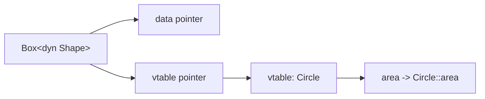

# Traits & Generics, Deep - Shared Behavior Without Inheritance

Back in [Phase 9](09-idioms-and-gotchas.md) you met traits as a one-paragraph idea: a set of methods a type promises to provide, and `&impl Trait` to accept "anything that has them." That was the postcard. This phase is the country.

Here's the mental model to carry through everything below. Most object-oriented languages share behavior by *inheritance*: a `Dog` **is a** `Animal` and gets `Animal`'s methods by being born into the family tree. Rust has no inheritance at all. Instead it shares behavior by *capability*: a type **can do** a thing if it implements the trait for that thing. A `Dog` isn't an `Animal`; a `Dog` is something that *can* `Speak`. Once that flip clicks - from "what is it" to "what can it do" - traits and generics stop feeling like two separate features and start feeling like the single answer to "how does Rust reuse code without classes."

## Traits as shared behavior - now with defaults

Quick recap so we're on the same page: a **trait** is a named set of method signatures. You write `impl ThatTrait for YourType` to fulfill the promise, and afterward your type can be used anywhere the trait is required.

📝 **Trait** - a contract describing behavior: a list of methods a type must provide to "implement" it. It's the unit of shared behavior in Rust, the rough equivalent of an interface in other languages - but with one extra power: a trait can ship *default* implementations.

That extra power is the new part. A trait method doesn't have to be just a signature - the trait can supply a working body. Implementors get that body for free and only override it when they want something different.

```rust
trait Greet {
    fn name(&self) -> String;

    // Default method: built from the required one above.
    fn greeting(&self) -> String {
        format!("Hello, I'm {}", self.name())
    }
}

struct Dog;
struct Robot;

impl Greet for Dog {
    fn name(&self) -> String {
        "Rex".to_string()
    }
    // No greeting() here - Dog takes the default.
}

impl Greet for Robot {
    fn name(&self) -> String {
        "Unit-7".to_string()
    }
    // Robot overrides the default with its own version.
    fn greeting(&self) -> String {
        "BEEP BOOP. DESIGNATION: UNIT-7".to_string()
    }
}

fn main() {
    println!("{}", Dog.greeting());
    println!("{}", Robot.greeting());
}
```
```console
$ cargo run
Hello, I'm Rex
BEEP BOOP. DESIGNATION: UNIT-7
```
*What just happened:* `Greet` declared `name` as required (no body) and `greeting` with a default body that *calls* `name`. `Dog` only implemented `name`, so it inherited the default `greeting`. `Robot` implemented both, so its custom `greeting` won. This is how the standard library keeps big traits ergonomic: you implement one or two core methods and get dozens of derived ones free - `Iterator` is the famous example, where you write `next` and the trait hands you `map`, `filter`, `sum`, and the rest as defaults.

💡 **Key point.** Default methods let a trait carry *behavior*, not just a *shape*. Required methods are the small surface you must implement; default methods are the convenience layer built on top of that surface. Design your traits with a minimal required core and rich defaults.

## Generics with trait bounds - write it once, for every type

Traits answer "what can a type do." Generics answer "how do I write one function that works for *many* types." The two are made for each other: a generic function uses a **trait bound** to say "this works for any type `T`, *as long as* `T` can do X."

The classic example is "find the largest item." Without generics you'd write one `largest` for `i32`, another for `f64`, another for `char` - identical logic, copy-pasted. With a generic you write it once:

```rust
// T can be any type, AS LONG AS values of T can be compared with > and <.
fn largest<T: PartialOrd>(list: &[T]) -> &T {
    let mut biggest = &list[0];
    for item in list {
        if item > biggest {   // requires T: PartialOrd
            biggest = item;
        }
    }
    biggest
}

fn main() {
    let numbers = vec![34, 50, 25, 100, 65];
    let chars = vec!['y', 'm', 'a', 'q'];
    println!("largest number: {}", largest(&numbers));
    println!("largest char:   {}", largest(&chars));
}
```
```console
$ cargo run
largest number: 100
largest char:   y
```
*What just happened:* `<T: PartialOrd>` reads "for any type `T` that implements `PartialOrd`." `PartialOrd` is the trait that provides `<`, `>`, `<=`, `>=`, so the bound is what *unlocks* the `item > biggest` comparison inside the body. Drop the bound and the compiler rejects the function - without it, `T` might be a type that can't be compared, so `>` wouldn't be guaranteed to exist. The bound is a promise the compiler holds you to *and* lets you rely on.

When bounds pile up, the inline `<T: A + B, U: C>` form gets noisy. The `where` clause moves them out of the signature line for readability - it's purely cosmetic, same meaning:

```rust
use std::fmt::Display;

// Harder to read:
fn show_both<T: Display + Clone, U: Display + Clone>(a: T, b: U) -> String {
    format!("{} and {}", a, b)
}

// Same thing, easier to read:
fn show_both_clean<T, U>(a: T, b: U) -> String
where
    T: Display + Clone,
    U: Display + Clone,
{
    format!("{} and {}", a, b)
}

fn main() {
    println!("{}", show_both(1, "two"));
    println!("{}", show_both_clean(3.5, 'x'));
}
```
```console
$ cargo run
1 and two
3.5 and x
```
*What just happened:* both functions are identical to the compiler; `where` is the readable spelling once you have more than one or two bounds. Reach for it the moment the `<...>` brackets start wrapping.

Now the part that makes generics *free* at runtime. When you call `largest(&numbers)` and `largest(&chars)`, the compiler doesn't keep one mysterious "generic" function around and figure out types at runtime. It stamps out a concrete copy for each type you actually used - `largest_i32`, `largest_char` - and compiles each as if you'd written it by hand.

📝 **Monomorphization** - the compile-time process where Rust replaces a generic function (or type) with specialized concrete copies, one per set of type arguments actually used in your program. "Mono" = one, "morph" = form: each generic becomes several single-form versions.

💡 **Key point.** Monomorphization is why Rust generics cost *nothing* at runtime - there's no boxing, no type tag, no lookup. The generated machine code is the same as if you'd hand-written a version per type. The price is paid at compile time (more code to compile) and in binary size (more copies), not in speed. This "zero-cost abstraction" is a recurring Rust theme: the convenience is real, and the runtime bill is zero.

## Associated types - when a trait has one logical companion type

Sometimes a trait needs to refer to *another* type that depends on the implementor. The iterator is the textbook case: an iterator produces items, but the *kind* of item differs per iterator - a number range yields `i32`, a lines reader yields `String`. The trait needs a slot for "the type I produce."

You *could* make that a generic parameter: `trait Iterator<Item>`. But there's a sharper tool. When there is exactly **one** logical choice of companion type per implementing type, you use an **associated type** instead - a type slot the *implementor* fills in, not the caller.

```rust
struct Counter {
    count: u32,
}

impl Iterator for Counter {
    type Item = u32;   // THIS counter always yields u32 - one logical choice.

    fn next(&mut self) -> Option<Self::Item> {
        if self.count < 3 {
            self.count += 1;
            Some(self.count)
        } else {
            None
        }
    }
}

fn main() {
    let counter = Counter { count: 0 };
    let collected: Vec<u32> = counter.collect();  // map/collect come free from Iterator's defaults
    println!("{:?}", collected);
}
```
```console
$ cargo run
[1, 2, 3]
```
*What just happened:* `Iterator` declares `type Item;` as an associated type. In the impl, `type Item = u32` fixes it for `Counter` specifically - and `next` returns `Option<Self::Item>`, i.e. `Option<u32>`. Because we satisfied `Iterator`'s one required method (`next`), we got `collect`, `map`, `filter`, and the rest as default methods. Notice we never write `Counter`'s item type at the call site; it's baked into the impl.

⚠️ **Gotcha - associated type vs. generic parameter.** The difference is *who chooses*. With an associated type (`type Item`), the implementor picks once and there's a single `impl Iterator for Counter`. With a generic parameter (`impl Iterator<u32> for Counter`), the *caller* could ask for different item types, and you'd need (and could write) `impl Iterator<u32> for Counter`, `impl Iterator<String> for Counter`, and so on. Use an associated type when "one type per impl" is the truth - it keeps signatures clean (`Counter::next` not `Counter::<u32>::next`) and stops nonsensical multiple impls. Reach for a generic parameter only when multiple companion types per implementor genuinely make sense.

## Static vs dynamic dispatch - fast-and-fixed vs flexible-and-runtime

Everything so far - `&impl Trait`, generics with bounds - resolves at **compile time**. The compiler knows the concrete type at the call site and monomorphizes a specialized version. This is **static dispatch**: fast, inlinable, zero runtime overhead. But it has a hard limit: every value in a generic context must be the *same* concrete type. You cannot put a `Dog` and a `Robot` in the same `Vec<T>`, because `T` is one type.

When you genuinely need a *mixed* collection - shapes of different kinds in one list, plugins of different types behind one interface - you need **dynamic dispatch**: `dyn Trait`, a "trait object." Here the concrete type is *erased* and the right method is found at runtime through a lookup table.

📝 **Static dispatch** - the compiler resolves which concrete method to call at compile time (via generics / `impl Trait` / monomorphization). No runtime cost; fully inlinable. **Dynamic dispatch** - the concrete type is unknown at compile time; at runtime the program follows a pointer in a **vtable** (virtual method table) to find the right method body. One shared function handles all types, at the cost of an indirection.

Here's both, side by side. First static dispatch with a generic - fast, but each call site is locked to one type:

```rust
trait Shape {
    fn area(&self) -> f64;
}

struct Circle { r: f64 }
struct Square { side: f64 }

impl Shape for Circle {
    fn area(&self) -> f64 { std::f64::consts::PI * self.r * self.r }
}
impl Shape for Square {
    fn area(&self) -> f64 { self.side * self.side }
}

// STATIC dispatch: monomorphized per concrete type, inlined, zero overhead.
fn print_area(shape: &impl Shape) {
    println!("area = {:.2}", shape.area());
}

fn main() {
    print_area(&Circle { r: 1.0 });
    print_area(&Square { side: 2.0 });
}
```
```console
$ cargo run
area = 3.14
area = 4.00
```
*What just happened:* `&impl Shape` is sugar for a generic bound. The compiler generated one `print_area` specialized for `Circle` and one for `Square`, each with the `area` call inlined directly. There is no runtime "which type is this?" step - the answer was settled at compile time. Fast, but `print_area` can never hold a `Circle` and a `Square` at the same time.

Now dynamic dispatch, which is what makes a *heterogeneous* collection possible:

```rust
trait Shape {
    fn area(&self) -> f64;
}

struct Circle { r: f64 }
struct Square { side: f64 }

impl Shape for Circle {
    fn area(&self) -> f64 { std::f64::consts::PI * self.r * self.r }
}
impl Shape for Square {
    fn area(&self) -> f64 { self.side * self.side }
}

fn main() {
    // A Vec holding DIFFERENT concrete types behind one trait object.
    let shapes: Vec<Box<dyn Shape>> = vec![
        Box::new(Circle { r: 1.0 }),
        Box::new(Square { side: 2.0 }),
    ];

    let mut total = 0.0;
    for shape in &shapes {
        total += shape.area();   // runtime vtable lookup picks Circle::area or Square::area
    }
    println!("total area = {:.2}", total);
}
```
```console
$ cargo run
total area = 7.14
```
*What just happened:* `Box<dyn Shape>` is a trait object - a value whose concrete type is erased behind the `Shape` interface. The `Box` is needed because different shapes have different sizes, so they can't live inline in the `Vec`; the `Box` puts each on the heap and the `Vec` holds same-sized pointers. Each `shape.area()` doesn't know at compile time whether it's a circle or a square - at runtime it follows the value's vtable pointer to the correct `area` implementation. *That* indirection is what buys you a single `Vec` of mixed types, which static dispatch flatly cannot do.

A trait object is really two pointers: one to the data, one to the vtable for that concrete type. The method call is "follow the vtable pointer, find `area`, jump there":



⚠️ **Gotcha - the trade-off is real, pick deliberately.** Static dispatch (generics / `impl Trait`) is faster (inlinable, no indirection) but bloats binary size with one copy per type and *cannot* hold mixed types. Dynamic dispatch (`dyn Trait`) keeps code small and enables heterogeneous collections and runtime-chosen behavior, but pays a vtable indirection per call and blocks inlining. The rule of thumb: **default to generics/`impl Trait`; reach for `dyn Trait` when you specifically need a mixed collection, a runtime-selected implementation, or to keep generic code from exploding the binary.** In practice the per-call cost of `dyn` is tiny - don't contort your design to avoid it when it's the natural fit.

## Blanket impls & the orphan rule

Two final pieces that show how far traits + generics reach.

A **blanket impl** is implementing a trait for *every* type that satisfies some bound - a generic impl. The standard library does this constantly. The most famous: any type that implements `Display` automatically gets `ToString`:

```rust
// This is (essentially) in the standard library:
//   impl<T: Display> ToString for T { ... }
//
// So you never implement ToString yourself. Implement Display, get ToString free.
use std::fmt;

struct Celsius(f64);

impl fmt::Display for Celsius {
    fn fmt(&self, f: &mut fmt::Formatter) -> fmt::Result {
        write!(f, "{}°C", self.0)
    }
}

fn main() {
    let temp = Celsius(21.5);
    let s: String = temp.to_string();   // .to_string() came from the blanket impl
    println!("{}", s);
}
```
```console
$ cargo run
21.5°C
```
*What just happened:* we never wrote `impl ToString for Celsius`. Because the standard library has `impl<T: Display> ToString for T`, implementing `Display` for `Celsius` *automatically* gave it `to_string()`. One blanket impl gives a method to thousands of types at once - that's the power of "implement a trait for all `T` matching a bound."

That power comes with a guardrail. You can implement a trait for a type only if **you own the trait, or you own the type** (at least one of the two must be defined in your crate). This is the **orphan rule**.

📝 **Orphan rule** - you may write `impl Trait for Type` only if `Trait` or `Type` (or both) is local to your crate. You cannot implement a *foreign* trait for a *foreign* type - e.g. you can't write `impl Display for Vec<i32>`, because both `Display` and `Vec` belong to the standard library, not you.

Why does it exist? Coherence. If crate A could `impl Display for Vec<i32>` and crate B could *also* `impl Display for Vec<i32>` differently, and your program used both, which one wins? There'd be no answer - two conflicting truths about the same type. The orphan rule makes that impossible: every `(trait, type)` pair has at most one implementation across the whole ecosystem, so behavior is unambiguous no matter which crates you combine. When you *do* need to implement a foreign trait on a foreign type, the standard workaround is the **newtype pattern**: wrap it in a one-field tuple struct you own (`struct MyVec(Vec<i32>)`), and now the type is local, so the impl is allowed.

💡 **Key point.** Step back and see the whole picture: traits define capabilities, generics + bounds write code once against those capabilities, monomorphization makes it free, trait objects make it flexible when you need mixed types, and blanket impls + the orphan rule let the whole ecosystem compose without collisions. *This* is Rust's answer to polymorphism - no base classes, no inheritance trees, just "what can this type do." Once you think in capabilities instead of hierarchies, idiomatic Rust design falls into place.

## Recap

1. A **trait** is a contract of behavior. Beyond method signatures, it can ship **default methods** built on the required ones - implement a small core, inherit the convenience layer (the way `Iterator` gives you `map`/`filter`/`collect` from just `next`).
2. **Generics with trait bounds** (`fn f<T: Bound>` or a `where` clause) write one function for every type that satisfies the bound. The bound both restricts `T` and unlocks the trait's methods inside the body.
3. **Monomorphization** stamps out a specialized concrete copy per type used, so generics are zero-cost at runtime - the price is compile time and binary size, never speed.
4. An **associated type** (`type Item;`) is a type slot the *implementor* fills when there's exactly one logical choice per impl; it keeps signatures clean versus a caller-chosen generic parameter.
5. **Static dispatch** (generics / `impl Trait`) resolves at compile time - fast, inlinable, but single-type. **Dynamic dispatch** (`dyn Trait`, a trait object) uses a runtime **vtable** lookup - needed for heterogeneous collections like `Vec<Box<dyn Shape>>`, at the cost of an indirection.
6. A **blanket impl** implements a trait for all `T` matching a bound (`impl<T: Display> ToString for T`); the **orphan rule** (own the trait or the type) keeps implementations unambiguous across crates, with the newtype pattern as the escape hatch.

## Quick check

Test yourself on the distinctions that matter most - bounds, dispatch, and the orphan rule:

```quiz
[
  {
    "q": "Why does `fn largest<T: PartialOrd>(list: &[T])` need the `: PartialOrd` bound?",
    "choices": [
      "Without it, the compiler can't guarantee values of `T` support `>` / `<`, so the comparison in the body wouldn't be allowed",
      "It makes the function run faster by skipping runtime type checks",
      "It tells the compiler to allocate the list on the heap instead of the stack",
      "It's optional styling - the function compiles fine without any bound"
    ],
    "answer": 0,
    "explain": "A trait bound both restricts which types `T` may be and unlocks that trait's methods inside the body. `PartialOrd` provides `<`/`>`; without the bound, `T` could be a non-comparable type, so `item > biggest` would be rejected."
  },
  {
    "q": "You need a single `Vec` that holds several different shape types together and calls `.area()` on each. Which tool fits?",
    "choices": [
      "`Vec<Box<dyn Shape>>` - dynamic dispatch, because a generic `Vec<T>` can only hold one concrete type",
      "`Vec<impl Shape>` - static dispatch handles mixed types automatically",
      "A separate generic `Vec<T>` per shape type, merged at runtime",
      "It's impossible in Rust; mixed-type collections aren't supported at all"
    ],
    "answer": 0,
    "explain": "Generics/`impl Trait` are static dispatch: every element must be the same concrete type. A heterogeneous collection needs trait objects - `Vec<Box<dyn Shape>>` - where the concrete type is erased and `area` is resolved at runtime via the vtable."
  },
  {
    "q": "Which `impl` does the orphan rule FORBID?",
    "choices": [
      "`impl Display for Vec<i32>` - both `Display` and `Vec` are foreign (from std), so you own neither",
      "`impl Display for MyStruct` - you own `MyStruct`",
      "`impl MyTrait for Vec<i32>` - you own `MyTrait`",
      "`impl MyTrait for MyStruct` - you own both"
    ],
    "answer": 0,
    "explain": "The orphan rule allows `impl Trait for Type` only if you own the trait OR the type. `Display` and `Vec` are both from the standard library, so that impl is forbidden - wrap `Vec` in a newtype you own to work around it."
  }
]
```

---

[← Phase 10: Lifetimes & the Borrow Checker, Deep](10-lifetimes-and-borrowing.md) · [Guide overview](_guide.md) · [Phase 12: Smart Pointers & Interior Mutability →](12-smart-pointers.md)
