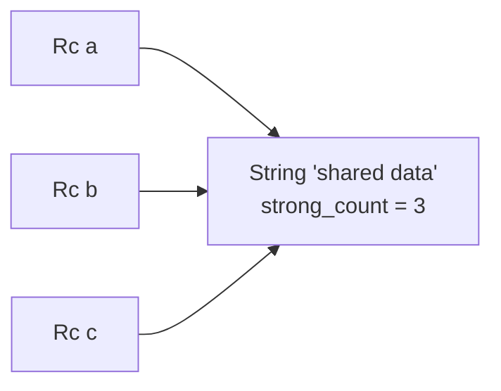

# Smart Pointers & Interior Mutability - Box, Rc, RefCell & Friends

Back in [Phase 6](06-ownership-and-borrowing.md) you learned Rust's iron law: every value has exactly one owner, and borrowing is checked at compile time - many readers *or* one writer, never both. That's what makes Rust safe with no garbage collector. But sooner or later you hit a wall it can't get you over: a linked list where each node needs to *be owned somewhere* but the type is defined in terms of itself; a value two parts of your program genuinely need to *share*; a tree where a child needs to update its parent. Taken literally, single ownership says these are impossible.

They're not. The escape hatches are **smart pointers**, and they don't *break* the ownership rules - they *bend them in controlled, documented ways*. Each one says exactly which rule it relaxes and what you pay for the privilege. Learn the four you'll actually use (`Box`, `Rc`, `Arc`, `RefCell`) and the two traits underneath them (`Deref`, `Drop`), and these stop being scary library types and become a toolkit you reach into deliberately.

📝 **Smart pointer** - a struct that *acts like* a pointer (dereference with `*`, call methods through it) but carries extra behavior: heap allocation, a reference count, runtime-checked borrowing, custom cleanup. `String` and `Vec<T>` are smart pointers too - they own heap data and clean it up for you - you've been using them all along.

## `Box<T>` - put one value on the heap

**What it actually is.** `Box<T>` is the simplest smart pointer: it takes a value, stores it on the **heap**, and gives you a fixed-size handle to it on the stack. Ownership works exactly as before - one owner, freed when the `Box` drops. The only thing that changed is *where the data lives*.

Most of the time you don't need a `Box` - Rust happily puts values on the stack. You reach for one when a value is too large to copy around on the stack, and - more importantly - when a type would otherwise have *infinite size*.

**Why recursive types need it.** Imagine a "cons list" (a list built from nested pairs, the classic Lisp shape). Written naively, each node contains the next node directly:

```rust
enum List {
    Cons(i32, List),   // a List that contains a List that contains a List...
    Nil,
}
```
```console
$ cargo build
error[E0072]: recursive type `List` has infinite size
 --> src/main.rs:1:1
  |
1 | enum List {
  | ^^^^^^^^^
2 |     Cons(i32, List),
  |               ---- recursive without indirection
  |
help: insert some indirection (e.g., a `Box`, `Rc`, or `&`) to break the cycle
  |
2 |     Cons(i32, Box<List>),
  |               ++++    +
```
*What just happened:* To lay out `List`, the compiler needs its size. But `Cons` contains a `List`, which contains a `List`, which contains... forever. The fix it suggests: put the inner `List` behind a `Box`. A `Box` is a pointer - always the same small, known size - so the recursion stops. Take the hint:

```rust
#[derive(Debug)]
enum List {
    Cons(i32, Box<List>),
    Nil,
}

use List::{Cons, Nil};

fn main() {
    // 1 -> 2 -> 3 -> Nil
    let list = Cons(1, Box::new(Cons(2, Box::new(Cons(3, Box::new(Nil))))));
    println!("{:?}", list);
}
```
```console
$ cargo run
Cons(1, Cons(2, Cons(3, Nil)))
```
*What just happened:* Each node now stores an `i32` and a `Box<List>` - a value plus a pointer to the next node on the heap. The type has a finite size, so it compiles, and the list can be as long as you like. `Box::new(...)` moves a value to the heap; the `Box` owns it and frees it when dropped - the everyday use of `Box`, especially for recursive shapes like lists and tree nodes.

💡 **Key point.** `Box<T>` changes *where* a value lives, not *who* owns it or *how* it's borrowed - one owner, normal borrow rules. It's the smart pointer that bends the fewest rules, which is exactly why it's the one to reach for first.

## `Rc<T>` - many owners, single-threaded

Now we bend a real rule. Sometimes a value genuinely needs **more than one owner**: two nodes pointing at the same shared child, several parts of a structure that all need to keep a configuration alive. Plain ownership forces you to pick one owner and hand everyone else borrows, then fight lifetimes to prove those borrows don't outlive it. `Rc<T>` sidesteps that.

📝 **`Rc<T>`** ("reference counted") - a smart pointer that allows **multiple owners** of the same value by keeping a count of how many owners exist. Each `Rc::clone` bumps the count up; each drop bumps it down; the value frees at zero. No single owner has to outlive the others - the data lives exactly as long as *someone* still holds an `Rc` to it.

The crucial detail: `Rc::clone` does **not** deep-copy the data. It copies the pointer and increments the count - cheap, no matter how big the underlying value. (By convention you write `Rc::clone(&a)` rather than `a.clone()`, to signal "this is a cheap refcount bump, not a deep copy.")

```rust
use std::rc::Rc;

fn main() {
    let a = Rc::new(String::from("shared data"));
    println!("count after creating a: {}", Rc::strong_count(&a));

    let b = Rc::clone(&a);   // b is a second owner - count goes to 2
    println!("count after b:          {}", Rc::strong_count(&a));

    {
        let c = Rc::clone(&a);  // a third owner, in an inner scope
        println!("count after c:          {}", Rc::strong_count(&a));
    } // c dropped here - count goes back down

    println!("count after c dropped:   {}", Rc::strong_count(&a));
    println!("value still alive:       {}", a);
}
```
```console
$ cargo run
count after creating a: 1
count after b:          2
count after c:          3
count after c dropped:   2
value still alive:       shared data
```
*What just happened:* `Rc::new` created the value with a count of 1. Each `Rc::clone` made another owner and bumped the count - `a`, `b`, and `c` all own the same `String`, with no copies of its bytes. When `c` went out of scope, its drop brought the count back to 2. The `String` frees only when the *last* `Rc` drops. `Rc::strong_count(&a)` lets you watch the bookkeeping happen.

The shared-ownership picture: three `Rc` handles, one heap value, one count.



⚠️ **`Rc<T>` is single-threaded only.** Its counter is an ordinary integer with no synchronization, so two threads bumping it at once would corrupt the count and cause double-frees or leaks. `Rc` is deliberately not safe to send between threads, and the compiler rejects any attempt to share one across threads. For that you need its thread-safe sibling, next.

## `Arc<T>` - the same idea, across threads

`Arc<T>` ("atomic reference counted") is `Rc<T>` with one change: the count updates using **atomic** operations, safe from multiple threads at once. The API is identical - `Arc::new`, `Arc::clone`, `Arc::strong_count` - so mentally it's "`Rc` you're allowed to share between threads."

```rust
use std::sync::Arc;
use std::thread;

fn main() {
    let data = Arc::new(vec![1, 2, 3]);
    let mut handles = vec![];

    for id in 0..3 {
        let data = Arc::clone(&data);   // each thread gets its own owning handle
        handles.push(thread::spawn(move || {
            println!("thread {id} sees {:?}", data);
        }));
    }

    for h in handles {
        h.join().unwrap();
    }
}
```
```console
$ cargo run
thread 0 sees [1, 2, 3]
thread 2 sees [1, 2, 3]
thread 1 sees [1, 2, 3]
```
*What just happened:* Each spawned thread received its own `Arc` clone (a cheap count bump), so all three share the one `Vec` without copying it. The atomic counter stays correct even though the threads run concurrently and finish in unpredictable order. The `Vec` frees only after the last thread drops its handle. We'll go deep on threads in [Phase 14](14-fearless-concurrency.md); for now, the takeaway is just *which* refcounted pointer to pick.

💡 **When to pay for `Arc` vs `Rc`.** Atomic operations cost slightly more than plain increments: use `Rc` for single-threaded sharing, `Arc` only when the value crosses thread boundaries. Don't reach for `Arc` "just in case" - the compiler will reject an `Rc` you try to send to a thread the moment you actually need one.

## Interior mutability with `RefCell<T>`

Notice what `Rc` *can't* do: it gives you shared ownership, but everything you get out of it is immutable - many owners, no writers, the borrow rule holding firm. So how do you get *shared, mutable* state, like a tree node that needs to update a value several owners can see? You need to bend the other rule: mutate through a shared reference. That's **interior mutability**.

📝 **Interior mutability** - a pattern where you mutate data even though you only hold a *shared* (`&`) reference to it. `RefCell<T>` makes this safe by **moving the borrow check from compile time to runtime**: the same rule (many readers or one writer) still applies, just checked by counters inside the `RefCell` as the program runs instead of by the compiler beforehand.

You ask for access with two methods: `.borrow()` gives a shared read handle, `.borrow_mut()` an exclusive write handle. Break the rules - ask for a `borrow_mut` while another borrow is live - and instead of a compile error you get a **runtime panic**.

```rust
use std::cell::RefCell;

fn main() {
    let log = RefCell::new(Vec::new());

    // We only hold `&log`, yet we can push into the Vec:
    log.borrow_mut().push("first");
    log.borrow_mut().push("second");

    println!("{:?}", log.borrow());   // a read borrow
}
```
```console
$ cargo run
["first", "second"]
```
*What just happened:* `log` is not declared `mut` and we never took a `&mut` to it - yet we mutated the `Vec` inside. Each `borrow_mut()` handed out a temporary exclusive write handle that ended at the semicolon, so the next one was free to take its turn; `RefCell` tracked this at runtime and saw no overlap.

Now the sharp edge: hold two conflicting borrows at once and it doesn't refuse to compile - it *panics*:

```rust
use std::cell::RefCell;

fn main() {
    let data = RefCell::new(5);

    let read = data.borrow();          // a shared borrow, still alive...
    let mut write = data.borrow_mut(); // ...and now an exclusive one. Conflict!

    *write += 1;
    println!("{} {}", read, write);
}
```
```console
$ cargo run
thread 'main' panicked at src/main.rs:7:26:
RefCell already borrowed
```
*What just happened:* The `read` borrow was still alive when we asked for `write`, violating "many readers *or* one writer." A plain `&`/`&mut` would have failed to compile (`error[E0502]`); `RefCell` instead let it compile and caught it at runtime, panicking with a `BorrowMutError` (the message reads `RefCell already borrowed`). ⚠️ **This is the price of `RefCell`:** a compile-time guarantee becomes a runtime check, so a violation the compiler would have caught for free now becomes a crash that only shows up when that path runs. Keep your borrows short and scoped.

**The classic combo: `Rc<RefCell<T>>`.** Stack the two and you get what neither gives alone: `Rc` provides multiple owners, `RefCell` lets each mutate the shared value. This pair is the standard Rust recipe for shared mutable state in single-threaded code (graphs, trees with back-references, observer-style structures).

```rust
use std::cell::RefCell;
use std::rc::Rc;

fn main() {
    let shared = Rc::new(RefCell::new(vec![1, 2, 3]));

    let owner_a = Rc::clone(&shared);
    let owner_b = Rc::clone(&shared);

    owner_a.borrow_mut().push(4);   // mutate through one owner
    owner_b.borrow_mut().push(5);   // ...and another

    println!("{:?}", shared.borrow());   // everyone sees the same updated Vec
}
```
```console
$ cargo run
[1, 2, 3, 4, 5]
```
*What just happened:* `owner_a` and `owner_b` are two owners of the *same* `RefCell<Vec<i32>>` (`Rc` made the sharing legal). Each called `borrow_mut()` to push into the shared `Vec`, and because the borrows didn't overlap, `RefCell` allowed both - the final read through `shared` shows one `Vec` that both owners mutated. `Rc<RefCell<T>>`: shared *and* mutable, single-threaded. (The thread-safe version is `Arc<Mutex<T>>`, from [Phase 14](14-fearless-concurrency.md).)

There's also **`Cell<T>`**, a lighter cousin of `RefCell` for `Copy` types like numbers and booleans. Instead of handing out borrows, it works by *moving values in and out* - `.get()` copies the value out, `.set(x)` replaces it - so there are no borrow handles to conflict and no runtime panic possible. Reach for `Cell` for a small `Copy` value; reach for `RefCell` when the value is bigger or non-`Copy` and you need a real borrow of it.

## The machinery underneath: `Deref` and `Drop`

Two traits make all of this work, and knowing their names demystifies the whole category.

**`Deref` - why `*` and method calls "see through" a smart pointer.** When you write `*my_box` to get at the value inside, or call `some_string.len()` even though `String` is a wrapper, that's the `Deref` trait. It defines what `*` does, and Rust uses it for *deref coercion*: automatically turning a `&Box<T>` into a `&T`, or a `&String` into a `&str`, so your smart pointer behaves like the value it wraps - why a `Box<T>` is so transparent that you mostly forget it's there.

```rust
fn main() {
    let boxed = Box::new(String::from("hello"));

    // Deref lets us call String methods straight through the Box,
    // and *boxed gets at the String itself:
    println!("len via Box: {}", boxed.len());
    println!("upper: {}", (*boxed).to_uppercase());
}
```
```console
$ cargo run
len via Box: 5
upper: HELLO
```
*What just happened:* `boxed` is a `Box<String>`, but `boxed.len()` worked as if it were a plain `String` - `Deref` coercion reached through the `Box` to the `String` (and `String`'s own `Deref` reaches further, to `&str`). `*boxed` explicitly dereferenced to the `String` value. This automatic see-through behavior is what makes smart pointers feel like the values they hold, not wrappers you constantly unpack.

**`Drop` - custom cleanup when a value goes out of scope.** The `Drop` trait defines code that runs automatically the moment a value is dropped. This is **RAII** (resource acquisition is initialization): tie a resource - heap memory, a file handle, a lock - to a value's lifetime, and its release is guaranteed even on an early return or a panic. It's how `Box` frees its heap, `Rc` decrements its count, and a file closes itself. You can implement it for your own types too:

```rust
struct Guard {
    name: String,
}

impl Drop for Guard {
    fn drop(&mut self) {
        println!("dropping Guard({})", self.name);
    }
}

fn main() {
    let _a = Guard { name: "a".into() };
    {
        let _b = Guard { name: "b".into() };
        println!("inner scope");
    } // _b dropped here
    println!("outer scope");
} // _a dropped here
```
```console
$ cargo run
inner scope
dropping Guard(b)
outer scope
dropping Guard(a)
```
*What just happened:* Each `Guard`'s `drop` ran automatically the moment it went out of scope - `_b` at the end of the inner block, `_a` at the end of `main`. Note the order: values drop in *reverse* order of creation (last in, first out). You never called `drop` yourself; the compiler inserted the calls. This is the same mechanism that frees every `Box`, decrements every `Rc`, and releases every lock in the language.

💡 **How to choose, in one breath.** `Box<T>` for one value on the heap (or a recursive type). `Rc<T>` / `Arc<T>` when a value needs **multiple owners** - `Rc` single-threaded, `Arc` across threads. `RefCell<T>` (often inside an `Rc`) when you need to **mutate through a shared reference**. Most code needs none of these; reach for a smart pointer only when the single-owner rule genuinely gets in your way, and pick the one that bends the *least*.

## Recap

1. **Smart pointers** are structs that act like pointers but add behavior (heap allocation, reference counting, runtime borrow checks, custom cleanup) - they bend the ownership rules in controlled, documented ways rather than breaking them.
2. **`Box<T>`** puts one value on the heap with normal single-owner, compile-time-borrow semantics; it's required for recursive types like cons lists and tree nodes (`error[E0072]` without it).
3. **`Rc<T>`** gives **multiple owners** via a reference count; `Rc::clone` is a cheap count bump (not a deep copy), and the value is freed when the count hits zero. ⚠️ Single-threaded only - use **`Arc<T>`** to share across threads.
4. **`RefCell<T>`** enables **interior mutability**: mutate through a shared reference by moving the borrow check to runtime. Break the rules and it **panics** (`BorrowMutError`) instead of failing to compile. `Rc<RefCell<T>>` is the standard single-threaded shared-mutable combo; `Cell<T>` is the lightweight option for `Copy` values.
5. **`Deref`** is why `*` and method calls see through a smart pointer (and powers deref coercion like `Box<String>` → `String` → `&str`); **`Drop`** runs cleanup automatically when a value's scope ends (RAII) - the mechanism behind every freed `Box`, decremented `Rc`, and closed file.
6. **Choosing:** `Box` for single-owner heap, `Rc`/`Arc` for shared ownership, `RefCell` for mutation through a shared reference - and most code needs none of them. Pick the pointer that bends the fewest rules.

## Quick check

Lock in the distinction that matters most - which pointer relaxes which rule:

```quiz
[
  {
    "q": "What does `Rc::clone(&a)` actually do?",
    "choices": [
      "Increments the reference count and returns another owning handle to the same data - no deep copy",
      "Makes a full, independent copy of the underlying value",
      "Moves ownership out of `a`, leaving it invalid",
      "Spawns a thread that shares the value"
    ],
    "answer": 0,
    "explain": "`Rc::clone` is cheap: it bumps the reference count and hands back another owner pointing at the *same* heap value. It does not copy the data. The value is freed only when the last `Rc` is dropped (count reaches zero)."
  },
  {
    "q": "You hold a `RefCell<T>`, call `.borrow()`, and then call `.borrow_mut()` while the first borrow is still alive. What happens?",
    "choices": [
      "The program panics at runtime with a BorrowMutError",
      "It fails to compile, just like a `&`/`&mut` conflict would",
      "Both borrows succeed silently - RefCell allows overlap",
      "The first borrow is automatically dropped to make room"
    ],
    "answer": 0,
    "explain": "`RefCell` moves borrow checking to runtime. The rule (many readers OR one writer) is still enforced, but a violation panics while the program runs instead of being caught by the compiler. That runtime panic is the price you pay for interior mutability."
  },
  {
    "q": "Why does a recursive `enum List { Cons(i32, List), Nil }` fail to compile, and how does `Box` fix it?",
    "choices": [
      "The type has infinite size; `Box<List>` is a fixed-size pointer to the heap, which breaks the recursion",
      "Enums can't be recursive at all; `Box` makes the enum into a struct",
      "`i32` is too small; `Box` upgrades it to a larger integer",
      "The compiler needs a `Drop` impl; `Box` provides one automatically"
    ],
    "answer": 0,
    "explain": "Laying out `List` requires its size, but a `List` containing a `List` containing a `List`... is infinite. `Box<List>` stores the next node on the heap and is itself a fixed-size pointer, so the type has a finite, known size and compiles."
  }
]
```

---

[← Phase 11: Traits & Generics, Deep](11-traits-and-generics.md) · [Guide overview](_guide.md) · [Phase 13: Error Handling, Deep →](13-error-handling-deep.md)
