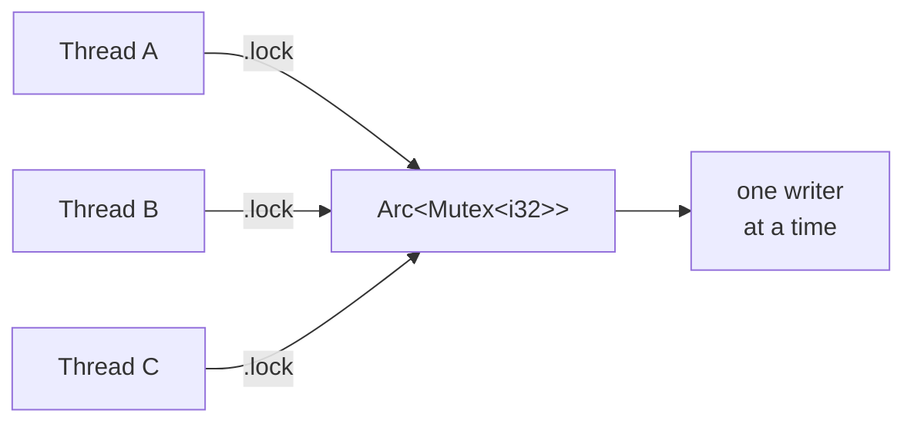

# Fearless Concurrency — Threads the Compiler Keeps Safe

Concurrency is where most languages quietly betray you. You write code that works on your laptop, ship it, and three weeks later a customer hits a race condition that only appears under load — two threads touched the same data at the same time, and the result was garbage. Those bugs are notoriously hard to reproduce and harder to fix, because they depend on timing.

Rust's pitch — and it's not marketing fluff — is **fearless concurrency**: you can write multithreaded code and trust that an entire category of those bugs *cannot reach production*, because the compiler refuses to build them. The trick is that there's no new safety system to learn here. It's the same ownership and borrowing rules from [Phase 6](06-ownership-and-borrowing.md), applied across threads. "Many readers or one writer, never both" is exactly what prevents a data race — and the borrow checker already enforces it. This phase is mostly about meeting the few tools that let you share data across threads *while keeping those rules intact*.

📝 **Data race** — two or more threads access the same memory at the same time, at least one of them writing, with no synchronization. The result is undefined: torn values, lost updates, corruption. This is the specific bug class Rust eliminates at compile time.

## Spawning threads

**What it actually is.** `std::thread::spawn` starts a new OS thread running a closure. It hands you back a `JoinHandle` — a receipt you can use to wait for that thread to finish and collect its result. Threads run *concurrently*, so the order their output appears in is not guaranteed.

```rust
use std::thread;

fn main() {
    let handle = thread::spawn(|| {
        for i in 1..=3 {
            println!("  spawned: {i}");
        }
    });

    for i in 1..=3 {
        println!("main: {i}");
    }

    handle.join().unwrap();   // wait for the spawned thread to finish
}
```
```console
$ cargo run
main: 1
main: 2
  spawned: 1
main: 3
  spawned: 2
  spawned: 3
```
*What just happened:* `spawn` launched a second thread that ran alongside `main`. Both loops printed at the same time, so their lines interleaved — and the exact interleaving changes from run to run, so your output order will differ from the above. `handle.join()` blocked `main` until the spawned thread finished; without it, `main` could return and tear the whole program down before the spawned thread ever printed.

⚠️ **`.join()` matters.** When `main` returns, the process ends — any still-running threads are killed mid-stride. If you spawn work and want it to actually complete, hold the `JoinHandle` and `.join()` it.

Now the more useful case: giving a thread some data to work with. A closure that uses a value from the surrounding scope needs to *own* it, because the thread may outlive the function that spawned it. You force that with the `move` keyword.

```rust
use std::thread;

fn main() {
    let greeting = String::from("hello from the main scope");

    let handle = thread::spawn(move || {
        // `move` gives this closure ownership of `greeting`
        println!("{greeting}");
    });

    handle.join().unwrap();
}
```
```console
$ cargo run
hello from the main scope
```
*What just happened:* `move` transferred ownership of `greeting` *into* the closure, so the spawned thread owns it outright. This is move semantics from Phase 6 doing exactly its job: the thread can't borrow `greeting` from `main`, because `main` might end first and drop it, leaving the thread holding a dangling reference. By *moving* it, ownership goes to the thread, and the problem disappears. The compiler insists on `move` here precisely so that dangling-reference bug can't happen.

## Why data races can't compile

Here's the headline, demonstrated. Suppose two threads try to mutate the same vector at the same time, the naive way — no synchronization, just shared mutable access. In C, C++, or Python this compiles and runs, and it's a data race waiting to corrupt your data. In Rust, it doesn't get past the compiler.

```rust
use std::thread;

fn main() {
    let mut data = vec![1, 2, 3];

    let handle = thread::spawn(move || {
        data.push(4);          // thread 1 mutates `data`
    });

    data.push(5);              // main also mutates `data` — two writers!
    handle.join().unwrap();
}
```
```console
$ cargo build
error[E0382]: borrow of moved value: `data`
 --> src/main.rs:9:5
  |
4 |     let mut data = vec![1, 2, 3];
  |         -------- move occurs because `data` has type `Vec<i32>`, which does not implement the `Copy` trait
6 |     let handle = thread::spawn(move || {
  |                                ------- value moved into closure here
7 |         data.push(4);
  |         ---- variable moved due to use in closure
...
9 |     data.push(5);
  |     ^^^^ value used here after move
```
*What just happened:* The `move` closure took ownership of `data` for the thread, so `main` no longer owns it — and `data.push(5)` in `main` is a use-after-move, exactly the error you met in Phase 6. The compiler won't let two owners mutate the same value. There's no way to express "both threads freely write to this" without going through a synchronization tool, and that's the whole point: the *only* way forward is to make the sharing safe.

💡 **This is the deal.** The race conditions other languages ship to production and chase with logging and prayer, Rust catches at build time — using nothing more than the ownership rules you already know. The compiler error feels like an obstacle, but it's the language refusing to let you write the bug.

## Sharing mutable state: `Arc<Mutex<T>>`

Sometimes you genuinely need multiple threads to share *and* mutate the same data. Rust makes you do it safely, with two pieces that stack together:

- **`Arc<T>`** — an *atomically reference-counted* pointer (the thread-safe sibling of `Rc` from [Phase 12](12-smart-pointers.md)). It lets several threads *co-own* the same value; the data is dropped only when the last owner goes away.
- **`Mutex<T>`** — a *mutual-exclusion lock*. To touch the data inside, a thread must call `.lock()`, which blocks until it's the *only* thread holding the lock. While it holds the lock, no one else can get in.

📝 **Mutex** — a lock that guarantees only one thread accesses the protected data at a time. `.lock()` returns a guard; when the guard goes out of scope, the lock releases automatically (no manual unlock to forget).

`Arc` answers "who owns this?" (everyone, jointly). `Mutex` answers "who may write to it *right now*?" (whoever holds the lock — one at a time). Together, `Arc<Mutex<T>>` is the standard way to share mutable state across threads.



Here ten threads each bump a shared counter. Without the `Mutex`, that's the classic data race; with it, every increment is safe:

```rust
use std::sync::{Arc, Mutex};
use std::thread;

fn main() {
    let counter = Arc::new(Mutex::new(0));
    let mut handles = vec![];

    for _ in 0..10 {
        let counter = Arc::clone(&counter);   // a new owning handle for this thread
        let handle = thread::spawn(move || {
            let mut num = counter.lock().unwrap();   // wait for the lock
            *num += 1;                                // safe: we hold it exclusively
        });                                          // lock releases as `num` drops
        handles.push(handle);
    }

    for handle in handles {
        handle.join().unwrap();
    }

    println!("final count: {}", *counter.lock().unwrap());
}
```
```console
$ cargo run
final count: 10
```
*What just happened:* `Arc::clone` made ten owning handles to the *same* `Mutex` — cheap, it just bumps the reference count, it doesn't copy the data. Each thread called `.lock()`, which handed it exclusive access and blocked any other thread from getting in until the guard (`num`) dropped at the end of the closure. Because only one thread ever mutates the counter at a time, the final value is reliably `10`. Run it a thousand times and it's `10` every time — there's no race to lose.

⚠️ **Rust prevents data races, not deadlocks.** A `Mutex` can still deadlock: if thread A holds lock 1 and waits for lock 2, while thread B holds lock 2 and waits for lock 1, both wait forever. That's a *logic* bug, not a data race, and the compiler can't catch it. The guardrails: always acquire multiple locks in the same order everywhere, and keep locked sections short. Fearless concurrency means no data races — it does not mean no thinking.

## `Send` and `Sync`: the traits behind the magic

How does the compiler *know* whether a type is safe to move to a thread or share between threads? Two marker traits, applied automatically.

📝 **`Send`** — a type is `Send` if it's safe to *move* to another thread. `String`, `Vec<T>`, `Arc<T>` are all `Send`. This is what made the `move` closure earlier legal.

📝 **`Sync`** — a type is `Sync` if it's safe to *share by reference* across threads (i.e. `&T` can be handed to multiple threads at once). `Mutex<T>` is `Sync` because its lock guarantees safe access.

These are *marker* traits — they carry no methods. They're labels the compiler reads to decide what's allowed. Almost every type is automatically `Send` and `Sync` because it's built from parts that are. You rarely write `Send` or `Sync` yourself; you just feel them when something *isn't*.

The sharpest example is exactly why `Arc` exists. `Rc<T>` from Phase 12 is **not** `Send` — its reference count is a plain integer, so two threads bumping it at once would race and corrupt the count. Try to send an `Rc` to a thread and the compiler stops you:

```rust
use std::rc::Rc;
use std::thread;

fn main() {
    let data = Rc::new(42);
    let handle = thread::spawn(move || {
        println!("{}", data);   // moving a non-Send Rc into a thread
    });
    handle.join().unwrap();
}
```
```console
$ cargo build
error[E0277]: `Rc<i32>` cannot be sent between threads safely
 --> src/main.rs:6:32
  |
6 |     let handle = thread::spawn(move || {
  |                                ^^^^^^^ `Rc<i32>` cannot be sent between threads safely
  |
  = help: the trait `Send` is not implemented for `Rc<i32>`
note: required because it's used within this closure
```
*What just happened:* `Rc` isn't `Send`, so the closure that captures it isn't `Send` either, and `thread::spawn` requires its closure to be `Send`. The compiler traced the whole chain and refused. The fix is `Arc`, whose reference count uses atomic operations that *are* safe across threads — which is the entire reason `Arc` exists alongside `Rc`. This is `Send`/`Sync` quietly doing their job: you didn't mention either trait, but they decided what was allowed.

## Channels: share by communicating

`Arc<Mutex<T>>` shares state. There's an often-cleaner alternative: don't share at all — *pass messages*. One thread sends values, another receives them, and ownership of each value moves across the boundary. No locks, no shared mutable state to reason about.

The standard library gives you this through `std::sync::mpsc` — **m**ultiple **p**roducer, **s**ingle **c**onsumer. `channel()` returns a `(Sender, Receiver)` pair: the sender's `.send()` pushes a value in, the receiver pulls values out (it's even iterable, ending when all senders are dropped).

```rust
use std::sync::mpsc;
use std::thread;

fn main() {
    let (tx, rx) = mpsc::channel();

    thread::spawn(move || {
        for word in ["the", "missing", "manual"] {
            tx.send(String::from(word)).unwrap();   // ownership moves into the channel
        }
        // tx drops here, which closes the channel
    });

    for received in rx {            // iterate until the channel closes
        println!("got: {received}");
    }
}
```
```console
$ cargo run
got: the
got: missing
got: manual
```
*What just happened:* The spawned thread `send`s three strings down the channel; ownership of each `String` *moves* into the channel and back out to the receiver, so there's never a moment where two threads hold the same value — the data race is structurally impossible. The `for received in rx` loop pulls values as they arrive and ends cleanly when `tx` is dropped (closing the channel). No `Mutex`, no `.lock()`, no shared state to coordinate.

💡 **A rule of thumb worth keeping.** *Share by communicating where you can; reach for `Arc<Mutex>` when you must share state.* Message passing keeps each piece of data owned by exactly one thread at a time, which sidesteps a whole class of locking headaches. Use shared state when threads genuinely need to read and write the same thing concurrently.

**One last horizon: `async`/`await`.** Everything above is about *threads* — great for CPU-bound work, where you want multiple cores chewing on a problem at once. But for *I/O-bound* work — a server juggling thousands of network connections that spend most of their time waiting — spawning a thread per connection is wasteful. Rust's answer is `async`/`await`: you write functions that can *pause* while waiting for I/O and let the same thread do other work in the meantime, handling thousands of tasks on a handful of threads. It needs a runtime to drive it (the ecosystem standard is **Tokio**), and it's a substantial topic of its own — the natural next domain to explore once threads feel comfortable. The same fearless-concurrency guarantees carry over: the compiler keeps async code data-race-free too.

## Recap

1. **`thread::spawn`** runs a closure on a new thread and returns a **`JoinHandle`**; call **`.join()`** to wait for it to finish (output order between threads is not guaranteed). Use a **`move`** closure to give the thread ownership of the data it uses.
2. **Data races can't compile.** Naive shared mutation fails the borrow checker — the same ownership rules from Phase 6 forbid two threads from freely mutating one value, so the bug class never ships.
3. **`Arc<Mutex<T>>`** is how you share mutable state safely: `Arc` for thread-safe shared ownership, `Mutex` for one-writer-at-a-time access via `.lock()`. ⚠️ It prevents data races, *not* deadlocks — those are logic bugs you must still avoid.
4. **`Send`** (safe to move to another thread) and **`Sync`** (safe to share by reference) are marker traits the compiler uses to enforce all of the above. Most types get them automatically; `Rc` is neither, which is exactly why `Arc` exists.
5. **Channels** (`std::sync::mpsc`) let threads communicate by passing values, moving ownership across the boundary — often cleaner than shared state. Reach for `async`/`await` (with a runtime like Tokio) when the bottleneck is I/O, not CPU.

## Quick check

Make sure the core idea stuck — that Rust's thread safety is just ownership, extended:

```quiz
[
  {
    "q": "Why does a `move` closure passed to `thread::spawn` need to take ownership of the data it uses?",
    "choices": [
      "Because the spawned thread may outlive the function that created the data, so borrowing it could leave a dangling reference",
      "Because `move` makes the closure run faster",
      "Because threads cannot read any data unless they own it, even temporarily",
      "Because `spawn` always copies its closure twice"
    ],
    "answer": 0,
    "explain": "A spawned thread can outlive the scope it was created in. If it only borrowed the data, that data could be dropped while the thread still used it — a dangling reference. `move` transfers ownership to the thread, so the data lives as long as the thread does."
  },
  {
    "q": "In `Arc<Mutex<T>>`, what does each of the two pieces do?",
    "choices": [
      "`Arc` provides thread-safe shared ownership; `Mutex` ensures only one thread accesses the data at a time",
      "`Arc` locks the data; `Mutex` counts references",
      "Both do the same thing, so either one alone is enough",
      "`Arc` prevents deadlocks; `Mutex` prevents memory leaks"
    ],
    "answer": 0,
    "explain": "`Arc` is an atomically reference-counted pointer that lets multiple threads co-own the value. `Mutex` is the lock that guarantees exclusive access — one writer at a time via `.lock()`. Stacked together, they share mutable state safely."
  },
  {
    "q": "Why can't you send an `Rc<T>` to another thread, while an `Arc<T>` is fine?",
    "choices": [
      "`Rc` isn't `Send` because its reference count isn't atomic and would race; `Arc` uses atomic counting and is `Send`",
      "`Rc` is too large to fit in a thread's stack",
      "`Arc` is just an older name for `Rc`, so there's no real difference",
      "`Rc` only works inside `async` functions"
    ],
    "answer": 0,
    "explain": "`Rc`'s reference count is a plain integer; two threads modifying it at once would corrupt the count, so `Rc` is not `Send` and the compiler rejects sending it across threads. `Arc` uses atomic operations for its count, making it safe to share — which is exactly why it exists."
  }
]
```

---

[← Phase 13: Error Handling, Deep](13-error-handling-deep.md) · [Guide overview](_guide.md) · [Phase 15: Closures, Iterators & Zero-Cost Abstractions →](15-closures-and-iterators.md)
