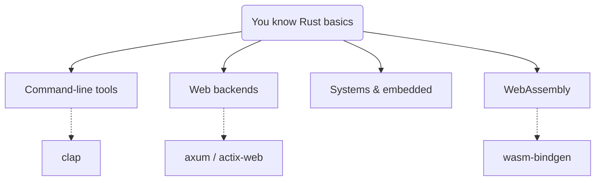

# Where to Go Next

If you've made it through ownership, errors, the tooling, and the idioms, take a second to notice what happened: you learned the hard part. The thing people are scared of - the borrow checker - you've now met face to face, and you understand what it's doing and why. Everything from here is *applying* what you know to a domain you care about. This phase is a short, clear map of where Rust shines and what to read next.

## Pick a direction by what you want to build

Rust isn't a "web language" or a "systems language" - it's genuinely good across a wide range, and the fastest way to get fluent is to build something real in an area that excites you. Here's the straight lay of the land:

- **Command-line tools.** Rust's sweet spot for a first real project - fast, single-binary, easy to share. Reach for **`clap`** for a polished CLI with help text and flags in an afternoon.
- **Web backends.** Rust makes fast, reliable servers. The two crates you'll hear about are **`axum`** and **`actix-web`**, both mature and widely used. *(The Missing Manual's own backend is a Rust server built with `axum`.)*
- **Systems & embedded.** The classic Rust territory - operating systems, databases, drivers, game engines, and microcontrollers with no operating system at all. Here "memory safety with no garbage collector" from [Phase 6](06-ownership-and-borrowing.md) pays its biggest dividends.
- **WebAssembly (WASM).** Compile Rust to run *in the browser* at near-native speed, often alongside JavaScript, via **`wasm-bindgen`**. Great for performance-critical web code like image processing, games, simulations.

You don't have to choose forever - pick the one that makes you want to open your editor tonight.

## The deep dive: *The Rust Programming Language*

When you want to go from "I can read and write Rust" to "I understand it thoroughly," there's one canonical resource: **"The Rust Programming Language,"** universally known as **"the Book."** It's the official, free, online book maintained by the Rust team - thorough, beginner-respecting, and the reference the community points to. (Find it at [doc.rust-lang.org/book](https://doc.rust-lang.org/book/).)

This guide gave you the working mental model fast; the Book gives you the complete picture at a comfortable pace. They pair well - come back to whatever chapter you're stuck on, and it'll go deeper than we had room to.

💡 **Key point.** The best next step isn't more reading - it's building. Pick a tiny project (a CLI that renames files, a web endpoint that returns the time, a number-cruncher) and finish it. You'll learn more from one completed small thing than three chapters you only read.

## A word about the borrow checker, before you go

Here's the plain, encouraging truth to carry with you: **the borrow checker stops fighting you sooner than you think.** Week one, it feels relentless. By the time you've built a project or two, you're writing code it accepts on the first try without consciously trying, because you've absorbed how it thinks. That frustration you may have felt in [Phase 6](06-ownership-and-borrowing.md) is temporary and *productive* - the feeling of learning to write code that doesn't have whole categories of bugs.

That's the deal Rust offers, plainly: more thinking up front, in exchange for programs that are fast and don't crash from memory bugs or data races. Every language makes a trade like this - if you're curious *why* they differ so much in these choices, [Programming Languages, Explained Like a Human](/guides/languages-explained-like-a-human) lays out the whole landscape and where Rust sits in it.

You've got the mental model now. Go build something. Welcome to Rust.

## Recap

1. **Choose by what you want to build:** CLIs (`clap`), web backends (`axum`/`actix-web`), systems & embedded, or WebAssembly (`wasm-bindgen`).
2. **The Book** ([doc.rust-lang.org/book](https://doc.rust-lang.org/book/)) is the official, free, thorough deep dive - pair it with hands-on building.
3. **Build a small thing and finish it** - that teaches more than more reading.
4. The **borrow checker stops fighting you sooner than you think**; the up-front thinking buys you fast, crash-resistant programs.

---

[← Phase 17: Performance, Unsafe & the Ecosystem](17-performance-and-unsafe.md) · [Guide overview](_guide.md)
