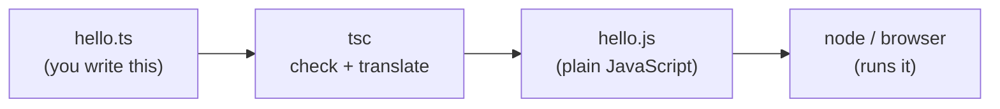

# Install & Your First Program - tsc, tsconfig, and the Compile Step

If you're arriving from the JavaScript guide, you already know the punchline: TypeScript is JavaScript plus a type checker that reads your code *without running it* and points at mistakes while you type. This phase is where you actually get it onto your machine and run it - and the very first thing to internalize is the one fact that explains the entire workflow.

## The mental model: TypeScript compiles to JavaScript

Here it is, the whole foundation in one sentence: **nothing runs TypeScript directly.** Not Node, not your browser, not anything. TypeScript is a language for *you and the checker* to talk in. Before your code can execute, a tool reads your `.ts` files, verifies the types line up, and emits ordinary `.js` files. Those `.js` files are what actually run.

That tool is `tsc`.

📝 **`tsc`** - the TypeScript compiler. It does two jobs at once: it **type-checks** your code (the part that catches bugs) and it **transpiles** it - strips out the type annotations and rewrites any newer syntax - producing plain JavaScript. "Compile" here mostly means "check, then translate down to JS."

Picture the pipeline. You write `.ts`. `tsc` turns it into `.js`. Then a normal JavaScript runtime - Node or a browser - runs the `.js`:



*What just happened:* the diagram traces the only path your code can take. The `.ts` file is the source you author; it never reaches a runtime. `tsc` sits in the middle as a gate - if the types don't check out, you find out *here*, before anything runs. What comes out the other side is `.js` with every type annotation deleted, which is why a browser or Node can run it without knowing TypeScript exists at all.

💡 **Why this matters from day one.** A whole class of "wait, where did my types go?" confusion vanishes once you hold this model. Types live at *compile time* - they help you and `tsc`, then they're erased. The `.js` that runs has no idea what a type is. Keep this in your back pocket; it's the answer to half the surprises beginners hit.

## Install TypeScript

You need Node installed already (the JavaScript guide covers that - confirm with `node --version`). TypeScript ships as an npm package. Two ways to install it, and the difference is worth understanding.

**The quick way - install it globally.** This puts the `tsc` command on your whole system so you can run it from any folder:

```bash
npm install -g typescript
```

**The way real projects do it - install it as a dev dependency.** Inside a project folder, this pins a specific TypeScript version to *that project*, so everyone working on it (and your CI server) uses the exact same compiler:

```bash
npm install --save-dev typescript
```

⚠️ **A global install is convenient but lies to you about versions.** If you only install globally, every project on your machine shares one `tsc` - and the day two projects need different TypeScript versions, you're stuck. Real projects keep TypeScript in `devDependencies` and run it via `npx tsc` (which uses the project's local copy). For *learning* on a scratch file, global is fine; for anything you'll commit, prefer the local install. We'll use a global `tsc` below to keep the commands short.

Whichever you chose, confirm it landed by asking the compiler its version:

```bash
tsc --version
```
```console
Version 5.4.5
```

*What just happened:* you ran `tsc` with the `--version` flag and it reported the compiler version it installed. Your exact number will differ - what matters is that you got `Version` and some digits back instead of `command not found`. (If you installed locally instead of globally, the bare `tsc` command won't be found; use `npx tsc --version`, which runs the project's local copy.)

## Your first program

Create a file called `hello.ts` - the `.ts` extension is what tells `tsc` "this is TypeScript." Put a small typed function in it:

```typescript
function greet(name: string): string {
  return `Hello, ${name}!`;
}

console.log(greet("TypeScript"));
```

*What just happened:* this is plain JavaScript with two annotations bolted on. `name: string` says the parameter must be a string. The `: string` after the parentheses says the function returns a string. Everything else - the template literal, `console.log` - is exactly the JavaScript you already know. The annotations are notes to the checker; they have no effect on what the program *does*.

Now compile it. Hand the file to `tsc`:

```bash
tsc hello.ts
```

This command prints nothing if all is well - silence means success. But look in your folder and you'll find a new file sitting next to `hello.ts`:

```typescript
// hello.js  - emitted by tsc
function greet(name) {
    return `Hello, ${name}!`;
}
console.log(greet("TypeScript"));
```

*What just happened:* `tsc` checked your types, found no problems, and wrote out `hello.js` - the same code with `: string` and the return annotation **stripped away**. This is the compile step from the mental model, made concrete: the types did their job at check time and then disappeared, leaving plain JavaScript behind. That emitted `.js` is what you actually run.

So run it - with Node, exactly as you would any JavaScript file:

```bash
node hello.js
```
```console
Hello, TypeScript!
```

*What just happened:* Node ran the *generated* `hello.js`, not your `hello.ts`. Node has never heard of TypeScript; it doesn't need to, because by the time it runs, all it's looking at is ordinary JavaScript. That's the full loop you'll repeat constantly: **edit `.ts` → `tsc` → run the `.js` with Node.**

## Watch the checker catch a bug

Everything so far just produced output - you could've skipped TypeScript entirely and written `hello.js` by hand. So here's the actual payoff, the reason any of this is worth a compile step. Break the program on purpose. Change the call to pass a number where `greet` demands a string:

```typescript
function greet(name: string): string {
  return `Hello, ${name}!`;
}

console.log(greet(42)); // 42 is a number, not a string
```

Now run `tsc hello.ts` again:

```bash
tsc hello.ts
```
```console
hello.ts:5:19 - error TS2345: Argument of type 'number' is not assignable to parameter of type 'string'.

5 console.log(greet(42)); // 42 is a number, not a string
                    ~~

Found 1 error in hello.ts:5
```

*What just happened:* `tsc` refused to wave the code through. It pointed at the exact file, line, and column (`hello.ts:5:19`), named the problem in plain terms - a `number` can't go where a `string` is required - and even underlined the offending `42`. Crucially, this happened **before the program ran**. There was no execution, no `NaN` quietly flowing downstream, no mysterious failure three screens later. The mistake was caught at rest, on the source code itself.

💡 **This is the entire pitch for TypeScript, in one error message.** In plain JavaScript, `greet(42)` runs without complaint and produces `"Hello, 42!"` - maybe harmless here, maybe a disaster when the value is wrong in a way that matters. TypeScript moves that discovery from "sometime at runtime, if you're lucky" to "right now, in your editor." The bug was always there; the checker just found it at the cheapest possible moment. (In a real editor like VS Code, you don't even run `tsc` to see this - the same red underline appears as you type.)

## tsconfig.json and a smoother workflow

Typing `tsc hello.ts` for one file is fine, but real projects have dozens of files and a pile of compiler options you don't want to retype every time. The fix is a config file. Generate one with:

```bash
tsc --init
```

*What just happened:* `tsc --init` created a `tsconfig.json` in your folder - a heavily-commented file listing every compiler option with sensible defaults. Its presence does something important: from now on you can run plain `tsc` (no filename), and the compiler will find every `.ts` file in the project and compile them all according to the rules in that file. The config *is* your project's compile recipe.

📝 **`tsconfig.json`** - the configuration file for `tsc`. It defines which files to compile, what JavaScript version to emit, where output goes, and - most importantly - how strict the type checking is. Running `tsc` in a folder that has one means "compile this whole project, my way."

One option deserves a flag now even though we cover it in depth later: `strict`. A freshly-generated `tsconfig.json` turns it on (`"strict": true`), and you should leave it on.

💡 **Leave `strict` on, always.** It switches on the checks that catch the most bugs - including forcing you to handle `null` and `undefined` instead of letting them slip through. Beginners are sometimes tempted to turn it off because it complains more; that's exactly backwards. The complaints are the value. We devote all of [Phase 8](08-modules-and-tsconfig.md) to `tsconfig` and strict mode - for now, just know it's there and it's your friend.

Two more things that make day-to-day work far less tedious:

**Watch mode** recompiles automatically every time you save, so you're not re-running `tsc` by hand:

```bash
tsc --watch
```

*What just happened:* `tsc --watch` (or `tsc -w`) starts the compiler and leaves it running. It compiles once, then sits and watches your files; the instant you save a change, it re-checks and re-emits, printing any errors in the terminal in real time. You edit, you glance at the terminal, you see immediately whether the checker is happy. Leave it running in a spare terminal while you work.

**`ts-node`** lets you run a `.ts` file directly during development, skipping the separate compile-then-run dance:

```bash
npx ts-node hello.ts
```
```console
Hello, TypeScript!
```

*What just happened:* `ts-node` compiled `hello.ts` **in memory** and ran the result in one step - no `hello.js` written to disk. It's a convenience for development and quick experiments: one command instead of two. Don't let it blur the mental model, though - `ts-node` is still doing the exact `.ts → tsc → .js → run` pipeline under the hood; it just hides the middle steps. For shipping real code you still compile properly with `tsc`.

## Recap

1. **Nothing runs TypeScript directly.** `tsc` checks your types and emits plain `.js`, and *that* JavaScript is what Node or the browser actually runs - the `.ts → tsc → .js → run` pipeline.
2. **Install it** with `npm install -g typescript` (quick) or `npm install --save-dev typescript` (how real projects pin a version); confirm with `tsc --version`.
3. **The loop is edit → compile → run:** write `hello.ts`, run `tsc hello.ts` to produce `hello.js` with the type annotations stripped out, then `node hello.js`.
4. **The payoff is compile-time errors.** Passing a number where a string is required makes `tsc` report the exact file, line, and reason *before the program runs* - the whole reason TypeScript exists.
5. **`tsconfig.json`** (from `tsc --init`) is your project's compile recipe; keep `"strict": true` on. Phase 8 goes deep on it.
6. **`tsc --watch`** recompiles on every save, and **`ts-node`** runs a `.ts` file directly during development - both conveniences over the same underlying pipeline.

You can now write, compile, and run TypeScript, and you've seen the checker do its one essential job. Next, we look at *why* types pay off and the basic types you'll annotate with every day.

## Quick check

Lock in the one idea that drives the whole workflow - what actually runs, and when bugs get caught:

```quiz
[
  {
    "q": "When you run `node hello.js` after compiling `hello.ts`, what is Node actually executing?",
    "choices": [
      "The plain JavaScript that `tsc` emitted, with all type annotations stripped out",
      "The `hello.ts` file directly - Node understands TypeScript natively",
      "The type annotations, which Node checks again at runtime",
      "Both files at once, merged together by `tsc`"
    ],
    "answer": 0,
    "explain": "Nothing runs TypeScript directly. `tsc` translates `hello.ts` into plain `hello.js`, deleting every type annotation. Node runs that emitted JavaScript and never needs to know TypeScript exists."
  },
  {
    "q": "You change a call to `greet(42)` when `greet` expects a `string`. When do you find out it's wrong?",
    "choices": [
      "At compile time - `tsc` reports the error before the program ever runs",
      "At runtime, when Node crashes on the line",
      "Never - TypeScript allows it and silently converts the number",
      "Only if you remember to add a runtime check yourself"
    ],
    "answer": 0,
    "explain": "That's the entire point of TypeScript. `tsc` checks types without running the code, so it flags `greet(42)` at compile time - naming the file, line, and reason - long before any runtime is involved."
  },
  {
    "q": "What does running `tsc --init` give you, and why keep `\"strict\": true`?",
    "choices": [
      "A `tsconfig.json` recipe for the whole project; strict mode turns on the checks that catch the most bugs",
      "A compiled `hello.js`; strict mode makes that file run faster",
      "A global install of TypeScript; strict mode disables type checking for speed",
      "A new `.ts` file template; strict mode is only for advanced users and should be off"
    ],
    "answer": 0,
    "explain": "`tsc --init` creates `tsconfig.json`, the config that lets you run plain `tsc` over a whole project. `strict: true` enables the strongest, most bug-catching checks - leave it on; the extra complaints are exactly the value."
  }
]
```

---

[Guide overview](_guide.md) · [Phase 2: Why Types & the Basic Types →](02-why-types-and-basic-types.md)
