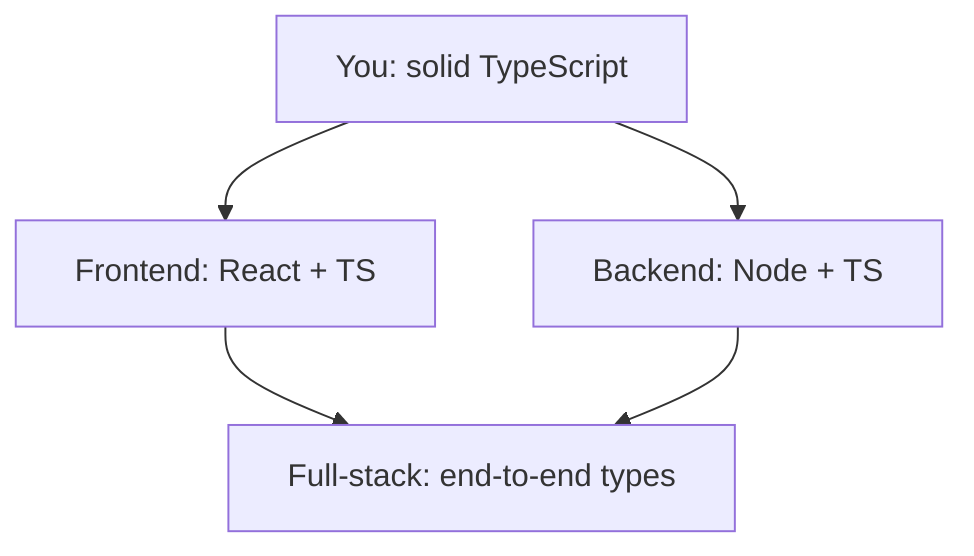

# Where to Go Next - Putting TypeScript to Work

You made it. You can read and write generics, model real data with unions and discriminated unions, narrow types until the compiler trusts you, and bend the type system with conditional and mapped types. That's the *hard* part, and the durable one - frameworks come and go, but the type system you just learned is the same whether you're writing a React component, a server, or a build script.

So this last phase isn't more syntax. Everything from here is **applying** what you already know. TypeScript on its own is rarely the destination - it's the language you reach for *while* building something else. This is the clear map of where it goes, and what to build so it sticks.

## The branches from here



*What this shows:* two directions lead out - browser and server - converging on what makes TypeScript genuinely special: types that flow across the whole stack. You don't have to pick forever, but pick **one to go deep on next**. Depth beats breadth when learning; a half-understood frontend plus a half-understood backend is worse than one you actually command.

## Frontend with React + TypeScript

This is the most common TypeScript job, full stop. React describes a UI as components, and TypeScript types the data flowing through them: the `props` a component accepts, the shape of its `state`, the return of a `useState` or custom hook. The payoff you felt all through this guide - autocomplete on every property, a red squiggle the instant you pass the wrong shape - is what makes typed React pleasant. You stop guessing what a component expects; the types tell you.

If you came from our [JavaScript guide](/guides/javascript-from-zero) and met React there, this is the same React with a safety net bolted on - a short leap.

## Backend with Node + TypeScript

The same language runs the server. With **Node**, you build typed APIs - code that listens for requests, talks to a database, and sends back JSON. The popular starting points are **Express** (small and everywhere), **Fastify** (faster, schema-friendly), and **NestJS** (opinionated, structured, heavy on the TypeScript). Here the types guard a different boundary: the request body, the database row, the response shape. A typo in a field name becomes a compile error instead of a 3 a.m. production page.

The natural path if you liked modeling data more than rendering it.

## Full-stack and end-to-end type safety

Here's where it gets good. Combine a typed frontend, a typed backend, and a database, and you can make **one type definition flow across all three**. Tools like **tRPC** and **Prisma** are built on exactly the mapped and conditional types from [Phase 10](10-utility-and-mapped-types.md) and [Phase 11](11-conditional-and-template-types.md): Prisma generates types from your database schema, tRPC carries your server's function signatures to the client untouched. The result is autocomplete from the database row all the way to the button in the UI - no hand-written API contract in between.

> 💡 This is *the* reason TypeScript is everywhere. One type definition can travel from database → server → client. Rename a column or change an API's return shape, and the frontend lights up with red squiggles **before you ship** - the compiler catches the mismatch across the entire stack, in your editor, the moment you make it. No other mainstream stack gives you that for free.

Don't try to learn tRPC and Prisma cold, though. Build a small typed frontend and backend separately first; full-stack type safety makes sense only once you've felt both halves.

## What to actually build

Reading got you here. *Building* turns knowledge into skill - something small enough to finish but real enough to teach you the messy parts. In rough order:

1. **Convert a small JS project to TS.** Take something you (or anyone) already wrote in JavaScript, rename the files, turn on `strict`, and fix the errors one by one. The fastest way to *feel* the payoff - every error the compiler surfaces is a bug it would have caught for you.
2. **A typed API plus a typed frontend that consumes it.** Start with a plain REST API (Express or Fastify) and a small frontend that fetches from it. When comfortable, rebuild the seam with **tRPC** and watch the types flow across it.
3. **A CLI with typed arguments.** Smaller and underrated - a command-line tool that parses and validates its flags. Great for practicing unions, narrowing, and modeling input without a browser in sight.

Whatever you pick: **finish one.** A finished rough project teaches more than three polished half-projects abandoned at 80%.

## A last word

When a corner of the type system feels fuzzy, the [TypeScript Handbook](https://www.typescriptlang.org/docs/handbook/intro.html) is the canonical reference - accurate, thorough, and where the experts actually check. Bookmark it.

If the JavaScript *underneath* still feels shaky - closures, `async`/`await`, the event loop - that's worth shoring up, since TypeScript only types the JavaScript you already understand. [JavaScript From Zero](/guides/javascript-from-zero) is right there. For the big-picture view of how languages relate and why TypeScript made the choices it did, [Languages, Explained Like a Human](/guides/languages-explained-like-a-human) is a calm read that puts it all in context.

You started this guide unsure what an `interface` was for. You're leaving it able to model real-world data, reason about generics, and choose your next step on purpose. That's the hard part, and it's behind you. Go build the small thing - the rest is more of what you already know.

## Recap

1. **You learned the durable part - the type system itself.** Everything from here is applying it; frameworks change, but generics, unions, and narrowing carry over everywhere.
2. **Two branches lead out:** typed **React** on the frontend (the most common TS job) and typed **Node** APIs on the backend (Express, Fastify, NestJS). Go deep on one.
3. **End-to-end type safety is TypeScript's killer payoff:** with tRPC and Prisma, one type definition flows from database to UI, so a backend change lights up red squiggles in the frontend before you ship.
4. **Build to learn:** convert a small JS project to TS with `strict` on, build a typed API plus a frontend consuming it, or write a CLI with typed args. **Finish one.**
5. **Keep the [TypeScript Handbook](https://www.typescriptlang.org/docs/handbook/intro.html) close** as your canonical reference, and shore up the JavaScript underneath if it still feels shaky.

## Quick check

One last check on the big picture:

```quiz
[
  {
    "q": "Why is 'end-to-end type safety' described as TypeScript's killer payoff?",
    "choices": [
      "One type definition can flow from database to server to client, so a backend change surfaces as a compile error in the frontend before you ship",
      "It makes your code run faster at runtime by skipping type checks",
      "It removes the need to ever write a frontend or a database",
      "It automatically writes your React components for you"
    ],
    "answer": 0,
    "explain": "Tools like Prisma and tRPC let a single type definition travel across the whole stack. Change a column or an API's return shape and the mismatch lights up as a red squiggle in the frontend in your editor - caught before it ever reaches production."
  },
  {
    "q": "You want to feel TypeScript's payoff as fast as possible. Which first project does that best?",
    "choices": [
      "Convert a small existing JS project to TS, turn on `strict`, and fix the errors",
      "Read the entire TypeScript Handbook cover to cover before writing any code",
      "Build a large full-stack app with tRPC and Prisma on day one",
      "Rewrite the TypeScript compiler from scratch"
    ],
    "answer": 0,
    "explain": "Converting a real JS project with `strict` on surfaces concrete bugs immediately - every error the compiler flags is one it would have caught for you. It's the quickest way to feel the safety net, and it builds on JavaScript you already understand."
  },
  {
    "q": "Which advanced TypeScript features from this guide power tools like tRPC and Prisma?",
    "choices": [
      "Conditional and mapped types - used to transform and derive types across the stack",
      "Only the `any` type, applied everywhere",
      "Runtime reflection that inspects values while the program runs",
      "Nothing from the type system - they're written in plain JavaScript"
    ],
    "answer": 0,
    "explain": "Prisma generates types from your database schema and tRPC carries your server's signatures to the client - both lean on the mapped and conditional types you met in Phases 10-11 to transform one type into another automatically."
  }
]
```

---

[← Phase 12: Typing the Real World](12-typing-the-real-world.md) · [Guide overview](_guide.md)
