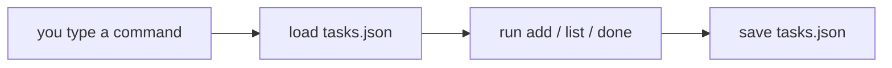

# A Real CLI

You've got every piece: adding, saving, loading, completing, deleting, filtering. They work - but only when *you* call them inside the code. A real tool flips that around. You type a command in your terminal, and the program figures out which function to run. That's the last piece, and once it clicks you'll have a to-do app you actually use.

## How a command line tool thinks

When you type `python todo.py add "buy milk"`, Python hands your script the words you typed as a list called `sys.argv`.

Before you run this, guess what `sys.argv[2:]` prints - one string, or a list?

```python runnable
import sys

# In a real terminal, sys.argv holds the words you typed.
# Here we set it by hand to show the shape.
sys.argv = ["todo.py", "add", "buy milk"]

print("Whole argv:", sys.argv)
print("Script name:", sys.argv[0])
print("Command word:", sys.argv[1])
print("The rest:", sys.argv[2:])
```

`sys.argv[0]` is always the script name - we ignore it. `sys.argv[1]` is the **command word**: `add`, `list`, or `done`. Everything after that is the command's argument: the task text, or the id. Read those three slots and you know what the user wants. That's the whole idea behind a CLI - there's no magic underneath.

> The `argparse` module in the standard library does this for you with help text and validation, and for a bigger tool you'd reach for it. We're dispatching by hand first so you can see exactly what it's doing. Same shape, no mystery.

## Dispatching on the command word

"Dispatch" means: look at the command word, run the matching function.

**Your turn.** Write `dispatch(argv)` using the stand-in functions below:
- if `argv` has fewer than 2 elements, print `"Usage: todo.py [add|list|done] ..."` and return
- if `argv[1]` is `"add"`, call `do_add(argv[2])`
- if `argv[1]` is `"list"`, call `do_list()`
- if `argv[1]` is `"done"`, call `do_done(int(argv[2]))` (convert the id to an int - `argv` is all text)
- otherwise, print `f"Unknown command: {argv[1]}"`

Fill it in and run the checks. My version is in the next block whenever you want it.

```python runnable
import sys

def do_add(text):   print(f"ADD: {text}")
def do_list():      print("LIST: showing all tasks")
def do_done(task_id): print(f"DONE: completing task {task_id}")

def dispatch(argv):
    # See the spec above. Route argv[1] to the matching do_* function.
    pass


# --- checks: fix your function until this prints "All good." ---
import io, contextlib

def run(argv):
    buf = io.StringIO()
    with contextlib.redirect_stdout(buf):
        dispatch(argv)
    return buf.getvalue().strip()

assert run(["todo.py", "add", "buy milk"]) == "ADD: buy milk", run(["todo.py", "add", "buy milk"])
assert run(["todo.py", "list"]) == "LIST: showing all tasks"
assert run(["todo.py", "done", "3"]) == "DONE: completing task 3"
assert run(["todo.py", "fly"]) == "Unknown command: fly"
assert run(["todo.py"]) == "Usage: todo.py [add|list|done] ..."
print("All good.")
```

Stuck? A chain of `if`/`elif` on `argv[1]` handles a multi-way choice like this one just fine.

### One way to write it

```python runnable
import sys

def do_add(text):   print(f"ADD: {text}")
def do_list():      print("LIST: showing all tasks")
def do_done(task_id): print(f"DONE: completing task {task_id}")

def dispatch(argv):
    if len(argv) < 2:
        print("Usage: todo.py [add|list|done] ...")
        return
    command = argv[1]
    if command == "add":
        do_add(argv[2])
    elif command == "list":
        do_list()
    elif command == "done":
        do_done(int(argv[2]))
    else:
        print(f"Unknown command: {command}")

# Try a few "commands":
dispatch(["todo.py", "add", "buy milk"])
dispatch(["todo.py", "list"])
dispatch(["todo.py", "done", "3"])
dispatch(["todo.py", "fly"])
dispatch(["todo.py"])
```

Each call routes to the right place. Notice `int(argv[2])` for the `done` command - everything in `argv` arrives as text, so `"3"` is a string until we convert it to the number 3 that `complete_task` expects. The last two calls show the guards earning their keep: an unknown command and a missing command word both get a clear message instead of a crash.

## The whole app, assembled

Time to put every function from the project together with the dispatcher. This is `todo.py` in full - the real thing. It runs here in your browser against a temporary file so you can see it end to end, then we'll show how to run it on your own machine.

```python runnable
import sys, json, os, tempfile

# On your machine this is simply "tasks.json".
PATH = os.path.join(tempfile.gettempdir(), "todo_app.json")

def load_tasks():
    try:
        with open(PATH, "r") as f:
            return json.load(f)
    except FileNotFoundError:
        return []

def save_tasks(tasks):
    with open(PATH, "w") as f:
        json.dump(tasks, f, indent=2)

def add_task(tasks, text):
    new_id = max((t["id"] for t in tasks), default=0) + 1
    tasks.append({"id": new_id, "text": text, "done": False})
    print(f"Added: {text}")

def list_tasks(tasks):
    if not tasks:
        print("No tasks yet. Add one!")
        return
    for t in tasks:
        mark = "x" if t["done"] else " "
        print(f"[{mark}] {t['id']}. {t['text']}")

def complete_task(tasks, task_id):
    for t in tasks:
        if t["id"] == task_id:
            t["done"] = True
            print(f"Marked done: {t['text']}")
            return
    print(f"No task with id {task_id}")

def main(argv):
    tasks = load_tasks()
    if len(argv) < 2:
        print("Usage: todo.py [add <text>|list|done <id>]")
        return
    command = argv[1]
    if command == "add":
        add_task(tasks, argv[2])
    elif command == "list":
        list_tasks(tasks)
    elif command == "done":
        complete_task(tasks, int(argv[2]))
    else:
        print(f"Unknown command: {command}")
    save_tasks(tasks)

# Start clean so this demo is repeatable.
if os.path.exists(PATH):
    os.remove(PATH)

# Simulate a session in your terminal:
main(["todo.py", "add", "buy milk"])
main(["todo.py", "add", "call the bank"])
main(["todo.py", "done", "1"])
print("\n--- todo.py list ---")
main(["todo.py", "list"])
```

Read the output top to bottom and you're watching real usage. Two tasks added, one marked done, then the list shows `[x] 1` and `[ ] 2`. And here's the payoff: every `main(...)` call loads from the file at the start and saves at the end. Each "command" is an independent run that picks up exactly where the last left off - which is precisely how it behaves when you type these in a terminal one at a time. The data persists across runs because it lives on disk between them.

## Running it for real on your machine

Everything above ran in your browser. To run it for real takes about two minutes.

**1. Install Python** if you don't have it. Check with:

```bash
python --version
```

If that prints a version (3.8 or newer), you're set. If not, grab it from python.org.

**2. Save the code.** Create a file named `todo.py` and paste in everything from the assembled block above - but make two changes so it reads from a normal file and runs from the real command line:

Change the path line to:

```python
PATH = "tasks.json"
```

And replace the demo lines at the bottom (the `os.remove` and the `main(...)` calls) with this single line, which feeds Python's real arguments into `main`:

```python
if __name__ == "__main__":
    main(sys.argv)
```

That `if __name__ == "__main__":` line means "run this when the file is executed directly." `sys.argv` now holds whatever you typed in the terminal - the real version of the fake lists we used above.

**3. Use it.** From the folder with `todo.py`:

```bash
python todo.py add "write the report"
python todo.py add "buy groceries"
python todo.py list
python todo.py done 1
python todo.py list
```

You'll see a `tasks.json` file appear next to the script. Open it in any text editor - it's your tasks in plain JSON, exactly the format from Phase 2. Close the terminal, come back tomorrow, run `python todo.py list`, and your tasks are still there.

## What you built

A working command-line to-do app, start to finish:



You modeled data as a list of dicts, made it permanent with JSON, gave it the verbs to complete and delete, and wrapped it in a command line you drive yourself. Nothing was installed beyond Python - the standard library carried the whole project.

From here, the obvious next moves are yours to take: add a `delete` command (you already wrote the function in Phase 3), wire in the open/done filters as a `list open` flag, or swap the hand-rolled dispatcher for `argparse` to get help text for free. You've got a real foundation now. Go finish your list.
