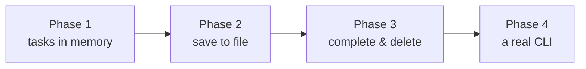

# Build a CLI To-Do App (Python)

We're going to build a to-do app this weekend. Not a toy that prints "Hello" and quits — a real one. You'll add tasks, list them, mark them done, delete them, and save the whole thing to a file so it survives between runs. By the end you'll type `python todo.py add "buy milk"` in a terminal and watch it work.

Here's the part that makes this fun: **every code block in this project runs right here in your browser.** You don't need Python installed to follow along. Click run, watch the output, change a line, run it again. When you're ready for the real thing, the last phase shows you exactly how to drop the same code onto your own machine.

## What you'll build

A single Python file — `todo.py` — that you drive from the command line:

```
python todo.py add "write the report"
python todo.py list
python todo.py done 1
```

Tasks live in a plain JSON file next to the script. Close your terminal, come back tomorrow, your list is still there.

## The stack

Nothing to install. We use three things, all built into Python:

| Piece | What it does |
|-------|--------------|
| `list` + `dict` | hold tasks in memory while the program runs |
| `json` module | save and load tasks as a text file |
| `sys.argv` | read the command word you typed (`add`, `list`, `done`) |

No frameworks. No pip. No third-party packages. The standard library does all of it, and learning to reach for it first is a habit worth building early.

## What you'll learn

- How to model data as a list of dictionaries — the bread and butter of Python programs.
- How to read and write files without losing your data.
- How JSON turns Python objects into text and back again.
- How a command-line tool decides what to do based on the words you type.

Each of these is a skill you'll reuse in nearly everything you write next.

## How the project flows



Four phases, each one a working step:

1. **Tasks in Memory** — represent tasks and add them to a growing list.
2. **Saving to a File** — write tasks to JSON and read them back.
3. **Complete, Delete, and Filter** — mark done, remove, and split open from finished.
4. **A Real CLI** — dispatch on a command word and run it as a script on your machine.

## Rough time

Plan for two or three relaxed hours. Each phase is ~30–45 minutes if you run the code and tinker. There's no rush — the point is to understand each piece before you stack the next one on top.

## Who this is for

You've seen a little Python — you know what a variable and a function are — and you want to build something whole instead of more disconnected exercises. That's exactly the right place to start. Let's build it.
