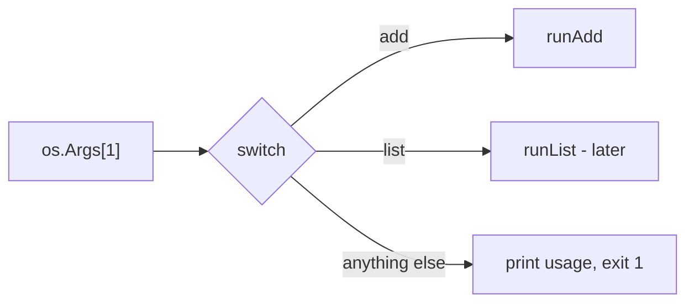

# Flags and the add Command

Type `git commit -m "fix"` and three different kinds of thing cross the command line: a **subcommand** (`commit`), a **flag** (`-m "fix"`), and the program figures out which is which. This phase builds that exact machinery for `til`. By the end, `til add -tags go "defer runs in LIFO order"` will parse cleanly into a structured note - it won't be *saved* yet (that's phase 3), but every argument will land in the right field.

## How subcommands actually work

There's no subcommand feature in Go, and there isn't one in C or Rust either. A subcommand is nothing more than a convention: **look at `os.Args[1]` and switch on it.** When you type `git commit`, git reads `"commit"` from its argument list and jumps to its commit code. That's the whole trick.



Which leaves the flags. You *could* parse `-tags go,cli` by hand out of the string slice, and people did for decades - it's fiddly and everyone's hand-rolled version disagrees about `-tags=go` vs `-tags go`. Go's standard `flag` package handles the fiddly part.

**One wrinkle:** the package-level `flag.Parse()` you may have seen in tutorials defines one global set of flags for the whole program. Subcommands need better than that - `add` has a `-tags` flag, and a future `list` will have `-n`, and they shouldn't collide or show up in each other's help text. The tool for that is **`flag.NewFlagSet`**: an independent, named collection of flags, one per subcommand. This is the same pattern the Go team's own tools use.

## The Note type

A note has an ID, the text, optional tags, and a timestamp. Define it as a struct - this type is the heart of the program and every later phase builds on it:

```go
type Note struct {
	ID      int
	Text    string
	Tags    []string
	Created time.Time
}
```

📝 **Terminology:** `time.Time` is Go's timestamp type. `time.Now()` gives you the current moment, and in phase 4 we'll format it for display with `.Format`.

## The full main.go

Replace everything in `main.go` with this. Read it top to bottom afterward - every piece gets explained.

```go
package main

import (
	"errors"
	"flag"
	"fmt"
	"os"
	"strings"
	"time"
)

type Note struct {
	ID      int
	Text    string
	Tags    []string
	Created time.Time
}

// parseTags turns "Go, CLI" into ["go", "cli"].
func parseTags(s string) []string {
	if s == "" {
		return nil
	}
	var tags []string
	for _, p := range strings.Split(s, ",") {
		p = strings.TrimSpace(strings.ToLower(p))
		if p != "" {
			tags = append(tags, p)
		}
	}
	return tags
}

func runAdd(args []string) error {
	fs := flag.NewFlagSet("add", flag.ExitOnError)
	tags := fs.String("tags", "", "comma-separated tags, e.g. -tags go,cli")
	fs.Parse(args)

	text := strings.TrimSpace(strings.Join(fs.Args(), " "))
	if text == "" {
		return errors.New(`nothing to add - usage: til add [-tags a,b] "your note"`)
	}

	note := Note{ID: 1, Text: text, Tags: parseTags(*tags), Created: time.Now()}
	fmt.Printf("Would add: %+v\n", note)
	return nil
}

func usage() {
	fmt.Println(`til - a tiny "today I learned" log

Usage:
  til add [-tags a,b] "your note"`)
}

func main() {
	if len(os.Args) < 2 {
		usage()
		os.Exit(1)
	}

	var err error
	switch os.Args[1] {
	case "add":
		err = runAdd(os.Args[2:])
	default:
		fmt.Fprintf(os.Stderr, "unknown command %q\n", os.Args[1])
		usage()
		os.Exit(1)
	}
	if err != nil {
		fmt.Fprintln(os.Stderr, "til:", err)
		os.Exit(1)
	}
}
```

Now the walkthrough, in the order things happen at runtime.

**`main` dispatches.** No arguments at all? Print usage and exit with status 1 - the universal "something went wrong" exit code that shells and scripts check. Otherwise, switch on `os.Args[1]` and hand the *rest* of the arguments - `os.Args[2:]`, everything after the subcommand - to the matching function. Each `runX` function returns an `error` instead of exiting on its own; `main` is the single place that turns errors into an exit code. Keeping exits in one place pays off in phase 5, when we test these functions - a function that calls `os.Exit` kills the test process too.

**`flag.NewFlagSet("add", flag.ExitOnError)`** creates the flag collection for this subcommand only. The name `"add"` appears in its error messages; `flag.ExitOnError` means "if the user passes a malformed flag, print the problem and exit" - the right behavior for a CLI, and it's also why we don't need to check `fs.Parse`'s return value.

**`fs.String("tags", "", "…")`** declares a flag: name, default value, help text. It returns a `*string` - a pointer - because the value doesn't exist until `Parse` runs; you read it afterward with `*tags`. The flag package accepts `-tags go,cli`, `-tags=go,cli`, and `--tags go,cli` interchangeably.

**`fs.Args()`** is what's left over after the flags are consumed - the positional arguments. For us, that's the note text. We `strings.Join` them with spaces so both `til add "one quoted note"` and `til add one unquoted note` produce the same text.

⚠️ **Gotcha - flags come before the text.** `fs.Parse` reads arguments left to right and **stops at the first thing that isn't a flag**. So `til add -tags go "my note"` works, but `til add "my note" -tags go` treats `-tags` and `go` as part of the note text, and your tag silently becomes words in the note. Every Go CLI built on the standard `flag` package shares this behavior (git behaves differently, which is exactly why this bites people). We'll write the usage string to show flags first, and now you know why.

**The error path goes to `os.Stderr`.** Normal output goes to stdout, errors to stderr. That split matters in real use: when someone pipes your tool - `til list | grep go` - error messages still reach their screen instead of disappearing into the pipe.

## Run it

```console
$ go run . add -tags go "defer runs in LIFO order"
Would add: {ID:1 Text:defer runs in LIFO order Tags:[go] Created:2026-07-06 14:22:31.4507118 +0200 CEST m=+0.000512301}
```

*What just happened:* `-tags go` was consumed by the flag set, the remaining words became the note text, and `%+v` printed the struct with field names. That trailing `m=+0.000512301` on the timestamp is Go's monotonic clock reading - internal bookkeeping that comes along when you print a `time.Time` raw. It disappears once we store and format times properly.

Try the failure paths too - a good CLI is defined by how it fails:

```console
$ go run . add
til: nothing to add - usage: til add [-tags a,b] "your note"
$ go run . remove 3
unknown command "remove"
til - a tiny "today I learned" log

Usage:
  til add [-tags a,b] "your note"
```

*What just happened:* both runs exited with status 1 and wrote to stderr. An empty `add` was caught by our own check; an unknown subcommand fell through to `default`. Nothing panicked, nothing printed a stack trace at the user - errors are sentences.

## What you have now

A real CLI skeleton: subcommand dispatch, per-command flags, positional arguments, and errors that behave like a grown-up tool's. What it doesn't have is memory - `Would add:` is an admission that the note goes nowhere. Next phase gives `til` a place to keep things: a JSON file in your home directory, written carefully enough that a crash mid-save can't destroy your notes.

Two quick questions to lock in the parsing model:

```quiz
[
  {
    "q": "Why must flags come before the note text, as in: til add -tags go \"my note\"?",
    "choices": [
      "The flag package requires flags in alphabetical order",
      "FlagSet.Parse stops treating arguments as flags at the first non-flag argument",
      "The shell reorders arguments before Go sees them"
    ],
    "answer": 1,
    "explain": "Parse consumes flags left to right and stops at the first positional argument - anything after that is left for fs.Args(), even if it looks like a flag."
  },
  {
    "q": "What does flag.NewFlagSet give you that the package-level flag functions don't?",
    "choices": [
      "Faster parsing of large argument lists",
      "An independent set of flags per subcommand, so add and list can't collide",
      "Automatic generation of subcommands from struct fields"
    ],
    "answer": 1,
    "explain": "The package-level flag.Parse manages one global flag set. NewFlagSet creates a named, isolated set - one per subcommand is the standard pattern."
  },
  {
    "q": "Why does runAdd return an error instead of calling os.Exit itself?",
    "choices": [
      "os.Exit is not allowed outside package main",
      "So main is the single place that maps errors to exit codes - and the function stays testable",
      "Returning an error is faster than exiting"
    ],
    "answer": 1,
    "explain": "A function that calls os.Exit kills any test that calls it. Return errors upward; let main decide the exit code."
  }
]
```
