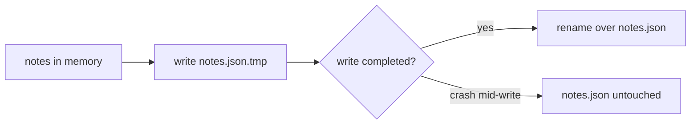

# JSON on Disk, Safely

Right now `til` has amnesia - every run starts from nothing. This phase gives it memory: a JSON file in your home directory that `add` appends to and a new `list` command reads back. The interesting part isn't reading and writing JSON - Go makes that almost free - it's doing it in a way that can't eat your notes. A note-taking tool that corrupts its own store the one time your laptop dies mid-save is worse than no tool at all, so we'll write the save path the way real tools do.

## Where state lives

CLI tools keep their state in a dotfolder in your home directory - that's the convention behind `~/.gitconfig`, `~/.ssh`, `~/.docker`. We'll follow it: notes go in `~/.til/notes.json`. The reader-visible win: it's one JSON file you can open, read, and back up with anything.

Go hands you the home directory portably:

```go
// storePath returns the notes file location: ~/.til/notes.json.
func storePath() (string, error) {
	home, err := os.UserHomeDir()
	if err != nil {
		return "", fmt.Errorf("finding home directory: %w", err)
	}
	return filepath.Join(home, ".til", "notes.json"), nil
}
```

`os.UserHomeDir` returns `C:\Users\you` on Windows and `/home/you` on Linux, and `filepath.Join` uses the right slashes for the platform - two functions, and the path question is closed on every OS. Note that the path comes back as a return value instead of living in a global: every function that touches the store will *take the path as a parameter*. That looks like a small style choice today; in phase 5 it's the whole reason the storage code is testable.

## Teaching the struct to speak JSON

`encoding/json` converts between Go structs and JSON text. By default it uses the Go field names - `Text`, `Created` - but JSON convention is lowercase. **Struct tags** fix the mapping:

```go
type Note struct {
	ID      int       `json:"id"`
	Text    string    `json:"text"`
	Tags    []string  `json:"tags,omitempty"`
	Created time.Time `json:"created"`
}
```

📝 **Terminology:** the backtick string after a field is a **struct tag** - metadata that packages like `encoding/json` read to decide how to handle the field. `json:"text"` says "call this key `text` in the JSON." The extra `omitempty` on `Tags` says "if the slice is empty, leave the key out entirely" - an untagged note stores as two lines shorter, and it's why `parseTags` returning `nil` for no tags was fine.

⚠️ **Gotcha:** struct tags only apply to **exported** fields (capitalized names). Rename a field to `text` and `encoding/json` skips it silently - no error, the data is simply absent from the file. If a field ever mysteriously stops persisting, check its capitalization first.

## Loading: a missing file is not an error

```go
// loadNotes reads the store. A missing file is a first run, not an error.
func loadNotes(path string) ([]Note, error) {
	data, err := os.ReadFile(path)
	if errors.Is(err, os.ErrNotExist) {
		return []Note{}, nil
	}
	if err != nil {
		return nil, err
	}
	var notes []Note
	if err := json.Unmarshal(data, &notes); err != nil {
		return nil, fmt.Errorf("parsing %s: %w", path, err)
	}
	return notes, nil
}
```

The first `if` is the line that makes the tool pleasant. On a brand-new machine, `notes.json` doesn't exist - and that's not a failure, it's day one. `errors.Is(err, os.ErrNotExist)` asks "is this error, or anything it wraps, a file-not-found?" and if so we return an empty list and move on. Every other error - permissions, a disk problem, JSON someone hand-edited into invalidity - is real and gets reported, with the file path wrapped in so the user knows *which* file to look at.

## Saving: the atomic write

Here's the scenario that separates careful tools from careless ones. You have 200 notes. `til` opens `notes.json`, starts writing the new version, and halfway through - power cut, `kill -9`, out-of-battery laptop lid snap. The file now contains half a JSON array. Next run, `loadNotes` fails to parse it. All 200 notes are hostage to a text file that ends mid-sentence.

The fix is old, small, and standard: **never write onto your only copy.** Write the new version to a temporary file next to the real one, and only when it's fully on disk, rename it over the original. A rename within the same directory is a single atomic operation at the filesystem level - it either fully happens or doesn't happen at all. There is no moment where `notes.json` is half-written.



```go
// saveNotes writes the store atomically: temp file first, then rename.
func saveNotes(path string, notes []Note) error {
	if err := os.MkdirAll(filepath.Dir(path), 0o755); err != nil {
		return err
	}
	data, err := json.MarshalIndent(notes, "", "  ")
	if err != nil {
		return err
	}
	tmp := path + ".tmp"
	if err := os.WriteFile(tmp, data, 0o644); err != nil {
		return err
	}
	return os.Rename(tmp, path)
}
```

Reading it through:

- **`os.MkdirAll`** creates `~/.til` if it's missing (and does nothing if it exists) - without this, the very first save fails because the folder isn't there. The `0o755` is the Unix permission bits (owner can write, everyone can read); Windows largely ignores them.
- **`json.MarshalIndent(notes, "", "  ")`** serializes the whole slice with two-space indentation. Plain `json.Marshal` would produce one long line; indented output means you can open your own store and read it, which you will, the first time you're curious.
- **Write `.tmp`, then `os.Rename`.** The two-step described above. If the process dies during `WriteFile`, the damage is a stray `notes.json.tmp` - your real store never changed.

💡 **Key point:** load tolerates absence, save tolerates interruption. Those two decisions are what "storing state safely" means, and they cost eleven lines total.

## Wiring it into add and list

`runAdd` now loads, appends, and saves. The new note's ID is the last note's ID plus one - IDs only ever grow, so they stay stable even if you later add a delete command. And `runList` is new - minimal for now, a proper table comes next phase.

Here's the complete `main.go` for this phase:

```go
package main

import (
	"encoding/json"
	"errors"
	"flag"
	"fmt"
	"os"
	"path/filepath"
	"strings"
	"time"
)

type Note struct {
	ID      int       `json:"id"`
	Text    string    `json:"text"`
	Tags    []string  `json:"tags,omitempty"`
	Created time.Time `json:"created"`
}

// parseTags turns "Go, CLI" into ["go", "cli"].
func parseTags(s string) []string {
	if s == "" {
		return nil
	}
	var tags []string
	for _, p := range strings.Split(s, ",") {
		p = strings.TrimSpace(strings.ToLower(p))
		if p != "" {
			tags = append(tags, p)
		}
	}
	return tags
}

// storePath returns the notes file location: ~/.til/notes.json.
func storePath() (string, error) {
	home, err := os.UserHomeDir()
	if err != nil {
		return "", fmt.Errorf("finding home directory: %w", err)
	}
	return filepath.Join(home, ".til", "notes.json"), nil
}

// loadNotes reads the store. A missing file is a first run, not an error.
func loadNotes(path string) ([]Note, error) {
	data, err := os.ReadFile(path)
	if errors.Is(err, os.ErrNotExist) {
		return []Note{}, nil
	}
	if err != nil {
		return nil, err
	}
	var notes []Note
	if err := json.Unmarshal(data, &notes); err != nil {
		return nil, fmt.Errorf("parsing %s: %w", path, err)
	}
	return notes, nil
}

// saveNotes writes the store atomically: temp file first, then rename.
func saveNotes(path string, notes []Note) error {
	if err := os.MkdirAll(filepath.Dir(path), 0o755); err != nil {
		return err
	}
	data, err := json.MarshalIndent(notes, "", "  ")
	if err != nil {
		return err
	}
	tmp := path + ".tmp"
	if err := os.WriteFile(tmp, data, 0o644); err != nil {
		return err
	}
	return os.Rename(tmp, path)
}

func runAdd(args []string) error {
	fs := flag.NewFlagSet("add", flag.ExitOnError)
	tags := fs.String("tags", "", "comma-separated tags, e.g. -tags go,cli")
	fs.Parse(args)

	text := strings.TrimSpace(strings.Join(fs.Args(), " "))
	if text == "" {
		return errors.New(`nothing to add - usage: til add [-tags a,b] "your note"`)
	}

	path, err := storePath()
	if err != nil {
		return err
	}
	notes, err := loadNotes(path)
	if err != nil {
		return err
	}

	id := 1
	if len(notes) > 0 {
		id = notes[len(notes)-1].ID + 1
	}
	notes = append(notes, Note{ID: id, Text: text, Tags: parseTags(*tags), Created: time.Now()})

	if err := saveNotes(path, notes); err != nil {
		return err
	}
	fmt.Printf("Added note #%d\n", id)
	return nil
}

func runList() error {
	path, err := storePath()
	if err != nil {
		return err
	}
	notes, err := loadNotes(path)
	if err != nil {
		return err
	}
	if len(notes) == 0 {
		fmt.Println(`No notes yet. Add one: til add "what you learned"`)
		return nil
	}
	for _, n := range notes {
		fmt.Printf("#%d [%s] %s\n", n.ID, n.Created.Format("2006-01-02"), n.Text)
	}
	return nil
}

func usage() {
	fmt.Println(`til - a tiny "today I learned" log

Usage:
  til add [-tags a,b] "your note"
  til list`)
}

func main() {
	if len(os.Args) < 2 {
		usage()
		os.Exit(1)
	}

	var err error
	switch os.Args[1] {
	case "add":
		err = runAdd(os.Args[2:])
	case "list":
		err = runList()
	default:
		fmt.Fprintf(os.Stderr, "unknown command %q\n", os.Args[1])
		usage()
		os.Exit(1)
	}
	if err != nil {
		fmt.Fprintln(os.Stderr, "til:", err)
		os.Exit(1)
	}
}
```

One new thing hides in `runList`: the date format. Go doesn't use `YYYY-MM-DD` patterns - you format times by writing **the reference moment**, `Mon Jan 2 15:04:05 MST 2006`, in the layout you want. `n.Created.Format("2006-01-02")` means "year-month-day, like 2006-01-02." It confuses *everybody* the first time; the mnemonic is that the reference date's parts count 1 2 3 4 5 6 in US order (month 1, day 2, hour 3, minute 4, second 5, year 6).

## Run it

```console
$ go run . add -tags go "defer runs in LIFO order"
Added note #1
$ go run . add -tags go,cli "flag.NewFlagSet gives each subcommand its own flags"
Added note #2
$ go run . list
#1 [2026-07-06] defer runs in LIFO order
#2 [2026-07-06] flag.NewFlagSet gives each subcommand its own flags
```

*What just happened:* two `add` runs each loaded the store, appended, and saved atomically; `list` read the result back. The notes survived across three separate processes - `til` has memory now.

Go look at the memory. Open `~/.til/notes.json` (on Windows, `C:\Users\you\.til\notes.json`):

```json
[
  {
    "id": 1,
    "text": "defer runs in LIFO order",
    "tags": [
      "go"
    ],
    "created": "2026-07-06T14:31:08.2214563+02:00"
  },
  {
    "id": 2,
    "text": "flag.NewFlagSet gives each subcommand its own flags",
    "tags": [
      "go",
      "cli"
    ],
    "created": "2026-07-06T14:31:52.9083317+02:00"
  }
]
```

*What just happened:* every struct tag did its job - lowercase keys, and `time.Time` serialized itself as an RFC 3339 timestamp (timezone included) that it can parse back losslessly. Your store is plain text you could edit, back up, or sync between machines.

## What you have now

A CLI with durable, crash-safe state and stable note IDs. The `list` output is honest but flat - and there's no way yet to *find* anything, which for a memory tool is the entire point. Next phase: `list` grows flags and a real table, and `search` and `tags` join the roster.

Lock in the storage ideas before moving on:

```quiz
[
  {
    "q": "Why does saveNotes write to notes.json.tmp and then rename, instead of writing notes.json directly?",
    "choices": [
      "It is faster than writing the file directly",
      "So two til processes can safely write at the same time",
      "A crash mid-write can only leave a broken .tmp file - the real notes.json is never half-written"
    ],
    "answer": 2,
    "explain": "The rename is atomic, so the store flips from old version to new version with no in-between state. (Two processes writing at once is a different problem - the rename trick does not solve that.)"
  },
  {
    "q": "What does loadNotes do when notes.json does not exist?",
    "choices": [
      "Returns an error so the user knows something is wrong",
      "Returns an empty list - a first run is not an error",
      "Creates the file immediately with an empty array"
    ],
    "answer": 1,
    "explain": "errors.Is(err, os.ErrNotExist) catches file-not-found and treats it as day one. The file gets created by the first save instead."
  },
  {
    "q": "What does the struct tag json:\"text\" on the Text field do?",
    "choices": [
      "Controls the key name used when the struct is marshaled to JSON",
      "Renames the field everywhere in Go code",
      "Validates that the field is non-empty before saving"
    ],
    "answer": 0,
    "explain": "Struct tags are metadata for packages like encoding/json. Without the tag, the JSON key would be the Go field name, Text."
  }
]
```
