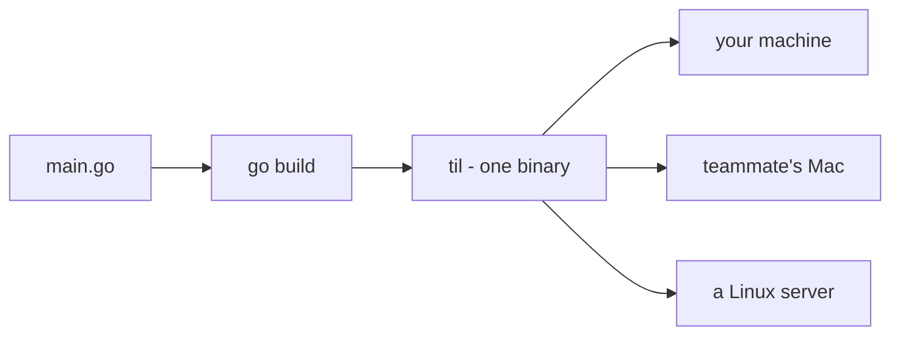

# Build a Real CLI Tool in Go

You learn things at work every day - a Git flag that saved you, a Go quirk that cost you an hour - and by Friday they're gone. This project fixes that with a tool you'll actually keep using: **`til`**, a "today I learned" log that lives in your terminal. Type `til add "defer runs in LIFO order"` the moment you learn something; months later, `til search defer` hands it back.

Along the way you'll learn the skills that every real CLI is made of: subcommands, flags, state that survives between runs, output that's pleasant to read, tests that catch regressions, and shipping a binary that runs on machines that have never heard of Go.

This one runs **on your machine.** You'll compile real binaries, keep state in a real file in your home directory, and end with `til` on your PATH like any other command you use.

## Why Go for this

You could write a CLI in Python or Node. People do. Then they try to give it to a teammate and hit the wall: "first install Python 3.12, then make a venv, then pip install..." A Go CLI is different in one way that changes everything:

**`go build` produces one self-contained binary.** No runtime to install, no dependency folder, no version manager. You copy a single file to another machine - even a different operating system, cross-compiled from yours - and it runs. That, plus instant startup and a standard library that covers flags, JSON, and testing without a single external package, is why so many tools you already use (Docker, kubectl, gh, terraform) are written in Go.

## The stack

| Piece | What it is | Why we use it |
|-------|-----------|---------------|
| Go standard library | `flag`, `encoding/json`, `text/tabwriter`, `testing` | Everything a CLI needs, zero dependencies |
| A JSON file | `~/.til/notes.json` | State that survives between runs, readable with any editor |
| `go build` / `go install` | The Go toolchain | One-command compile, one-command install to PATH |

That's the whole list. This project has **zero third-party dependencies** - the `go.mod` file will never grow past two lines.

## What you'll need

- **Go 1.22 or newer.** Check with `go version` in a terminal. If you don't have it, grab the installer from go.dev/dl.
- A text editor and a terminal.
- The basics from a first pass at Go - variables, structs, slices, functions, and `if err != nil`. If you've finished the *Go from Zero* guide, you're ready.

Rough time: a focused day, or two relaxed evenings.

## What you'll learn

- How a CLI reads its arguments, and how subcommands like `git commit` actually work
- The `flag` package and per-subcommand flag sets
- Persisting state as JSON without corrupting it, even if the program dies mid-write
- Aligned table output with `text/tabwriter`
- Table-driven tests with the `testing` package and `t.TempDir()`
- Cross-compiling for Windows, macOS, and Linux, and installing your tool on PATH

## The phases

1. **Why Go, and a Compiling Project** - set up the module, read `os.Args`, and build your first binary.
2. **Flags and the add Command** - subcommand dispatch and the `flag` package, done the way real tools do it.
3. **JSON on Disk, Safely** - notes that survive between runs, written so a crash can't corrupt them.
4. **list, search, and tags** - the remaining subcommands, with clean table output.
5. **Tests That Catch Real Bugs** - table-driven tests for the logic, temp dirs for the file handling.
6. **Cross-Compile and Ship It** - binaries for three operating systems, and `til` on your PATH for good.

Each phase ends with a program that compiles and runs. By phase 3 you're already storing real notes; by phase 6 the tool is installed and part of your day. Let's set it up.
