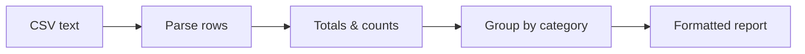

# Build a CSV Summary Report (Python)

You have a CSV file. Maybe it's sales, maybe it's expenses, maybe it's a log of who did what. Opening it in a spreadsheet works once, but the moment someone asks "what's the total per region?" every week, you want a script that answers it in a second.

That's what we're building this weekend: a small Python program that reads a CSV, adds up the numbers, breaks them out by category, and prints a clean report you'd be happy to paste into an email. No libraries to install - Python ships with everything we need in its `csv` module.

## What you'll build

A self-contained report generator. Feed it rows like this:

```
date,region,product,amount
2026-01-03,North,Widget,120.50
2026-01-05,South,Gadget,89.00
```

and it prints something like this:

```
SALES SUMMARY
=============
Rows:          12
Total amount:  1,884.50
Average:       157.04
Largest sale:  410.00

By region:
  North        642.50
  South        531.00
  East         711.00
```

We'll get there in four steps, each one a working piece you can run on its own.

## Runs in your browser

Every code block in this project is **run-along** - it executes right here in the page, no setup, no install. Each block is self-contained: it carries its own sample data and prints its own result, so you can run them in any order and tweak the numbers to see what changes. The last phase also shows you how to point the same code at a real file on your own machine.

## The stack

| Piece | What it does |
|-------|--------------|
| `csv.DictReader` | Reads each row into a dict keyed by the header |
| `io.StringIO` | Lets us treat a string as a file (so the sample lives in the code) |
| `collections.defaultdict` | Groups rows by category without messy setup |
| `str.format` / f-strings | Lines up the numbers into a tidy report |

All four are in the standard library. Nothing else.

## The shape of the build



## Roughly how long

A focused afternoon - maybe two to three hours if you stop to experiment, which you should. Each phase stands alone, so you can do one, walk away, and come back.

## What you'll learn

- Reading CSV safely with `DictReader` instead of splitting strings by hand
- Converting text columns to numbers (and why the CSV gives you strings)
- Aggregating: sum, count, min, max, average
- Grouping rows with `defaultdict` - the pattern you'll reuse forever
- Formatting numbers into aligned, readable columns
- How to swap the embedded sample for a real file when you run it locally

By the end you'll have one script that does the whole job, and the muscle memory to write the next one without looking it up. Let's start by getting the rows out of the CSV.
