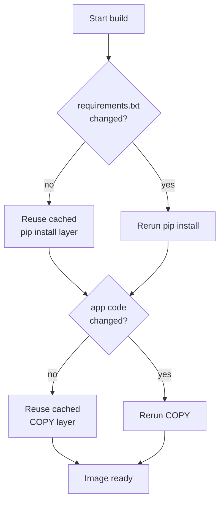

# A Real Dockerfile

The Phase 1 Dockerfile works, but it has three problems you'll feel the moment you use it for real: it rebuilds slowly, it's enormous, and it runs your app as root. Each has a fix, and each fix teaches you something about how Docker actually works. Let's take them one at a time and end with a Dockerfile you'd ship.

## How the layer cache works

Every instruction in a Dockerfile creates a **layer** — a saved snapshot of the filesystem after that step. When you rebuild, Docker walks the instructions in order and reuses a cached layer as long as nothing that feeds it has changed. The first instruction whose inputs changed busts the cache, and every instruction after it reruns.

That last sentence is the whole game. Look at the Phase 1 order:

```dockerfile
COPY . .
RUN pip install -r requirements.txt
```

If you wrote it this way, every edit to `app.py` changes the `COPY . .` layer, which busts the cache for `pip install` right below it — so Docker reinstalls Flask on every single code change. You changed a string and paid for a full dependency install.

We already avoided that in Phase 1 by copying `requirements.txt` *before* the rest of the code:

```dockerfile
COPY requirements.txt .
RUN pip install -r requirements.txt
COPY . .
```

Now `pip install` only reruns when `requirements.txt` changes. Edit `app.py` a hundred times and the install layer stays cached. The rule that falls out of this:

> Put the things that change rarely (dependencies) **above** the things that change often (your code).

Here's the cache decision as a picture:



## A .dockerignore

When you run `docker build .`, Docker sends the entire folder — the build context — to the build engine. If that folder contains a `.git` directory, a virtualenv, caches, or logs, all of it gets shipped, slowing the build and sometimes sneaking junk into your image through `COPY . .`.

Fix it the same way you'd fix `.gitignore` — list what to leave out. Create `.dockerignore` next to your Dockerfile:

```text
# .dockerignore
.git
.gitignore
__pycache__/
*.pyc
.venv/
venv/
.env
*.log
Dockerfile
.dockerignore
```

Excluding `.env` here matters for more than speed: it keeps local secrets from being copied into the image. We'll handle configuration properly in Phase 4.

## A slim base image

`python:3.12` is the full image — it includes compilers, build tools, and a complete Debian userland you mostly don't need to *run* a Flask app. The `-slim` variant strips that down to a minimal Debian plus Python:

| Base image | Rough size |
| --- | --- |
| `python:3.12` | ~1 GB |
| `python:3.12-slim` | ~150 MB |
| `python:3.12-alpine` | ~70 MB |

Swap one word and you've cut the image by roughly 850 MB:

```dockerfile
FROM python:3.12-slim
```

A note on `alpine`: it's even smaller, but it uses a different C library (musl, not glibc), which occasionally breaks Python packages that ship compiled code and expect glibc. For this project `-slim` is the sweet spot — small, and no surprises. Reach for `alpine` only when you've measured that the extra savings is worth the risk.

## Don't run as root

By default, the process inside your container runs as `root`. If someone finds a way to break out of your app, they're root inside the container — a worse starting point for them than an unprivileged user. Create a normal user and switch to it before the app runs:

```dockerfile
RUN useradd --create-home appuser
USER appuser
```

Everything after `USER appuser` runs as that user. Put this line *after* your `pip install` (which may need to write to system locations) but *before* `CMD`, so the app itself runs unprivileged.

## The real Dockerfile

Put it all together:

```dockerfile
# Dockerfile
FROM python:3.12-slim

WORKDIR /app

# Dependencies first — this layer is cached until requirements.txt changes
COPY requirements.txt .
RUN pip install --no-cache-dir -r requirements.txt

# App code second — changes here don't bust the install layer
COPY . .

# Run as a non-root user
RUN useradd --create-home appuser
USER appuser

EXPOSE 5000

CMD ["python", "app.py"]
```

Two small additions worth calling out. `pip install --no-cache-dir` tells pip not to keep its download cache inside the image — you don't need it at runtime, and it only adds weight. And the comments document *why* the order is what it is, which the next person (often future you) will thank you for.

## Prove it's better

Rebuild:

```bash
docker build -t myapp .
docker images myapp
```

The size should now be a few hundred megabytes instead of a gigabyte. Now test the cache. Change the greeting in `app.py` — edit the string in the `home()` route — and rebuild:

```bash
docker build -t myapp .
```

Watch the output. The `pip install` step prints `CACHED` and finishes instantly; only the `COPY . .` and the steps after it rerun. The rebuild that took a minute now takes a couple of seconds. Run it again to confirm it still serves traffic:

```bash
docker run -d -p 8080:5000 --name myapp-run myapp
curl http://localhost:8080
docker stop myapp-run && docker rm myapp-run
```

Same `Hello`, smaller image, faster builds, no root. This is a Dockerfile you can be proud of. Next we give the app something to talk to — a real database, in its own container, wired up with compose.
