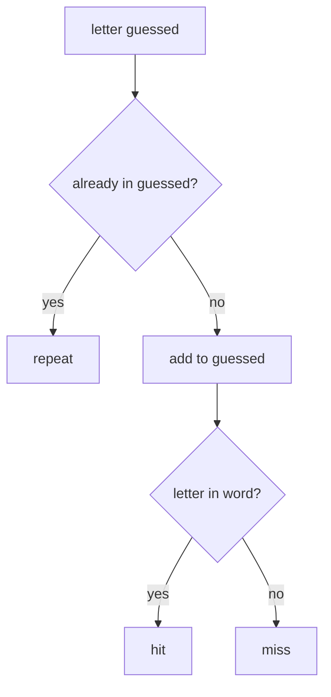

# Handling a Guess

Right now the guessed letters are something you type into the code by hand. A real
game adds to them as the player guesses. This phase builds the part that takes a
single letter, records it, and reports back what happened: a hit, a miss, or a
letter the player already tried.

Carry the `show` function from Phase 1 with you - every example here re-declares
it so the blocks run on their own.

## The set does the bookkeeping

Guessed letters live in a set. Adding to a set is one method call, and a set
quietly drops duplicates, so a repeated guess never piles up:

Before you run this, guess what `len(guessed)` will print. Then check.

```python runnable
guessed = set()      # empty to start
guessed.add("p")
guessed.add("y")
guessed.add("p")     # repeat - the set ignores it
print(guessed)
print("Total letters tracked:", len(guessed))
```

Run it. You added `p` twice but the set holds two letters, not three. That's the
duplicate handling we talked about last phase, and it's free.

## Hit or miss

When a letter comes in, there are three outcomes:



Read the diagram top to bottom. First we check if the letter was already tried -
if so, it's a repeat and nothing changes. Otherwise we record it, then check
whether it's actually in the word: in means hit, not in means miss.

## Writing the guess function

Write that flow as a function called `guess`. It takes the letter, the word, and
the guessed set, updates the set, and returns a short word describing what
happened. One wrinkle: a player might type `"P"` or `"p"` - your function should
treat them the same.

**Your turn.** This function is the point of the phase, so have a go before you
read on. Fill it in and hit Run: the checks underneath tell you whether it works.
My version is in the next block whenever you want it.

```python runnable
def guess(letter, word, guessed):
    # Record `letter` in `guessed` and report what happened. `letter` may
    # come in as "P" or "p" - treat them the same.
    #   - already in `guessed` -> return "repeat", don't touch anything else
    #   - otherwise add it (lowercased) to `guessed`, then return "hit" if
    #     it's in `word`, "miss" if it isn't
    pass


# --- checks: fix your function until this prints "All good." ---
guessed = set()
assert guess("P", "python", guessed) == "hit", f"got: {guess('P', 'python', set())!r}"
assert guessed == {"p"}, f"guessed should hold the lowercase letter, got: {guessed!r}"
assert guess("z", "python", guessed) == "miss", f"got: {guess('z', 'python', guessed)!r}"
assert guess("p", "python", guessed) == "repeat", f"got: {guess('p', 'python', guessed)!r}"
print("All good.")
```

Stuck on the `"P"` vs `"p"` wrinkle? There's a string method that hands back a
lowercase copy of any string - call it on `letter` before you do anything else
with it.

### One way to write it

```python runnable
def guess(letter, word, guessed):
    letter = letter.lower()          # treat P and p the same
    if letter in guessed:
        return "repeat"
    guessed.add(letter)
    return "hit" if letter in word else "miss"

# Try one guess and inspect the result:
word = "python"
guessed = set()
result = guess("P", word, guessed)
print("Result:", result)
print("Guessed so far:", guessed)
```

Run it. Notice we passed an uppercase `"P"` and the function lowercased it before
doing anything, so it matched the lowercase word and the set holds `'p'`. That
one `letter.lower()` line saves you from "I typed P and it said miss" complaints.

If you skipped the `.lower()` call, the checks above catch it fast: `guess("P",
"python", guessed)` returns `"miss"` instead of `"hit"`, because Python's `in`
check is case-sensitive and `"P"` is nowhere in the string `"python"`.

## Wiring it to the display

A guess on its own isn't satisfying - you want to *see* the word change. So after
each guess we print the result and the freshly masked word together. Here we
simulate a few guesses in a row, the way a real game would over several turns:

```python runnable
def show(word, guessed):
    return " ".join(letter if letter in guessed else "_" for letter in word)

def guess(letter, word, guessed):
    letter = letter.lower()
    if letter in guessed:
        return "repeat"
    guessed.add(letter)
    return "hit" if letter in word else "miss"

word = "python"
guessed = set()

# A simulated run of four turns (no input() - we feed the letters in):
for letter in ["p", "z", "y", "p"]:
    result = guess(letter, word, guessed)
    print(f"You guessed '{letter}': {result:6}  ->  {show(word, guessed)}")
```

Run it and read the four lines:

- `p` is a **hit** - the first blank fills in.
- `z` is a **miss** - `z` isn't in "python", the display doesn't change.
- `y` is a **hit** - another blank fills.
- `p` again is a **repeat** - we already had it, so nothing changes.

That `{result:6}` in the f-string pads the result word out to six characters so
the arrows line up in a neat column. A small touch, but a tidy readout is easier
to follow.

## Why we return a word instead of printing inside

You might wonder why `guess` returns `"hit"` / `"miss"` / `"repeat"` rather than
printing the message itself. Because the function's job is to *decide* what
happened, not to *display* it. The caller decides how to show it - maybe print it,
maybe count the misses, maybe both. Keeping "figure it out" separate from "show
it" means we can reuse `guess` in Phase 3 to drive the life counter without
touching it. One function, one job.

## A quick self-check

If the logic ever breaks, a tiny check catches it. This asserts the three
outcomes are what we expect, then prints a confirmation:

```python runnable
def guess(letter, word, guessed):
    letter = letter.lower()
    if letter in guessed:
        return "repeat"
    guessed.add(letter)
    return "hit" if letter in word else "miss"

g = set()
assert guess("p", "python", g) == "hit"
assert guess("z", "python", g) == "miss"
assert guess("p", "python", g) == "repeat"
print("All three outcomes behave. Guess logic is solid.")
```

Run it. If you see the confirmation line, the guess handling works. If an assert
ever failed, Python would stop and point at the broken line - a fast way to know
the moment something's off.

## Where you are

You can hand the game a letter and it does the right thing: records it, ignores
repeats, and tells you hit or miss while the masked word updates. What's missing
is stakes - a miss should cost something, and the game should end. That's next:
lives, winning, and losing.
