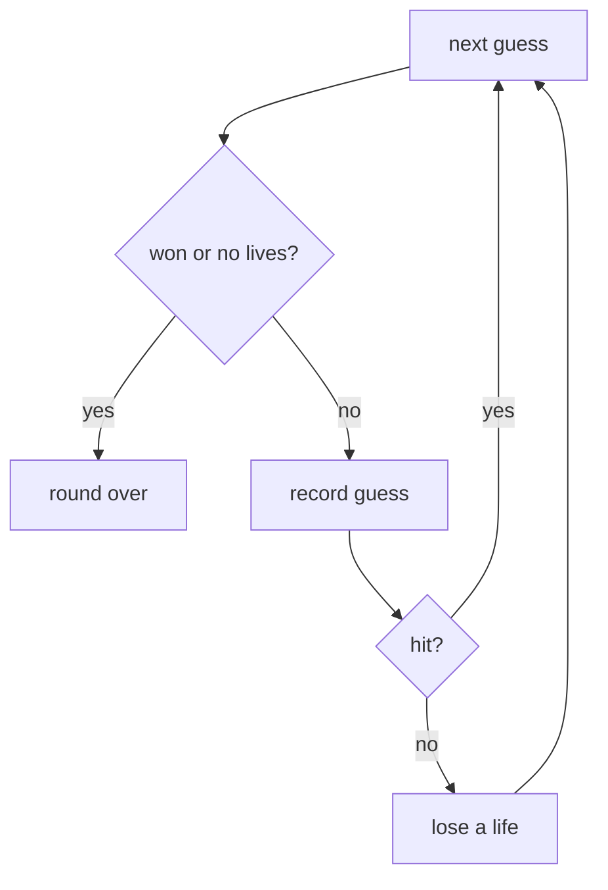

# Lives, Wins, and Losses

A guessing game with no consequences is a list of letters. The fun is the tension:
every wrong guess brings you closer to losing, every right one closer to winning.
This phase adds that tension — a life counter that drops on misses, plus the two
checks that end the game.

By the end you'll run a complete round from start to finish.

## Lives are a number that only misses touch

A life is a counter. Start it at some limit — six is the classic Hangman number,
one for each part of the stick figure — and subtract one every time the player
misses. Hits don't touch it.

```python runnable
lives = 6
# Simulate three misses:
for bad in ["z", "q", "x"]:
    lives -= 1
    print(f"Missed '{bad}'. Lives left: {lives}")
```

Run it. Three misses, three down from six, lands on three. When `lives` hits zero,
the player is out — that's the loss condition, and it's a plain `lives <= 0`
check.

## Detecting a win

A win is "every letter in the word has been guessed." We saw the shape of this in
Phase 1. Python's `all(...)` is built for exactly this question: give it a
sequence of true/false answers and it returns `True` only if every one is true.

```python runnable
def won(word, guessed):
    return all(letter in guessed for letter in word)

word = "python"
print("Half guessed:", won(word, {"p", "y", "t"}))
print("All guessed: ", won(word, set("python")))
```

Run it. The first line is `False` — `h`, `o`, and `n` are still missing. The
second is `True` — `set("python")` holds every letter, so every `letter in
guessed` check is true, so `all(...)` is true. That `won` function is your win
detector.

One thing worth noticing: this checks every *distinct* letter in the word, and a
word like "coffee" has repeats. That's fine — guessing `f` once puts `f` in the
set, and both `f` positions in "coffee" now count as guessed. The set handles
repeated letters in the word without any extra code.

## The shape of a round

Now we have all four ideas: show the word, take a guess, drop a life on a miss,
and check for a win or a loss. A round is a loop over the player's guesses that
stops the moment someone wins or runs out of lives.



Read it: before each guess we check whether the game's already decided. If not, we
record the guess; a hit loops straight back for the next one, a miss costs a life
first. When the word's complete or the lives are gone, the round ends.

## A full round, start to finish

Here's the whole thing in one runnable block. Because there's no console to type
into, we feed it a hardcoded list of guesses and print every turn, then announce
the ending:

```python runnable
def show(word, guessed):
    return " ".join(letter if letter in guessed else "_" for letter in word)

def won(word, guessed):
    return all(letter in guessed for letter in word)

word = "python"
guessed = set()
lives = 6

# A simulated game: one miss ('z'), the rest hits — this should win.
moves = ["p", "y", "z", "t", "h", "o", "n"]

print(f"Starting word: {show(word, guessed)}  (lives: {lives})")
print("-" * 40)

for letter in moves:
    if lives <= 0 or won(word, guessed):
        break                       # game already decided, stop reading guesses
    guessed.add(letter)
    if letter in word:
        print(f"'{letter}' hit   | lives: {lives} | {show(word, guessed)}")
    else:
        lives -= 1
        print(f"'{letter}' miss  | lives: {lives} | {show(word, guessed)}")

print("-" * 40)
if won(word, guessed):
    print(f"You won! The word was '{word}'.")
else:
    print(f"Out of lives. The word was '{word}'.")
```

Run it. You'll watch the blanks fill in turn by turn, the single `z` miss knock a
life off, and the round end with `You won!`. That's a complete, playable round of
Hangman.

## Make it lose

Change the story and the same code handles the other ending. Swap the `moves` line
for a run of bad guesses and run it again:

```python runnable
def show(word, guessed):
    return " ".join(letter if letter in guessed else "_" for letter in word)

def won(word, guessed):
    return all(letter in guessed for letter in word)

word = "python"
guessed = set()
lives = 3                           # short life count, to lose fast

moves = ["z", "q", "x", "k", "b"]   # five misses, only three lives

for letter in moves:
    if lives <= 0 or won(word, guessed):
        break
    guessed.add(letter)
    if letter in word:
        print(f"'{letter}' hit   | lives: {lives} | {show(word, guessed)}")
    else:
        lives -= 1
        print(f"'{letter}' miss  | lives: {lives} | {show(word, guessed)}")

if won(word, guessed):
    print(f"You won! The word was '{word}'.")
else:
    print(f"Out of lives. The word was '{word}'.")
```

Run it. Three misses burn the three lives, and the loop's `break` fires before the
fourth guess is even read — notice only three turns print, then `Out of lives`.
Same engine, both endings, decided by the guesses and the life limit.

## Where you are

You have a full round: a masked word, guess handling, a life counter, and both
endings. The one thing still hardcoded is the word itself — you've been playing
"python" every time. Last phase we pick from a word list and wrap everything into
a single tidy game function, then point you at ways to make it your own.
