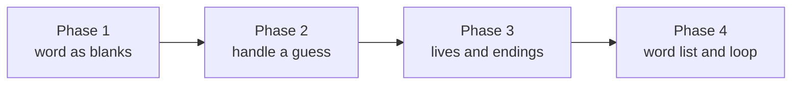

# Build a Hangman Game (Python)

You know Hangman. A hidden word shows up as a row of blanks. You guess a letter.
Right guesses fill in the blanks; wrong ones cost you a life. Run out of lives
and you lose. Fill in the word and you win.

It's a small game, but it touches a lot of the things you'll use forever in
Python: strings, sets, loops, conditionals, and a couple of functions that each
do one clear job. By the end you'll have built the whole thing, piece by piece,
and watched each piece run.

## What you'll build

A complete, playable round of Hangman: a secret word shown as blanks, a record of
which letters have been guessed, a life counter that drops on every miss, and the
two endings - you won, or you're out of lives.

## The stack

Python's standard library. Nothing to install. We use `random` for picking a word
and that's the only import in the whole project.

## This one runs in your browser

Every code block on these pages has a Run button. Click it and the code runs
right here - no setup, no terminal. Because there's no console to type into, we
don't use `input()`. Instead we feed the game a hardcoded list of guesses and
print the play-by-play, so you watch a full round unfold each time you run it.

In the last phase we'll also show you how to bolt on a real `input()` version so
you can play it for real on your own machine.

## Rough time

About 45 minutes if you read along and run each block. Less if you're quick.

## What you'll learn

| Skill | Where it shows up |
|-------|-------------------|
| Strings and slicing | Showing the word as blanks |
| Sets | Tracking guessed letters without duplicates |
| Loops | Walking the word, running the rounds |
| Conditionals | Hit vs miss, win vs lose |
| Functions | One job each: show, guess, check for a win |
| `random` | Picking a word from a list |

## The plan

Each phase ends with a working piece you can run. By Phase 4 those pieces snap
together into the finished game. Let's pick a word.
