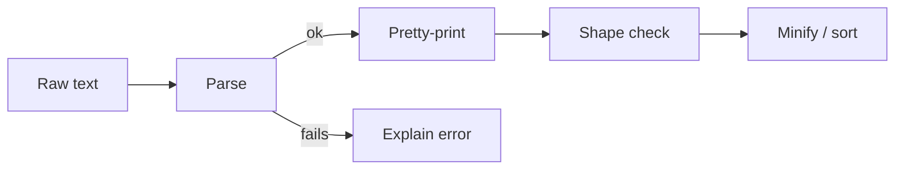

# Build a JSON Formatter & Validator (JS)

You have pasted ugly JSON into a tool more times than you can count. A single line, no spaces, a missing comma somewhere, and a browser tab that screams "Unexpected token" without telling you where. This weekend you and I are building the tool that does it better - and you'll understand every line of it.

By the end you'll have a small JavaScript module that takes raw JSON text and:

- pretty-prints it with clean indentation,
- catches broken JSON and explains the problem in plain language with a rough location,
- checks the data against a shape you describe (required keys, expected types),
- minifies it back down and sorts the keys for stable output.

No frameworks. No build step. No npm install. Everything here is plain JavaScript using `JSON.parse` and `JSON.stringify`, which already live in every browser and every Node runtime.

## This one runs in your browser

This is a run-along project. Every code block on these pages is a real, runnable snippet - press the run button and you'll see the output right there on the page. You don't need to set anything up on your machine. Read, run, tweak a value, run again. That loop is the whole point.

Because each block runs fresh and on its own, every example re-declares what it needs and ends with a `console.log`. When you build the real thing later, you'd keep these as functions in one file and call them. Here, each one stands alone so you can poke at it in isolation.

## The stack

| Piece | What we use | Why |
| --- | --- | --- |
| Parsing | `JSON.parse` | Built in, strict, gives us error messages |
| Formatting | `JSON.stringify` | Has an indent argument most people never use |
| Errors | `try` / `catch` | Turn a thrown error into a friendly report |
| Shape check | plain functions + `typeof` | No schema library needed for this |

## The shape of the build

Each phase adds one box. Phase 1 gets text in and pretty JSON out. Phase 2 handles the day every developer has, where the JSON is broken. Phase 3 asks "is this the data I expected?" Phase 4 squeezes it back down and gives you a few directions to take it further.

## What you'll learn

- The second argument to `JSON.parse` and the third to `JSON.stringify` - the parts almost nobody reads about.
- How to catch a thrown error and pull useful information out of it.
- How to walk an object and compare it to an expected structure without reaching for a library.
- Where to draw the line between "good enough for me" and "I'd ship this," and how to extend it past that line.

Rough time: about two hours if you run every block and tinker. Less if you skim, but skimming a run-along project is like reading a recipe without tasting anything.

Difficulty: beginner. If you've written a function and called it, you're ready. If you've never touched JSON, here's the one-sentence version - it's a text format for data that looks like JavaScript objects and arrays, and it's how most web APIs talk.

Grab a drink. Phase 1 is short and you'll have working output in five minutes.
